# DeepSeek-V4-Flash CSA/HCA Attention: Operation-Level Logical Dataflow

This is an attention-only refinement companion to [V4Flash.md](V4Flash.md). It covers one
main decoder attention sublayer from the expanded residual input
$\mathbf X_\ell$ to the post-attention residual state $\mathbf X_\ell^a$ that is consumed by
the MLP-side pre-mixing path. CSA and HCA are shown as mutually exclusive layer families.

All architecture symbols, configured values, named boundary tensors, phase-dependent widths,
cache rules, RoPE/YaRN definitions, and mathematical formulas are imported from
[V4Flash.md](V4Flash.md#model-configuration-and-symbolic-constants) and are not redeclared here.
Only new operation-local intermediates are introduced. The executable flow follows
[model.py](inference/model.py) and [kernel.py](inference/kernel.py); the architectural cross-check
is the DeepSeek-V4 paper, especially Figures 2-4, Equations (1), (9)-(27), Sections 2.2-2.3,
and the Flash configuration in Section 4.2.1 of [2606.19348v1.pdf](2606.19348v1.pdf).

## Reading and lowering contract

- A rectangular node is a tensor, a tuple/view of tensors, an index state, or a persistent
  buffer. A labeled solid edge is exactly one primitive operation or one permitted standard
  ML operator. Dashed edges are identity/control/cross-diagram connections and execute no
  tensor operation. $X_\star$ denotes a dynamic local parameter, not a model constant.
- Operation IDs are stable within this file. An edge labeled `inline P1`, `inline P2`,
  `inline P3`, or `inline P4` is not an opaque implementation call: it is a cross-diagram
  splice point that must be replaced by the named primitive expansion below before NPU lowering.
- Full gathered-KV and score tiles are logical on-chip states, not global materializations.
  Persistent state is amber; indices are purple; logical tiles are dashed indigo; boundary
  inputs are blue; final outputs are green.
- [Section I](#i-family-complete-attention-assembly) alone is a non-executing assembly manifest: rounded nodes name complete graphs
  from earlier sections, and every dashed connector is a port binding with no additional
  operation. All executable operations remain on solid edges in A-H.
- Prefill means $p_0=0$. The only supported nonzero-position path has $p_0>0$ and $S=1$.
  The diagrams use the implementation's completion boundary and allocation behavior already
  reconciled in [V4Flash.md](V4Flash.md#attention-layouts-caches-and-visibility).
- Abbreviations: `Bcast` = broadcast, `GEMM` = general matrix multiply, `Contig` = contiguous, `persist` = persistent, `Had` = Hadamard.

The two complete paths are:

| Layer family              | Operation-level path through this file                                                                               |
| ------------------------- | -------------------------------------------------------------------------------------------------------------------- |
|  CSA | A1 -> A2 ingress -> C -> D1/D2 -> E1/E2 twice (main and indexer) -> F0 -> F1/F2 -> G3/G4 -> G5 -> H1/H2 -> A2 egress |
|  HCA | A1 -> A2 ingress -> C -> D1/D2 -> E3/E4 -> G1/G2 -> G3/G4 -> G5 -> H1/H2 -> A2 egress                                |

## A. Shared mHC attention wrapper

Implementation referencess: [model.py, lines 652-700](inference/model.py#L652-L700) and
[kernel.py, lines 372-438](inference/kernel.py#L372-L438). The existing closed-form description see [V4Flash.md, mHC pre/post mapping](V4Flash.md#mhc-prepost-mapping).

### A1. Dynamic attention-map generation and constrained residual map

```mermaid
%%{init: {"theme": "base", "flowchart": {"htmlLabels": true, "curve": "basis", "nodeSpacing": 18, "rankSpacing": 28}}}%%
flowchart TD
    A_X["$$\mathbf X_{\ell}\in\mathbb R^{B\times S\times M\times D}\;[\mathrm{BF16}]$$"]
    A_XF16["$$\mathbf X_{\ell,\mathrm{flat}}^{16}\in\mathbb R^{B\times S\times D_{\mathrm{hc}}}\;[\mathrm{BF16\ view}]$$"]
    A_XF32["$$\mathbf X_{\ell,\mathrm{flat}}^{32}\in\mathbb R^{B\times S\times D_{\mathrm{hc}}}\;[\mathrm{FP32}]$$"]
    A_SQ["$$\mathbf E_{\ell}^{a}\in\mathbb R^{B\times S\times D_{\mathrm{hc}}}\;[\mathrm{FP32}]$$"]
    A_MEAN["$$\mathbf v_{\ell}^{a}\in\mathbb R^{B\times S\times1}\;[\mathrm{FP32}]$$"]
    A_VEPS["$$\mathbf v_{\ell,\epsilon}^{a}\in\mathbb R^{B\times S\times1}\;[\mathrm{FP32}]$$"]
    A_RSQ["$$\mathbf r_{\ell}^{a}\in\mathbb R^{B\times S\times1}\;[\mathrm{FP32}]$$"]
    A_MRAW["$$\boldsymbol\mu_{\ell}^{a,\mathrm{raw}}\in\mathbb R^{B\times S\times D_{\mu}}\;[\mathrm{FP32}]$$"]
    A_MU["$$\boldsymbol\mu_{\ell}^{a}\in\mathbb R^{B\times S\times D_{\mu}}\;[\mathrm{FP32}]$$"]

    A_ARAW["$$\widetilde{\mathbf A}_{\ell}^{a}\in\mathbb R^{B\times S\times M}\;[\mathrm{FP32\ view}]$$"]
    A_AS["$$\widetilde{\mathbf A}_{\ell}^{a,s}\in\mathbb R^{B\times S\times M}\;[\mathrm{FP32}]$$"]
    A_AB["$$\widetilde{\mathbf A}_{\ell}^{a,b}\in\mathbb R^{B\times S\times M}\;[\mathrm{FP32}]$$"]
    A_ASIG["$$\widetilde{\mathbf A}_{\ell}^{a,\sigma}\in\mathbb R^{B\times S\times M}\;[\mathrm{FP32}]$$"]
    A_A["$$\mathbf A_{\ell}^{a}\in\mathbb R^{B\times S\times M}\;[\mathrm{FP32}]$$"]

    A_CRAW["$$\widetilde{\mathbf C}_{\ell}^{a}\in\mathbb R^{B\times S\times M}\;[\mathrm{FP32\ view}]$$"]
    A_CS["$$\widetilde{\mathbf C}_{\ell}^{a,s}\in\mathbb R^{B\times S\times M}\;[\mathrm{FP32}]$$"]
    A_CB["$$\widetilde{\mathbf C}_{\ell}^{a,b}\in\mathbb R^{B\times S\times M}\;[\mathrm{FP32}]$$"]
    A_CSIG["$$\widetilde{\mathbf C}_{\ell}^{a,\sigma}\in\mathbb R^{B\times S\times M}\;[\mathrm{FP32}]$$"]
    A_C["$$\mathbf C_{\ell}^{a}\in\mathbb R^{B\times S\times M}\;[\mathrm{FP32}]$$"]

    A_BFLAT["$$\widetilde{\mathbf B}_{\ell}^{a,f}\in\mathbb R^{B\times S\times M^2}\;[\mathrm{FP32\ view}]$$"]
    A_BRAW["$$\widetilde{\mathbf B}_{\ell}^{a}\in\mathbb R^{B\times S\times M\times M}\;[\mathrm{FP32\ view}]$$"]
    A_BS["$$\widetilde{\mathbf B}_{\ell}^{a,s}\in\mathbb R^{B\times S\times M\times M}\;[\mathrm{FP32}]$$"]
    A_BB["$$\widetilde{\mathbf B}_{\ell}^{a,b}\in\mathbb R^{B\times S\times M\times M}\;[\mathrm{FP32}]$$"]
    A_RMAX["$$\mathbf m_{\ell}^{a,B}\in\mathbb R^{B\times S\times M\times1}\;[\mathrm{FP32}]$$"]
    A_BCTR["$$\widetilde{\mathbf B}_{\ell}^{a,c}\in\mathbb R^{B\times S\times M\times M}\;[\mathrm{FP32}]$$"]
    A_BEXP["$$\widetilde{\mathbf B}_{\ell}^{a,e}\in\mathbb R^{B\times S\times M\times M}\;[\mathrm{FP32}]$$"]
    A_RSUM0["$$\mathbf d_{\ell}^{a,B,0}\in\mathbb R^{B\times S\times M\times1}\;[\mathrm{FP32}]$$"]
    A_BRSM["$$\widetilde{\mathbf B}_{\ell}^{a,r0}\in\mathbb R^{B\times S\times M\times M}\;[\mathrm{FP32}]$$"]
    A_BEPS["$$\mathbf B_{\ell}^{a,0}\in\mathbb R^{B\times S\times M\times M}\;[\mathrm{FP32}]$$"]
    A_CSUM0["$$\mathbf c_{\ell}^{a,B,0}\in\mathbb R^{B\times S\times1\times M}\;[\mathrm{FP32}]$$"]
    A_CDEN0["$$\mathbf c_{\ell,\epsilon}^{a,B,0}\in\mathbb R^{B\times S\times1\times M}\;[\mathrm{FP32}]$$"]
    A_B1["$$\mathbf B_{\ell}^{a,1}\in\mathbb R^{B\times S\times M\times M}\;[\mathrm{FP32}]$$"]

    A_BR["$$\mathbf B_{\ell}^{a,r}\in\mathbb R^{B\times S\times M\times M}\;[\mathrm{FP32}],\quad1\le r\lt I_{\mathrm{SK}}$$"]
    A_RSUM["$$\mathbf d_{\ell}^{a,B,r}\in\mathbb R^{B\times S\times M\times1}\;[\mathrm{FP32}]$$"]
    A_RDEN["$$\mathbf d_{\ell,\epsilon}^{a,B,r}\in\mathbb R^{B\times S\times M\times1}\;[\mathrm{FP32}]$$"]
    A_BRN["$$\mathbf B_{\ell}^{a,r+\frac12}\in\mathbb R^{B\times S\times M\times M}\;[\mathrm{FP32}]$$"]
    A_CSUM["$$\mathbf c_{\ell}^{a,B,r}\in\mathbb R^{B\times S\times1\times M}\;[\mathrm{FP32}]$$"]
    A_CDEN["$$\mathbf c_{\ell,\epsilon}^{a,B,r}\in\mathbb R^{B\times S\times1\times M}\;[\mathrm{FP32}]$$"]
    A_BNEXT["$$\mathbf B_{\ell}^{a,r+1}\in\mathbb R^{B\times S\times M\times M}\;[\mathrm{FP32}]$$"]
    A_B["$$\mathbf B_{\ell}^{a}\in\mathbb R^{B\times S\times M\times M}\;[\mathrm{FP32}]$$"]

    A_X -->|"$$[\mathrm{A01}]\ \operatorname{FlattenView}_{M,D\rightarrow D_{\mathrm{hc}}}$$"| A_XF16
    A_XF16 -->|"$$[\mathrm{A02}]\ \operatorname{Cast}_{\mathrm{BF16}\rightarrow\mathrm{FP32}}$$"| A_XF32
    A_XF32 -->|"$$[\mathrm{A03}]\ \operatorname{Square}$$"| A_SQ
    A_SQ -->|"$$[\mathrm{A04}]\ \operatorname{ReduceMean}_{D_{\mathrm{hc}}}$$"| A_MEAN
    A_MEAN -->|"$$[\mathrm{A05}]\ \operatorname{AddScalar}(\epsilon_n)$$"| A_VEPS
    A_VEPS -->|"$$[\mathrm{A06}]\ \operatorname{Rsqrt}$$"| A_RSQ
    A_XF32 -->|"$$[\mathrm{A07}]\ \operatorname{GEMM}\!\left(W_{\mathrm{hc},a}^{\ell}\in\mathbb R^{D_{\mu}\times D_{\mathrm{hc}}}\right)$$"| A_MRAW
    A_MRAW & A_RSQ -->|"$$[\mathrm{A08}]\ \operatorname{MulBcast}$$"| A_MU

    A_MU -->|"$$[\mathrm{A09}]\ \operatorname{SliceView}_{0:M}$$"| A_ARAW
    A_ARAW -->|"$$[\mathrm{A10}]\ \operatorname{MulScalar}(\mathrm{hc\_attn\_scale}_{\ell}[0]\;[\mathrm{FP32}])$$"| A_AS
    A_AS -->|"$$[\mathrm{A11}]\ \operatorname{AddBcast}(\mathrm{hc\_attn\_base}_{\ell}[0:M]\;[\mathrm{FP32}])$$"| A_AB
    A_AB -->|"$$[\mathrm{A12}]\ \operatorname{Sigmoid}$$"| A_ASIG
    A_ASIG -->|"$$[\mathrm{A13}]\ \operatorname{AddScalar}(\epsilon_{\mathrm{hc}})$$"| A_A

    A_MU -->|"$$[\mathrm{A14}]\ \operatorname{SliceView}_{M:2M}$$"| A_CRAW
    A_CRAW -->|"$$[\mathrm{A15}]\ \operatorname{MulScalar}(\mathrm{hc\_attn\_scale}_{\ell}[1]\;[\mathrm{FP32}])$$"| A_CS
    A_CS -->|"$$[\mathrm{A16}]\ \operatorname{AddBcast}(\mathrm{hc\_attn\_base}_{\ell}[M:2M]\;[\mathrm{FP32}])$$"| A_CB
    A_CB -->|"$$[\mathrm{A17}]\ \operatorname{Sigmoid}$$"| A_CSIG
    A_CSIG -->|"$$[\mathrm{A18}]\ \operatorname{MulScalar}(2)$$"| A_C

    A_MU -->|"$$[\mathrm{A19a}]\ \operatorname{SliceView}_{2M:D_{\mu}}$$"| A_BFLAT
    A_BFLAT -->|"$$[\mathrm{A19b}]\ \operatorname{ReshapeView}_{M,M}$$"| A_BRAW
    A_BRAW -->|"$$[\mathrm{A20}]\ \operatorname{MulScalar}(\mathrm{hc\_attn\_scale}_{\ell}[2]\;[\mathrm{FP32}])$$"| A_BS
    A_BS -->|"$$[\mathrm{A21}]\ \operatorname{AddBcast}(\mathrm{hc\_attn\_base}_{\ell}[2M:D_{\mu}]\;[\mathrm{FP32}])$$"| A_BB
    A_BB -->|"$$[\mathrm{A22}]\ \operatorname{ReduceMax}_{\mathrm{columns}}$$"| A_RMAX
    A_BB & A_RMAX -->|"$$[\mathrm{A23}]\ \operatorname{SubBcast}$$"| A_BCTR
    A_BCTR -->|"$$[\mathrm{A24}]\ \operatorname{Exp}$$"| A_BEXP
    A_BEXP -->|"$$[\mathrm{A25}]\ \operatorname{ReduceSum}_{\mathrm{columns}}$$"| A_RSUM0
    A_BEXP & A_RSUM0 -->|"$$[\mathrm{A26}]\ \operatorname{DivBcast}$$"| A_BRSM
    A_BRSM -->|"$$[\mathrm{A27}]\ \operatorname{AddScalar}(\epsilon_{\mathrm{hc}})$$"| A_BEPS
    A_BEPS -->|"$$[\mathrm{A28}]\ \operatorname{ReduceSum}_{\mathrm{rows}}$$"| A_CSUM0
    A_CSUM0 -->|"$$[\mathrm{A29}]\ \operatorname{AddScalar}(\epsilon_{\mathrm{hc}})$$"| A_CDEN0
    A_BEPS & A_CDEN0 -->|"$$[\mathrm{A30}]\ \operatorname{DivBcast}$$"| A_B1

    A_B1 -.->|"$$r\leftarrow1\ \text{(identity)}$$"| A_BR
    A_BR -->|"$$[\mathrm{A31}]\ \operatorname{ReduceSum}_{\mathrm{columns}}$$"| A_RSUM
    A_RSUM -->|"$$[\mathrm{A32}]\ \operatorname{AddScalar}(\epsilon_{\mathrm{hc}})$$"| A_RDEN
    A_BR & A_RDEN -->|"$$[\mathrm{A33}]\ \operatorname{DivBcast}$$"| A_BRN
    A_BRN -->|"$$[\mathrm{A34}]\ \operatorname{ReduceSum}_{\mathrm{rows}}$$"| A_CSUM
    A_CSUM -->|"$$[\mathrm{A35}]\ \operatorname{AddScalar}(\epsilon_{\mathrm{hc}})$$"| A_CDEN
    A_BRN & A_CDEN -->|"$$[\mathrm{A36}]\ \operatorname{DivBcast}$$"| A_BNEXT
    A_BNEXT -.->|"$$r+1\lt I_{\mathrm{SK}}:\ r\leftarrow r+1$$"| A_BR
    A_BNEXT -.->|"$$r+1=I_{\mathrm{SK}}:\ \text{identity}$$"| A_B

    classDef input fill:#e8f3ff,stroke:#2563eb,color:#0f172a,stroke-width:1.5px;
    classDef data fill:#f8fafc,stroke:#475569,color:#0f172a,stroke-width:1.1px;
    classDef output fill:#dcfce7,stroke:#15803d,color:#052e16,stroke-width:1.6px;
    class A_X input;
    class A_XF16,A_XF32,A_SQ,A_MEAN,A_VEPS,A_RSQ,A_MRAW,A_MU,A_ARAW,A_AS,A_AB,A_ASIG,A_CRAW,A_CS,A_CB,A_CSIG,A_BFLAT,A_BRAW,A_BS,A_BB,A_RMAX,A_BCTR,A_BEXP,A_RSUM0,A_BRSM,A_BEPS,A_CSUM0,A_CDEN0,A_B1,A_BR,A_RSUM,A_RDEN,A_BRN,A_CSUM,A_CDEN,A_BNEXT data;
    class A_A,A_C,A_B output;
```

### A2. Pre-reduction, attention normalization, and post-attention residual mix

The center family port is replaced by the complete CSA [path](#path-csa) or the complete HCA path [path](#path-hca).
No operation is attached to a dashed port edge. A2 also receives A1's A02 output, so the
FP32 residual used by the pre-reduction is the same allocation used to generate the maps.

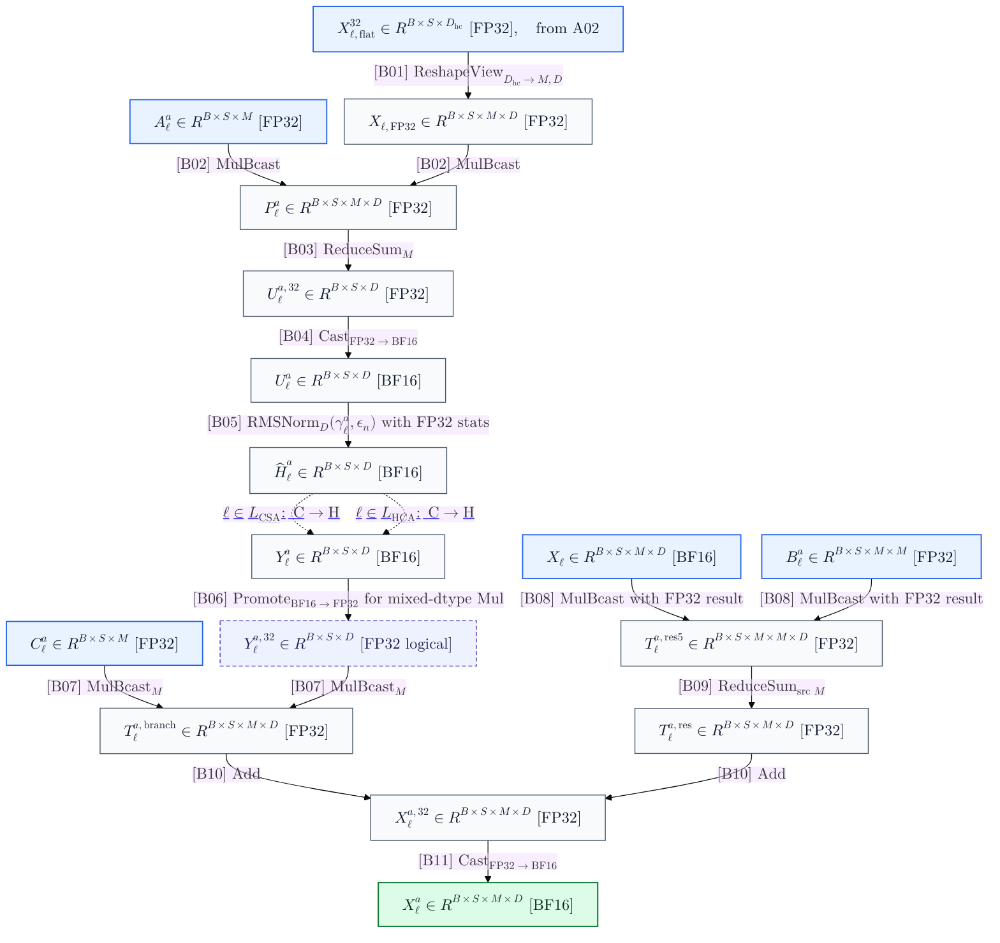
```mermaid
%%{init: {"theme": "base", "flowchart": {"htmlLabels": true, "curve": "basis", "nodeSpacing": 22, "rankSpacing": 32}}}%%
flowchart TD
    B_X["$$\mathbf X_{\ell}\in\mathbb R^{B\times S\times M\times D}\;[\mathrm{BF16}]$$"]
    B_XFLAT["$$\mathbf X_{\ell,\mathrm{flat}}^{32}\in\mathbb R^{B\times S\times D_{\mathrm{hc}}}\;[\mathrm{FP32}],\quad\text{from A02}$$"]
    B_XFP["$$\mathbf X_{\ell,\mathrm{FP32}}\in\mathbb R^{B\times S\times M\times D}\;[\mathrm{FP32}]$$"]
    B_A["$$\mathbf A_{\ell}^{a}\in\mathbb R^{B\times S\times M}\;[\mathrm{FP32}]$$"]
    B_AX["$$\mathbf P_{\ell}^{a}\in\mathbb R^{B\times S\times M\times D}\;[\mathrm{FP32}]$$"]
    B_UFP["$$\mathbf U_{\ell}^{a,32}\in\mathbb R^{B\times S\times D}\;[\mathrm{FP32}]$$"]
    B_U["$$\mathbf U_{\ell}^{a}\in\mathbb R^{B\times S\times D}\;[\mathrm{BF16}]$$"]
    B_H["$$\widehat{\mathbf H}_{\ell}^{a}\in\mathbb R^{B\times S\times D}\;[\mathrm{BF16}]$$"]
    B_Y["$$\mathbf Y_{\ell}^{a}\in\mathbb R^{B\times S\times D}\;[\mathrm{BF16}]$$"]
    B_C["$$\mathbf C_{\ell}^{a}\in\mathbb R^{B\times S\times M}\;[\mathrm{FP32}]$$"]
    B_B["$$\mathbf B_{\ell}^{a}\in\mathbb R^{B\times S\times M\times M}\;[\mathrm{FP32}]$$"]
    B_YFP["$$\mathbf Y_{\ell}^{a,32}\in\mathbb R^{B\times S\times D}\;[\mathrm{FP32\ logical}]$$"]
    B_CY["$$\mathbf T_{\ell}^{a,\mathrm{branch}}\in\mathbb R^{B\times S\times M\times D}\;[\mathrm{FP32}]$$"]
    B_BX5["$$\mathbf T_{\ell}^{a,\mathrm{res5}}\in\mathbb R^{B\times S\times M\times M\times D}\;[\mathrm{FP32}]$$"]
    B_BX["$$\mathbf T_{\ell}^{a,\mathrm{res}}\in\mathbb R^{B\times S\times M\times D}\;[\mathrm{FP32}]$$"]
    B_SUM["$$\mathbf X_{\ell}^{a,32}\in\mathbb R^{B\times S\times M\times D}\;[\mathrm{FP32}]$$"]
    B_OUT["$$\mathbf X_{\ell}^{a}\in\mathbb R^{B\times S\times M\times D}\;[\mathrm{BF16}]$$"]

    B_XFLAT -->|"$$[\mathrm{B01}]\ \operatorname{ReshapeView}_{D_{\mathrm{hc}}\rightarrow M,D}$$"| B_XFP
    B_A & B_XFP -->|"$$[\mathrm{B02}]\ \operatorname{MulBcast}$$"| B_AX
    B_AX -->|"$$[\mathrm{B03}]\ \operatorname{ReduceSum}_{M}$$"| B_UFP
    B_UFP -->|"$$[\mathrm{B04}]\ \operatorname{Cast}_{\mathrm{FP32}\rightarrow\mathrm{BF16}}$$"| B_U
    B_U -->|"$$[\mathrm{B05}]\ \operatorname{RMSNorm}_{D}(\gamma_{\ell}^{a},\epsilon_n)\ \text{with FP32 stats}$$"| B_H
    B_H -.->|"<a href='#path-csa'>$$\ell\in\mathcal L_{\mathrm{CSA}}:\ \mathrm{C} \to \mathrm{H}$$</a>"| B_Y
    B_H -.->|"<a href='#path-hca'>$$\ell\in\mathcal L_{\mathrm{HCA}}:\ \mathrm{C} \to \mathrm{H}$$</a>"| B_Y

    B_Y -->|"$$[\mathrm{B06}]\ \operatorname{Promote}_{\mathrm{BF16}\rightarrow\mathrm{FP32}}\ \text{for mixed-dtype Mul}$$"| B_YFP
    B_C & B_YFP -->|"$$[\mathrm{B07}]\ \operatorname{MulBcast}_{M}$$"| B_CY
    B_X & B_B -->|"$$[\mathrm{B08}]\ \operatorname{MulBcast}\ \text{with FP32 result}$$"| B_BX5
    B_BX5 -->|"$$[\mathrm{B09}]\ \operatorname{ReduceSum}_{\mathrm{src}\ M}$$"| B_BX
    B_CY & B_BX -->|"$$[\mathrm{B10}]\ \operatorname{Add}$$"| B_SUM
    B_SUM -->|"$$[\mathrm{B11}]\ \operatorname{Cast}_{\mathrm{FP32}\rightarrow\mathrm{BF16}}$$"| B_OUT

    classDef input fill:#e8f3ff,stroke:#2563eb,color:#0f172a,stroke-width:1.5px;
    classDef data fill:#f8fafc,stroke:#475569,color:#0f172a,stroke-width:1.1px;
    classDef logical fill:#eef2ff,stroke:#4338ca,color:#1e1b4b,stroke-width:1.1px,stroke-dasharray:5 3;
    classDef output fill:#dcfce7,stroke:#15803d,color:#052e16,stroke-width:1.7px;
    class B_X,B_XFLAT,B_A,B_C,B_B input;
    class B_XFP,B_AX,B_UFP,B_U,B_H,B_Y,B_CY,B_BX5,B_BX,B_SUM data;
    class B_YFP logical;
    class B_OUT output;
```

## B. Reusable primitive expansions

The metavariables $R_\star$, $K_\star$, and $N_\star$ in this section describe
flattened local row count, reduction width, and output width.
Each later splice names its concrete input, output, and stored weight.

### P1. BF16 activation to scaled FP8-weight GEMM

This expansion applies to the low-rank query projections, the local-KV projection, and the
second grouped output projection. It exposes the exact activation quantization and per-reduction-
block scale correction in [kernel.py, lines 22-125 and 203-273](inference/kernel.py#L22-L273).

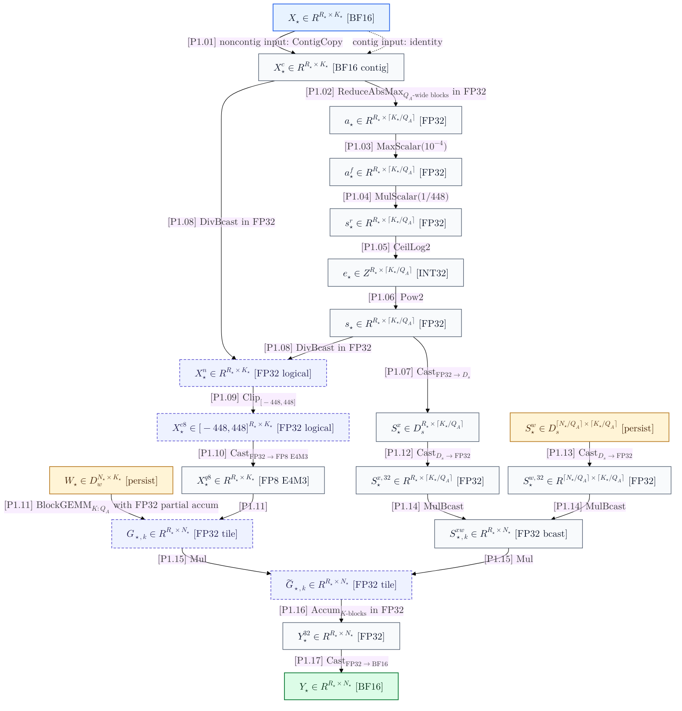
```mermaid
%%{init: {"theme": "base", "flowchart": {"htmlLabels": true, "curve": "basis", "nodeSpacing": 18, "rankSpacing": 26}}}%%
flowchart TD
    P1_X["$$\mathbf X_{\star}\in\mathbb R^{R_{\star}\times K_{\star}}\;[\mathrm{BF16}]$$"]
    P1_XC["$$\mathbf X_{\star}^{c}\in\mathbb R^{R_{\star}\times K_{\star}}\;[\mathrm{BF16\ contig}]$$"]
    P1_AMAX["$$\mathbf a_{\star}\in\mathbb R^{R_{\star}\times\lceil K_{\star}/Q_A\rceil}\;[\mathrm{FP32}]$$"]
    P1_AF["$$\mathbf a_{\star}^{f}\in\mathbb R^{R_{\star}\times\lceil K_{\star}/Q_A\rceil}\;[\mathrm{FP32}]$$"]
    P1_SR["$$\mathbf s_{\star}^{r}\in\mathbb R^{R_{\star}\times\lceil K_{\star}/Q_A\rceil}\;[\mathrm{FP32}]$$"]
    P1_SE["$$\mathbf e_{\star}\in\mathbb Z^{R_{\star}\times\lceil K_{\star}/Q_A\rceil}\;[\mathrm{INT32}]$$"]
    P1_SFP["$$\mathbf s_{\star}\in\mathbb R^{R_{\star}\times\lceil K_{\star}/Q_A\rceil}\;[\mathrm{FP32}]$$"]
    P1_SST["$$\mathbf S_{\star}^{x}\in\mathcal D_s^{R_{\star}\times\lceil K_{\star}/Q_A\rceil}$$"]
    P1_NORM["$$\mathbf X_{\star}^{n}\in\mathbb R^{R_{\star}\times K_{\star}}\;[\mathrm{FP32\ logical}]$$"]
    P1_CLIP["$$\mathbf X_{\star}^{c8}\in[-448,448]^{R_{\star}\times K_{\star}}\;[\mathrm{FP32\ logical}]$$"]
    P1_Q["$$\mathbf X_{\star}^{q8}\in\mathbb R^{R_{\star}\times K_{\star}}\;[\mathrm{FP8\ E4M3}]$$"]
    P1_W["$$W_{\star}\in\mathcal D_w^{N_{\star}\times K_{\star}}\;[\mathrm{persist}]$$"]
    P1_WS["$$\mathbf S_{\star}^{w}\in\mathcal D_s^{\lceil N_{\star}/Q_A\rceil\times\lceil K_{\star}/Q_A\rceil}\;[\mathrm{persist}]$$"]
    P1_G["$$\mathbf G_{\star,k}\in\mathbb R^{R_{\star}\times N_{\star}}\;[\mathrm{FP32\ tile}]$$"]
    P1_SX32["$$\mathbf S_{\star}^{x,32}\in\mathbb R^{R_{\star}\times\lceil K_{\star}/Q_A\rceil}\;[\mathrm{FP32}]$$"]
    P1_SW32["$$\mathbf S_{\star}^{w,32}\in\mathbb R^{\lceil N_{\star}/Q_A\rceil\times\lceil K_{\star}/Q_A\rceil}\;[\mathrm{FP32}]$$"]
    P1_SP["$$\mathbf S_{\star,k}^{xw}\in\mathbb R^{R_{\star}\times N_{\star}}\;[\mathrm{FP32\ bcast}]$$"]
    P1_GS["$$\widetilde{\mathbf G}_{\star,k}\in\mathbb R^{R_{\star}\times N_{\star}}\;[\mathrm{FP32\ tile}]$$"]
    P1_ACC["$$\mathbf Y_{\star}^{32}\in\mathbb R^{R_{\star}\times N_{\star}}\;[\mathrm{FP32}]$$"]
    P1_Y["$$\mathbf Y_{\star}\in\mathbb R^{R_{\star}\times N_{\star}}\;[\mathrm{BF16}]$$"]

    P1_X -->|"$$[\mathrm{P1.01}]\ \text{noncontig input: }\operatorname{ContigCopy}$$"| P1_XC
    P1_X -.->|"$$\text{contig input: identity}$$"| P1_XC
    P1_XC -->|"$$[\mathrm{P1.02}]\ \operatorname{ReduceAbsMax}_{Q_A\text{-wide blocks}}\ \text{in FP32}$$"| P1_AMAX
    P1_AMAX -->|"$$[\mathrm{P1.03}]\ \operatorname{MaxScalar}(10^{-4})$$"| P1_AF
    P1_AF -->|"$$[\mathrm{P1.04}]\ \operatorname{MulScalar}(1/448)$$"| P1_SR
    P1_SR -->|"$$[\mathrm{P1.05}]\ \operatorname{CeilLog2}$$"| P1_SE
    P1_SE -->|"$$[\mathrm{P1.06}]\ \operatorname{Pow2}$$"| P1_SFP
    P1_SFP -->|"$$[\mathrm{P1.07}]\ \operatorname{Cast}_{\mathrm{FP32}\rightarrow\mathcal D_s}$$"| P1_SST
    P1_XC & P1_SFP -->|"$$[\mathrm{P1.08}]\ \operatorname{DivBcast}\ \text{in FP32}$$"| P1_NORM
    P1_NORM -->|"$$[\mathrm{P1.09}]\ \operatorname{Clip}_{[-448,448]}$$"| P1_CLIP
    P1_CLIP -->|"$$[\mathrm{P1.10}]\ \operatorname{Cast}_{\mathrm{FP32}\rightarrow\mathrm{FP8\ E4M3}}$$"| P1_Q
    P1_W -->|"$$[\mathrm{P1.11}]\ \operatorname{BlockGEMM}_{K:Q_A}\ \text{with FP32 partial accum}$$"| P1_G
    P1_Q -->|"$$[\mathrm{P1.11}]$$"| P1_G
    P1_SST -->|"$$[\mathrm{P1.12}]\ \operatorname{Cast}_{\mathcal D_s\rightarrow\mathrm{FP32}}$$"| P1_SX32
    P1_WS -->|"$$[\mathrm{P1.13}]\ \operatorname{Cast}_{\mathcal D_s\rightarrow\mathrm{FP32}}$$"| P1_SW32
    P1_SX32 & P1_SW32 -->|"$$[\mathrm{P1.14}]\ \operatorname{MulBcast}$$"| P1_SP
    P1_G & P1_SP -->|"$$[\mathrm{P1.15}]\ \operatorname{Mul}$$"| P1_GS
    P1_GS -->|"$$[\mathrm{P1.16}]\ \operatorname{Accum}_{K\text{-blocks}}\ \text{in FP32}$$"| P1_ACC
    P1_ACC -->|"$$[\mathrm{P1.17}]\ \operatorname{Cast}_{\mathrm{FP32}\rightarrow\mathrm{BF16}}$$"| P1_Y

    classDef input fill:#e8f3ff,stroke:#2563eb,color:#0f172a,stroke-width:1.5px;
    classDef weight fill:#fff4d6,stroke:#b7791f,color:#422006,stroke-width:1.4px;
    classDef data fill:#f8fafc,stroke:#475569,color:#0f172a,stroke-width:1.1px;
    classDef logical fill:#eef2ff,stroke:#4338ca,color:#1e1b4b,stroke-width:1.1px,stroke-dasharray:5 3;
    classDef output fill:#dcfce7,stroke:#15803d,color:#052e16,stroke-width:1.6px;
    class P1_X input;
    class P1_W,P1_WS weight;
    class P1_XC,P1_AMAX,P1_AF,P1_SR,P1_SE,P1_SFP,P1_SST,P1_Q,P1_SX32,P1_SW32,P1_SP,P1_ACC data;
    class P1_NORM,P1_CLIP,P1_G,P1_GS logical;
    class P1_Y output;
```

### P2. Forward or inverse partial RoPE write-back

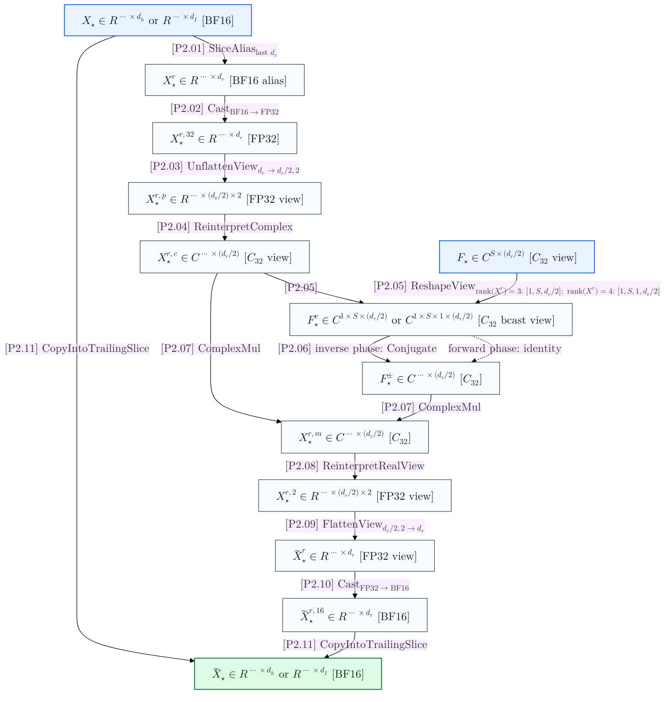
```mermaid
%%{init: {"theme": "base", "flowchart": {"htmlLabels": true, "curve": "basis", "nodeSpacing": 18, "rankSpacing": 26}}}%%
flowchart TD
    P2_X["$$\mathbf X_{\star}\in\mathbb R^{\cdots\times d_h}\ \text{or}\ \mathbb R^{\cdots\times d_I}\;[\mathrm{BF16}]$$"]
    P2_TAIL["$$\mathbf X_{\star}^{r}\in\mathbb R^{\cdots\times d_r}\;[\mathrm{BF16\ alias}]$$"]
    P2_FP["$$\mathbf X_{\star}^{r,32}\in\mathbb R^{\cdots\times d_r}\;[\mathrm{FP32}]$$"]
    P2_PAIR["$$\mathbf X_{\star}^{r,p}\in\mathbb R^{\cdots\times(d_r/2)\times2}\;[\mathrm{FP32\ view}]$$"]
    P2_CX["$$\mathbf X_{\star}^{r,c}\in\mathbb C^{\cdots\times(d_r/2)}\;[\mathbb{C}_{32} \text{ view}]$$"]
    P2_F["$$\mathbf F_{\star}\in\mathbb C^{S\times(d_r/2)}\;[\mathbb{C}_{32} \text{ view}]$$"]
    P2_FV["$$\mathbf F_{\star}^{v}\in\mathbb C^{1\times S\times(d_r/2)}\ \text{or}\ \mathbb C^{1\times S\times1\times(d_r/2)}\;[\mathbb{C}_{32} \text{ bcast view}]$$"]
    P2_FDIR["$$\mathbf F_{\star}^{\pm}\in\mathbb C^{\cdots\times(d_r/2)}\;[\mathbb{C}_{32}]$$"]
    P2_CM["$$\mathbf X_{\star}^{r,m}\in\mathbb C^{\cdots\times(d_r/2)}\;[\mathbb{C}_{32}]$$"]
    P2_REAL["$$\mathbf X_{\star}^{r,2}\in\mathbb R^{\cdots\times(d_r/2)\times2}\;[\mathrm{FP32\ view}]$$"]
    P2_FLAT["$$\widetilde{\mathbf X}_{\star}^{r}\in\mathbb R^{\cdots\times d_r}\;[\mathrm{FP32\ view}]$$"]
    P2_BF["$$\widetilde{\mathbf X}_{\star}^{r,16}\in\mathbb R^{\cdots\times d_r}\;[\mathrm{BF16}]$$"]
    P2_Y["$$\widetilde{\mathbf X}_{\star}\in\mathbb R^{\cdots\times d_h}\ \text{or}\ \mathbb R^{\cdots\times d_I}\;[\mathrm{BF16}]$$"]

    P2_X -->|"$$[\mathrm{P2.01}]\ \operatorname{SliceAlias}_{\mathrm{last}\ d_r}$$"| P2_TAIL
    P2_TAIL -->|"$$[\mathrm{P2.02}]\ \operatorname{Cast}_{\mathrm{BF16}\rightarrow\mathrm{FP32}}$$"| P2_FP
    P2_FP -->|"$$[\mathrm{P2.03}]\ \operatorname{UnflattenView}_{d_r\rightarrow d_r/2,2}$$"| P2_PAIR
    P2_PAIR -->|"$$[\mathrm{P2.04}]\ \operatorname{ReinterpretComplex}$$"| P2_CX
    P2_CX -->|"$$[\mathrm{P2.05}]$$"| P2_FV
    P2_F -->|"$$[\mathrm{P2.05}]\ \operatorname{ReshapeView}_{\mathrm{rank}(\mathbf X^r)=3:\,[1,S,d_r/2];\ \mathrm{rank}(\mathbf X^r)=4:\,[1,S,1,d_r/2]}$$"| P2_FV
    P2_FV -->|"$$[\mathrm{P2.06}]\ \text{inverse phase: }\operatorname{Conjugate}$$"| P2_FDIR
    P2_FV -.->|"$$\text{forward phase: identity}$$"| P2_FDIR
    P2_CX & P2_FDIR -->|"$$[\mathrm{P2.07}]\ \operatorname{ComplexMul}$$"| P2_CM
    P2_CM -->|"$$[\mathrm{P2.08}]\ \operatorname{ReinterpretRealView}$$"| P2_REAL
    P2_REAL -->|"$$[\mathrm{P2.09}]\ \operatorname{FlattenView}_{d_r/2,2\rightarrow d_r}$$"| P2_FLAT
    P2_FLAT -->|"$$[\mathrm{P2.10}]\ \operatorname{Cast}_{\mathrm{FP32}\rightarrow\mathrm{BF16}}$$"| P2_BF
    P2_X & P2_BF -->|"$$[\mathrm{P2.11}]\ \operatorname{CopyIntoTrailingSlice}$$"| P2_Y

    classDef input fill:#e8f3ff,stroke:#2563eb,color:#0f172a,stroke-width:1.5px;
    classDef data fill:#f8fafc,stroke:#475569,color:#0f172a,stroke-width:1.1px;
    classDef output fill:#dcfce7,stroke:#15803d,color:#052e16,stroke-width:1.6px;
    class P2_X,P2_F input;
    class P2_TAIL,P2_FP,P2_PAIR,P2_CX,P2_FV,P2_FDIR,P2_CM,P2_REAL,P2_FLAT,P2_BF data;
    class P2_Y output;
```

### P3. In-place FP8 quantize-dequantize of non-rotary KV dimensions

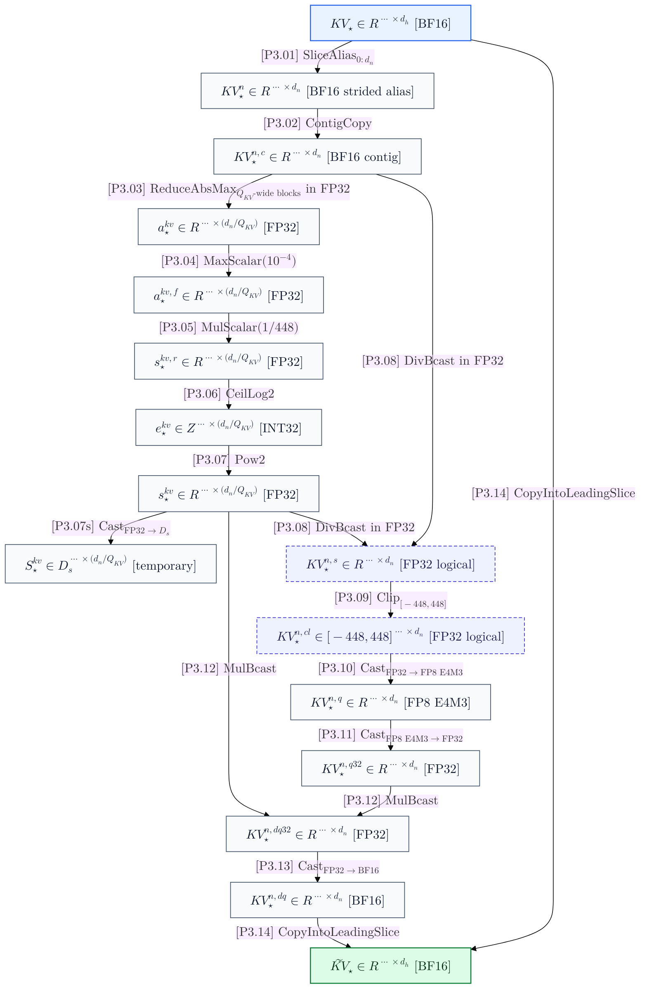
```mermaid
%%{init: {"theme": "base", "flowchart": {"htmlLabels": true, "curve": "basis", "nodeSpacing": 18, "rankSpacing": 26}}}%%
flowchart TD
    P3_X["$$\mathbf{KV}_{\star}\in\mathbb R^{\cdots\times d_h}\;[\mathrm{BF16}]$$"]
    P3_NR["$$\mathbf{KV}_{\star}^{n}\in\mathbb R^{\cdots\times d_n}\;[\mathrm{BF16\ strided\ alias}]$$"]
    P3_C["$$\mathbf{KV}_{\star}^{n,c}\in\mathbb R^{\cdots\times d_n}\;[\mathrm{BF16\ contig}]$$"]
    P3_A["$$\mathbf a_{\star}^{kv}\in\mathbb R^{\cdots\times(d_n/Q_{KV})}\;[\mathrm{FP32}]$$"]
    P3_AF["$$\mathbf a_{\star}^{kv,f}\in\mathbb R^{\cdots\times(d_n/Q_{KV})}\;[\mathrm{FP32}]$$"]
    P3_SR["$$\mathbf s_{\star}^{kv,r}\in\mathbb R^{\cdots\times(d_n/Q_{KV})}\;[\mathrm{FP32}]$$"]
    P3_SE["$$\mathbf e_{\star}^{kv}\in\mathbb Z^{\cdots\times(d_n/Q_{KV})}\;[\mathrm{INT32}]$$"]
    P3_S["$$\mathbf s_{\star}^{kv}\in\mathbb R^{\cdots\times(d_n/Q_{KV})}\;[\mathrm{FP32}]$$"]
    P3_SST["$$\mathbf S_{\star}^{kv}\in\mathcal D_s^{\cdots\times(d_n/Q_{KV})}\;[\mathrm{temporary}]$$"]
    P3_SN["$$\mathbf{KV}_{\star}^{n,s}\in\mathbb R^{\cdots\times d_n}\;[\mathrm{FP32\ logical}]$$"]
    P3_CL["$$\mathbf{KV}_{\star}^{n,cl}\in[-448,448]^{\cdots\times d_n}\;[\mathrm{FP32\ logical}]$$"]
    P3_Q["$$\mathbf{KV}_{\star}^{n,q}\in\mathbb R^{\cdots\times d_n}\;[\mathrm{FP8\ E4M3}]$$"]
    P3_Q32["$$\mathbf{KV}_{\star}^{n,q32}\in\mathbb R^{\cdots\times d_n}\;[\mathrm{FP32}]$$"]
    P3_DQ["$$\mathbf{KV}_{\star}^{n,dq32}\in\mathbb R^{\cdots\times d_n}\;[\mathrm{FP32}]$$"]
    P3_BF["$$\mathbf{KV}_{\star}^{n,dq}\in\mathbb R^{\cdots\times d_n}\;[\mathrm{BF16}]$$"]
    P3_Y["$$\widetilde{\mathbf{KV}}_{\star}\in\mathbb R^{\cdots\times d_h}\;[\mathrm{BF16}]$$"]

    P3_X -->|"$$[\mathrm{P3.01}]\ \operatorname{SliceAlias}_{0:d_n}$$"| P3_NR
    P3_NR -->|"$$[\mathrm{P3.02}]\ \operatorname{ContigCopy}$$"| P3_C
    P3_C -->|"$$[\mathrm{P3.03}]\ \operatorname{ReduceAbsMax}_{Q_{KV}\text{-wide blocks}}\ \text{in FP32}$$"| P3_A
    P3_A -->|"$$[\mathrm{P3.04}]\ \operatorname{MaxScalar}(10^{-4})$$"| P3_AF
    P3_AF -->|"$$[\mathrm{P3.05}]\ \operatorname{MulScalar}(1/448)$$"| P3_SR
    P3_SR -->|"$$[\mathrm{P3.06}]\ \operatorname{CeilLog2}$$"| P3_SE
    P3_SE -->|"$$[\mathrm{P3.07}]\ \operatorname{Pow2}$$"| P3_S
    P3_S -->|"$$[\mathrm{P3.07s}]\ \operatorname{Cast}_{\mathrm{FP32}\rightarrow\mathcal D_s}$$"| P3_SST
    P3_C & P3_S -->|"$$[\mathrm{P3.08}]\ \operatorname{DivBcast}\ \text{in FP32}$$"| P3_SN
    P3_SN -->|"$$[\mathrm{P3.09}]\ \operatorname{Clip}_{[-448,448]}$$"| P3_CL
    P3_CL -->|"$$[\mathrm{P3.10}]\ \operatorname{Cast}_{\mathrm{FP32}\rightarrow\mathrm{FP8\ E4M3}}$$"| P3_Q
    P3_Q -->|"$$[\mathrm{P3.11}]\ \operatorname{Cast}_{\mathrm{FP8\ E4M3}\rightarrow\mathrm{FP32}}$$"| P3_Q32
    P3_Q32 & P3_S -->|"$$[\mathrm{P3.12}]\ \operatorname{MulBcast}$$"| P3_DQ
    P3_DQ -->|"$$[\mathrm{P3.13}]\ \operatorname{Cast}_{\mathrm{FP32}\rightarrow\mathrm{BF16}}$$"| P3_BF
    P3_X & P3_BF -->|"$$[\mathrm{P3.14}]\ \operatorname{CopyIntoLeadingSlice}$$"| P3_Y

    classDef input fill:#e8f3ff,stroke:#2563eb,color:#0f172a,stroke-width:1.5px;
    classDef data fill:#f8fafc,stroke:#475569,color:#0f172a,stroke-width:1.1px;
    classDef logical fill:#eef2ff,stroke:#4338ca,color:#1e1b4b,stroke-width:1.1px,stroke-dasharray:5 3;
    classDef output fill:#dcfce7,stroke:#15803d,color:#052e16,stroke-width:1.6px;
    class P3_X input;
    class P3_NR,P3_C,P3_A,P3_AF,P3_SR,P3_SE,P3_S,P3_SST,P3_Q,P3_Q32,P3_DQ,P3_BF data;
    class P3_SN,P3_CL logical;
    class P3_Y output;
```

### P4. Normalized Hadamard rotation and in-place FP4 quantize-dequantize

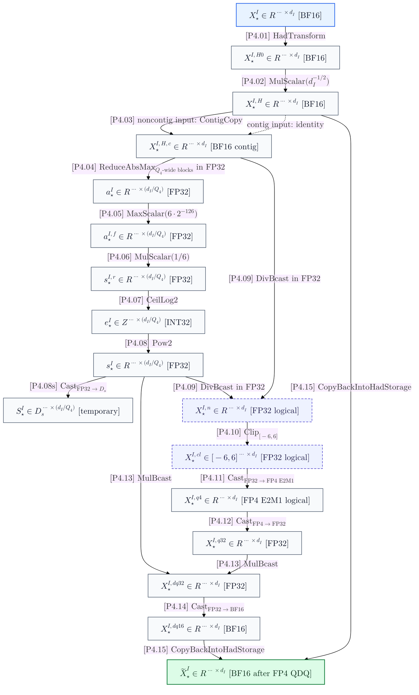
```mermaid
%%{init: {"theme": "base", "flowchart": {"htmlLabels": true, "curve": "basis", "nodeSpacing": 18, "rankSpacing": 26}}}%%
flowchart TD
    P4_X["$$\mathbf X_{\star}^{I}\in\mathbb R^{\cdots\times d_I}\;[\mathrm{BF16}]$$"]
    P4_H0["$$\mathbf X_{\star}^{I,H0}\in\mathbb R^{\cdots\times d_I}\;[\mathrm{BF16}]$$"]
    P4_H["$$\mathbf X_{\star}^{I,H}\in\mathbb R^{\cdots\times d_I}\;[\mathrm{BF16}]$$"]
    P4_C["$$\mathbf X_{\star}^{I,H,c}\in\mathbb R^{\cdots\times d_I}\;[\mathrm{BF16\ contig}]$$"]
    P4_A["$$\mathbf a_{\star}^{I}\in\mathbb R^{\cdots\times(d_I/Q_4)}\;[\mathrm{FP32}]$$"]
    P4_AF["$$\mathbf a_{\star}^{I,f}\in\mathbb R^{\cdots\times(d_I/Q_4)}\;[\mathrm{FP32}]$$"]
    P4_SR["$$\mathbf s_{\star}^{I,r}\in\mathbb R^{\cdots\times(d_I/Q_4)}\;[\mathrm{FP32}]$$"]
    P4_SE["$$\mathbf e_{\star}^{I}\in\mathbb Z^{\cdots\times(d_I/Q_4)}\;[\mathrm{INT32}]$$"]
    P4_S["$$\mathbf s_{\star}^{I}\in\mathbb R^{\cdots\times(d_I/Q_4)}\;[\mathrm{FP32}]$$"]
    P4_SST["$$\mathbf S_{\star}^{I}\in\mathcal D_s^{\cdots\times(d_I/Q_4)}\;[\mathrm{temporary}]$$"]
    P4_N["$$\mathbf X_{\star}^{I,n}\in\mathbb R^{\cdots\times d_I}\;[\mathrm{FP32\ logical}]$$"]
    P4_CL["$$\mathbf X_{\star}^{I,cl}\in[-6,6]^{\cdots\times d_I}\;[\mathrm{FP32\ logical}]$$"]
    P4_Q["$$\mathbf X_{\star}^{I,q4}\in\mathbb R^{\cdots\times d_I}\;[\mathrm{FP4\ E2M1\ logical}]$$"]
    P4_Q32["$$\mathbf X_{\star}^{I,q32}\in\mathbb R^{\cdots\times d_I}\;[\mathrm{FP32}]$$"]
    P4_DQ["$$\mathbf X_{\star}^{I,dq32}\in\mathbb R^{\cdots\times d_I}\;[\mathrm{FP32}]$$"]
    P4_BF["$$\mathbf X_{\star}^{I,dq16}\in\mathbb R^{\cdots\times d_I}\;[\mathrm{BF16}]$$"]
    P4_Y["$$\widetilde{\mathbf X}_{\star}^{I}\in\mathbb R^{\cdots\times d_I}\;[\mathrm{BF16\ after\ FP4\ QDQ}]$$"]

    P4_X -->|"$$[\mathrm{P4.01}]\ \operatorname{HadTransform}$$"| P4_H0
    P4_H0 -->|"$$[\mathrm{P4.02}]\ \operatorname{MulScalar}(d_I^{-1/2})$$"| P4_H
    P4_H -.->|"$$\text{contig input: identity}$$"| P4_C
    P4_H -->|"$$[\mathrm{P4.03}]\ \text{noncontig input: }\operatorname{ContigCopy}$$"| P4_C
    P4_C -->|"$$[\mathrm{P4.04}]\ \operatorname{ReduceAbsMax}_{Q_4\text{-wide blocks}}\ \text{in FP32}$$"| P4_A
    P4_A -->|"$$[\mathrm{P4.05}]\ \operatorname{MaxScalar}(6\cdot2^{-126})$$"| P4_AF
    P4_AF -->|"$$[\mathrm{P4.06}]\ \operatorname{MulScalar}(1/6)$$"| P4_SR
    P4_SR -->|"$$[\mathrm{P4.07}]\ \operatorname{CeilLog2}$$"| P4_SE
    P4_SE -->|"$$[\mathrm{P4.08}]\ \operatorname{Pow2}$$"| P4_S
    P4_S -->|"$$[\mathrm{P4.08s}]\ \operatorname{Cast}_{\mathrm{FP32}\rightarrow\mathcal D_s}$$"| P4_SST
    P4_C & P4_S -->|"$$[\mathrm{P4.09}]\ \operatorname{DivBcast}\ \text{in FP32}$$"| P4_N
    P4_N -->|"$$[\mathrm{P4.10}]\ \operatorname{Clip}_{[-6,6]}$$"| P4_CL
    P4_CL -->|"$$[\mathrm{P4.11}]\ \operatorname{Cast}_{\mathrm{FP32}\rightarrow\mathrm{FP4\ E2M1}}$$"| P4_Q
    P4_Q -->|"$$[\mathrm{P4.12}]\ \operatorname{Cast}_{\mathrm{FP4}\rightarrow\mathrm{FP32}}$$"| P4_Q32
    P4_Q32 & P4_S -->|"$$[\mathrm{P4.13}]\ \operatorname{MulBcast}$$"| P4_DQ
    P4_DQ -->|"$$[\mathrm{P4.14}]\ \operatorname{Cast}_{\mathrm{FP32}\rightarrow\mathrm{BF16}}$$"| P4_BF
    P4_H & P4_BF -->|"$$[\mathrm{P4.15}]\ \operatorname{CopyBackIntoHadStorage}$$"| P4_Y

    classDef input fill:#e8f3ff,stroke:#2563eb,color:#0f172a,stroke-width:1.5px;
    classDef data fill:#f8fafc,stroke:#475569,color:#0f172a,stroke-width:1.1px;
    classDef logical fill:#eef2ff,stroke:#4338ca,color:#1e1b4b,stroke-width:1.1px,stroke-dasharray:5 3;
    classDef output fill:#dcfce7,stroke:#15803d,color:#052e16,stroke-width:1.6px;
    class P4_X input;
    class P4_H0,P4_H,P4_C,P4_A,P4_AF,P4_SR,P4_SE,P4_S,P4_SST,P4_Q,P4_Q32,P4_DQ,P4_BF data;
    class P4_N,P4_CL logical;
    class P4_Y output;
```

## C. Shared main-query and current-token shared-KV stems

This graph is executed by both layer families. The normalized query latent is also exported to
the CSA lightning indexer. It is unused by an HCA-specific side path. Reference implementation:
[model.py, lines 490-513](inference/model.py#L490-L513).

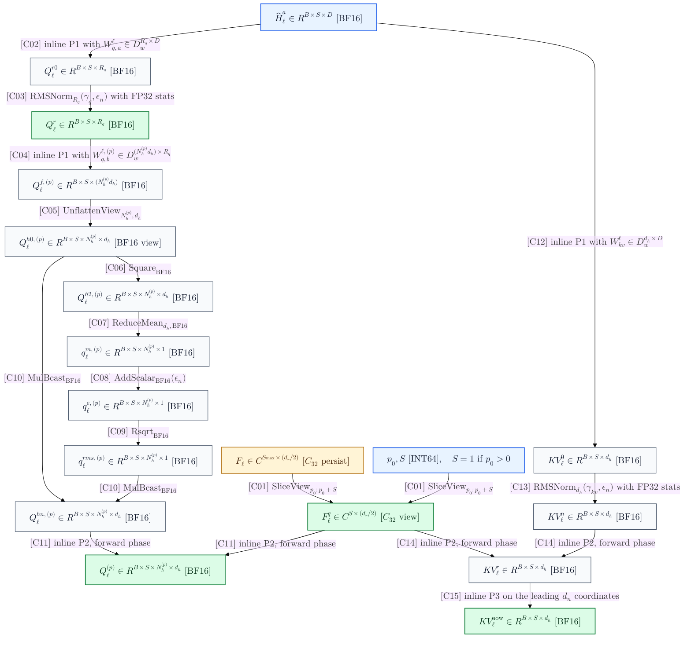
```mermaid
%%{init: {"theme": "base", "flowchart": {"htmlLabels": true, "curve": "basis", "nodeSpacing": 20, "rankSpacing": 30}}}%%
flowchart TD
    C_H["$$\widehat{\mathbf H}_{\ell}^{a}\in\mathbb R^{B\times S\times D}\;[\mathrm{BF16}]$$"]
    C_POS["$$p_0,S\;[\mathrm{INT64}],\quad S=1\ \mathrm{if}\ p_0\gt0$$"]
    C_FALL["$$\mathcal F_{\ell}\in\mathbb C^{S_{\max}\times(d_r/2)}\;[\mathbb{C}_{32} \text{ persist}]$$"]
    C_F["$$\mathbf F_{\ell}^{q}\in\mathbb C^{S\times(d_r/2)}\;[\mathbb{C}_{32} \text{ view}]$$"]

    C_QR0["$$\mathbf Q_{\ell}^{r0}\in\mathbb R^{B\times S\times R_q}\;[\mathrm{BF16}]$$"]
    C_QR["$$\mathbf Q_{\ell}^{r}\in\mathbb R^{B\times S\times R_q}\;[\mathrm{BF16}]$$"]
    C_QFL["$$\mathbf Q_{\ell}^{f,(p)}\in\mathbb R^{B\times S\times(N_h^{(p)}d_h)}\;[\mathrm{BF16}]$$"]
    C_QH0["$$\mathbf Q_{\ell}^{h0,(p)}\in\mathbb R^{B\times S\times N_h^{(p)}\times d_h}\;[\mathrm{BF16\ view}]$$"]
    C_QSQ["$$\mathbf Q_{\ell}^{h2,(p)}\in\mathbb R^{B\times S\times N_h^{(p)}\times d_h}\;[\mathrm{BF16}]$$"]
    C_QM["$$\mathbf q_{\ell}^{m,(p)}\in\mathbb R^{B\times S\times N_h^{(p)}\times1}\;[\mathrm{BF16}]$$"]
    C_QE["$$\mathbf q_{\ell}^{e,(p)}\in\mathbb R^{B\times S\times N_h^{(p)}\times1}\;[\mathrm{BF16}]$$"]
    C_QRMS["$$\mathbf q_{\ell}^{rms,(p)}\in\mathbb R^{B\times S\times N_h^{(p)}\times1}\;[\mathrm{BF16}]$$"]
    C_QN["$$\mathbf Q_{\ell}^{hn,(p)}\in\mathbb R^{B\times S\times N_h^{(p)}\times d_h}\;[\mathrm{BF16}]$$"]
    C_Q["$$\mathbf Q_{\ell}^{(p)}\in\mathbb R^{B\times S\times N_h^{(p)}\times d_h}\;[\mathrm{BF16}]$$"]

    C_KV0["$$\mathbf{KV}_{\ell}^{0}\in\mathbb R^{B\times S\times d_h}\;[\mathrm{BF16}]$$"]
    C_KVN["$$\mathbf{KV}_{\ell}^{n}\in\mathbb R^{B\times S\times d_h}\;[\mathrm{BF16}]$$"]
    C_KVR["$$\mathbf{KV}_{\ell}^{r}\in\mathbb R^{B\times S\times d_h}\;[\mathrm{BF16}]$$"]
    C_KVNOW["$$\mathbf{KV}_{\ell}^{\mathrm{now}}\in\mathbb R^{B\times S\times d_h}\;[\mathrm{BF16}]$$"]

    C_FALL & C_POS -->|"$$[\mathrm{C01}]\ \operatorname{SliceView}_{p_0:p_0+S}$$"| C_F

    C_H -->|"$$[\mathrm{C02}]\ \text{inline P1 with }W_{q,a}^{\ell}\in\mathcal D_w^{R_q\times D}$$"| C_QR0
    C_QR0 -->|"$$[\mathrm{C03}]\ \operatorname{RMSNorm}_{R_q}(\gamma_q,\epsilon_n)\ \text{with FP32 stats}$$"| C_QR
    C_QR -->|"$$[\mathrm{C04}]\ \text{inline P1 with }W_{q,b}^{\ell,(p)}\in\mathcal D_w^{(N_h^{(p)}d_h)\times R_q}$$"| C_QFL
    C_QFL -->|"$$[\mathrm{C05}]\ \operatorname{UnflattenView}_{N_h^{(p)},d_h}$$"| C_QH0
    C_QH0 -->|"$$[\mathrm{C06}]\ \operatorname{Square}_{\mathrm{BF16}}$$"| C_QSQ
    C_QSQ -->|"$$[\mathrm{C07}]\ \operatorname{ReduceMean}_{d_h,\mathrm{BF16}}$$"| C_QM
    C_QM -->|"$$[\mathrm{C08}]\ \operatorname{AddScalar}_{\mathrm{BF16}}(\epsilon_n)$$"| C_QE
    C_QE -->|"$$[\mathrm{C09}]\ \operatorname{Rsqrt}_{\mathrm{BF16}}$$"| C_QRMS
    C_QH0 & C_QRMS -->|"$$[\mathrm{C10}]\ \operatorname{MulBcast}_{\mathrm{BF16}}$$"| C_QN
    C_QN & C_F -->|"$$[\mathrm{C11}]\ \text{inline P2, forward phase}$$"| C_Q

    C_H -->|"$$[\mathrm{C12}]\ \text{inline P1 with }W_{kv}^{\ell}\in\mathcal D_w^{d_h\times D}$$"| C_KV0
    C_KV0 -->|"$$[\mathrm{C13}]\ \operatorname{RMSNorm}_{d_h}(\gamma_{kv},\epsilon_n)\ \text{with FP32 stats}$$"| C_KVN
    C_F & C_KVN -->|"$$[\mathrm{C14}]\ \text{inline P2, forward phase}$$"| C_KVR
    C_KVR -->|"$$[\mathrm{C15}]\ \text{inline P3 on the leading }d_n\text{ coordinates}$$"| C_KVNOW

    classDef input fill:#e8f3ff,stroke:#2563eb,color:#0f172a,stroke-width:1.5px;
    classDef cache fill:#fff4d6,stroke:#b7791f,color:#422006,stroke-width:1.4px;
    classDef data fill:#f8fafc,stroke:#475569,color:#0f172a,stroke-width:1.1px;
    classDef output fill:#dcfce7,stroke:#15803d,color:#052e16,stroke-width:1.6px;
    class C_H,C_POS input;
    class C_FALL cache;
    class C_QR0,C_QFL,C_QH0,C_QSQ,C_QM,C_QE,C_QRMS,C_QN,C_KV0,C_KVN,C_KVR data;
    class C_F,C_QR,C_Q,C_KVNOW output;
```

## D. Shared causal-window index construction

This is the exact arithmetic expansion of [model.py, lines 260-271](inference/model.py#L260-L271).
It produces gather addresses only; it does not gather KV data.

### D1. Prefill window indices

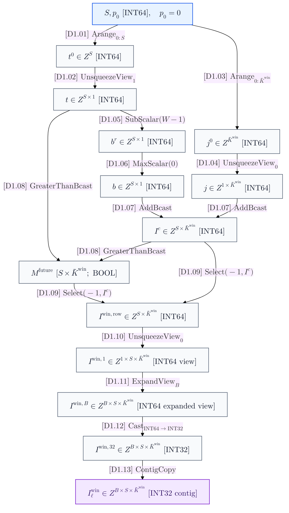
```mermaid
%%{init: {"theme": "base", "flowchart": {"htmlLabels": true, "curve": "basis", "nodeSpacing": 20, "rankSpacing": 28}}}%%
flowchart TD
    D1_S["$$S,p_0\;[\mathrm{INT64}],\quad p_0=0$$"]
    D1_T0["$$\mathbf t^{0}\in\mathbb Z^{S}\;[\mathrm{INT64}]$$"]
    D1_T["$$\mathbf t\in\mathbb Z^{S\times1}\;[\mathrm{INT64}]$$"]
    D1_J0["$$\mathbf j^{0}\in\mathbb Z^{\bar K^{\mathrm{win}}}\;[\mathrm{INT64}]$$"]
    D1_J["$$\mathbf j\in\mathbb Z^{1\times\bar K^{\mathrm{win}}}\;[\mathrm{INT64}]$$"]
    D1_BR["$$\mathbf b^{r}\in\mathbb Z^{S\times1}\;[\mathrm{INT64}]$$"]
    D1_B["$$\mathbf b\in\mathbb Z^{S\times1}\;[\mathrm{INT64}]$$"]
    D1_CAND["$$\mathbf I^{c}\in\mathbb Z^{S\times\bar K^{\mathrm{win}}}\;[\mathrm{INT64}]$$"]
    D1_MASK["$$\mathbf M^{\mathrm{future}}\;[S\times\bar K^{\mathrm{win}};\ \mathrm{BOOL}]$$"]
    D1_ROW["$$\mathbf I^{\mathrm{win,row}}\in\mathbb Z^{S\times\bar K^{\mathrm{win}}}\;[\mathrm{INT64}]$$"]
    D1_UNS["$$\mathbf I^{\mathrm{win},1}\in\mathbb Z^{1\times S\times\bar K^{\mathrm{win}}}\;[\mathrm{INT64\ view}]$$"]
    D1_EXP["$$\mathbf I^{\mathrm{win},B}\in\mathbb Z^{B\times S\times\bar K^{\mathrm{win}}}\;[\mathrm{INT64\ expanded\ view}]$$"]
    D1_CAST["$$\mathbf I^{\mathrm{win},32}\in\mathbb Z^{B\times S\times\bar K^{\mathrm{win}}}\;[\mathrm{INT32}]$$"]
    D1_OUT["$$\mathbf I_{\ell}^{\mathrm{win}}\in\mathbb Z^{B\times S\times\bar K^{\mathrm{win}}}\;[\mathrm{INT32\ contig}]$$"]

    D1_S -->|"$$[\mathrm{D1.01}]\ \operatorname{Arange}_{0:S}$$"| D1_T0
    D1_T0 -->|"$$[\mathrm{D1.02}]\ \operatorname{UnsqueezeView}_{1}$$"| D1_T
    D1_S -->|"$$[\mathrm{D1.03}]\ \operatorname{Arange}_{0:\bar K^{\mathrm{win}}}$$"| D1_J0
    D1_J0 -->|"$$[\mathrm{D1.04}]\ \operatorname{UnsqueezeView}_{0}$$"| D1_J
    D1_T -->|"$$[\mathrm{D1.05}]\ \operatorname{SubScalar}(W-1)$$"| D1_BR
    D1_BR -->|"$$[\mathrm{D1.06}]\ \operatorname{MaxScalar}(0)$$"| D1_B
    D1_B & D1_J -->|"$$[\mathrm{D1.07}]\ \operatorname{AddBcast}$$"| D1_CAND
    D1_T & D1_CAND -->|"$$[\mathrm{D1.08}]\ \operatorname{GreaterThanBcast}$$"| D1_MASK
    D1_MASK & D1_CAND -->|"$$[\mathrm{D1.09}]\ \operatorname{Select}(-1,\mathbf I^c)$$"| D1_ROW
    D1_ROW -->|"$$[\mathrm{D1.10}]\ \operatorname{UnsqueezeView}_{0}$$"| D1_UNS
    D1_UNS -->|"$$[\mathrm{D1.11}]\ \operatorname{ExpandView}_{B}$$"| D1_EXP
    D1_EXP -->|"$$[\mathrm{D1.12}]\ \operatorname{Cast}_{\mathrm{INT64}\rightarrow\mathrm{INT32}}$$"| D1_CAST
    D1_CAST -->|"$$[\mathrm{D1.13}]\ \operatorname{ContigCopy}$$"| D1_OUT

    classDef input fill:#e8f3ff,stroke:#2563eb,color:#0f172a,stroke-width:1.5px;
    classDef data fill:#f8fafc,stroke:#475569,color:#0f172a,stroke-width:1.1px;
    classDef index fill:#f3e8ff,stroke:#7e22ce,color:#2e1065,stroke-width:1.3px;
    class D1_S input;
    class D1_T0,D1_T,D1_J0,D1_J,D1_BR,D1_B,D1_CAND,D1_MASK,D1_ROW,D1_UNS,D1_EXP,D1_CAST data;
    class D1_OUT index;
```

### D2. Single-token decode window indices

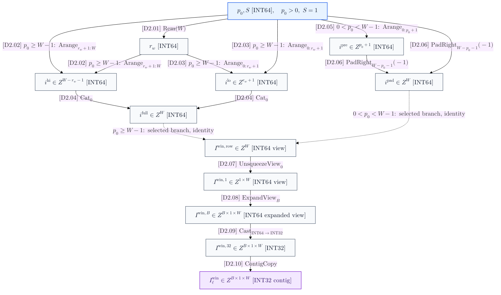
```mermaid
%%{init: {"theme": "base", "flowchart": {"htmlLabels": true, "curve": "basis", "nodeSpacing": 20, "rankSpacing": 28}}}%%
flowchart TD
    D2_P["$$p_0,S\;[\mathrm{INT64}],\quad p_0\gt0,\ S=1$$"]
    D2_R["$$r_w\;[\mathrm{INT64}]$$"]
    D2_HI["$$\mathbf i^{\mathrm{hi}}\in\mathbb Z^{W-r_w-1}\;[\mathrm{INT64}]$$"]
    D2_LO["$$\mathbf i^{\mathrm{lo}}\in\mathbb Z^{r_w+1}\;[\mathrm{INT64}]$$"]
    D2_FULL["$$\mathbf i^{\mathrm{full}}\in\mathbb Z^{W}\;[\mathrm{INT64}]$$"]
    D2_PRE["$$\mathbf i^{\mathrm{pre}}\in\mathbb Z^{p_0+1}\;[\mathrm{INT64}]$$"]
    D2_PAD["$$\mathbf i^{\mathrm{pad}}\in\mathbb Z^{W}\;[\mathrm{INT64}]$$"]
    D2_ROW["$$\mathbf I^{\mathrm{win,row}}\in\mathbb Z^{W}\;[\mathrm{INT64\ view}]$$"]
    D2_UNS["$$\mathbf I^{\mathrm{win},1}\in\mathbb Z^{1\times W}\;[\mathrm{INT64\ view}]$$"]
    D2_EXP["$$\mathbf I^{\mathrm{win},B}\in\mathbb Z^{B\times1\times W}\;[\mathrm{INT64\ expanded\ view}]$$"]
    D2_CAST["$$\mathbf I^{\mathrm{win},32}\in\mathbb Z^{B\times1\times W}\;[\mathrm{INT32}]$$"]
    D2_OUT["$$\mathbf I_{\ell}^{\mathrm{win}}\in\mathbb Z^{B\times1\times W}\;[\mathrm{INT32\ contig}]$$"]

    D2_P -->|"$$[\mathrm{D2.01}]\ \operatorname{Rem}(W)$$"| D2_R
    D2_P & D2_R -->|"$$[\mathrm{D2.02}]\ p_0\ge W-1:\ \operatorname{Arange}_{r_w+1:W}$$"| D2_HI
    D2_R & D2_P -->|"$$[\mathrm{D2.03}]\ p_0\ge W-1:\ \operatorname{Arange}_{0:r_w+1}$$"| D2_LO
    D2_HI & D2_LO -->|"$$[\mathrm{D2.04}]\ \operatorname{Cat}_{0}$$"| D2_FULL
    D2_P -->|"$$[\mathrm{D2.05}]\ 0\lt p_0\lt W-1:\ \operatorname{Arange}_{0:p_0+1}$$"| D2_PRE
    D2_PRE & D2_P -->|"$$[\mathrm{D2.06}]\ \operatorname{PadRight}_{W-p_0-1}(-1)$$"| D2_PAD
    D2_FULL -.->|"$$p_0\ge W-1:\ \text{selected branch, identity}$$"| D2_ROW
    D2_PAD -.->|"$$0\lt p_0\lt W-1:\ \text{selected branch, identity}$$"| D2_ROW
    D2_ROW -->|"$$[\mathrm{D2.07}]\ \operatorname{UnsqueezeView}_{0}$$"| D2_UNS
    D2_UNS -->|"$$[\mathrm{D2.08}]\ \operatorname{ExpandView}_{B}$$"| D2_EXP
    D2_EXP -->|"$$[\mathrm{D2.09}]\ \operatorname{Cast}_{\mathrm{INT64}\rightarrow\mathrm{INT32}}$$"| D2_CAST
    D2_CAST -->|"$$[\mathrm{D2.10}]\ \operatorname{ContigCopy}$$"| D2_OUT

    classDef input fill:#e8f3ff,stroke:#2563eb,color:#0f172a,stroke-width:1.5px;
    classDef data fill:#f8fafc,stroke:#475569,color:#0f172a,stroke-width:1.1px;
    classDef index fill:#f3e8ff,stroke:#7e22ce,color:#2e1065,stroke-width:1.3px;
    class D2_P input;
    class D2_R,D2_HI,D2_LO,D2_FULL,D2_PRE,D2_PAD,D2_ROW,D2_UNS,D2_EXP,D2_CAST data;
    class D2_OUT index;
```

## E. Compression state machines

The CSA overlap state machine is executed twice with independent parameters and buffers. In
E1/E2, $d_\star=d_h$ denotes the main attention-compressor instance and $d_\star=d_I$ denotes
the lightning-indexer compressor instance.

| CSA instance      | Raw projected width | Persistent incomplete states                     | Post-pooling path             | Persistent completed cache        |
| ----------------- | ------------------- | ------------------------------------------------ | ----------------------------- | --------------------------------- |
| Main attention    | $2d_h$              | $(\mathcal S_\ell^{kv},\mathcal S_\ell^z)$       | RMSNorm, block-start RoPE, P3 | $\mathcal K_\ell^{\mathrm{comp}}$ |
| Lightning indexer | $2d_I$              | $(\mathcal S_\ell^{I,kv},\mathcal S_\ell^{I,z})$ | RMSNorm, block-start RoPE, P4 | $\mathcal K_\ell^I$               |

The two rows are two executions, not aliases. Implementation references for all four state machines:
[model.py, lines 285-383](inference/model.py#L285-L383).

For CSA branch lettering, the projected second half is paper branch $a$ (the current block),
whereas the projected first half is paper branch $b$ (the preceding block). The executable code
names these operands by half and time rather than by the paper's letters.

### E1. CSA overlapping compression - prefill

```mermaid
%%{init: {"theme": "base", "flowchart": {"htmlLabels": true, "curve": "basis", "nodeSpacing": 18, "rankSpacing": 28}}}%%
flowchart LR
    E1_H["$$\widehat{\mathbf H}_{\ell}^{a}\in\mathbb R^{B\times S\times D}\;[\mathrm{BF16}],\quad p_0=0$$"]
    E1_S["$$S\;[\mathrm{INT64}]$$"]
    E1_H32["$$\widehat{\mathbf H}_{\ell}^{a,32}\in\mathbb R^{B\times S\times D}\;[\mathrm{FP32}]$$"]
    E1_V["$$\mathbf V_{\ell,\star}^{\mathrm{raw}}\in\mathbb R^{B\times S\times(2d_\star)}\;[\mathrm{FP32}]$$"]
    E1_Z["$$\mathbf Z_{\ell,\star}^{\mathrm{raw}}\in\mathbb R^{B\times S\times(2d_\star)}\;[\mathrm{FP32}]$$"]
    E1_REM["$$r_C\;[\mathrm{INT64}]$$"]
    E1_CUT["$$s_C\;[\mathrm{INT64}]$$"]
    E1_READY["$$e_C^{\mathrm{pre}}\;[\mathrm{BOOL}]$$"]

    E1_LASTV["$$\mathbf V_{\ell,\star}^{\mathrm{last}}\in\mathbb R^{B\times\rho_C\times(2d_\star)}\;[\mathrm{FP32\ view}]$$"]
    E1_LASTZ["$$\mathbf Z_{\ell,\star}^{\mathrm{last}}\in\mathbb R^{B\times\rho_C\times(2d_\star)}\;[\mathrm{FP32\ view}]$$"]
    E1_LASTZA["$$\mathbf Z_{\ell,\star}^{\mathrm{last+ape}}\in\mathbb R^{B\times\rho_C\times(2d_\star)}\;[\mathrm{FP32}]$$"]
    E1_PREVV["$$\mathcal S_{\ell,\star}^{kv}[:,0:\rho_C,:]\;[\mathrm{FP32\ persist}]$$"]
    E1_PREVZ["$$\mathcal S_{\ell,\star}^{z}[:,0:\rho_C,:]\;[\mathrm{FP32\ persist}]$$"]
    E1_REMV["$$\mathbf V_{\ell,\star}^{\mathrm{rem}}\in\mathbb R^{B\times r_C\times(2d_\star)}\;[\mathrm{FP32\ view}]$$"]
    E1_REMZ["$$\mathbf Z_{\ell,\star}^{\mathrm{rem}}\in\mathbb R^{B\times r_C\times(2d_\star)}\;[\mathrm{FP32\ view}]$$"]
    E1_REMZA["$$\mathbf Z_{\ell,\star}^{\mathrm{rem+ape}}\in\mathbb R^{B\times r_C\times(2d_\star)}\;[\mathrm{FP32}]$$"]
    E1_CURV["$$\mathcal S_{\ell,\star}^{kv}[:,\rho_C:\rho_C+r_C,:]\;[\mathrm{FP32\ persist}]$$"]
    E1_CURZ["$$\mathcal S_{\ell,\star}^{z}[:,\rho_C:\rho_C+r_C,:]\;[\mathrm{FP32\ persist}]$$"]

    E1_VP["$$\mathbf V_{\ell,\star}^{\mathrm{prefix}}\in\mathbb R^{B\times s_C\times(2d_\star)}\;[\mathrm{FP32\ view}]$$"]
    E1_ZP["$$\mathbf Z_{\ell,\star}^{\mathrm{prefix}}\in\mathbb R^{B\times s_C\times(2d_\star)}\;[\mathrm{FP32\ view}]$$"]
    E1_VG["$$\mathbf V_{\ell,\star}^{\mathrm{group}}\in\mathbb R^{B\times C_{\ell}^{\mathrm{new}}\times\rho_C\times(2d_\star)}\;[\mathrm{FP32\ view}]$$"]
    E1_ZG["$$\mathbf Z_{\ell,\star}^{\mathrm{group}}\in\mathbb R^{B\times C_{\ell}^{\mathrm{new}}\times\rho_C\times(2d_\star)}\;[\mathrm{FP32\ view}]$$"]
    E1_ZA["$$\mathbf Z_{\ell,\star}^{\mathrm{group+ape}}\in\mathbb R^{B\times C_{\ell}^{\mathrm{new}}\times\rho_C\times(2d_\star)}\;[\mathrm{FP32}]$$"]
    E1_SRCV0["$$\mathbf V_{\ell,\star}^{\mathrm{src0}}\in\mathbb R^{B\times C_{\ell}^{\mathrm{new}}\times(2\rho_C)\times d_\star}\;[\mathrm{FP32\ allocated\ zeros}]$$"]
    E1_SRCZ0["$$\mathbf Z_{\ell,\star}^{\mathrm{src0}}\in\mathbb R^{B\times C_{\ell}^{\mathrm{new}}\times(2\rho_C)\times d_\star}\;[\mathrm{FP32\ allocated}\ -\infty]$$"]
    E1_VB["$$\mathbf V_{\ell,\star}^{a,\mathrm{cur}}\in\mathbb R^{B\times C_{\ell}^{\mathrm{new}}\times\rho_C\times d_\star}\;[\mathrm{FP32\ view}]$$"]
    E1_ZB["$$\mathbf Z_{\ell,\star}^{a,\mathrm{cur}}\in\mathbb R^{B\times C_{\ell}^{\mathrm{new}}\times\rho_C\times d_\star}\;[\mathrm{FP32\ view}]$$"]
    E1_VA["$$\mathbf V_{\ell,\star}^{b,\mathrm{prev}}\in\mathbb R^{B\times\max(C_{\ell}^{\mathrm{new}}-1,0)\times\rho_C\times d_\star}\;[\mathrm{FP32\ view}]$$"]
    E1_ZAA["$$\mathbf Z_{\ell,\star}^{b,\mathrm{prev}}\in\mathbb R^{B\times\max(C_{\ell}^{\mathrm{new}}-1,0)\times\rho_C\times d_\star}\;[\mathrm{FP32\ view}]$$"]
    E1_SRCV1["$$\mathbf V_{\ell,\star}^{\mathrm{src1}}\in\mathbb R^{B\times C_{\ell}^{\mathrm{new}}\times(2\rho_C)\times d_\star}\;[\mathrm{FP32}]$$"]
    E1_SRCV["$$\mathbf V_{\ell,\star}^{\mathrm{src}}\in\mathbb R^{B\times C_{\ell}^{\mathrm{new}}\times(2\rho_C)\times d_\star}\;[\mathrm{FP32}]$$"]
    E1_SRCZ1["$$\mathbf Z_{\ell,\star}^{\mathrm{src1}}\in\mathbb R^{B\times C_{\ell}^{\mathrm{new}}\times(2\rho_C)\times d_\star}\;[\mathrm{FP32}]$$"]
    E1_SRCZ["$$\mathbf Z_{\ell,\star}^{\mathrm{src}}\in\mathbb R^{B\times C_{\ell}^{\mathrm{new}}\times(2\rho_C)\times d_\star}\;[\mathrm{FP32}]$$"]
    E1_W["$$\mathbf W_{\ell,\star}^{\mathrm{pool}}\in\mathbb R^{B\times C_{\ell}^{\mathrm{new}}\times(2\rho_C)\times d_\star}\;[\mathrm{FP32}]$$"]
    E1_MUL["$$\mathbf V_{\ell,\star}^{\mathrm{weighted}}\in\mathbb R^{B\times C_{\ell}^{\mathrm{new}}\times(2\rho_C)\times d_\star}\;[\mathrm{FP32}]$$"]
    E1_POOL["$$\mathbf V_{\ell,\star}^{\mathrm{pool}}\in\mathbb R^{B\times C_{\ell}^{\mathrm{new}}\times d_\star}\;[\mathrm{FP32}]$$"]

    E1_BF["$$\mathbf V_{\ell,\star}^{\mathrm{pool16}}\in\mathbb R^{B\times C_{\ell}^{\mathrm{new}}\times d_\star}\;[\mathrm{BF16}]$$"]
    E1_N["$$\mathbf V_{\ell,\star}^{\mathrm{norm}}\in\mathbb R^{B\times C_{\ell}^{\mathrm{new}}\times d_\star}\;[\mathrm{BF16}]$$"]
    E1_FALL["$$\mathcal F_{\ell}\in\mathbb C^{S_{\max}\times(d_r/2)}\;[\mathbb{C}_{32} \text{ persist}]$$"]
    E1_FB["$$\mathbf F_{\ell}^{C}\in\mathbb C^{C_{\ell}^{\mathrm{new}}\times(d_r/2)}\;[\mathbb{C}_{32} \text{ view}]$$"]
    E1_R["$$\mathbf V_{\ell,\star}^{\mathrm{rope}}\in\mathbb R^{B\times C_{\ell}^{\mathrm{new}}\times d_\star}\;[\mathrm{BF16}]$$"]
    E1_MAIN["$$\mathbf C_{\ell}^{\mathrm{emit}}\in\mathbb R^{B\times C_{\ell}^{\mathrm{new}}\times d_h}\;[\mathrm{BF16}]$$"]
    E1_INDEX["$$\mathbf K_{\ell}^{I,\mathrm{emit}}\in\mathbb R^{B\times C_{\ell}^{\mathrm{new}}\times d_I}\;[\mathrm{BF16\ after\ FP4\ QDQ}]$$"]
    E1_MCACHE["$$\mathcal K_{\ell}^{\mathrm{comp}}[:,0:C_{\ell}^{\mathrm{new}},:]\;[\mathrm{BF16\ persist}]$$"]
    E1_ICACHE["$$\mathcal K_{\ell}^{I}[:,0:C_{\ell}^{\mathrm{new}},:]\;[\mathrm{BF16\ persist}]$$"]
    E1_STATEONLY["$$(\mathcal S_{\ell,\star}^{kv,+},\mathcal S_{\ell,\star}^{z,+})\;[\mathrm{FP32\ persist};\ \mathrm{no\ compressed\ emission}]$$"]

    E1_H -->|"$$[\mathrm{E1.01}]\ \operatorname{Cast}_{\mathrm{BF16}\rightarrow\mathrm{FP32}}$$"| E1_H32
    E1_H32 -->|"$$[\mathrm{E1.02}]\ \operatorname{GEMM}\!\left(W_{\star,kv}^{\ell}\in\mathbb R^{(2d_\star)\times D}\right)$$"| E1_V
    E1_H32 -->|"$$[\mathrm{E1.03}]\ \operatorname{GEMM}\!\left(W_{\star,z}^{\ell}\in\mathbb R^{(2d_\star)\times D}\right)$$"| E1_Z
    E1_S -->|"$$[\mathrm{E1.04}]\ \operatorname{Rem}(\rho_C)$$"| E1_REM
    E1_S & E1_REM -->|"$$[\mathrm{E1.05}]\ \operatorname{Sub}$$"| E1_CUT
    E1_S -->|"$$[\mathrm{E1.05g}]\ \operatorname{GreaterEqScalar}(\rho_C)$$"| E1_READY

    E1_V & E1_CUT -->|"$$[\mathrm{E1.06}]\ s_C\ge\rho_C:\ \operatorname{SliceView}_{s_C-\rho_C:s_C}$$"| E1_LASTV
    E1_Z & E1_CUT -->|"$$[\mathrm{E1.07}]\ s_C\ge\rho_C:\ \operatorname{SliceView}_{s_C-\rho_C:s_C}$$"| E1_LASTZ
    E1_LASTZ -->|"$$[\mathrm{E1.08}]\ \operatorname{AddBcast}(\mathrm{APE}_{C,\star}\in\mathbb R^{\rho_C\times2d_\star}\;[\mathrm{FP32}])$$"| E1_LASTZA
    E1_LASTV -->|"$$[\mathrm{E1.09V}]\ \operatorname{CacheWrite}_{0:\rho_C}$$"| E1_PREVV
    E1_LASTZA -->|"$$[\mathrm{E1.09Z}]\ \operatorname{CacheWrite}_{0:\rho_C}$$"| E1_PREVZ
    E1_V & E1_CUT & E1_S -->|"$$[\mathrm{E1.10}]\ r_C\gt0:\ \operatorname{SliceView}_{s_C:S}$$"| E1_REMV
    E1_Z & E1_CUT & E1_S -->|"$$[\mathrm{E1.11}]\ r_C\gt0:\ \operatorname{SliceView}_{s_C:S}$$"| E1_REMZ
    E1_REMZ -->|"$$[\mathrm{E1.12}]\ \operatorname{AddBcast}(\mathrm{APE}_{C,\star}[0:r_C,0:2d_\star]\;[\mathrm{FP32}])$$"| E1_REMZA
    E1_REMV -->|"$$[\mathrm{E1.13V}]\ \operatorname{CacheWrite}_{\rho_C:\rho_C+r_C}$$"| E1_CURV
    E1_REMZA -->|"$$[\mathrm{E1.13Z}]\ \operatorname{CacheWrite}_{\rho_C:\rho_C+r_C}$$"| E1_CURZ

    E1_V & E1_CUT -->|"$$[\mathrm{E1.14}]\ \operatorname{SliceView}_{0:s_C}$$"| E1_VP
    E1_Z & E1_CUT -->|"$$[\mathrm{E1.15}]\ \operatorname{SliceView}_{0:s_C}$$"| E1_ZP
    E1_VP -->|"$$[\mathrm{E1.16}]\ \operatorname{UnflattenView}_{s_C\rightarrow C_{\ell}^{\mathrm{new}},\rho_C}$$"| E1_VG
    E1_ZP -->|"$$[\mathrm{E1.17}]\ \operatorname{UnflattenView}_{s_C\rightarrow C_{\ell}^{\mathrm{new}},\rho_C}$$"| E1_ZG
    E1_ZG -->|"$$[\mathrm{E1.18}]\ \operatorname{AddBcast}(\mathrm{APE}_{C,\star}\in\mathbb R^{\rho_C\times2d_\star}\;[\mathrm{FP32}])$$"| E1_ZA
    E1_H & E1_CUT -->|"$$[\mathrm{E1.19}]\ \operatorname{AllocateFill}(0)$$"| E1_SRCV0
    E1_H & E1_CUT -->|"$$[\mathrm{E1.20}]\ \operatorname{AllocateFill}(-\infty)$$"| E1_SRCZ0
    E1_VG -->|"$$[\mathrm{E1.21}]\ \operatorname{SliceView}_{:,:,:,d_\star:2d_\star}\ \text{(paper }a\text{, current)}$$"| E1_VB
    E1_ZA -->|"$$[\mathrm{E1.22}]\ \operatorname{SliceView}_{:,:,:,d_\star:2d_\star}\ \text{(paper }a\text{, current)}$$"| E1_ZB
    E1_VG -->|"$$[\mathrm{E1.23}]\ \operatorname{SliceView}_{:,0:C_{\ell}^{\mathrm{new}}-1,:,0:d_\star}\ \text{(paper }b\text{, preceding)}$$"| E1_VA
    E1_ZA -->|"$$[\mathrm{E1.24}]\ \operatorname{SliceView}_{:,0:C_{\ell}^{\mathrm{new}}-1,:,0:d_\star}\ \text{(paper }b\text{, preceding)}$$"| E1_ZAA
    E1_SRCV0 & E1_VB -->|"$$[\mathrm{E1.25}]\ \operatorname{CopyIntoSlots}_{\rho_C:2\rho_C}$$"| E1_SRCV1
    E1_SRCV1 & E1_VA -->|"$$[\mathrm{E1.26}]\ \operatorname{CopyIntoBlocks}_{1:,\ \mathrm{slots}\ 0:\rho_C}$$"| E1_SRCV
    E1_SRCZ0 & E1_ZB -->|"$$[\mathrm{E1.27}]\ \operatorname{CopyIntoSlots}_{\rho_C:2\rho_C}$$"| E1_SRCZ1
    E1_SRCZ1 & E1_ZAA -->|"$$[\mathrm{E1.28}]\ \operatorname{CopyIntoBlocks}_{1:,\ \mathrm{slots}\ 0:\rho_C}$$"| E1_SRCZ
    E1_SRCZ -->|"$$[\mathrm{E1.29}]\ \operatorname{Softmax}_{2\rho_C\ \mathrm{srcs},\mathrm{FP32}}$$"| E1_W
    E1_SRCV & E1_W -->|"$$[\mathrm{E1.30}]\ \operatorname{Mul}$$"| E1_MUL
    E1_MUL -->|"$$[\mathrm{E1.31}]\ \operatorname{ReduceSum}_{2\rho_C\ \mathrm{srcs}}$$"| E1_POOL

    E1_POOL & E1_READY -->|"$$[\mathrm{E1.32}]\ e_C^{\mathrm{pre}}:\ \operatorname{Cast}_{\mathrm{FP32}\rightarrow\mathrm{BF16}}$$"| E1_BF
    E1_BF -->|"$$[\mathrm{E1.33}]\ \operatorname{RMSNorm}_{d_\star}\ \text{with FP32 stats}$$"| E1_N
    E1_READY & E1_CUT & E1_FALL -->|"$$[\mathrm{E1.34}]\ e_C^{\mathrm{pre}}:\ \operatorname{StridedSliceView}_{0:s_C:\rho_C}$$"| E1_FB
    E1_N & E1_FB -->|"$$[\mathrm{E1.35}]\ \text{inline P2, forward block-start phase}$$"| E1_R
    E1_R -->|"$$[\mathrm{E1.36M}]\ d_\star=d_h:\ \text{inline P3}$$"| E1_MAIN
    E1_R -->|"$$[\mathrm{E1.36I}]\ d_\star=d_I:\ \text{inline P4}$$"| E1_INDEX
    E1_MAIN -->|"$$[\mathrm{E1.37M}]\ \operatorname{CacheWrite}_{0:C_{\ell}^{\mathrm{new}}}$$"| E1_MCACHE
    E1_INDEX -->|"$$[\mathrm{E1.37I}]\ \operatorname{CacheWrite}_{0:C_{\ell}^{\mathrm{new}}}$$"| E1_ICACHE
    E1_CURV & E1_CURZ & E1_POOL & E1_READY -.->|"$$\neg e_C^{\mathrm{pre}}:$$ zero-block pool and state aliases complete; stop before E1.32"| E1_STATEONLY

    classDef input fill:#e8f3ff,stroke:#2563eb,color:#0f172a,stroke-width:1.5px;
    classDef data fill:#f8fafc,stroke:#475569,color:#0f172a,stroke-width:1.05px;
    classDef cache fill:#fff4d6,stroke:#b7791f,color:#422006,stroke-width:1.4px;
    classDef output fill:#dcfce7,stroke:#15803d,color:#052e16,stroke-width:1.6px;
    class E1_H,E1_S input;
    class E1_PREVV,E1_PREVZ,E1_CURV,E1_CURZ,E1_FALL,E1_MCACHE,E1_ICACHE cache;
    class E1_H32,E1_V,E1_Z,E1_REM,E1_CUT,E1_READY,E1_LASTV,E1_LASTZ,E1_LASTZA,E1_REMV,E1_REMZ,E1_REMZA,E1_VP,E1_ZP,E1_VG,E1_ZG,E1_ZA,E1_SRCV0,E1_SRCZ0,E1_VB,E1_ZB,E1_VA,E1_ZAA,E1_SRCV1,E1_SRCV,E1_SRCZ1,E1_SRCZ,E1_W,E1_MUL,E1_POOL,E1_BF,E1_N,E1_FB,E1_R,E1_STATEONLY data;
    class E1_MAIN,E1_INDEX output;
```

### E2. CSA overlapping compression - single-token decode

```mermaid
%%{init: {"theme": "base", "flowchart": {"htmlLabels": true, "curve": "basis", "nodeSpacing": 18, "rankSpacing": 28}}}%%
flowchart LR
    E2_H["$$\widehat{\mathbf H}_{\ell}^{a}\in\mathbb R^{B\times1\times D}\;[\mathrm{BF16}],\quad p_0\gt0$$"]
    E2_P["$$p_0,S\;[\mathrm{INT64}],\quad p_0\gt0,\ S=1$$"]
    E2_H32["$$\widehat{\mathbf H}_{\ell}^{a,32}\in\mathbb R^{B\times1\times D}\;[\mathrm{FP32}]$$"]
    E2_V["$$\mathbf V_{\ell,\star}^{\mathrm{raw}}\in\mathbb R^{B\times1\times(2d_\star)}\;[\mathrm{FP32}]$$"]
    E2_Z["$$\mathbf Z_{\ell,\star}^{\mathrm{raw}}\in\mathbb R^{B\times1\times(2d_\star)}\;[\mathrm{FP32}]$$"]
    E2_R["$$r_C\;[\mathrm{INT64}]$$"]
    E2_ZA["$$\mathbf Z_{\ell,\star}^{\mathrm{raw+ape}}\in\mathbb R^{B\times1\times(2d_\star)}\;[\mathrm{FP32}]$$"]
    E2_V0["$$\mathbf V_{\ell,\star}^{\mathrm{raw0}}\in\mathbb R^{B\times(2d_\star)}\;[\mathrm{FP32\ view}]$$"]
    E2_Z0["$$\mathbf Z_{\ell,\star}^{\mathrm{raw0+ape}}\in\mathbb R^{B\times(2d_\star)}\;[\mathrm{FP32\ view}]$$"]
    E2_SVIN["$$\mathcal S_{\ell,\star}^{kv}\in\mathbb R^{B_{\max}\times(2\rho_C)\times(2d_\star)}\;[\mathrm{FP32\ persist}]$$"]
    E2_SZIN["$$\mathcal S_{\ell,\star}^{z}\in\mathbb R^{B_{\max}\times(2\rho_C)\times(2d_\star)}\;[\mathrm{FP32\ persist}]$$"]
    E2_STATEV["$$\mathcal S_{\ell,\star}^{kv,+}\in\mathbb R^{B_{\max}\times(2\rho_C)\times(2d_\star)}\;[\mathrm{FP32\ persist\ after\ write}]$$"]
    E2_STATEZ["$$\mathcal S_{\ell,\star}^{z,+}\in\mathbb R^{B_{\max}\times(2\rho_C)\times(2d_\star)}\;[\mathrm{FP32\ persist\ after\ write}]$$"]
    E2_P1["$$p_0^{+}\;[\mathrm{INT64}]$$"]
    E2_FREM["$$r_C^{+}\;[\mathrm{INT64}]$$"]
    E2_FLAG["$$e_C\;[\mathrm{BOOL}]$$"]

    E2_PVA["$$\mathbf V_{\ell,\star}^{\mathrm{prev},b}\in\mathbb R^{B\times\rho_C\times d_\star}\;[\mathrm{FP32\ view}]$$"]
    E2_CVB["$$\mathbf V_{\ell,\star}^{\mathrm{cur},a}\in\mathbb R^{B\times\rho_C\times d_\star}\;[\mathrm{FP32\ view}]$$"]
    E2_PZA["$$\mathbf Z_{\ell,\star}^{\mathrm{prev},b}\in\mathbb R^{B\times\rho_C\times d_\star}\;[\mathrm{FP32\ view}]$$"]
    E2_CZB["$$\mathbf Z_{\ell,\star}^{\mathrm{cur},a}\in\mathbb R^{B\times\rho_C\times d_\star}\;[\mathrm{FP32\ view}]$$"]
    E2_SV["$$\mathbf V_{\ell,\star}^{\mathrm{src}}\in\mathbb R^{B\times(2\rho_C)\times d_\star}\;[\mathrm{FP32}]$$"]
    E2_SZ["$$\mathbf Z_{\ell,\star}^{\mathrm{src}}\in\mathbb R^{B\times(2\rho_C)\times d_\star}\;[\mathrm{FP32}]$$"]
    E2_W["$$\mathbf W_{\ell,\star}^{\mathrm{pool}}\in\mathbb R^{B\times(2\rho_C)\times d_\star}\;[\mathrm{FP32}]$$"]
    E2_M["$$\mathbf V_{\ell,\star}^{\mathrm{weighted}}\in\mathbb R^{B\times(2\rho_C)\times d_\star}\;[\mathrm{FP32}]$$"]
    E2_POOL0["$$\mathbf V_{\ell,\star}^{\mathrm{pool0}}\in\mathbb R^{B\times d_\star}\;[\mathrm{FP32}]$$"]
    E2_POOL["$$\mathbf V_{\ell,\star}^{\mathrm{pool}}\in\mathbb R^{B\times1\times d_\star}\;[\mathrm{FP32}]$$"]
    E2_ROLLV["$$\mathcal S_{\ell,\star}^{kv}[:,0:\rho_C,:]\;[\mathrm{FP32\ persist}]$$"]
    E2_ROLLZ["$$\mathcal S_{\ell,\star}^{z}[:,0:\rho_C,:]\;[\mathrm{FP32\ persist}]$$"]

    E2_BF["$$\mathbf V_{\ell,\star}^{\mathrm{pool16}}\in\mathbb R^{B\times1\times d_\star}\;[\mathrm{BF16}]$$"]
    E2_N["$$\mathbf V_{\ell,\star}^{\mathrm{norm}}\in\mathbb R^{B\times1\times d_\star}\;[\mathrm{BF16}]$$"]
    E2_BPOS["$$p_C\;[\mathrm{INT64}]$$"]
    E2_FALL["$$\mathcal F_{\ell}\in\mathbb C^{S_{\max}\times(d_r/2)}\;[\mathbb{C}_{32} \text{ persist}]$$"]
    E2_FB["$$\mathbf F_{\ell}^{C}\in\mathbb C^{1\times(d_r/2)}\;[\mathbb{C}_{32} \text{ view}]$$"]
    E2_ROPE["$$\mathbf V_{\ell,\star}^{\mathrm{rope}}\in\mathbb R^{B\times1\times d_\star}\;[\mathrm{BF16}]$$"]
    E2_MAIN["$$\mathbf C_{\ell}^{\mathrm{emit}}\in\mathbb R^{B\times1\times d_h}\;[\mathrm{BF16}]$$"]
    E2_INDEX["$$\mathbf K_{\ell}^{I,\mathrm{emit}}\in\mathbb R^{B\times1\times d_I}\;[\mathrm{BF16\ after\ FP4\ QDQ}]$$"]
    E2_CIDX["$$c_C\;[\mathrm{INT64}]$$"]
    E2_MCACHE["$$\mathcal K_{\ell}^{\mathrm{comp}}[:,c_C,:]\;[\mathrm{BF16\ persist}]$$"]
    E2_ICACHE["$$\mathcal K_{\ell}^{I}[:,c_C,:]\;[\mathrm{BF16\ persist}]$$"]
    E2_STATEONLY["$$(\mathcal S_{\ell,\star}^{kv,+},\mathcal S_{\ell,\star}^{z,+})\;[\mathrm{FP32\ persist};\ \mathrm{no\ compressed\ emission}]$$"]

    E2_H -->|"$$[\mathrm{E2.01}]\ \operatorname{Cast}_{\mathrm{BF16}\rightarrow\mathrm{FP32}}$$"| E2_H32
    E2_H32 -->|"$$[\mathrm{E2.02}]\ \operatorname{GEMM}\!\left(W_{\star,kv}^{\ell}\in\mathbb R^{(2d_\star)\times D}\right)$$"| E2_V
    E2_H32 -->|"$$[\mathrm{E2.03}]\ \operatorname{GEMM}\!\left(W_{\star,z}^{\ell}\in\mathbb R^{(2d_\star)\times D}\right)$$"| E2_Z
    E2_P -->|"$$[\mathrm{E2.04}]\ \operatorname{Rem}(\rho_C)$$"| E2_R
    E2_Z & E2_R -->|"$$[\mathrm{E2.05}]\ \operatorname{AddBcast}(\mathrm{APE}_{C,\star}[r_C,0:2d_\star]\;[\mathrm{FP32}])$$"| E2_ZA
    E2_V -->|"$$[\mathrm{E2.06}]\ \operatorname{SqueezeView}_{S}$$"| E2_V0
    E2_ZA -->|"$$[\mathrm{E2.07}]\ \operatorname{SqueezeView}_{S}$$"| E2_Z0
    E2_R -->|"$$[\mathrm{E2.08}]\ \operatorname{CacheWrite}_{\rho_C+r_C}$$"| E2_STATEV
    E2_SVIN & E2_V0 -->|"$$[\mathrm{E2.08}]$$"| E2_STATEV
    E2_Z0 & E2_SZIN -->|"$$[\mathrm{E2.09}]$$"| E2_STATEZ
    E2_R -->|"$$[\mathrm{E2.09}]\ \operatorname{CacheWrite}_{\rho_C+r_C}$$"| E2_STATEZ
    E2_P -->|"$$[\mathrm{E2.10}]\ \operatorname{AddScalar}(1)$$"| E2_P1
    E2_P1 -->|"$$[\mathrm{E2.11}]\ \operatorname{Rem}(\rho_C)$$"| E2_FREM
    E2_FREM -->|"$$[\mathrm{E2.12}]\ \operatorname{EqScalar}(0)$$"| E2_FLAG

    E2_STATEV -->|"$$[\mathrm{E2.13}]\ e_C:\ \operatorname{SliceView}_{:B,0:\rho_C,0:d_\star}\ \text{(paper }b\text{)}$$"| E2_PVA
    E2_FLAG -->|"$$[\mathrm{E2.13}]$$"| E2_PVA
    E2_STATEV -->|"$$[\mathrm{E2.14}]\ e_C:\ \operatorname{SliceView}_{:B,\rho_C:2\rho_C,d_\star:2d_\star}\ \text{(paper }a\text{)}$$"| E2_CVB
    E2_FLAG -->|"$$[\mathrm{E2.14}]$$"| E2_CVB
    E2_STATEZ -->|"$$[\mathrm{E2.15}]\ e_C:\ \operatorname{SliceView}_{:B,0:\rho_C,0:d_\star}\ \text{(paper }b\text{)}$$"| E2_PZA
    E2_FLAG -->|"$$[\mathrm{E2.15}]$$"| E2_PZA
    E2_STATEZ -->|"$$[\mathrm{E2.16}]\ e_C:\ \operatorname{SliceView}_{:B,\rho_C:2\rho_C,d_\star:2d_\star}\ \text{(paper }a\text{)}$$"| E2_CZB
    E2_FLAG -->|"$$[\mathrm{E2.16}]$$"| E2_CZB
    E2_PVA & E2_CVB -->|"$$[\mathrm{E2.17}]\ \operatorname{Cat}_{\mathrm{src}}$$"| E2_SV
    E2_PZA & E2_CZB -->|"$$[\mathrm{E2.18}]\ \operatorname{Cat}_{\mathrm{src}}$$"| E2_SZ
    E2_SZ -->|"$$[\mathrm{E2.19}]\ \operatorname{Softmax}_{2\rho_C\ \mathrm{srcs},\mathrm{FP32}}$$"| E2_W
    E2_SV & E2_W -->|"$$[\mathrm{E2.20}]\ \operatorname{Mul}$$"| E2_M
    E2_M -->|"$$[\mathrm{E2.21}]\ \operatorname{ReduceSum}_{2\rho_C\ \mathrm{srcs}}$$"| E2_POOL0
    E2_POOL0 -->|"$$[\mathrm{E2.22}]\ \operatorname{UnsqueezeView}_{1}$$"| E2_POOL
    E2_STATEV -->|"$$[\mathrm{E2.23}]\ e_C:\ \operatorname{Copy}_{:B,\rho_C:2\rho_C,0:2d_\star\rightarrow:B,0:\rho_C,0:2d_\star}$$"| E2_ROLLV
    E2_POOL0 -.->|"pool read completed before in-place roll"| E2_ROLLV
    E2_FLAG -->|"$$[\mathrm{E2.23}]$$"| E2_ROLLV
    E2_POOL0 -.->|"pool read completed before in-place roll"| E2_ROLLZ
    E2_STATEZ -->|"$$[\mathrm{E2.24}]\ e_C:\ \operatorname{Copy}_{:B,\rho_C:2\rho_C,0:2d_\star\rightarrow:B,0:\rho_C,0:2d_\star}$$"| E2_ROLLZ
    E2_FLAG -->|"$$[\mathrm{E2.24}]$$"| E2_ROLLZ

    E2_POOL -->|"$$[\mathrm{E2.25}]\ \operatorname{Cast}_{\mathrm{FP32}\rightarrow\mathrm{BF16}}$$"| E2_BF
    E2_BF -->|"$$[\mathrm{E2.26}]\ \operatorname{RMSNorm}_{d_\star}\ \text{with FP32 stats}$$"| E2_N
    E2_FLAG -->|"$$[\mathrm{E2.27}]$$"| E2_BPOS
    E2_P1 -->|"$$[\mathrm{E2.27}]\ e_C:\ \operatorname{SubScalar}(\rho_C)$$"| E2_BPOS
    E2_FALL & E2_BPOS -->|"$$[\mathrm{E2.28}]\ \operatorname{SliceView}_{p_C:p_C+1}$$"| E2_FB
    E2_N & E2_FB -->|"$$[\mathrm{E2.29}]\ \text{inline P2, forward block-start phase}$$"| E2_ROPE
    E2_ROPE -->|"$$[\mathrm{E2.30M}]\ d_\star=d_h:\ \text{inline P3}$$"| E2_MAIN
    E2_ROPE -->|"$$[\mathrm{E2.30I}]\ d_\star=d_I:\ \text{inline P4}$$"| E2_INDEX
    E2_P -->|"$$[\mathrm{E2.31}]\ e_C:\ \operatorname{FloorDivScalar}(\rho_C)$$"| E2_CIDX
    E2_FLAG -->|"$$[\mathrm{E2.31}]$$"| E2_CIDX
    E2_MAIN & E2_CIDX -->|"$$[\mathrm{E2.32M}]\ \operatorname{CacheWrite}_{c_C}$$"| E2_MCACHE
    E2_INDEX & E2_CIDX -->|"$$[\mathrm{E2.32I}]\ \operatorname{CacheWrite}_{c_C}$$"| E2_ICACHE
    E2_STATEV & E2_STATEZ & E2_FLAG -.->|"$$\neg e_C:$$ state aliases only; stop before E2.13"| E2_STATEONLY

    classDef input fill:#e8f3ff,stroke:#2563eb,color:#0f172a,stroke-width:1.5px;
    classDef data fill:#f8fafc,stroke:#475569,color:#0f172a,stroke-width:1.05px;
    classDef cache fill:#fff4d6,stroke:#b7791f,color:#422006,stroke-width:1.4px;
    classDef output fill:#dcfce7,stroke:#15803d,color:#052e16,stroke-width:1.6px;
    class E2_H,E2_P input;
    class E2_SVIN,E2_SZIN,E2_STATEV,E2_STATEZ,E2_ROLLV,E2_ROLLZ,E2_FALL,E2_MCACHE,E2_ICACHE cache;
    class E2_H32,E2_V,E2_Z,E2_R,E2_ZA,E2_V0,E2_Z0,E2_P1,E2_FREM,E2_FLAG,E2_PVA,E2_CVB,E2_PZA,E2_CZB,E2_SV,E2_SZ,E2_W,E2_M,E2_POOL0,E2_POOL,E2_BF,E2_N,E2_BPOS,E2_FB,E2_ROPE,E2_CIDX,E2_STATEONLY data;
    class E2_MAIN,E2_INDEX output;
```

### E3. HCA non-overlapping compression - prefill

```mermaid
%%{init: {"theme": "base", "flowchart": {"htmlLabels": true, "curve": "basis", "nodeSpacing": 18, "rankSpacing": 28}}}%%
flowchart TD
    E3_H["$$\widehat{\mathbf H}_{\ell}^{a}\in\mathbb R^{B\times S\times D}\;[\mathrm{BF16}],\quad p_0=0$$"]
    E3_S["$$S\;[\mathrm{INT64}]$$"]
    E3_H32["$$\widehat{\mathbf H}_{\ell}^{a,32}\in\mathbb R^{B\times S\times D}\;[\mathrm{FP32}]$$"]
    E3_C["$$\mathbf C_{\ell}^{\mathrm{raw}}\in\mathbb R^{B\times S\times d_h}\;[\mathrm{FP32}]$$"]
    E3_Z["$$\mathbf Z_{\ell}^{\mathrm{raw}}\in\mathbb R^{B\times S\times d_h}\;[\mathrm{FP32}]$$"]
    E3_REM["$$r_H\;[\mathrm{INT64}]$$"]
    E3_CUT["$$s_H\;[\mathrm{INT64}]$$"]
    E3_READY["$$e_H^{\mathrm{pre}}\;[\mathrm{BOOL}]$$"]
    E3_CR["$$\mathbf C_{\ell}^{\mathrm{rem}}\in\mathbb R^{B\times r_H\times d_h}\;[\mathrm{FP32\ view}]$$"]
    E3_ZR["$$\mathbf Z_{\ell}^{\mathrm{rem}}\in\mathbb R^{B\times r_H\times d_h}\;[\mathrm{FP32\ view}]$$"]
    E3_ZRA["$$\mathbf Z_{\ell}^{\mathrm{rem+ape}}\in\mathbb R^{B\times r_H\times d_h}\;[\mathrm{FP32}]$$"]
    E3_SCV["$$\mathcal S_{\ell}^{kv}[:,0:r_H,:]\;[\mathrm{FP32\ persist}]$$"]
    E3_SCZ["$$\mathcal S_{\ell}^{z}[:,0:r_H,:]\;[\mathrm{FP32\ persist}]$$"]
    E3_CP["$$\mathbf C_{\ell}^{\mathrm{prefix}}\in\mathbb R^{B\times s_H\times d_h}\;[\mathrm{FP32\ view}]$$"]
    E3_ZP["$$\mathbf Z_{\ell}^{\mathrm{prefix}}\in\mathbb R^{B\times s_H\times d_h}\;[\mathrm{FP32\ view}]$$"]
    E3_CG["$$\mathbf C_{\ell}^{\mathrm{src}}\in\mathbb R^{B\times C_{\ell}^{\mathrm{new}}\times\rho_H\times d_h}\;[\mathrm{FP32\ view}]$$"]
    E3_ZG["$$\mathbf Z_{\ell}^{\mathrm{group}}\in\mathbb R^{B\times C_{\ell}^{\mathrm{new}}\times\rho_H\times d_h}\;[\mathrm{FP32\ view}]$$"]
    E3_ZA["$$\mathbf Z_{\ell}^{\mathrm{src}}\in\mathbb R^{B\times C_{\ell}^{\mathrm{new}}\times\rho_H\times d_h}\;[\mathrm{FP32}]$$"]
    E3_W["$$\mathbf W_{\ell}^{\mathrm{pool}}\in\mathbb R^{B\times C_{\ell}^{\mathrm{new}}\times\rho_H\times d_h}\;[\mathrm{FP32}]$$"]
    E3_M["$$\mathbf C_{\ell}^{\mathrm{weighted}}\in\mathbb R^{B\times C_{\ell}^{\mathrm{new}}\times\rho_H\times d_h}\;[\mathrm{FP32}]$$"]
    E3_POOL["$$\mathbf C_{\ell}^{\mathrm{pool}}\in\mathbb R^{B\times C_{\ell}^{\mathrm{new}}\times d_h}\;[\mathrm{FP32}]$$"]
    E3_BF["$$\mathbf C_{\ell}^{\mathrm{pool16}}\in\mathbb R^{B\times C_{\ell}^{\mathrm{new}}\times d_h}\;[\mathrm{BF16}]$$"]
    E3_N["$$\mathbf C_{\ell}^{\mathrm{norm}}\in\mathbb R^{B\times C_{\ell}^{\mathrm{new}}\times d_h}\;[\mathrm{BF16}]$$"]
    E3_FALL["$$\mathcal F_{\ell}\in\mathbb C^{S_{\max}\times(d_r/2)}\;[\mathbb{C}_{32} \text{ persist}]$$"]
    E3_FB["$$\mathbf F_{\ell}^{H}\in\mathbb C^{C_{\ell}^{\mathrm{new}}\times(d_r/2)}\;[\mathbb{C}_{32} \text{ view}]$$"]
    E3_R["$$\mathbf C_{\ell}^{\mathrm{rope}}\in\mathbb R^{B\times C_{\ell}^{\mathrm{new}}\times d_h}\;[\mathrm{BF16}]$$"]
    E3_OUT["$$\mathbf C_{\ell}^{\mathrm{emit}}\in\mathbb R^{B\times C_{\ell}^{\mathrm{new}}\times d_h}\;[\mathrm{BF16}]$$"]
    E3_CACHE["$$\mathcal K_{\ell}^{\mathrm{comp}}[:,0:C_{\ell}^{\mathrm{new}},:]\;[\mathrm{BF16\ persist}]$$"]
    E3_STATEONLY["$$(\mathcal S_{\ell}^{kv,+},\mathcal S_{\ell}^{z,+})\;[\mathrm{FP32\ persist};\ \mathrm{no\ compressed\ emission}]$$"]

    E3_H -->|"$$[\mathrm{E3.01}]\ \operatorname{Cast}_{\mathrm{BF16}\rightarrow\mathrm{FP32}}$$"| E3_H32
    E3_H32 -->|"$$[\mathrm{E3.02}]\ \operatorname{GEMM}\!\left(W_{c,kv}^{\ell}\in\mathbb R^{d_h\times D}\right)$$"| E3_C
    E3_H32 -->|"$$[\mathrm{E3.03}]\ \operatorname{GEMM}\!\left(W_{c,z}^{\ell}\in\mathbb R^{d_h\times D}\right)$$"| E3_Z
    E3_S -->|"$$[\mathrm{E3.04}]\ \operatorname{Rem}(\rho_H)$$"| E3_REM
    E3_S & E3_REM -->|"$$[\mathrm{E3.05}]\ \operatorname{Sub}$$"| E3_CUT
    E3_S -->|"$$[\mathrm{E3.05g}]\ \operatorname{GreaterEqScalar}(\rho_H)$$"| E3_READY
    E3_C & E3_CUT -->|"$$[\mathrm{E3.06}]\ r_H\gt0:\ \operatorname{SliceView}_{s_H:S}$$"| E3_CR
    E3_Z & E3_CUT -->|"$$[\mathrm{E3.07}]\ r_H\gt0:\ \operatorname{SliceView}_{s_H:S}$$"| E3_ZR
    E3_ZR -->|"$$[\mathrm{E3.08}]\ \operatorname{AddBcast}(\mathrm{APE}_{H}[0:r_H,0:d_h]\;[\mathrm{FP32}])$$"| E3_ZRA
    E3_CR -->|"$$[\mathrm{E3.09}]\ \operatorname{CacheWrite}_{0:r_H}$$"| E3_SCV
    E3_ZRA -->|"$$[\mathrm{E3.10}]\ \operatorname{CacheWrite}_{0:r_H}$$"| E3_SCZ
    E3_C & E3_CUT -->|"$$[\mathrm{E3.11}]\ \operatorname{SliceView}_{0:s_H}$$"| E3_CP
    E3_Z & E3_CUT -->|"$$[\mathrm{E3.12}]\ \operatorname{SliceView}_{0:s_H}$$"| E3_ZP
    E3_CP -->|"$$[\mathrm{E3.13}]\ \operatorname{UnflattenView}_{s_H\rightarrow C_{\ell}^{\mathrm{new}},\rho_H}$$"| E3_CG
    E3_ZP -->|"$$[\mathrm{E3.14}]\ \operatorname{UnflattenView}_{s_H\rightarrow C_{\ell}^{\mathrm{new}},\rho_H}$$"| E3_ZG
    E3_ZG -->|"$$[\mathrm{E3.15}]\ \operatorname{AddBcast}(\mathrm{APE}_{H}\in\mathbb R^{\rho_H\times d_h}\;[\mathrm{FP32}])$$"| E3_ZA
    E3_ZA -->|"$$[\mathrm{E3.16}]\ \operatorname{Softmax}_{\rho_H\ \mathrm{srcs},\mathrm{FP32}}$$"| E3_W
    E3_CG & E3_W -->|"$$[\mathrm{E3.17}]\ \operatorname{Mul}$$"| E3_M
    E3_M -->|"$$[\mathrm{E3.18}]\ \operatorname{ReduceSum}_{\rho_H\ \mathrm{srcs}}$$"| E3_POOL
    E3_POOL & E3_READY -->|"$$[\mathrm{E3.19}]\ e_H^{\mathrm{pre}}:\ \operatorname{Cast}_{\mathrm{FP32}\rightarrow\mathrm{BF16}}$$"| E3_BF
    E3_BF -->|"$$[\mathrm{E3.20}]\ \operatorname{RMSNorm}_{d_h}\ \text{with FP32 stats}$$"| E3_N
    E3_FALL & E3_CUT & E3_READY -->|"$$[\mathrm{E3.21}]\ e_H^{\mathrm{pre}}:\ \operatorname{StridedSliceView}_{0:s_H:\rho_H}$$"| E3_FB
    E3_N & E3_FB -->|"$$[\mathrm{E3.22}]\ \text{inline P2, forward block-start phase}$$"| E3_R
    E3_R -->|"$$[\mathrm{E3.23}]\ \text{inline P3 on the leading }d_n\text{ coordinates}$$"| E3_OUT
    E3_OUT -->|"$$[\mathrm{E3.24}]\ \operatorname{CacheWrite}_{0:C_{\ell}^{\mathrm{new}}}$$"| E3_CACHE
    E3_SCV & E3_SCZ & E3_POOL & E3_READY -.->|"$$\neg e_H^{\mathrm{pre}}:$$ zero-block pool and state aliases complete; stop before E3.19"| E3_STATEONLY

    classDef input fill:#e8f3ff,stroke:#2563eb,color:#0f172a,stroke-width:1.5px;
    classDef data fill:#f8fafc,stroke:#475569,color:#0f172a,stroke-width:1.05px;
    classDef cache fill:#fff4d6,stroke:#b7791f,color:#422006,stroke-width:1.4px;
    classDef output fill:#dcfce7,stroke:#15803d,color:#052e16,stroke-width:1.6px;
    class E3_H,E3_S input;
    class E3_SCV,E3_SCZ,E3_FALL,E3_CACHE cache;
    class E3_H32,E3_C,E3_Z,E3_REM,E3_CUT,E3_READY,E3_CR,E3_ZR,E3_ZRA,E3_CP,E3_ZP,E3_CG,E3_ZG,E3_ZA,E3_W,E3_M,E3_POOL,E3_BF,E3_N,E3_FB,E3_R,E3_STATEONLY data;
    class E3_OUT output;
```

### E4. HCA non-overlapping compression - single-token decode

```mermaid
%%{init: {"theme": "base", "flowchart": {"htmlLabels": true, "curve": "basis", "nodeSpacing": 18, "rankSpacing": 28}}}%%
flowchart TD
    E4_H["$$\widehat{\mathbf H}_{\ell}^{a}\in\mathbb R^{B\times1\times D}\;[\mathrm{BF16}]$$"]
    E4_P["$$p_0,S\;[\mathrm{INT64}],\quad p_0\gt0,\ S=1$$"]
    E4_H32["$$\widehat{\mathbf H}_{\ell}^{a,32}\in\mathbb R^{B\times1\times D}\;[\mathrm{FP32}]$$"]
    E4_C["$$\mathbf C_{\ell}^{\mathrm{raw}}\in\mathbb R^{B\times1\times d_h}\;[\mathrm{FP32}]$$"]
    E4_Z["$$\mathbf Z_{\ell}^{\mathrm{raw}}\in\mathbb R^{B\times1\times d_h}\;[\mathrm{FP32}]$$"]
    E4_R["$$r_H\;[\mathrm{INT64}]$$"]
    E4_ZA["$$\mathbf Z_{\ell}^{\mathrm{raw+ape}}\in\mathbb R^{B\times1\times d_h}\;[\mathrm{FP32}]$$"]
    E4_SVIN["$$\mathcal S_{\ell}^{kv}\in\mathbb R^{B_{\max}\times\rho_H\times d_h}\;[\mathrm{FP32\ persist}]$$"]
    E4_SZIN["$$\mathcal S_{\ell}^{z}\in\mathbb R^{B_{\max}\times\rho_H\times d_h}\;[\mathrm{FP32\ persist}]$$"]
    E4_STATEV["$$\mathcal S_{\ell}^{kv,+}\in\mathbb R^{B_{\max}\times\rho_H\times d_h}\;[\mathrm{FP32\ persist\ after\ write}]$$"]
    E4_STATEZ["$$\mathcal S_{\ell}^{z,+}\in\mathbb R^{B_{\max}\times\rho_H\times d_h}\;[\mathrm{FP32\ persist\ after\ write}]$$"]
    E4_P1["$$p_0^{+}\;[\mathrm{INT64}]$$"]
    E4_FREM["$$r_H^{+}\;[\mathrm{INT64}]$$"]
    E4_FLAG["$$e_H\;[\mathrm{BOOL}]$$"]
    E4_W["$$\mathbf W_{\ell}^{\mathrm{pool}}\in\mathbb R^{B\times\rho_H\times d_h}\;[\mathrm{FP32}]$$"]
    E4_M["$$\mathbf C_{\ell}^{\mathrm{weighted}}\in\mathbb R^{B\times\rho_H\times d_h}\;[\mathrm{FP32}]$$"]
    E4_PV["$$\mathbf C_{\ell}^{\mathrm{pool0}}\in\mathbb R^{B\times d_h}\;[\mathrm{FP32}]$$"]
    E4_POOL["$$\mathbf C_{\ell}^{\mathrm{pool}}\in\mathbb R^{B\times1\times d_h}\;[\mathrm{FP32\ view}]$$"]
    E4_BF["$$\mathbf C_{\ell}^{\mathrm{pool16}}\in\mathbb R^{B\times1\times d_h}\;[\mathrm{BF16}]$$"]
    E4_N["$$\mathbf C_{\ell}^{\mathrm{norm}}\in\mathbb R^{B\times1\times d_h}\;[\mathrm{BF16}]$$"]
    E4_BP["$$p_H\;[\mathrm{INT64}]$$"]
    E4_FALL["$$\mathcal F_{\ell}\in\mathbb C^{S_{\max}\times(d_r/2)}\;[\mathbb{C}_{32} \text{ persist}]$$"]
    E4_FB["$$\mathbf F_{\ell}^{H}\in\mathbb C^{1\times(d_r/2)}\;[\mathbb{C}_{32} \text{ view}]$$"]
    E4_ROPE["$$\mathbf C_{\ell}^{\mathrm{rope}}\in\mathbb R^{B\times1\times d_h}\;[\mathrm{BF16}]$$"]
    E4_OUT["$$\mathbf C_{\ell}^{\mathrm{emit}}\in\mathbb R^{B\times1\times d_h}\;[\mathrm{BF16}]$$"]
    E4_CIDX["$$c_H\;[\mathrm{INT64}]$$"]
    E4_CACHE["$$\mathcal K_{\ell}^{\mathrm{comp}}[:,c_H,:]\;[\mathrm{BF16\ persist}]$$"]
    E4_STATEONLY["$$(\mathcal S_{\ell}^{kv,+},\mathcal S_{\ell}^{z,+})\;[\mathrm{FP32\ persist};\ \mathrm{no\ compressed\ emission}]$$"]

    E4_H -->|"$$[\mathrm{E4.01}]\ \operatorname{Cast}_{\mathrm{BF16}\rightarrow\mathrm{FP32}}$$"| E4_H32
    E4_H32 -->|"$$[\mathrm{E4.02}]\ \operatorname{GEMM}\!\left(W_{c,kv}^{\ell}\in\mathbb R^{d_h\times D}\right)$$"| E4_C
    E4_H32 -->|"$$[\mathrm{E4.03}]\ \operatorname{GEMM}\!\left(W_{c,z}^{\ell}\in\mathbb R^{d_h\times D}\right)$$"| E4_Z
    E4_P -->|"$$[\mathrm{E4.04}]\ \operatorname{Rem}(\rho_H)$$"| E4_R
    E4_Z & E4_R -->|"$$[\mathrm{E4.05}]\ \operatorname{AddBcast}(\mathrm{APE}_{H}[r_H,0:d_h]\;[\mathrm{FP32}])$$"| E4_ZA
    E4_C & E4_R -->|"$$[\mathrm{E4.06}]\ \operatorname{SqueezeView}_{S}$$"| E4_CV0["$$\mathbf C_{\ell}^{\mathrm{raw0}}\in\mathbb R^{B\times d_h}\;[\mathrm{FP32\ view}]$$"]
    E4_SVIN & E4_CV0 & E4_R -->|"$$[\mathrm{E4.07}]\ \operatorname{CacheWrite}_{r_H}$$"| E4_STATEV
    E4_ZA & E4_R -->|"$$[\mathrm{E4.08}]\ \operatorname{SqueezeView}_{S}$$"| E4_CZ0["$$\mathbf Z_{\ell}^{\mathrm{raw0+ape}}\in\mathbb R^{B\times d_h}\;[\mathrm{FP32\ view}]$$"]
    E4_SZIN & E4_CZ0 & E4_R -->|"$$[\mathrm{E4.09}]\ \operatorname{CacheWrite}_{r_H}$$"| E4_STATEZ
    E4_P -->|"$$[\mathrm{E4.10}]\ \operatorname{AddScalar}(1)$$"| E4_P1
    E4_P1 -->|"$$[\mathrm{E4.11}]\ \operatorname{Rem}(\rho_H)$$"| E4_FREM
    E4_FREM -->|"$$[\mathrm{E4.12}]\ \operatorname{EqScalar}(0)$$"| E4_FLAG
    E4_STATEZ & E4_FLAG -->|"$$[\mathrm{E4.13}]\ e_H:\ \operatorname{Softmax}_{\rho_H\ \mathrm{srcs},\mathrm{FP32}}$$"| E4_W
    E4_STATEV & E4_W -->|"$$[\mathrm{E4.14}]\ \operatorname{Mul}$$"| E4_M
    E4_M -->|"$$[\mathrm{E4.15}]\ \operatorname{ReduceSum}_{\rho_H\ \mathrm{srcs}}$$"| E4_PV
    E4_PV -->|"$$[\mathrm{E4.16}]\ \operatorname{UnsqueezeView}_{1}$$"| E4_POOL
    E4_POOL -->|"$$[\mathrm{E4.17}]\ \operatorname{Cast}_{\mathrm{FP32}\rightarrow\mathrm{BF16}}$$"| E4_BF
    E4_BF -->|"$$[\mathrm{E4.18}]\ \operatorname{RMSNorm}_{d_h}\ \text{with FP32 stats}$$"| E4_N
    E4_FLAG & E4_P1 -->|"$$[\mathrm{E4.19}]\ e_H:\ \operatorname{SubScalar}(\rho_H)$$"| E4_BP
    E4_BP & E4_FALL -->|"$$[\mathrm{E4.20}]\ \operatorname{SliceView}_{p_H:p_H+1}$$"| E4_FB
    E4_N & E4_FB -->|"$$[\mathrm{E4.21}]\ \text{inline P2, forward block-start phase}$$"| E4_ROPE
    E4_ROPE -->|"$$[\mathrm{E4.22}]\ \text{inline P3 on the leading }d_n\text{ coordinates}$$"| E4_OUT
    E4_FLAG & E4_P -->|"$$[\mathrm{E4.23}]\ e_H:\ \operatorname{FloorDivScalar}(\rho_H)$$"| E4_CIDX
    E4_OUT & E4_CIDX -->|"$$[\mathrm{E4.24}]\ \operatorname{CacheWrite}_{c_H}$$"| E4_CACHE
    E4_STATEV & E4_STATEZ & E4_FLAG -.->|"$$\neg e_H:$$ state aliases only; stop before E4.13"| E4_STATEONLY

    classDef input fill:#e8f3ff,stroke:#2563eb,color:#0f172a,stroke-width:1.5px;
    classDef data fill:#f8fafc,stroke:#475569,color:#0f172a,stroke-width:1.05px;
    classDef cache fill:#fff4d6,stroke:#b7791f,color:#422006,stroke-width:1.4px;
    classDef output fill:#dcfce7,stroke:#15803d,color:#052e16,stroke-width:1.6px;
    class E4_H,E4_P input;
    class E4_SVIN,E4_SZIN,E4_STATEV,E4_STATEZ,E4_FALL,E4_CACHE cache;
    class E4_H32,E4_C,E4_Z,E4_R,E4_ZA,E4_P1,E4_FREM,E4_FLAG,E4_CV0,E4_CZ0,E4_W,E4_M,E4_PV,E4_POOL,E4_BF,E4_N,E4_BP,E4_FB,E4_ROPE,E4_CIDX,E4_STATEONLY data;
    class E4_OUT output;
```

## F. CSA lightning indexer

These graphs apply only to $\ell\in\mathcal L_{\mathrm{CSA}}$.
The index-key cache consumed in F0 has already been updated by the $d_\star=d_I$ execution of E1 or E2.
The main attention compressor state/cache is not an operand.
Reference implementation: [model.py, lines 386-439](inference/model.py#L386-L439).

### F0. Index-query construction and distributed score reduction

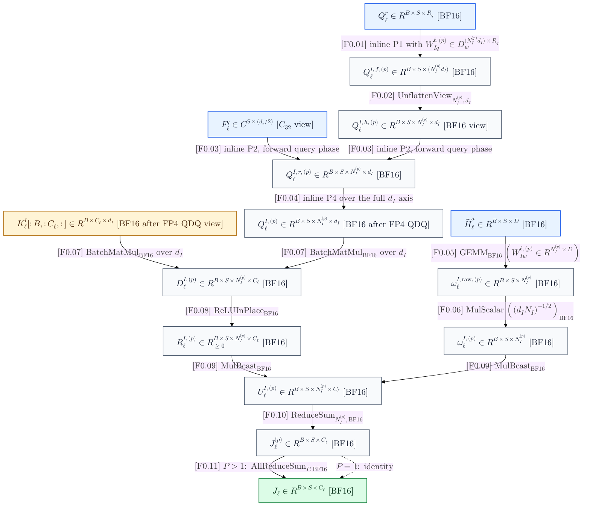
```mermaid
%%{init: {"theme": "base", "flowchart": {"htmlLabels": true, "curve": "basis", "nodeSpacing": 18, "rankSpacing": 28}}}%%
flowchart TD
    F0_H["$$\widehat{\mathbf H}_{\ell}^{a}\in\mathbb R^{B\times S\times D}\;[\mathrm{BF16}]$$"]
    F0_QR["$$\mathbf Q_{\ell}^{r}\in\mathbb R^{B\times S\times R_q}\;[\mathrm{BF16}]$$"]
    F0_F["$$\mathbf F_{\ell}^{q}\in\mathbb C^{S\times(d_r/2)}\;[\mathbb{C}_{32} \text{ view}]$$"]
    F0_KIC["$$\mathcal K_{\ell}^{I}[:B,:C_{\ell},:]\in\mathbb R^{B\times C_{\ell}\times d_I}\;[\mathrm{BF16\ after\ FP4\ QDQ\ view}]$$"]
    F0_QFL["$$\mathbf Q_{\ell}^{I,f,(p)}\in\mathbb R^{B\times S\times(N_I^{(p)}d_I)}\;[\mathrm{BF16}]$$"]
    F0_QH["$$\mathbf Q_{\ell}^{I,h,(p)}\in\mathbb R^{B\times S\times N_I^{(p)}\times d_I}\;[\mathrm{BF16\ view}]$$"]
    F0_QRPE["$$\mathbf Q_{\ell}^{I,r,(p)}\in\mathbb R^{B\times S\times N_I^{(p)}\times d_I}\;[\mathrm{BF16}]$$"]
    F0_Q["$$\mathbf Q_{\ell}^{I,(p)}\in\mathbb R^{B\times S\times N_I^{(p)}\times d_I}\;[\mathrm{BF16\ after\ FP4\ QDQ}]$$"]
    F0_WR["$$\boldsymbol\omega_{\ell}^{I,\mathrm{raw},(p)}\in\mathbb R^{B\times S\times N_I^{(p)}}\;[\mathrm{BF16}]$$"]
    F0_W["$$\boldsymbol\omega_{\ell}^{I,(p)}\in\mathbb R^{B\times S\times N_I^{(p)}}\;[\mathrm{BF16}]$$"]
    F0_DOT["$$\mathbf D_{\ell}^{I,(p)}\in\mathbb R^{B\times S\times N_I^{(p)}\times C_{\ell}}\;[\mathrm{BF16}]$$"]
    F0_RELU["$$\mathbf R_{\ell}^{I,(p)}\in\mathbb R_{\ge0}^{B\times S\times N_I^{(p)}\times C_{\ell}}\;[\mathrm{BF16}]$$"]
    F0_MUL["$$\mathbf U_{\ell}^{I,(p)}\in\mathbb R^{B\times S\times N_I^{(p)}\times C_{\ell}}\;[\mathrm{BF16}]$$"]
    F0_JL["$$\mathbf J_{\ell}^{(p)}\in\mathbb R^{B\times S\times C_{\ell}}\;[\mathrm{BF16}]$$"]
    F0_J["$$\mathbf J_{\ell}\in\mathbb R^{B\times S\times C_{\ell}}\;[\mathrm{BF16}]$$"]

    F0_QR -->|"$$[\mathrm{F0.01}]\ \text{inline P1 with }W_{Iq}^{\ell,(p)}\in\mathcal D_w^{(N_I^{(p)}d_I)\times R_q}$$"| F0_QFL
    F0_QFL -->|"$$[\mathrm{F0.02}]\ \operatorname{UnflattenView}_{N_I^{(p)},d_I}$$"| F0_QH
    F0_F & F0_QH -->|"$$[\mathrm{F0.03}]\ \text{inline P2, forward query phase}$$"| F0_QRPE
    F0_QRPE -->|"$$[\mathrm{F0.04}]\ \text{inline P4 over the full }d_I\text{ axis}$$"| F0_Q
    F0_H -->|"$$[\mathrm{F0.05}]\ \operatorname{GEMM}_{\mathrm{BF16}}\!\left(W_{Iw}^{\ell,(p)}\in\mathbb R^{N_I^{(p)}\times D}\right)$$"| F0_WR
    F0_WR -->|"$$[\mathrm{F0.06}]\ \operatorname{MulScalar}\!\left((d_I N_I)^{-1/2}\right)_{\mathrm{BF16}}$$"| F0_W
    F0_KIC & F0_Q -->|"$$[\mathrm{F0.07}]\ \operatorname{BatchMatMul}_{\mathrm{BF16}}\ \text{over }d_I$$"| F0_DOT
    F0_DOT -->|"$$[\mathrm{F0.08}]\ \operatorname{ReLUInPlace}_{\mathrm{BF16}}$$"| F0_RELU
    F0_RELU & F0_W -->|"$$[\mathrm{F0.09}]\ \operatorname{MulBcast}_{\mathrm{BF16}}$$"| F0_MUL
    F0_MUL -->|"$$[\mathrm{F0.10}]\ \operatorname{ReduceSum}_{N_I^{(p)},\mathrm{BF16}}$$"| F0_JL
    F0_JL -->|"$$[\mathrm{F0.11}]\ P\gt1:\ \operatorname{AllReduceSum}_{P,\mathrm{BF16}}$$"| F0_J
    F0_JL -.->|"$$P=1:\ \text{identity}$$"| F0_J

    classDef input fill:#e8f3ff,stroke:#2563eb,color:#0f172a,stroke-width:1.5px;
    classDef cache fill:#fff4d6,stroke:#b7791f,color:#422006,stroke-width:1.4px;
    classDef data fill:#f8fafc,stroke:#475569,color:#0f172a,stroke-width:1.05px;
    classDef output fill:#dcfce7,stroke:#15803d,color:#052e16,stroke-width:1.6px;
    class F0_H,F0_QR,F0_F input;
    class F0_KIC cache;
    class F0_QFL,F0_QH,F0_QRPE,F0_Q,F0_WR,F0_W,F0_DOT,F0_RELU,F0_MUL,F0_JL data;
    class F0_J output;
```

### F1. CSA prefill causal mask and TopK addresses

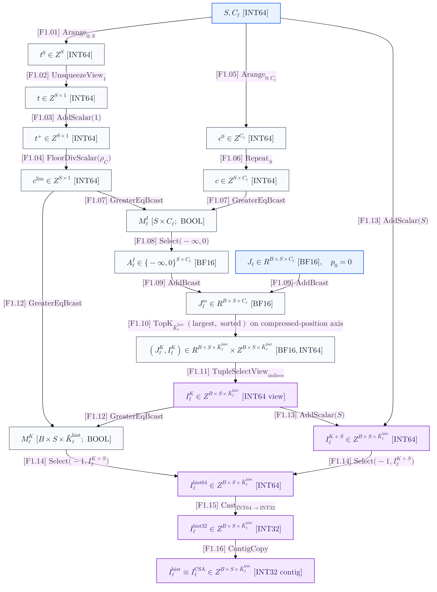
```mermaid
%%{init: {"theme": "base", "flowchart": {"htmlLabels": true, "curve": "basis", "nodeSpacing": 18, "rankSpacing": 28}}}%%
flowchart TD
    F1_J["$$\mathbf J_{\ell}\in\mathbb R^{B\times S\times C_{\ell}}\;[\mathrm{BF16}],\quad p_0=0$$"]
    F1_S["$$S,C_{\ell}\;[\mathrm{INT64}]$$"]
    F1_T0["$$\mathbf t^{0}\in\mathbb Z^{S}\;[\mathrm{INT64}]$$"]
    F1_T["$$\mathbf t\in\mathbb Z^{S\times1}\;[\mathrm{INT64}]$$"]
    F1_T1["$$\mathbf t^{+}\in\mathbb Z^{S\times1}\;[\mathrm{INT64}]$$"]
    F1_LIM["$$\mathbf c^{\mathrm{lim}}\in\mathbb Z^{S\times1}\;[\mathrm{INT64}]$$"]
    F1_C0["$$\mathbf c^{0}\in\mathbb Z^{C_{\ell}}\;[\mathrm{INT64}]$$"]
    F1_C["$$\mathbf c\in\mathbb Z^{S\times C_{\ell}}\;[\mathrm{INT64}]$$"]
    F1_MASK["$$\mathbf M_{\ell}^{I}\;[S\times C_{\ell};\ \mathrm{BOOL}]$$"]
    F1_ADD["$$\mathbf A_{\ell}^{I}\in\{-\infty,0\}^{S\times C_{\ell}}\;[\mathrm{BF16}]$$"]
    F1_JM["$$\mathbf J_{\ell}^{m}\in\mathbb R^{B\times S\times C_{\ell}}\;[\mathrm{BF16}]$$"]
    F1_TK["$$\left(\mathbf J_{\ell}^{K},\mathbf I_{\ell}^{K}\right)\in\mathbb R^{B\times S\times\bar K_{\ell}^{\mathrm{hist}}}\times\mathbb Z^{B\times S\times\bar K_{\ell}^{\mathrm{hist}}}\;[\mathrm{BF16},\mathrm{INT64}]$$"]
    F1_IDX["$$\mathbf I_{\ell}^{K}\in\mathbb Z^{B\times S\times\bar K_{\ell}^{\mathrm{hist}}}\;[\mathrm{INT64\ view}]$$"]
    F1_BAD["$$\mathbf M_{\ell}^{K}\;[B\times S\times\bar K_{\ell}^{\mathrm{hist}};\ \mathrm{BOOL}]$$"]
    F1_OFF["$$\mathbf I_{\ell}^{K+S}\in\mathbb Z^{B\times S\times\bar K_{\ell}^{\mathrm{hist}}}\;[\mathrm{INT64}]$$"]
    F1_SEL["$$\mathbf I_{\ell}^{\mathrm{hist64}}\in\mathbb Z^{B\times S\times\bar K_{\ell}^{\mathrm{hist}}}\;[\mathrm{INT64}]$$"]
    F1_CAST["$$\mathbf I_{\ell}^{\mathrm{hist32}}\in\mathbb Z^{B\times S\times\bar K_{\ell}^{\mathrm{hist}}}\;[\mathrm{INT32}]$$"]
    F1_OUT["$$\mathbf I_{\ell}^{\mathrm{hist}}\equiv\mathbf I_{\ell}^{\mathrm{CSA}}\in\mathbb Z^{B\times S\times\bar K_{\ell}^{\mathrm{hist}}}\;[\mathrm{INT32\ contig}]$$"]

    F1_S -->|"$$[\mathrm{F1.01}]\ \operatorname{Arange}_{0:S}$$"| F1_T0
    F1_T0 -->|"$$[\mathrm{F1.02}]\ \operatorname{UnsqueezeView}_{1}$$"| F1_T
    F1_T -->|"$$[\mathrm{F1.03}]\ \operatorname{AddScalar}(1)$$"| F1_T1
    F1_T1 -->|"$$[\mathrm{F1.04}]\ \operatorname{FloorDivScalar}(\rho_C)$$"| F1_LIM
    F1_S -->|"$$[\mathrm{F1.05}]\ \operatorname{Arange}_{0:C_{\ell}}$$"| F1_C0
    F1_C0 -->|"$$[\mathrm{F1.06}]\ \operatorname{Repeat}_{S}$$"| F1_C
    F1_LIM & F1_C -->|"$$[\mathrm{F1.07}]\ \operatorname{GreaterEqBcast}$$"| F1_MASK
    F1_MASK -->|"$$[\mathrm{F1.08}]\ \operatorname{Select}(-\infty,0)$$"| F1_ADD
    F1_ADD & F1_J -->|"$$[\mathrm{F1.09}]\ \operatorname{AddBcast}$$"| F1_JM
    F1_JM -->|"$$[\mathrm{F1.10}]\ \operatorname{TopK}_{\bar K_{\ell}^{\mathrm{hist}}}\!\left(\mathrm{largest},\ \mathrm{sorted}\right)\ \text{on compressed-position axis}$$"| F1_TK
    F1_TK -->|"$$[\mathrm{F1.11}]\ \operatorname{TupleSelectView}_{\mathrm{indices}}$$"| F1_IDX
    F1_LIM & F1_IDX -->|"$$[\mathrm{F1.12}]\ \operatorname{GreaterEqBcast}$$"| F1_BAD
    F1_IDX & F1_S -->|"$$[\mathrm{F1.13}]\ \operatorname{AddScalar}(S)$$"| F1_OFF
    F1_BAD & F1_OFF -->|"$$[\mathrm{F1.14}]\ \operatorname{Select}(-1,\mathbf I_{\ell}^{K+S})$$"| F1_SEL
    F1_SEL -->|"$$[\mathrm{F1.15}]\ \operatorname{Cast}_{\mathrm{INT64}\rightarrow\mathrm{INT32}}$$"| F1_CAST
    F1_CAST -->|"$$[\mathrm{F1.16}]\ \operatorname{ContigCopy}$$"| F1_OUT

    classDef input fill:#e8f3ff,stroke:#2563eb,color:#0f172a,stroke-width:1.5px;
    classDef data fill:#f8fafc,stroke:#475569,color:#0f172a,stroke-width:1.05px;
    classDef index fill:#f3e8ff,stroke:#7e22ce,color:#2e1065,stroke-width:1.3px;
    class F1_J,F1_S input;
    class F1_T0,F1_T,F1_T1,F1_LIM,F1_C0,F1_C,F1_MASK,F1_ADD,F1_JM,F1_TK,F1_BAD data;
    class F1_IDX,F1_OFF,F1_SEL,F1_CAST,F1_OUT index;
```

### F2. CSA single-token decode TopK addresses

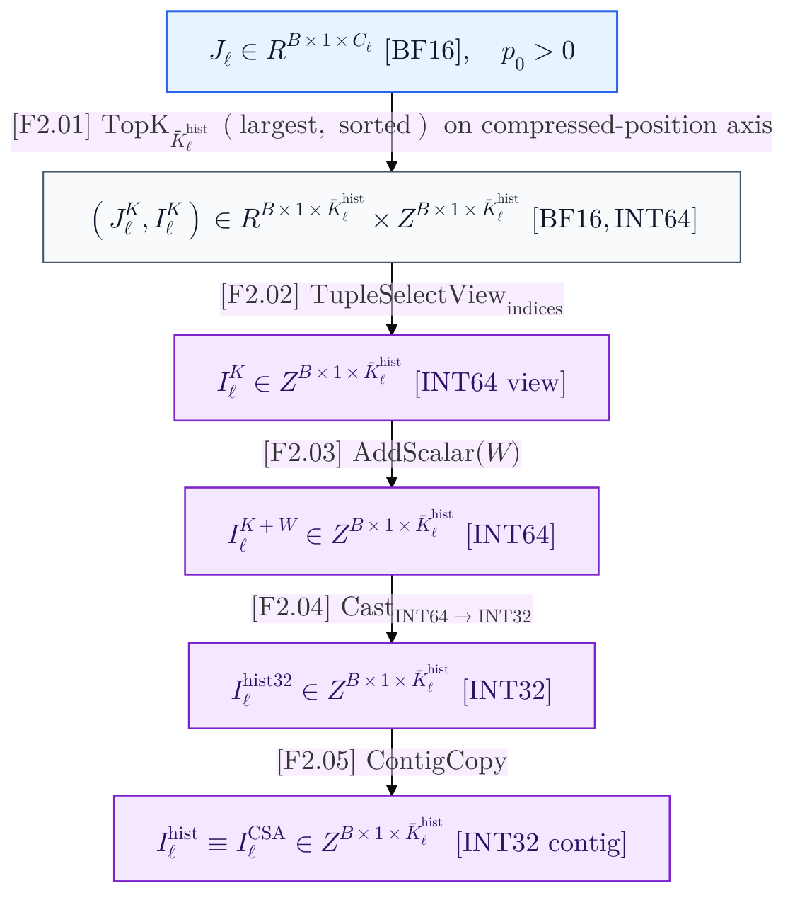
```mermaid
%%{init: {"theme": "base", "flowchart": {"htmlLabels": true, "curve": "basis", "nodeSpacing": 20, "rankSpacing": 28}}}%%
flowchart TD
    F2_J["$$\mathbf J_{\ell}\in\mathbb R^{B\times1\times C_{\ell}}\;[\mathrm{BF16}],\quad p_0\gt0$$"]
    F2_TK["$$\left(\mathbf J_{\ell}^{K},\mathbf I_{\ell}^{K}\right)\in\mathbb R^{B\times1\times\bar K_{\ell}^{\mathrm{hist}}}\times\mathbb Z^{B\times1\times\bar K_{\ell}^{\mathrm{hist}}}\;[\mathrm{BF16},\mathrm{INT64}]$$"]
    F2_IDX["$$\mathbf I_{\ell}^{K}\in\mathbb Z^{B\times1\times\bar K_{\ell}^{\mathrm{hist}}}\;[\mathrm{INT64\ view}]$$"]
    F2_OFF["$$\mathbf I_{\ell}^{K+W}\in\mathbb Z^{B\times1\times\bar K_{\ell}^{\mathrm{hist}}}\;[\mathrm{INT64}]$$"]
    F2_CAST["$$\mathbf I_{\ell}^{\mathrm{hist32}}\in\mathbb Z^{B\times1\times\bar K_{\ell}^{\mathrm{hist}}}\;[\mathrm{INT32}]$$"]
    F2_OUT["$$\mathbf I_{\ell}^{\mathrm{hist}}\equiv\mathbf I_{\ell}^{\mathrm{CSA}}\in\mathbb Z^{B\times1\times\bar K_{\ell}^{\mathrm{hist}}}\;[\mathrm{INT32\ contig}]$$"]

    F2_J -->|"$$[\mathrm{F2.01}]\ \operatorname{TopK}_{\bar K_{\ell}^{\mathrm{hist}}}\!\left(\mathrm{largest},\ \mathrm{sorted}\right)\ \text{on compressed-position axis}$$"| F2_TK
    F2_TK -->|"$$[\mathrm{F2.02}]\ \operatorname{TupleSelectView}_{\mathrm{indices}}$$"| F2_IDX
    F2_IDX -->|"$$[\mathrm{F2.03}]\ \operatorname{AddScalar}(W)$$"| F2_OFF
    F2_OFF -->|"$$[\mathrm{F2.04}]\ \operatorname{Cast}_{\mathrm{INT64}\rightarrow\mathrm{INT32}}$$"| F2_CAST
    F2_CAST -->|"$$[\mathrm{F2.05}]\ \operatorname{ContigCopy}$$"| F2_OUT

    classDef input fill:#e8f3ff,stroke:#2563eb,color:#0f172a,stroke-width:1.5px;
    classDef data fill:#f8fafc,stroke:#475569,color:#0f172a,stroke-width:1.05px;
    classDef index fill:#f3e8ff,stroke:#7e22ce,color:#2e1065,stroke-width:1.3px;
    class F2_J input;
    class F2_TK data;
    class F2_IDX,F2_OFF,F2_CAST,F2_OUT index;
```

## G. HCA history addresses and phase-specific KV-bank assembly

### G1. HCA prefill history addresses

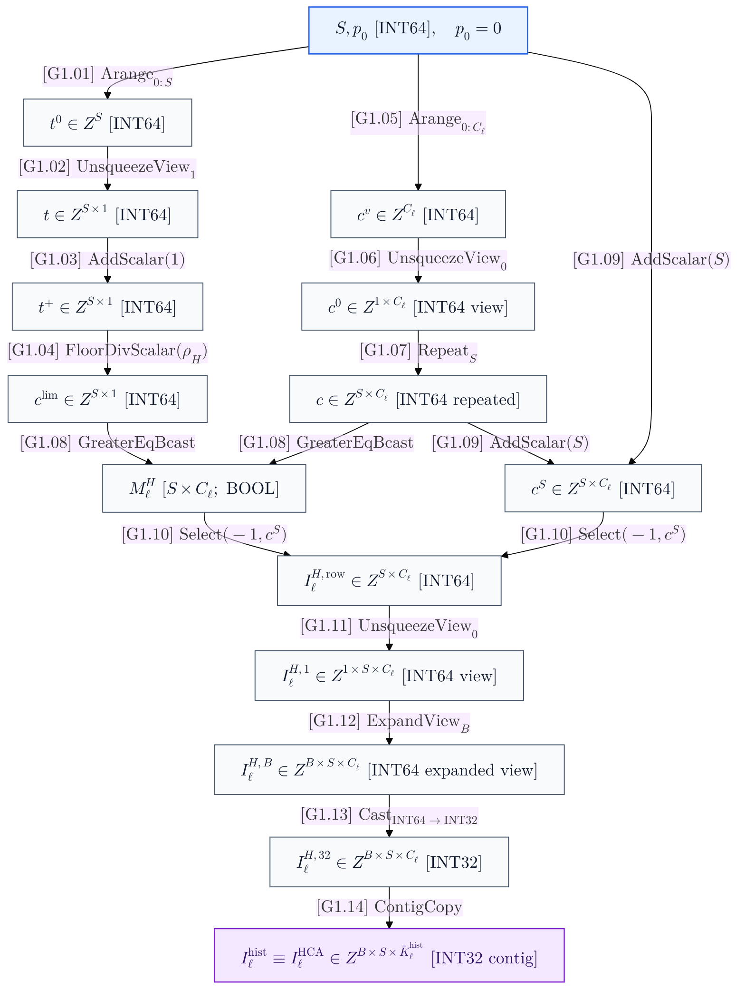
```mermaid
%%{init: {"theme": "base", "flowchart": {"htmlLabels": true, "curve": "basis", "nodeSpacing": 18, "rankSpacing": 28}}}%%
flowchart TD
    G1_S["$$S,p_0\;[\mathrm{INT64}],\quad p_0=0$$"]
    G1_T0["$$\mathbf t^{0}\in\mathbb Z^{S}\;[\mathrm{INT64}]$$"]
    G1_T["$$\mathbf t\in\mathbb Z^{S\times1}\;[\mathrm{INT64}]$$"]
    G1_T1["$$\mathbf t^{+}\in\mathbb Z^{S\times1}\;[\mathrm{INT64}]$$"]
    G1_LIM["$$\mathbf c^{\mathrm{lim}}\in\mathbb Z^{S\times1}\;[\mathrm{INT64}]$$"]
    G1_CV["$$\mathbf c^{v}\in\mathbb Z^{C_{\ell}}\;[\mathrm{INT64}]$$"]
    G1_C0["$$\mathbf c^{0}\in\mathbb Z^{1\times C_{\ell}}\;[\mathrm{INT64\ view}]$$"]
    G1_C["$$\mathbf c\in\mathbb Z^{S\times C_{\ell}}\;[\mathrm{INT64\ repeated}]$$"]
    G1_MASK["$$\mathbf M_{\ell}^{H}\;[S\times C_{\ell};\ \mathrm{BOOL}]$$"]
    G1_OFF["$$\mathbf c^{S}\in\mathbb Z^{S\times C_{\ell}}\;[\mathrm{INT64}]$$"]
    G1_ROW["$$\mathbf I_{\ell}^{H,\mathrm{row}}\in\mathbb Z^{S\times C_{\ell}}\;[\mathrm{INT64}]$$"]
    G1_UNS["$$\mathbf I_{\ell}^{H,1}\in\mathbb Z^{1\times S\times C_{\ell}}\;[\mathrm{INT64\ view}]$$"]
    G1_EXP["$$\mathbf I_{\ell}^{H,B}\in\mathbb Z^{B\times S\times C_{\ell}}\;[\mathrm{INT64\ expanded\ view}]$$"]
    G1_CAST["$$\mathbf I_{\ell}^{H,32}\in\mathbb Z^{B\times S\times C_{\ell}}\;[\mathrm{INT32}]$$"]
    G1_OUT["$$\mathbf I_{\ell}^{\mathrm{hist}}\equiv\mathbf I_{\ell}^{\mathrm{HCA}}\in\mathbb Z^{B\times S\times\bar K_{\ell}^{\mathrm{hist}}}\;[\mathrm{INT32\ contig}]$$"]

    G1_S -->|"$$[\mathrm{G1.01}]\ \operatorname{Arange}_{0:S}$$"| G1_T0
    G1_T0 -->|"$$[\mathrm{G1.02}]\ \operatorname{UnsqueezeView}_{1}$$"| G1_T
    G1_T -->|"$$[\mathrm{G1.03}]\ \operatorname{AddScalar}(1)$$"| G1_T1
    G1_T1 -->|"$$[\mathrm{G1.04}]\ \operatorname{FloorDivScalar}(\rho_H)$$"| G1_LIM
    G1_S -->|"$$[\mathrm{G1.05}]\ \operatorname{Arange}_{0:C_{\ell}}$$"| G1_CV
    G1_CV -->|"$$[\mathrm{G1.06}]\ \operatorname{UnsqueezeView}_{0}$$"| G1_C0
    G1_C0 -->|"$$[\mathrm{G1.07}]\ \operatorname{Repeat}_{S}$$"| G1_C
    G1_C & G1_LIM -->|"$$[\mathrm{G1.08}]\ \operatorname{GreaterEqBcast}$$"| G1_MASK
    G1_C & G1_S -->|"$$[\mathrm{G1.09}]\ \operatorname{AddScalar}(S)$$"| G1_OFF
    G1_MASK & G1_OFF -->|"$$[\mathrm{G1.10}]\ \operatorname{Select}(-1,\mathbf c^S)$$"| G1_ROW
    G1_ROW -->|"$$[\mathrm{G1.11}]\ \operatorname{UnsqueezeView}_{0}$$"| G1_UNS
    G1_UNS -->|"$$[\mathrm{G1.12}]\ \operatorname{ExpandView}_{B}$$"| G1_EXP
    G1_EXP -->|"$$[\mathrm{G1.13}]\ \operatorname{Cast}_{\mathrm{INT64}\rightarrow\mathrm{INT32}}$$"| G1_CAST
    G1_CAST -->|"$$[\mathrm{G1.14}]\ \operatorname{ContigCopy}$$"| G1_OUT

    classDef input fill:#e8f3ff,stroke:#2563eb,color:#0f172a,stroke-width:1.5px;
    classDef data fill:#f8fafc,stroke:#475569,color:#0f172a,stroke-width:1.05px;
    classDef index fill:#f3e8ff,stroke:#7e22ce,color:#2e1065,stroke-width:1.3px;
    class G1_S input;
    class G1_T0,G1_T,G1_T1,G1_LIM,G1_CV,G1_C0,G1_C,G1_MASK,G1_OFF,G1_ROW,G1_UNS,G1_EXP,G1_CAST data;
    class G1_OUT index;
```

### G2. HCA single-token decode history addresses

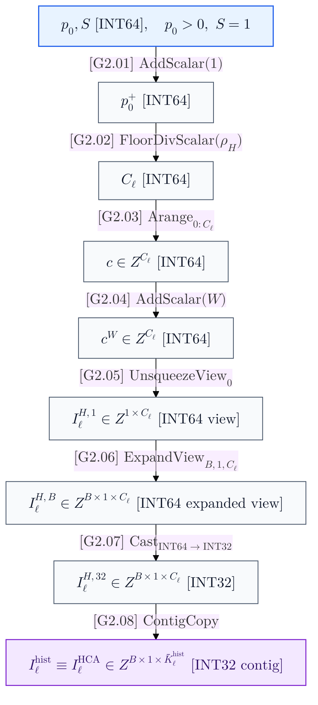
```mermaid
%%{init: {"theme": "base", "flowchart": {"htmlLabels": true, "curve": "basis", "nodeSpacing": 20, "rankSpacing": 28}}}%%
flowchart TD
    G2_P["$$p_0,S\;[\mathrm{INT64}],\quad p_0\gt0,\ S=1$$"]
    G2_P1["$$p_0^{+}\;[\mathrm{INT64}]$$"]
    G2_C["$$C_{\ell}\;[\mathrm{INT64}]$$"]
    G2_ROW0["$$\mathbf c\in\mathbb Z^{C_{\ell}}\;[\mathrm{INT64}]$$"]
    G2_ROW["$$\mathbf c^{W}\in\mathbb Z^{C_{\ell}}\;[\mathrm{INT64}]$$"]
    G2_UNS1["$$\mathbf I_{\ell}^{H,1}\in\mathbb Z^{1\times C_{\ell}}\;[\mathrm{INT64\ view}]$$"]
    G2_EXP["$$\mathbf I_{\ell}^{H,B}\in\mathbb Z^{B\times1\times C_{\ell}}\;[\mathrm{INT64\ expanded\ view}]$$"]
    G2_CAST["$$\mathbf I_{\ell}^{H,32}\in\mathbb Z^{B\times1\times C_{\ell}}\;[\mathrm{INT32}]$$"]
    G2_OUT["$$\mathbf I_{\ell}^{\mathrm{hist}}\equiv\mathbf I_{\ell}^{\mathrm{HCA}}\in\mathbb Z^{B\times1\times\bar K_{\ell}^{\mathrm{hist}}}\;[\mathrm{INT32\ contig}]$$"]

    G2_P -->|"$$[\mathrm{G2.01}]\ \operatorname{AddScalar}(1)$$"| G2_P1
    G2_P1 -->|"$$[\mathrm{G2.02}]\ \operatorname{FloorDivScalar}(\rho_H)$$"| G2_C
    G2_C -->|"$$[\mathrm{G2.03}]\ \operatorname{Arange}_{0:C_{\ell}}$$"| G2_ROW0
    G2_ROW0 -->|"$$[\mathrm{G2.04}]\ \operatorname{AddScalar}(W)$$"| G2_ROW
    G2_ROW -->|"$$[\mathrm{G2.05}]\ \operatorname{UnsqueezeView}_{0}$$"| G2_UNS1
    G2_UNS1 -->|"$$[\mathrm{G2.06}]\ \operatorname{ExpandView}_{B,1,C_{\ell}}$$"| G2_EXP
    G2_EXP -->|"$$[\mathrm{G2.07}]\ \operatorname{Cast}_{\mathrm{INT64}\rightarrow\mathrm{INT32}}$$"| G2_CAST
    G2_CAST -->|"$$[\mathrm{G2.08}]\ \operatorname{ContigCopy}$$"| G2_OUT

    classDef input fill:#e8f3ff,stroke:#2563eb,color:#0f172a,stroke-width:1.5px;
    classDef data fill:#f8fafc,stroke:#475569,color:#0f172a,stroke-width:1.05px;
    classDef index fill:#f3e8ff,stroke:#7e22ce,color:#2e1065,stroke-width:1.3px;
    class G2_P input;
    class G2_P1,G2_C,G2_ROW0,G2_ROW,G2_UNS1,G2_EXP,G2_CAST data;
    class G2_OUT index;
```

### G3. Prefill ring mutation and active KV bank

This graph is instantiated with the corresponding CSA or HCA emitted tensor.
The active prefill bank uses the current-call tensors, while the persistent writes prepare later decode.

```mermaid
%%{init: {"theme": "base", "flowchart": {"htmlLabels": true, "curve": "basis", "nodeSpacing": 18, "rankSpacing": 28}}}%%
flowchart TD
    G3_KV["$$\mathbf{KV}_{\ell}^{\mathrm{now}}\in\mathbb R^{B\times S\times d_h}\;[\mathrm{BF16}],\quad p_0=0$$"]
    G3_S["$$S\;[\mathrm{INT64}]$$"]
    G3_CE["$$\mathbf C_{\ell}^{\mathrm{emit}}\in\mathbb R^{B\times C_{\ell}^{\mathrm{new}}\times d_h}\;[\mathrm{BF16}]$$"]
    G3_RING["$$\mathcal K_{\ell}^{\mathrm{ring}}\in\mathbb R^{B_{\max}\times W\times d_h}\;[\mathrm{BF16\ persist}]$$"]
    G3_CUT["$$r_W\;[\mathrm{INT64}]$$"]
    G3_TAIL["$$\mathbf{KV}_{\ell}^{\mathrm{tail}}\in\mathbb R^{B\times W\times d_h}\;[\mathrm{BF16\ view}]$$"]
    G3_A["$$\mathbf{KV}_{\ell}^{\mathrm{tail},a}\in\mathbb R^{B\times(W-r_W)\times d_h}\;[\mathrm{BF16\ view}]$$"]
    G3_B["$$\mathbf{KV}_{\ell}^{\mathrm{tail},b}\in\mathbb R^{B\times r_W\times d_h}\;[\mathrm{BF16\ view}]$$"]
    G3_RINGA["$$\mathcal K_{\ell}^{\mathrm{ring}}[:,r_W:W,:]\;[\mathrm{BF16\ persist}]$$"]
    G3_RINGB["$$\mathcal K_{\ell}^{\mathrm{ring}}[:,0:r_W,:]\;[\mathrm{BF16\ persist}]$$"]
    G3_LOCAL["$$\mathbf{KV}_{\ell}^{\mathrm{local}}\in\mathbb R^{B\times S\times d_h}\;[\mathrm{BF16\ alias}]$$"]
    G3_BANK["$$\mathcal K_{\ell}\in\mathbb R^{B\times N_{\ell}^{kv}\times d_h}\;[\mathrm{BF16}]$$"]

    G3_KV -.->|"identity alias for current-call local bank"| G3_LOCAL
    G3_KV & G3_S -->|"$$[\mathrm{G3.03}]\ S\gt W:\ \operatorname{SliceView}_{S-W:S}$$"| G3_TAIL
    G3_KV & G3_S -->|"$$[\mathrm{G3.01}]\ S\le W:\ \operatorname{CacheWrite}_{0:S}$$"| G3_RING
    G3_S -->|"$$[\mathrm{G3.02}]\ S\gt W:\ \operatorname{Rem}(W)$$"| G3_CUT
    G3_TAIL & G3_CUT -->|"$$[\mathrm{G3.04}]\ \operatorname{SliceView}_{0:W-r_W}$$"| G3_A
    G3_TAIL & G3_CUT -->|"$$[\mathrm{G3.05}]\ \operatorname{SliceView}_{W-r_W:W}$$"| G3_B
    G3_A & G3_CUT -->|"$$[\mathrm{G3.06}]\ \operatorname{CacheWrite}_{r_W:W}$$"| G3_RINGA
    G3_B & G3_CUT -->|"$$[\mathrm{G3.07}]\ \operatorname{CacheWrite}_{0:r_W}$$"| G3_RINGB
    G3_LOCAL & G3_CE -->|"$$[\mathrm{G3.08}]\ C_{\ell}^{\mathrm{new}}\gt0:\ \operatorname{Cat}_{\mathrm{sequence}}$$"| G3_BANK
    G3_LOCAL -.->|"$$C_{\ell}^{\mathrm{new}}=0:\ \text{identity}$$"| G3_BANK

    classDef input fill:#e8f3ff,stroke:#2563eb,color:#0f172a,stroke-width:1.5px;
    classDef data fill:#f8fafc,stroke:#475569,color:#0f172a,stroke-width:1.05px;
    classDef cache fill:#fff4d6,stroke:#b7791f,color:#422006,stroke-width:1.4px;
    classDef output fill:#dcfce7,stroke:#15803d,color:#052e16,stroke-width:1.6px;
    class G3_KV,G3_CE,G3_S input;
    class G3_RING,G3_RINGA,G3_RINGB cache;
    class G3_CUT,G3_TAIL,G3_A,G3_B,G3_LOCAL data;
    class G3_BANK output;
```

### G4. Single-token decode ring mutation and no-copy active bank view

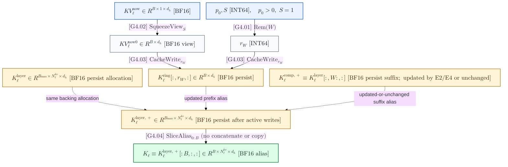
```mermaid
%%{init: {"theme": "base", "flowchart": {"htmlLabels": true, "curve": "basis", "nodeSpacing": 20, "rankSpacing": 28}}}%%
flowchart TD
    G4_KV["$$\mathbf{KV}_{\ell}^{\mathrm{now}}\in\mathbb R^{B\times1\times d_h}\;[\mathrm{BF16}]$$"]
    G4_P["$$p_0,S\;[\mathrm{INT64}],\quad p_0\gt0,\ S=1$$"]
    G4_R["$$r_W\;[\mathrm{INT64}]$$"]
    G4_KVS["$$\mathbf{KV}_{\ell}^{\mathrm{now0}}\in\mathbb R^{B\times d_h}\;[\mathrm{BF16\ view}]$$"]
    G4_RING["$$\mathcal K_{\ell}^{\mathrm{ring}}[:,r_W,:]\in\mathbb R^{B\times d_h}\;[\mathrm{BF16\ persist}]$$"]
    G4_LAYER["$$\mathcal K_{\ell}^{\mathrm{layer}}\in\mathbb R^{B_{\max}\times N_{\ell}^{kv}\times d_h}\;[\mathrm{BF16\ persist\ allocation}]$$"]
    G4_COMP["$$\mathcal K_{\ell}^{\mathrm{comp},+}\equiv\mathcal K_{\ell}^{\mathrm{layer}}[:,W:,:]\;[\mathrm{BF16\ persist\ suffix};\ \text{updated by E2/E4 or unchanged}]$$"]
    G4_LAYERP["$$\mathcal K_{\ell}^{\mathrm{layer},+}\in\mathbb R^{B_{\max}\times N_{\ell}^{kv}\times d_h}\;[\mathrm{BF16\ persist\ after\ active\ writes}]$$"]
    G4_BANK["$$\mathcal K_{\ell}\equiv\mathcal K_{\ell}^{\mathrm{layer},+}[:B,:,:]\in\mathbb R^{B\times N_{\ell}^{kv}\times d_h}\;[\mathrm{BF16\ alias}]$$"]

    G4_P -->|"$$[\mathrm{G4.01}]\ \operatorname{Rem}(W)$$"| G4_R
    G4_KV -->|"$$[\mathrm{G4.02}]\ \operatorname{SqueezeView}_{S}$$"| G4_KVS
    G4_KVS & G4_R -->|"$$[\mathrm{G4.03}]\ \operatorname{CacheWrite}_{r_W}$$"| G4_RING
    G4_LAYER -.->|"same backing allocation"| G4_LAYERP
    G4_RING -.->|"updated prefix alias"| G4_LAYERP
    G4_COMP -.->|"updated-or-unchanged suffix alias"| G4_LAYERP
    G4_LAYERP -->|"$$[\mathrm{G4.04}]\ \operatorname{SliceAlias}_{0:B}\ \text{(no concatenate or copy)}$$"| G4_BANK

    classDef input fill:#e8f3ff,stroke:#2563eb,color:#0f172a,stroke-width:1.5px;
    classDef cache fill:#fff4d6,stroke:#b7791f,color:#422006,stroke-width:1.4px;
    classDef data fill:#f8fafc,stroke:#475569,color:#0f172a,stroke-width:1.05px;
    classDef output fill:#dcfce7,stroke:#15803d,color:#052e16,stroke-width:1.6px;
    class G4_KV,G4_P input;
    class G4_RING,G4_LAYER,G4_COMP,G4_LAYERP cache;
    class G4_R,G4_KVS data;
    class G4_BANK output;
```

### G5. Shared index-list assembly

```mermaid
%%{init: {"theme": "base", "flowchart": {"htmlLabels": true, "curve": "basis", "nodeSpacing": 24, "rankSpacing": 30}}}%%
flowchart TD
    G5_W["$$\mathbf I_{\ell}^{\mathrm{win}}\in\mathbb Z^{B\times S\times\bar K^{\mathrm{win}}}\;[\mathrm{INT32}]$$"]
    G5_H["$$\mathbf I_{\ell}^{\mathrm{hist}}\in\mathbb Z^{B\times S\times\bar K_{\ell}^{\mathrm{hist}}}\;[\mathrm{INT32}]$$"]
    G5_I["$$\mathbf I_{\ell}\in\mathbb Z^{B\times S\times\bar K_{\ell}}\;[\mathrm{INT32\ allocated}]$$"]

    G5_W & G5_H -->|"$$[\mathrm{G5.01}]\ \operatorname{Cat}_{\mathrm{last\ axis}}\ \text{window first, history second}$$"| G5_I

    classDef input fill:#e8f3ff,stroke:#2563eb,color:#0f172a,stroke-width:1.5px;
    classDef index fill:#f3e8ff,stroke:#7e22ce,color:#2e1065,stroke-width:1.3px;
    class G5_W,G5_H input;
    class G5_I index;
```

## H. Shared indexed MQA core and grouped output projection

The main attention core is identical for CSA and HCA;
only $\mathcal K_\ell$ and $\mathbf I_\ell$ differ.
The diagram-local $\widehat N_h^{(p)}$ equals $N_h^{(p)}$
unless the wrapper's minimum-head padding branch is active, in which case it equals 16.

### H1. Gather-tiled online softmax with a denominator-only sink

Reference implementation: [kernel.py, lines 277-368](inference/kernel.py#L277-L368).

```mermaid
%%{init: {"theme": "base", "flowchart": {"htmlLabels": true, "curve": "basis", "nodeSpacing": 18, "rankSpacing": 27}}}%%
flowchart TD
    H1_Q["$$\mathbf Q_{\ell}^{(p)}\in\mathbb R^{B\times S\times N_h^{(p)}\times d_h}\;[\mathrm{BF16}]$$"]
    H1_K["$$\mathcal K_{\ell}\in\mathbb R^{B\times N_{\ell}^{kv}\times d_h}\;[\mathrm{BF16}]$$"]
    H1_I["$$\mathbf I_{\ell}\in\mathbb Z^{B\times S\times\bar K_{\ell}}\;[\mathrm{INT32}]$$"]
    H1_SINK["$$\mathbf z_{\ell}^{\mathrm{sink},(p)}\in\mathbb R^{N_h^{(p)}}\;[\mathrm{FP32}]$$"]
    H1_QZ["$$\mathbf Q_{\ell}^{0}\in\mathbb R^{B\times S\times(16-N_h^{(p)})\times d_h}\;[\mathrm{BF16\ zeros}]$$"]
    H1_SZ["$$\mathbf z_{\ell}^{0}\in\mathbb R^{16-N_h^{(p)}}\;[\mathrm{FP32\ zeros}]$$"]
    H1_QK["$$\widehat{\mathbf Q}_{\ell}^{(p)}\in\mathbb R^{B\times S\times\widehat N_h^{(p)}\times d_h}\;[\mathrm{BF16}]$$"]
    H1_SK["$$\widehat{\mathbf z}_{\ell}^{\mathrm{sink},(p)}\in\mathbb R^{\widehat N_h^{(p)}}\;[\mathrm{FP32}]$$"]
    H1_KLEN["$$\bar K_{\ell}\;[\mathrm{INT64}]$$"]
    H1_NT["$$T_K\;[\mathrm{INT64}]$$"]
    H1_U["$$u\;[\mathrm{INT64\ serial\ loop\ index}]$$"]

    H1_QT["$$\widehat{\mathbf Q}_{\ell,b,t}^{(p)}\in\mathbb R^{\widehat N_h^{(p)}\times d_h}\;[\mathrm{BF16\ shared\ tile}]$$"]
    H1_IDX["$$\mathbf i_{u}\in\mathbb Z^{Q_S}\;[\mathrm{INT32\ frag}],\quad -1\ \text{outside width or invalid}$$"]
    H1_VALID["$$\mathbf m_{u}^{v}\;[Q_S;\ \mathrm{BOOL\ frag}]$$"]
    H1_KVT["$$\widetilde{\mathbf{KV}}_{\ell,b,t,u}\in\mathbb R^{Q_S\times d_h}\;[\mathrm{BF16\ shared\ tile}]$$"]
    H1_S0["$$\mathbf Z_{\ell,b,t,u}^{0}\in\{0,-\infty\}^{\widehat N_h^{(p)}\times Q_S}\;[\mathrm{FP32\ frag}]$$"]
    H1_DOT["$$\mathbf Z_{\ell,b,t,u}^{d}\in\mathbb R^{\widehat N_h^{(p)}\times Q_S}\;[\mathrm{FP32\ frag}]$$"]
    H1_LOG["$$\mathbf Z_{\ell,b,t,u}^{a}\in\mathbb R^{\widehat N_h^{(p)}\times Q_S}\;[\mathrm{FP32\ frag}]$$"]

    H1_NEGINF["$$-\infty\;[\mathrm{FP32\ scalar}]$$"]
    H1_ZERO["$$0\;[\mathrm{FP32\ scalar}]$$"]
    H1_MI["$$\mathbf m_{-1}^{0}\in\mathbb R^{\widehat N_h^{(p)}}\;[\mathrm{FP32\ frag}]$$"]
    H1_LI["$$\boldsymbol\lambda_{-1}^{0}\in\mathbb R^{\widehat N_h^{(p)}}\;[\mathrm{FP32\ frag}]$$"]
    H1_OI["$$\mathbf O_{-1}^{0}\in\mathbb R^{\widehat N_h^{(p)}\times d_h}\;[\mathrm{FP32\ frag}]$$"]
    H1_MPREV["$$\mathbf m_{u-1}\in\mathbb R^{\widehat N_h^{(p)}}\;[\mathrm{FP32\ frag}]$$"]
    H1_LPREV["$$\boldsymbol\lambda_{u-1}\in\mathbb R^{\widehat N_h^{(p)}}\;[\mathrm{FP32\ frag}]$$"]
    H1_OPREV["$$\mathbf O_{u-1}^{32}\in\mathbb R^{\widehat N_h^{(p)}\times d_h}\;[\mathrm{FP32\ frag}]$$"]
    H1_MT["$$\mathbf m_{u}^{t}\in\mathbb R^{\widehat N_h^{(p)}}\;[\mathrm{FP32\ frag}]$$"]
    H1_M["$$\mathbf m_{u}\in\mathbb R^{\widehat N_h^{(p)}}\;[\mathrm{FP32\ frag}]$$"]
    H1_DIFF["$$\boldsymbol\delta_{u}\in\mathbb R^{\widehat N_h^{(p)}}\;[\mathrm{FP32\ frag}]$$"]
    H1_ALPHA["$$\boldsymbol\alpha_{u}\in\mathbb R^{\widehat N_h^{(p)}}\;[\mathrm{FP32\ frag}]$$"]
    H1_CENTER["$$\widetilde{\mathbf Z}_{\ell,b,t,u}\in\mathbb R^{\widehat N_h^{(p)}\times Q_S}\;[\mathrm{FP32\ frag}]$$"]
    H1_E["$$\mathbf E_{\ell,b,t,u}\in\mathbb R_{\ge0}^{\widehat N_h^{(p)}\times Q_S}\;[\mathrm{FP32\ frag}]$$"]
    H1_ESUM["$$\boldsymbol\eta_{u}\in\mathbb R^{\widehat N_h^{(p)}}\;[\mathrm{FP32\ frag}]$$"]
    H1_LS["$$\widetilde{\boldsymbol\lambda}_{u-1}\in\mathbb R^{\widehat N_h^{(p)}}\;[\mathrm{FP32\ frag}]$$"]
    H1_L["$$\boldsymbol\lambda_{u}\in\mathbb R^{\widehat N_h^{(p)}}\;[\mathrm{FP32\ frag}]$$"]
    H1_EBF["$$\mathbf E_{\ell,b,t,u}^{16,f}\in\mathbb R_{\ge0}^{\widehat N_h^{(p)}\times Q_S}\;[\mathrm{BF16\ frag}]$$"]
    H1_E16["$$\mathbf E_{\ell,b,t,u}^{16}\in\mathbb R_{\ge0}^{\widehat N_h^{(p)}\times Q_S}\;[\mathrm{BF16\ shared\ tile}]$$"]
    H1_OS["$$\widetilde{\mathbf O}_{u-1}^{32}\in\mathbb R^{\widehat N_h^{(p)}\times d_h}\;[\mathrm{FP32\ frag}]$$"]
    H1_O["$$\mathbf O_{u}^{32}\in\mathbb R^{\widehat N_h^{(p)}\times d_h}\;[\mathrm{FP32\ frag}]$$"]
    H1_U1["$$u^{+}\;[\mathrm{INT64}]$$"]
    H1_MORE["$$e_u^{\mathrm{more}}\;[\mathrm{BOOL}]$$"]
    H1_LAST["$$e_u^{\mathrm{last}}\;[\mathrm{BOOL}]$$"]
    H1_MF["$$\mathbf m_{T_K-1}\in\mathbb R^{\widehat N_h^{(p)}}\;[\mathrm{FP32\ frag\ alias}]$$"]
    H1_LF["$$\boldsymbol\lambda_{T_K-1}\in\mathbb R^{\widehat N_h^{(p)}}\;[\mathrm{FP32\ frag\ alias}]$$"]
    H1_OF["$$\mathbf O_{T_K-1}^{32}\in\mathbb R^{\widehat N_h^{(p)}\times d_h}\;[\mathrm{FP32\ frag\ alias}]$$"]

    H1_SD["$$\boldsymbol\delta_{\mathrm{sink}}\in\mathbb R^{\widehat N_h^{(p)}}\;[\mathrm{FP32}]$$"]
    H1_SE["$$\boldsymbol\eta_{\mathrm{sink}}\in\mathbb R_{\ge0}^{\widehat N_h^{(p)}}\;[\mathrm{FP32}]$$"]
    H1_DEN["$$\boldsymbol\lambda_{\mathrm{final}}\in\mathbb R^{\widehat N_h^{(p)}}\;[\mathrm{FP32}]$$"]
    H1_ON["$$\mathbf O_{\mathrm{final}}^{32}\in\mathbb R^{\widehat N_h^{(p)}\times d_h}\;[\mathrm{FP32}]$$"]
    H1_O16["$$\mathbf O_{\mathrm{final}}^{16}\in\mathbb R^{\widehat N_h^{(p)}\times d_h}\;[\mathrm{BF16\ frag}]$$"]
    H1_OSH["$$\mathbf O_{\mathrm{final}}^{s}\in\mathbb R^{\widehat N_h^{(p)}\times d_h}\;[\mathrm{BF16\ shared\ tile}]$$"]
    H1_OBF["$$\widehat{\mathbf O}_{\ell,b,t}^{(p)}\in\mathbb R^{\widehat N_h^{(p)}\times d_h}\;[\mathrm{BF16\ global}]$$"]
    H1_NAR["$$\mathbf O_{\ell,b,t}^{v,(p)}\in\mathbb R^{N_h^{(p)}\times d_h}\;[\mathrm{BF16\ view}]$$"]
    H1_OUT["$$\mathbf O_{\ell}^{(p)}\in\mathbb R^{B\times S\times N_h^{(p)}\times d_h}\;[\mathrm{BF16\ contig}]$$"]

    H1_Q -->|"$$[\mathrm{H1.01}]\ N_h^{(p)}\lt16:\ \operatorname{AllocateFill}(0)$$"| H1_QZ
    H1_SINK -->|"$$[\mathrm{H1.02}]\ N_h^{(p)}\lt16:\ \operatorname{AllocateFill}(0)$$"| H1_SZ
    H1_Q & H1_QZ -->|"$$[\mathrm{H1.03}]\ N_h^{(p)}\lt16:\ \operatorname{Cat}_{\mathrm{heads}}$$"| H1_QK
    H1_Q -.->|"$$N_h^{(p)}\ge16:\ \text{identity}$$"| H1_QK
    H1_SINK & H1_SZ -->|"$$[\mathrm{H1.04}]\ N_h^{(p)}\lt16:\ \operatorname{Cat}_{\mathrm{heads}}$$"| H1_SK
    H1_SINK -.->|"$$N_h^{(p)}\ge16:\ \text{identity}$$"| H1_SK
    H1_I -->|"$$[\mathrm{H1.L01}]\ \operatorname{ShapeExtent}_{\mathrm{last\ axis}}$$"| H1_KLEN
    H1_KLEN -->|"$$[\mathrm{H1.L02}]\ \operatorname{CeilDivScalar}(Q_S)$$"| H1_NT
    H1_NT -->|"$$[\mathrm{H1.L03}]\ \operatorname{SerialLoopRange}_{0:T_K}$$"| H1_U
    H1_QK -->|"$$[\mathrm{H1.05}]\ \operatorname{Copy}_{b,t}\ \text{to shared tile}$$"| H1_QT
    H1_I & H1_U -->|"$$[\mathrm{H1.06}]\ \operatorname{LoadIndexTile}_{u,Q_S}\ \text{with tail fill }-1$$"| H1_IDX
    H1_IDX -->|"$$[\mathrm{H1.07}]\ \operatorname{NotEqScalar}(-1)$$"| H1_VALID
    H1_K & H1_IDX -->|"$$[\mathrm{H1.08}]\ \operatorname{IndexedGatherOrZero}_{Q_S}$$"| H1_KVT
    H1_VALID -->|"$$[\mathrm{H1.09}]\ \operatorname{Select}(\mathbf m_u^v,0,-\infty)$$"| H1_S0
    H1_QT & H1_KVT & H1_S0 -->|"$$[\mathrm{H1.10}]\ \operatorname{GEMMAccum}_{\mathrm{BF16}\times\mathrm{BF16}\rightarrow\mathrm{FP32}}$$"| H1_DOT
    H1_DOT -->|"$$[\mathrm{H1.11}]\ \operatorname{MulScalar}(d_h^{-1/2})$$"| H1_LOG

    H1_NEGINF -->|"$$[\mathrm{H1.I01}]\ \operatorname{BcastFill}_{\widehat N_h^{(p)}}$$"| H1_MI
    H1_ZERO -->|"$$[\mathrm{H1.I02}]\ \operatorname{BcastFill}_{\widehat N_h^{(p)}}$$"| H1_LI
    H1_ZERO -->|"$$[\mathrm{H1.I03}]\ \operatorname{BcastFill}_{\widehat N_h^{(p)},d_h}$$"| H1_OI
    H1_MI -.->|"$$u=0:\ \text{identity}$$"| H1_MPREV
    H1_LI -.->|"$$u=0:\ \text{identity}$$"| H1_LPREV
    H1_OI -.->|"$$u=0:\ \text{identity}$$"| H1_OPREV
    H1_LOG -->|"$$[\mathrm{H1.12}]\ \operatorname{ReduceMax}_{Q_S}$$"| H1_MT
    H1_MT & H1_MPREV -->|"$$[\mathrm{H1.13}]\ \operatorname{Max}$$"| H1_M
    H1_MPREV & H1_M -->|"$$[\mathrm{H1.14}]\ \operatorname{Sub}$$"| H1_DIFF
    H1_DIFF -->|"$$[\mathrm{H1.15}]\ \operatorname{Exp}$$"| H1_ALPHA
    H1_LOG & H1_M -->|"$$[\mathrm{H1.16}]\ \operatorname{SubBcast}$$"| H1_CENTER
    H1_CENTER -->|"$$[\mathrm{H1.17}]\ \operatorname{Exp}$$"| H1_E
    H1_E -->|"$$[\mathrm{H1.18}]\ \operatorname{ReduceSum}_{Q_S}$$"| H1_ESUM
    H1_LPREV & H1_ALPHA -->|"$$[\mathrm{H1.19}]\ \operatorname{Mul}$$"| H1_LS
    H1_LS & H1_ESUM -->|"$$[\mathrm{H1.20}]\ \operatorname{Add}$$"| H1_L
    H1_E -->|"$$[\mathrm{H1.21a}]\ \operatorname{Cast}_{\mathrm{FP32}\rightarrow\mathrm{BF16}}$$"| H1_EBF
    H1_EBF -->|"$$[\mathrm{H1.21b}]\ \operatorname{CopyToShared}$$"| H1_E16
    H1_OPREV & H1_ALPHA -->|"$$[\mathrm{H1.22}]\ \operatorname{MulBcast}$$"| H1_OS
    H1_E16 & H1_KVT & H1_OS -->|"$$[\mathrm{H1.23}]\ \operatorname{GEMMAccum}_{\mathrm{BF16}\times\mathrm{BF16}\rightarrow\mathrm{FP32}}$$"| H1_O
    H1_U -->|"$$[\mathrm{H1.L04}]\ \operatorname{AddScalar}(1)$$"| H1_U1
    H1_U1 & H1_NT -->|"$$[\mathrm{H1.L05}]\ \operatorname{LessThan}$$"| H1_MORE
    H1_U1 & H1_NT -->|"$$[\mathrm{H1.L06}]\ \operatorname{Eq}$$"| H1_LAST
    H1_M & H1_MORE -.->|"$$e_u^{\mathrm{more}}:\ \text{running-Max carry}$$"| H1_MPREV
    H1_L & H1_MORE -.->|"$$e_u^{\mathrm{more}}:\ \text{running-denominator carry}$$"| H1_LPREV
    H1_O & H1_MORE -.->|"$$e_u^{\mathrm{more}}:\ \text{running-numerator carry}$$"| H1_OPREV
    H1_M & H1_LAST -.->|"$$e_u^{\mathrm{last}}:\ \text{final-state alias}$$"| H1_MF
    H1_L & H1_LAST -.->|"$$e_u^{\mathrm{last}}:\ \text{final-state alias}$$"| H1_LF
    H1_O & H1_LAST -.->|"$$e_u^{\mathrm{last}}:\ \text{final-state alias}$$"| H1_OF

    H1_SK & H1_MF -->|"$$[\mathrm{H1.24}]\ \operatorname{Sub}$$"| H1_SD
    H1_SD -->|"$$[\mathrm{H1.25}]\ \operatorname{Exp}$$"| H1_SE
    H1_LF & H1_SE -->|"$$[\mathrm{H1.26}]\ \operatorname{Add}$$"| H1_DEN
    H1_OF & H1_DEN -->|"$$[\mathrm{H1.27}]\ \operatorname{DivBcast}$$"| H1_ON
    H1_ON -->|"$$[\mathrm{H1.28}]\ \operatorname{Cast}_{\mathrm{FP32}\rightarrow\mathrm{BF16}}$$"| H1_O16
    H1_O16 -->|"$$[\mathrm{H1.29}]\ \operatorname{CopyToShared}$$"| H1_OSH
    H1_OSH -->|"$$[\mathrm{H1.30}]\ \operatorname{CopyToGlobal}$$"| H1_OBF
    H1_OBF -->|"$$[\mathrm{H1.31}]\ N_h^{(p)}\lt16:\ \operatorname{NarrowView}_{0:N_h^{(p)}}$$"| H1_NAR
    H1_NAR -->|"$$[\mathrm{H1.32}]\ N_h^{(p)}\lt16:\ \operatorname{ContigCopy}$$"| H1_OUT
    H1_OBF -.->|"$$N_h^{(p)}\ge16:\ \text{identity}$$"| H1_OUT

    classDef input fill:#e8f3ff,stroke:#2563eb,color:#0f172a,stroke-width:1.5px;
    classDef data fill:#f8fafc,stroke:#475569,color:#0f172a,stroke-width:1.0px;
    classDef logical fill:#eef2ff,stroke:#4338ca,color:#1e1b4b,stroke-width:1.1px,stroke-dasharray:5 3;
    classDef output fill:#dcfce7,stroke:#15803d,color:#052e16,stroke-width:1.6px;
    class H1_Q,H1_K,H1_I,H1_SINK,H1_NEGINF,H1_ZERO input;
    class H1_QZ,H1_SZ,H1_QK,H1_SK,H1_KLEN,H1_NT,H1_U,H1_U1,H1_MORE,H1_LAST,H1_SD,H1_SE,H1_DEN,H1_ON,H1_O16,H1_OSH,H1_OBF,H1_NAR data;
    class H1_QT,H1_IDX,H1_VALID,H1_KVT,H1_S0,H1_DOT,H1_LOG,H1_MI,H1_LI,H1_OI,H1_MPREV,H1_LPREV,H1_OPREV,H1_MT,H1_M,H1_DIFF,H1_ALPHA,H1_CENTER,H1_E,H1_ESUM,H1_LS,H1_L,H1_EBF,H1_E16,H1_OS,H1_O,H1_MF,H1_LF,H1_OF logical;
    class H1_OUT output;
```

### H2. Inverse partial RoPE and grouped two-stage output projection

Reference implementation: [model.py, lines 539-548](inference/model.py#L539-L548).

```mermaid
%%{init: {"theme": "base", "flowchart": {"htmlLabels": true, "curve": "basis", "nodeSpacing": 20, "rankSpacing": 30}}}%%
flowchart TD
    H2_O["$$\mathbf O_{\ell}^{(p)}\in\mathbb R^{B\times S\times N_h^{(p)}\times d_h}\;[\mathrm{BF16}]$$"]
    H2_F["$$\mathbf F_{\ell}^{q}\in\mathbb C^{S\times(d_r/2)}\;[\mathbb{C}_{32} \text{ view}]$$"]
    H2_OR["$$\widetilde{\mathbf O}_{\ell}^{(p)}\in\mathbb R^{B\times S\times N_h^{(p)}\times d_h}\;[\mathrm{BF16}]$$"]
    H2_OGRP["$$\mathbf O_{\ell}^{g,(p)}\in\mathbb R^{B\times S\times G^{(p)}\times(H_gd_h)}\;[\mathrm{BF16\ view}]$$"]
    H2_WRAW["$$W_{o,a}^{\ell,(p)}\in\mathbb R^{(G^{(p)}R_o)\times(H_gd_h)}\;[\mathrm{BF16\ persist}]$$"]
    H2_W["$$\widetilde W_{o,a}^{\ell,(p)}\in\mathbb R^{G^{(p)}\times R_o\times(H_gd_h)}\;[\mathrm{BF16\ view}]$$"]
    H2_OG["$$\mathbf O_{\ell}^{G,(p)}\in\mathbb R^{B\times S\times G^{(p)}\times R_o}\;[\mathrm{BF16}]$$"]
    H2_OF["$$\mathbf O_{\ell}^{f,(p)}\in\mathbb R^{B\times S\times(G^{(p)}R_o)}\;[\mathrm{BF16\ view}]$$"]
    H2_YP["$$\mathbf Y_{\ell}^{a,(p)}\in\mathbb R^{B\times S\times D}\;[\mathrm{BF16}]$$"]
    H2_Y32["$$\mathbf Y_{\ell}^{a,32,(p)}\in\mathbb R^{B\times S\times D}\;[\mathrm{FP32}]$$"]
    H2_YR["$$\mathbf Y_{\ell}^{a,32}\in\mathbb R^{B\times S\times D}\;[\mathrm{FP32}]$$"]
    H2_Y["$$\mathbf Y_{\ell}^{a}\in\mathbb R^{B\times S\times D}\;[\mathrm{BF16}]$$"]

    H2_O & H2_F -->|"$$[\mathrm{H2.01}]\ \text{inline P2 with conjugated query-position phase}$$"| H2_OR
    H2_OR -->|"$$[\mathrm{H2.02}]\ \operatorname{ReshapeView}_{N_h^{(p)},d_h\rightarrow G^{(p)},H_gd_h}$$"| H2_OGRP
    H2_WRAW -->|"$$[\mathrm{H2.03}]\ \operatorname{ReshapeView}_{G^{(p)},R_o,H_gd_h}$$"| H2_W
    H2_OGRP & H2_W -->|"$$[\mathrm{H2.04}]\ \operatorname{GroupedGEMM}_{\mathrm{BF16}}\ \text{over }H_gd_h$$"| H2_OG
    H2_OG -->|"$$[\mathrm{H2.05}]\ \operatorname{FlattenView}_{G^{(p)},R_o}$$"| H2_OF
    H2_OF -->|"$$[\mathrm{H2.06}]\ \text{inline P1 with }W_{o,b}^{\ell,(p)}\in\mathcal D_w^{D\times(G^{(p)}R_o)}$$"| H2_YP
    H2_YP -->|"$$[\mathrm{H2.07}]\ P\gt1:\ \operatorname{Cast}_{\mathrm{BF16}\rightarrow\mathrm{FP32}}$$"| H2_Y32
    H2_Y32 -->|"$$[\mathrm{H2.08}]\ P\gt1:\ \operatorname{AllReduceSum}_{P,\mathrm{FP32}}$$"| H2_YR
    H2_YR -->|"$$[\mathrm{H2.09}]\ P\gt1:\ \operatorname{Cast}_{\mathrm{FP32}\rightarrow\mathrm{BF16}}$$"| H2_Y
    H2_YP -.->|"$$P=1:\ \text{identity}$$"| H2_Y

    classDef input fill:#e8f3ff,stroke:#2563eb,color:#0f172a,stroke-width:1.5px;
    classDef weight fill:#fff4d6,stroke:#b7791f,color:#422006,stroke-width:1.4px;
    classDef data fill:#f8fafc,stroke:#475569,color:#0f172a,stroke-width:1.05px;
    classDef output fill:#dcfce7,stroke:#15803d,color:#052e16,stroke-width:1.6px;
    class H2_O,H2_F input;
    class H2_WRAW weight;
    class H2_OR,H2_OGRP,H2_W,H2_OG,H2_OF,H2_YP,H2_Y32,H2_YR data;
    class H2_Y output;
```

## I. Family-complete attention assembly

These two manifests close the scope boundary from $\mathbf X_\ell$ through $\mathbf X_\ell^a$.
They do not introduce operators as well.
Each rounded node is replaced by the referenced graph, including its selected prefill or single-token-decode branch.

### I1. CSA layer

```mermaid
%%{init: {"theme": "base", "flowchart": {"htmlLabels": true, "curve": "basis", "nodeSpacing": 24, "rankSpacing": 34}}}%%
flowchart TD
    I1_X["$$\mathbf X_{\ell}\;[\mathrm{BF16}]$$"]
    I1_PHASE["$$p_0,S\;[\mathrm{INT64}]$$"]
    I1_MHC(["A1 + A2 ingress"])
    I1_H["$$\widehat{\mathbf H}_{\ell}^{a}\;[\mathrm{BF16}]$$"]
    I1_SAVE["$$\mathbf X_{\ell},\mathbf C_{\ell}^{a},\mathbf B_{\ell}^{a}\;[\mathrm{saved}]$$"]
    I1_C(["C: shared query and local-KV stems"])
    I1_Q["$$\mathbf Q_{\ell}^{(p)}$$"]
    I1_QR["$$\mathbf Q_{\ell}^{r}$$"]
    I1_FQ["$$\mathbf F_{\ell}^{q}\;[\mathbb{C}_{32} \text{ view}]$$"]
    I1_KVN["$$\mathbf{KV}_{\ell}^{\mathrm{now}}$$"]
    I1_D(["D1 or D2: window addresses"])
    I1_IW["$$\mathbf I_{\ell}^{\mathrm{win}}$$"]
    I1_EI(["$$\text{E1 or E2 with}\ d_{\star}=d_I$$"])
    I1_KI["$$\mathcal K_{\ell}^{I}$$"]
    I1_F0(["F0: index scores"])
    I1_J["$$\mathbf J_{\ell}$$"]
    I1_FK(["F1 or F2: causal TopK"])
    I1_IH["$$\mathbf I_{\ell}^{\mathrm{CSA}}$$"]
    I1_EM(["$$\text{E1 or E2 with}\ d_{\star}=d_h$$"])
    I1_CE["$$\mathbf C_{\ell}^{\mathrm{emit}}\ \text{when present};\ \mathcal K_{\ell}^{\mathrm{comp},+}\ \text{updated or unchanged}$$"]
    I1_BANK(["G3 or G4: active KV bank"])
    I1_K["$$\mathcal K_{\ell}$$"]
    I1_G5(["G5: index concatenation"])
    I1_I["$$\mathbf I_{\ell}$$"]
    I1_ATT(["H1 + H2: sparse attention and output projection"])
    I1_Y["$$\mathbf Y_{\ell}^{a}\;[\mathrm{BF16}]$$"]
    I1_POST(["A2 egress"])
    I1_OUT["$$\mathbf X_{\ell}^{a}\;[\mathrm{BF16}]$$"]

    I1_X --> I1_MHC
    I1_MHC --> I1_H
    I1_MHC --> I1_SAVE
    I1_PHASE --> I1_C
    I1_H --> I1_C
    I1_C --> I1_Q
    I1_C --> I1_QR
    I1_C --> I1_FQ
    I1_C --> I1_KVN

    I1_PHASE --> I1_D
    I1_D --> I1_IW
    I1_PHASE --> I1_EI
    I1_EI --> I1_KI
    I1_H --> I1_F0
    I1_H --> I1_EI
    I1_QR --> I1_F0
    I1_KI --> I1_F0
    I1_FQ --> I1_F0
    I1_F0 --> I1_J
    I1_PHASE --> I1_FK
    I1_J --> I1_FK
    I1_FK --> I1_IH

    I1_PHASE --> I1_EM
    I1_H --> I1_EM
    I1_EM -->|"$$e_C:\ \mathbf C_{\ell}^{\mathrm{emit}};\ \neg e_C:\ \text{no tensor};\ \mathcal K_{\ell}^{\mathrm{comp},+}$$"| I1_CE
    I1_PHASE --> I1_BANK
    I1_CE -->|"optional emission and persistent compressed suffix}"| I1_BANK
    I1_KVN --> I1_BANK
    I1_BANK --> I1_K
    I1_IW --> I1_G5
    I1_IH --> I1_G5
    I1_G5 --> I1_I

    I1_K --> I1_ATT
    I1_Q --> I1_ATT
    I1_I --> I1_ATT
    I1_FQ -->|"for H2"| I1_ATT
    I1_ATT --> I1_Y
    I1_Y --> I1_POST
    I1_SAVE --> I1_POST
    I1_POST --> I1_OUT

    classDef input fill:#e8f3ff,stroke:#2563eb,color:#0f172a,stroke-width:1.5px;
    classDef stage fill:#f1f5f9,stroke:#334155,color:#0f172a,stroke-width:1.3px;
    classDef data fill:#f8fafc,stroke:#475569,color:#0f172a,stroke-width:1.05px;
    classDef cache fill:#fff4d6,stroke:#b7791f,color:#422006,stroke-width:1.4px;
    classDef index fill:#f3e8ff,stroke:#7e22ce,color:#2e1065,stroke-width:1.3px;
    classDef output fill:#dcfce7,stroke:#15803d,color:#052e16,stroke-width:1.7px;
    class I1_X,I1_PHASE input;
    class I1_MHC,I1_C,I1_D,I1_EI,I1_F0,I1_FK,I1_EM,I1_BANK,I1_G5,I1_ATT,I1_POST stage;
    class I1_H,I1_SAVE,I1_Q,I1_QR,I1_FQ,I1_KVN,I1_J,I1_Y data;
    class I1_KI,I1_CE,I1_K cache;
    class I1_IW,I1_IH,I1_I index;
    class I1_OUT output;
```

### I2. HCA layer

```mermaid
%%{init: {"theme": "base", "flowchart": {"htmlLabels": true, "curve": "basis", "nodeSpacing": 24, "rankSpacing": 34}}}%%
flowchart TD
    I2_X["$$\mathbf X_{\ell}\;[\mathrm{BF16}]$$"]
    I2_PHASE["$$p_0,S\;[\mathrm{INT64}]$$"]
    I2_MHC(["A1 + A2 ingress"])
    I2_H["$$\widehat{\mathbf H}_{\ell}^{a}\;[\mathrm{BF16}]$$"]
    I2_SAVE["$$\mathbf X_{\ell},\mathbf C_{\ell}^{a},\mathbf B_{\ell}^{a}\;[\mathrm{saved}]$$"]
    I2_C(["C: shared query and local-KV stems"])
    I2_Q["$$\mathbf Q_{\ell}^{(p)}$$"]
    I2_FQ["$$\mathbf F_{\ell}^{q}\;[\mathbb{C}_{32} \text{ view}]$$"]
    I2_KVN["$$\mathbf{KV}_{\ell}^{\mathrm{now}}$$"]
    I2_D(["D1 or D2: window addresses"])
    I2_E(["E3 or E4: HCA compression"])
    I2_IW["$$\mathbf I_{\ell}^{\mathrm{win}}$$"]
    I2_CE["$$\mathbf C_{\ell}^{\mathrm{emit}}\ \text{when present};\ \mathcal K_{\ell}^{\mathrm{comp},+}\ \text{updated or unchanged}$$"]
    I2_GH(["G1 or G2: deterministic history addresses"])
    I2_IH["$$\mathbf I_{\ell}^{\mathrm{HCA}}$$"]
    I2_BANK(["G3 or G4: active KV bank"])
    I2_K["$$\mathcal K_{\ell}$$"]
    I2_G5(["G5: index concatenation"])
    I2_I["$$\mathbf I_{\ell}$$"]
    I2_ATT(["H1 + H2: indexed shared-KV MQA over all visible compressed history and output projection"])
    I2_Y["$$\mathbf Y_{\ell}^{a}\;[\mathrm{BF16}]$$"]
    I2_POST(["A2 egress"])
    I2_OUT["$$\mathbf X_{\ell}^{a}\;[\mathrm{BF16}]$$"]

    I2_PHASE --> I2_D
    I2_D --> I2_IW
    I2_H --> I2_E
    I2_PHASE --> I2_GH
    I2_PHASE --> I2_BANK
    I2_PHASE --> I2_E
    I2_E -->|"$$e_H:\ \mathbf C_{\ell}^{\mathrm{emit}};\ \neg e_H:\ \text{no tensor};\ \mathcal K_{\ell}^{\mathrm{comp},+}$$"| I2_CE
    I2_GH --> I2_IH
    I2_KVN --> I2_BANK
    I2_CE -->|"optional emission and persistent compressed suffix"| I2_BANK
    I2_BANK --> I2_K
    I2_IW --> I2_G5
    I2_IH --> I2_G5
    I2_G5 --> I2_I

    I2_X --> I2_MHC
    I2_MHC --> I2_H
    I2_MHC --> I2_SAVE
    I2_H --> I2_C
    I2_PHASE --> I2_C
    I2_C --> I2_KVN
    I2_C --> I2_Q
    I2_C --> I2_FQ

    I2_Q --> I2_ATT
    I2_K --> I2_ATT
    I2_I --> I2_ATT
    I2_FQ -->|"for H2"| I2_ATT
    I2_ATT --> I2_Y
    I2_Y --> I2_POST
    I2_SAVE --> I2_POST
    I2_POST --> I2_OUT

    classDef input fill:#e8f3ff,stroke:#2563eb,color:#0f172a,stroke-width:1.5px;
    classDef stage fill:#f1f5f9,stroke:#334155,color:#0f172a,stroke-width:1.3px;
    classDef data fill:#f8fafc,stroke:#475569,color:#0f172a,stroke-width:1.05px;
    classDef cache fill:#fff4d6,stroke:#b7791f,color:#422006,stroke-width:1.4px;
    classDef index fill:#f3e8ff,stroke:#7e22ce,color:#2e1065,stroke-width:1.3px;
    classDef output fill:#dcfce7,stroke:#15803d,color:#052e16,stroke-width:1.7px;
    class I2_X,I2_PHASE input;
    class I2_MHC,I2_C,I2_D,I2_E,I2_GH,I2_BANK,I2_G5,I2_ATT,I2_POST stage;
    class I2_H,I2_SAVE,I2_Q,I2_FQ,I2_KVN,I2_Y data;
    class I2_CE,I2_K cache;
    class I2_IW,I2_IH,I2_I index;
    class I2_OUT output;
```

## J. Concrete lowering and traceability ledger

### J1. Mandatory primitive-template substitutions

The entries below are compile-time substitutions, not runtime calls. A backend expands every
listed edge before scheduling or fusion.

| Concrete edge(s)                  | Expansion  | Concrete role                                                        |
| --------------------------------- | ---------- | -------------------------------------------------------------------- |
| C02, C04, C12                     | P1         | query down/up projections and current-token shared-KV projection     |
| F0.01                             | P1         | CSA index-query projection                                           |
| H2.06                             | P1         | row-parallel grouped-output projection                               |
| C11, C14                          | P2 forward | query and current-token shared-KV trailing-coordinate rotation       |
| E1.35, E2.29, E3.22, E4.21        | P2 forward | emitted compressed-vector block-start rotation                       |
| F0.03                             | P2 forward | CSA index-query trailing-coordinate rotation                         |
| H2.01                             | P2 inverse | attention-output trailing-coordinate de-rotation                     |
| C15, E1.36M, E2.30M, E3.23, E4.22 | P3         | current or compressed main-KV leading-coordinate simulated FP8 QDQ   |
| E1.36I, E2.30I, F0.04             | P4         | CSA index keys or queries normalized-Hadamard plus simulated FP4 QDQ |

### J2. Source coverage and resolution rule

| Concern                                     | Primary executable evidence                                                                                             | Paper cross-check                                                                                                                |
| ------------------------------------------- | ----------------------------------------------------------------------------------------------------------------------- | -------------------------------------------------------------------------------------------------------------------------------- |
| mHC ingress/egress                          | [model.py, lines 652-700](inference/model.py#L652-L700),   [kernel.py, lines 372-438](inference/kernel.py#L372-L438) | Figure 2 and Equation (1)                                                                                                        |
| attention projections and output            | [model.py, lines 442-548](inference/model.py#L442-L548)                                                                 | Sections 2.2-2.3 and Figures 3-4                                                                                                 |
| reference ring/compressed cache dispatch    | [model.py, lines 479-538](inference/model.py#L479-L538)                                                                 | implementation-specific; Section 3.5 and Figure 6 describe a different production cache                                          |
| prefill/decode physical index arithmetic    | [model.py, lines 260-282](inference/model.py#L260-L282)                                                                 | implementation-specific; Equation (16) and Section 2.3.3 cross-check only causal intent                                          |
| CSA/HCA compressors and CSA indexer         | [model.py, lines 285-439](inference/model.py#L285-L439)                                                                 | Sections 2.2-2.3 and Figures 3-4                                                                                                 |
| FP8/FP4 quantization and FP8 GEMM           | [kernel.py, lines 22-273](inference/kernel.py#L22-L273)                                                                 | implementation-specific refinement                                                                                               |
| indexed online attention and mHC map kernel | [kernel.py, lines 276-438](inference/kernel.py#L276-L438)                                                               | architecture-level attention and mHC descriptions                                                                                |
| Flash layer assignment and dimensions       | [config-Flash-0731.json](inference/config-Flash-0731.json)                                                              | Section 4.2.1 confirms dimensions and the first-two-window/later-interleaved schedule class; exact layer IDs are config-specific |

The source-precedence and paper/code reconciliation rules already recorded in
[V4Flash.md](V4Flash.md#source-authority-execution-boundary-and-invariants) are imported without
restatement.
