# Logical Dataflow Graphs of DeepSeek-V4-Flash

These hierarchical, data-centric inference diagrams describe the checked-in
[DeepSeek V4 Flash configuration](inference/config-Flash-0731.json) and
[Python reference implementation using PyTorch and TileLang](inference/model.py).
They cover the complete `Transformer.forward` path and the separately callable
`Transformer.forward_spec` DSpark path.
The supplied [generation entry point](inference/generate.py) calls only `Transformer.forward`;
DSpark is instantiated but is not used by that generation loop.

## Source authority, execution boundary, and invariants

The source order used for executable facts is:

1. [config-Flash-0731.json](inference/config-Flash-0731.json) for configured values;
2. [model.py](inference/model.py) and [kernel.py](inference/kernel.py) for actual tensor flow, layouts, precision, cache mutation, and collectives;
3. the [DeepSeek-V4 paper](2606.19348v1.pdf) for architectural intent and production-system context.

At the model boundary, the component diagrams model one evaluation-mode call; the end-to-end
overview additionally situates repeated calls inside the supplied generation loop. The reference
cache helpers implement arbitrary-length prefill only for $p_0=0$ and single-token decode for $p_0>0$, so the decode
path assumes $S=1$. Persistent cache writes are part of the detailed diagrams even though caches are not
returned. Training losses, backward propagation, Muon, and training-only load-balancing losses
are outside the inference boundary.

Two especially important source differences affecting the execution boundary are preserved here:

- The paper reports a Flash MTP depth of 1 and never names DSpark (Section 4.2.1, p. 24).
  The supplied JSON instead sets three stages, and the code implements them as
  `DSparkBlock` objects under the `mtp.\*` checkpoint namespace. This
  document calls them three configured DSpark stages, not three paper-verified MTP depths.
- The paper states a one-million-token architectural capability and later describes extending
  Flash training to a one-million-token sequence length. The JSON does not set
  `max_seq_len`: the code default is 4,096, while interactive
  `generate.py` overrides it to 65,536. A caller must explicitly construct a larger
  runtime to allocate a larger reference cache.
  (Paper: abstract and Figure 1, p. 1, and Section 4.2.2, p. 25;
  implementation: [model.py, lines 34-86](inference/model.py#L34-L86) and [generate.py, lines 80-86](inference/generate.py#L80-L86).)

## Model configuration and symbolic constants

PyTorch linear weights below use stored orientation $[\text{out features},\text{in features}]$.
A superscript $(p)$ denotes one of $P$ tensor/expert-parallel ranks.

### Dynamic and runtime dimensions

| Symbol                        | Configuration key or runtime source |                                                                                                       Effective value | Architectural role                                                           |
| ----------------------------- | ----------------------------------- | --------------------------------------------------------------------------------------------------------------------: | ---------------------------------------------------------------------------- |
| $B$                           | runtime                             |                                                                                                               dynamic | batch size                                                                   |
| $S$                           | runtime                             |                                                                              dynamic; prefill chunk, or $1$ in decode | tokens processed by this main-model call                                     |
| $S_m$                         | main hidden passed to DSpark        |                                                                                   $S$ in cache prefill, $1$ in decode | DSpark main-conditioning length                                              |
| $S_b^{\mathrm{prompt}}$       | tokenized prompt $b$                |                                                                                                               dynamic | per-example prompt length in the outer generation loop                       |
| $S_{\mathrm{new}}$            | `max_new_tokens`                    |                                                                                                               runtime | requested completion budget                                                  |
| $S_{\mathrm{total}}$          | derived generation width            |                                                        $\min(S_{\max},S_{\mathrm{new}}+\max_b S_b^{\mathrm{prompt}})$ | allocated token-buffer width                                                 |
| $p_0$                         | `start_pos`                         |                                                                                                               dynamic | absolute position of the first call token                                    |
| $N=BS$                        | derived                             |                                                                                                               dynamic | flattened token rows used by MoE                                             |
| $P$                           | distributed world size              |                                                                                                               runtime | tensor/expert-parallel rank count                                            |
| $B_{\max}$                    | `max_batch_size` default/override   |                                                                                       $4$ batch-file; $1$ interactive | allocated cache batch capacity                                               |
| $S_{\max}$                    | `max_seq_len` default/override      |                                                                                $4096$ batch-file; $65536$ interactive | allocated RoPE/cache horizon                                                 |
| $\tau$                        | `temperature`                       |                                                                                                CLI value, default $1$ | main and DSpark sampling temperature                                         |
| $C_\ell$                      | derived for $\rho_\ell>0$           |                                                                          $\left\lfloor(p_0+S)/\rho_\ell\right\rfloor$ | compressed entries computed by the end of a call                             |
| $C_\ell^{\mathrm{new}}$       | emitted in this call                | $\rho_\ell=0:0;\ \rho_\ell>0,p_0=0:\lfloor S/\rho_\ell\rfloor;\ \rho_\ell>0,p_0>0:\mathbf 1[(p_0+1)\bmod\rho_\ell=0]$ | newly emitted attention-compressor entries                                   |
| $N_{\mathrm{local}}$          | phase-dependent KV source           |                                                                                                   $p_0=0:S;\ p_0>0:W$ | physical local-KV length before any compressed region is appended/aliased    |
| $N_\ell^{kv}$                 | phase-dependent attention bank      |         $p_0=0:S+C_\ell^{\mathrm{new}};\ p_0>0,\rho_\ell=0:W;\ p_0>0,\rho_\ell>0:W+\lfloor S_{\max}/\rho_\ell\rfloor$ | physical bank length passed to sparse attention                              |
| $\bar K^{\mathrm{win}}$       | physical call width                 |                                                                                           $p_0=0:\min(S,W);\ p_0>0:W$ | fixed window-index axis for every query row in this call                     |
| $\bar K_\ell^{\mathrm{hist}}$ | physical call width                 |                                                                   $0$ (SWA); $\min(K_I,C_\ell)$ (CSA); $C_\ell$ (HCA) | fixed compressed-index axis for every query row in this call                 |
| $\bar K_\ell$                 | derived                             |                                                                   $\bar K^{\mathrm{win}}+\bar K_\ell^{\mathrm{hist}}$ | physical sparse-index/logit width; invalid query-specific slots contain $-1$ |
| $K_t^{\mathrm{win}}$          | derived                             |                                                                         $K_t^{\mathrm{win}}\leq\bar K^{\mathrm{win}}$ | valid uncompressed causal entries for query $t$                              |
| $K_{\ell,t}^{\mathrm{hist}}$  | derived                             |                                                           $K_{\ell,t}^{\mathrm{hist}}\leq\bar K_\ell^{\mathrm{hist}}$ | valid local, CSA, or HCA compressed-history entries for query $t$            |
| $K_{\ell,t}$                  | derived                             |                                                        $K_t^{\mathrm{win}}+K_{\ell,t}^{\mathrm{hist}}\leq\bar K_\ell$ | valid shared-KV candidates for query $t$ after masking padded slots          |
| $N_e$                         | runtime routing result              |                                                                                                               dynamic | token rows assigned to routed expert $e$ on one rank                         |

### Architecture, routing, and DSpark constants

| Symbol                   | Configuration key         |                      Flash value | Architectural role                                                   |
| ------------------------ | ------------------------- | -------------------------------: | -------------------------------------------------------------------- |
| $V$                      | `vocab_size`              |                         $129280$ | exact JSON vocabulary rows; the paper reports the rounded value 128K |
| $D$                      | `dim`                     |                           $4096$ | hidden width                                                         |
| $L$                      | `n_layers`                |                             $43$ | main Transformer blocks                                              |
| $L_H$                    | `n_hash_layers`           |                              $3$ | initial hash-routed MoE blocks                                       |
| $M$                      | `hc_mult`                 |                              $4$ | mHC residual streams                                                 |
| $D_{\mathrm{hc}}=MD$     | derived                   |                          $16384$ | flattened residual width                                             |
| $D_\mu=M(M+2)$           | derived                   |                             $24$ | dynamic mHC map values                                               |
| $I_{\mathrm{SK}}$        | `hc_sinkhorn_iters`       |                             $20$ | finite Sinkhorn normalization steps                                  |
| $\epsilon_n$             | `norm_eps` default        |                        $10^{-6}$ | RMS normalization stabilizer                                         |
| $\epsilon_{\mathrm{hc}}$ | `hc_eps` default          |                        $10^{-6}$ | mHC pre/Sinkhorn stabilizer                                          |
| $D_e$                    | `moe_inter_dim`           |                           $2048$ | each expert's SwiGLU width                                           |
| $E$                      | `n_routed_experts`        |                            $256$ | routed experts                                                       |
| $E_s$                    | `n_shared_experts`        |                              $1$ | replicated shared experts; code asserts one                          |
| $E_a$                    | `n_activated_experts`     |                              $6$ | selected routed experts per token                                    |
| $\phi_r$                 | `score_func`              | $\sqrt{\operatorname{softplus}}$ | router affinity function                                             |
| $\alpha_r$               | `route_scale`             |                            $1.5$ | normalized route-weight multiplier                                   |
| $c_{\mathrm{SwiGLU}}$    | `swiglu_limit`            |                             $10$ | gate upper cap and up-branch symmetric clamp                         |
| $L_D$                    | `n_mtp_layers`            |                              $3$ | configured DSpark refinement stages                                  |
| $K_D$                    | `dspark_block_size`       |                              $5$ | parallel draft positions                                             |
| $t_{\mathrm{noise}}$     | `dspark_noise_token_id`   |                         $128799$ | initialization token for draft positions $1,\ldots,K_D-1$            |
| $\mathcal T$             | `dspark_target_layer_ids` |                   $\{40,41,42\}$ | main-layer states concatenated for DSpark                            |
| $R_M$                    | `dspark_markov_rank`      |                            $256$ | Markov embedding/head rank                                           |

### Attention, position, and precision constants

| Symbol                                     | Configuration key                                       |                         Flash value | Architectural role                              |
| ------------------------------------------ | ------------------------------------------------------- | ----------------------------------: | ----------------------------------------------- |
| $N_h$                                      | `n_heads`                                               |                                $64$ | main query heads                                |
| $N_h^{(p)}=N_h/P$                          | derived                                                 |                              $64/P$ | query heads on rank $p$                         |
| $d_h$                                      | `head_dim`                                              |                               $512$ | query and shared-KV width                       |
| $d_r$                                      | `rope_head_dim`                                         |                                $64$ | trailing rotary dimensions                      |
| $d_n=d_h-d_r$                              | derived                                                 |                               $448$ | non-rotary dimensions                           |
| $R_q$                                      | `q_lora_rank`                                           |                              $1024$ | normalized query latent width                   |
| $G$                                        | `o_groups`                                              |                                 $8$ | grouped output projections                      |
| $G^{(p)}=G/P$                              | derived                                                 |                               $8/P$ | output groups on rank $p$                       |
| $H_g=N_h/G$                                | derived                                                 |                                 $8$ | query heads per output group                    |
| $R_o$                                      | `o_lora_rank`                                           |                              $1024$ | output latent width per group                   |
| $W$                                        | `window_size`                                           |                               $128$ | uncompressed causal window                      |
| $\rho_C$                                   | `compress_ratios` on CSA layers                         |                                 $4$ | overlapping CSA compression ratio               |
| $\rho_H$                                   | `compress_ratios` on HCA layers                         |                               $128$ | non-overlapping HCA compression ratio           |
| $\chi_\ell$                                | derived compressor branch count                         |            $2$ for CSA, $1$ for HCA | projected KV/gate branches before pooling       |
| $R_\ell^{\mathrm{src}}=\chi_\ell\rho_\ell$ | derived                                                 | $2\rho_C$ for CSA, $\rho_H$ for HCA | per-entry source vectors after overlap/grouping |
| $N_I$                                      | `index_n_heads`                                         |                                $64$ | lightning-indexer query heads                   |
| $N_I^{(p)}=N_I/P$                          | derived                                                 |                              $64/P$ | indexer heads on rank $p$                       |
| $d_I$                                      | `index_head_dim`                                        |                               $128$ | indexer query/key width                         |
| $K_I$                                      | `index_topk`                                            |                               $512$ | maximum selected CSA entries                    |
| $\theta_{\mathrm{local}}$                  | `rope_theta`                                            |                             $10000$ | pure-window and DSpark RoPE base                |
| $\theta_{\mathrm{comp}}$                   | `compress_rope_theta`                                   |                            $160000$ | CSA/HCA RoPE base                               |
| $S_{\mathrm{orig}}$                        | `original_seq_len`                                      |                             $65536$ | YaRN reference length for compressed layers     |
| $f_Y$                                      | `rope_factor`                                           |                                $16$ | YaRN interpolation factor                       |
| $\beta_f,\beta_s$                          | `beta_fast`, `beta_slow`                                |                              $32,1$ | YaRN correction range                           |
| $\mathcal D_w$                             | `dtype`                                                 |                            FP8 E4M3 | ordinary quantized linear weights               |
| $\mathcal D_e$                             | `expert_dtype`                                          |                     packed FP4 E2M1 | routed-expert weights                           |
| $\mathcal F_s$                             | `scale_fmt`                                             |                               UE8M0 | power-of-two scale format                       |
| $\mathcal D_s$                             | `scale_dtype` default                                   |                            FP8 E8M0 | effective activation/weight scale dtype         |
| $Q_A$                                      | [model.py, line 17](inference/model.py#L17)             |                               $128$ | activation and FP8-weight reduction block       |
| $Q_{KV}$                                   | [model.py, lines 376-378](inference/model.py#L376-L378) |                                $64$ | in-place main-KV FP8 simulation block           |
| $Q_4$                                      | [model.py, line 18](inference/model.py#L18)             |                                $32$ | FP4 simulation/weight block                     |
| $Q_S$                                      | [kernel.py, line 290](inference/kernel.py#L290)         |                                $64$ | sparse-attention gather tile                    |

### Static main-layer schedule

| Symbolic set                | Main layer IDs  | Count | Attention                                                                  | MoE routing                   |
| --------------------------- | --------------- | ----: | -------------------------------------------------------------------------- | ----------------------------- |
| $\mathcal L_{\mathrm{SWA}}$ | $0,1$           |   $2$ | shared-KV causal sliding window; $\rho_\ell=0$                             | hash table                    |
| $\mathcal L_{\mathrm{CSA}}$ | $2,4,\ldots,42$ |  $21$ | overlapping $\rho_C$ compression plus top-$K_I$ indexer and window         | layer $2$ hash; later learned |
| $\mathcal L_{\mathrm{HCA}}$ | $3,5,\ldots,41$ |  $20$ | non-overlapping $\rho_H$ compression plus all completed history and window | learned top-$E_a$             |

The 46-element `compress_ratios` array contains the 43 main ratios followed by
three zero ratios for effective DSpark layer IDs $L,\ldots,L+L_D-1$.

## Hierarchical logical dataflow diagrams

The architecture is split into eleven independently renderable views. The end-to-end
overview is the only block-centric abstraction: its four double-bordered nodes denote the four
top-level execution regions, and its edge labels name the boundary data or control flow. Except for
explicitly styled policy nodes that compact multi-way branch rules, every rectangular node below is
a tensor, tuple of tensors, index state, persistent buffer, or returned data bundle. Operators,
weights, casts, reshapes, branch predicates, cache writes, and collectives remain on edges. Policy
nodes are compact references to case tables immediately below their diagrams.

Repeated boundary tensors are cross-diagram references to the same semantic state. They do not
introduce a copy, synchronization point, runtime barrier, or additional materialization. Colors are
consistent across diagrams: gray is intermediate data, blue is an external or boundary input,
amber is persistent mutable state, purple is an index, dashed indigo is a logical tile-materialized
tensor, green is an output, dashed cyan in the shared-attention view marks a compressed interface
supplied by a layer-variant diagram, and dashed orange marks a policy reference.

CSA and HCA are mutually exclusive main-layer alternatives, not consecutive stages. CSA uses
overlapping ratio-$\rho_C$ compression plus lightning-indexer top-$K_I$ selection; HCA uses
non-overlapping ratio-$\rho_H$ compression and enumerates every completed compressed entry. Both
feed their compressed-history outputs into the same window-plus-history index assembly,
shared-KV sparse-attention kernel, inverse-RoPE correction, and grouped output projection. The two
initial SWA layers use that same shared core with empty compressed-history interfaces.

### End-to-end overview

The four top-level execution blocks and the four outer entry/state objects.

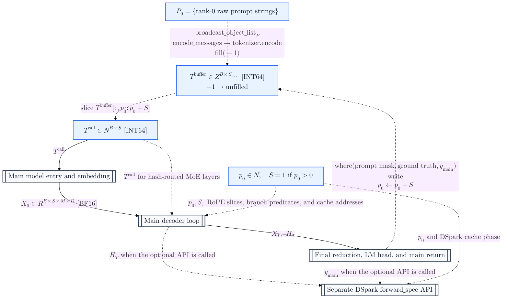

### Main model entry and embedding

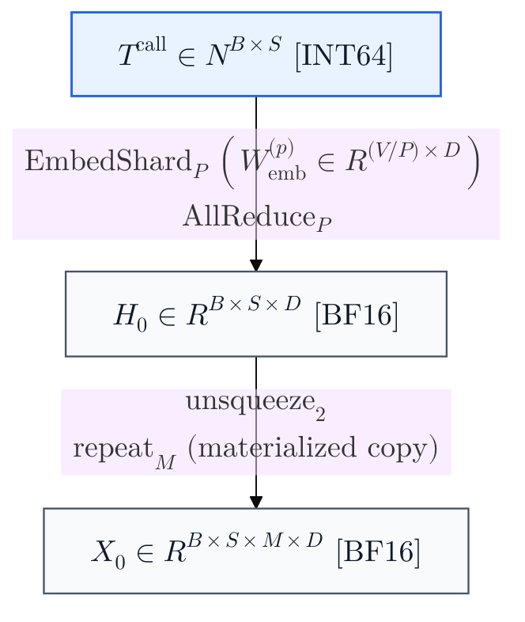

### Main decoder loop

#### One-level decoder-loop flow

This view contracts each decoder sub-block to one labeled transformation while preserving the
boundary tensors (including the mHC map bundles), target taps, loop back-edge, and final exit.

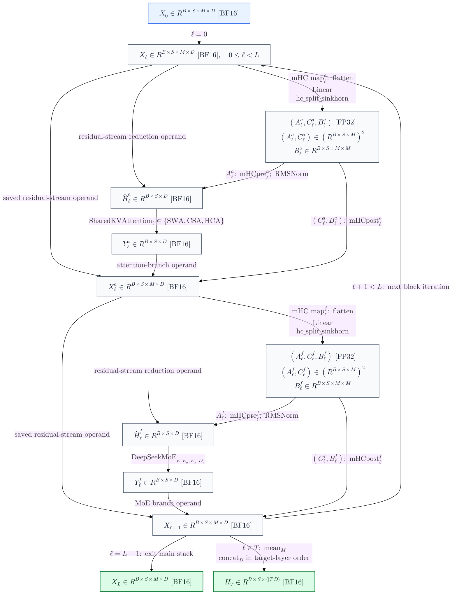

#### Attention-side mHC

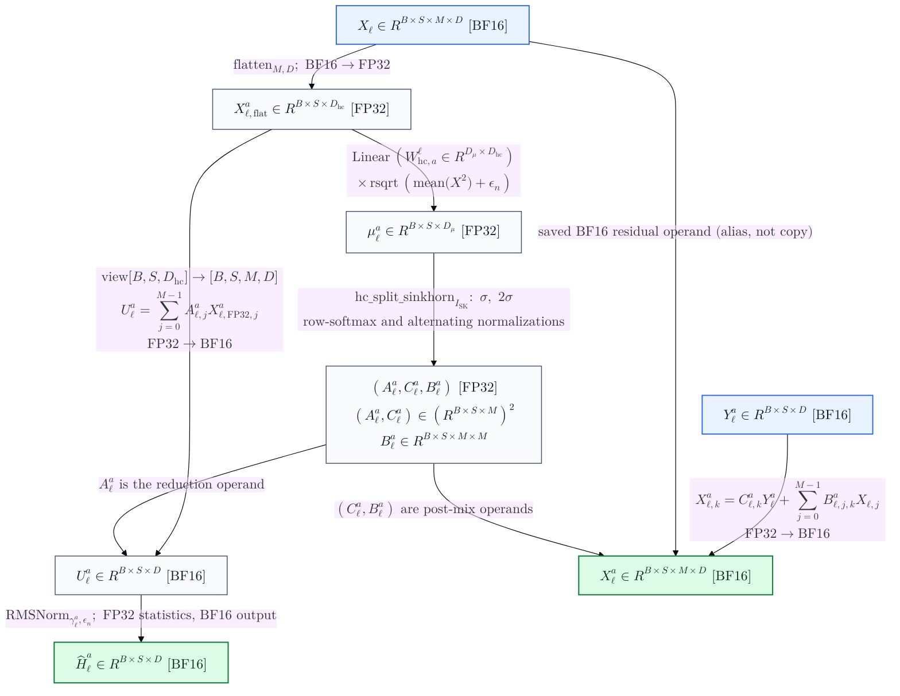

#### Shared query, local-KV, and sparse-attention core

The compressed-history interfaces consumed below are piecewise data states:

$$
\mathbf I_{\ell}^{\mathrm{hist}}=
\begin{cases}
\varnothing, & \ell\in\mathcal L_{\mathrm{SWA}},\\
\mathbf I_{\ell}^{\mathrm{CSA}}, & \ell\in\mathcal L_{\mathrm{CSA}},\\
\mathbf I_{\ell}^{\mathrm{HCA}}, & \ell\in\mathcal L_{\mathrm{HCA}},
\end{cases}
$$

Here $\mathbf I_{\ell}^{\mathrm{CSA}}$ and $\mathbf I_{\ell}^{\mathrm{HCA}}$ denote the history-index outputs of the two family-specific diagrams below.

For $\rho_\ell>0$, the active compressed KV operand is
$\mathbf C_{\ell}^{\mathrm{emit}}$ during prefill or the post-update persistent
$\mathcal K_{\ell}^{\mathrm{comp}}$ alias view during decode. On CSA layers, the same normalized
query latent $\mathbf Q^r_\ell$ produced by the shared query stem also supplies the
lightning-indexer query projection. The history-index tensor and phase-active compressed-KV
operand are logically empty in SWA: no `Compressor`, `Indexer`, or compressed-cache region is
instantiated on an SWA layer, whose layer cache is exactly the $W$-entry ring.

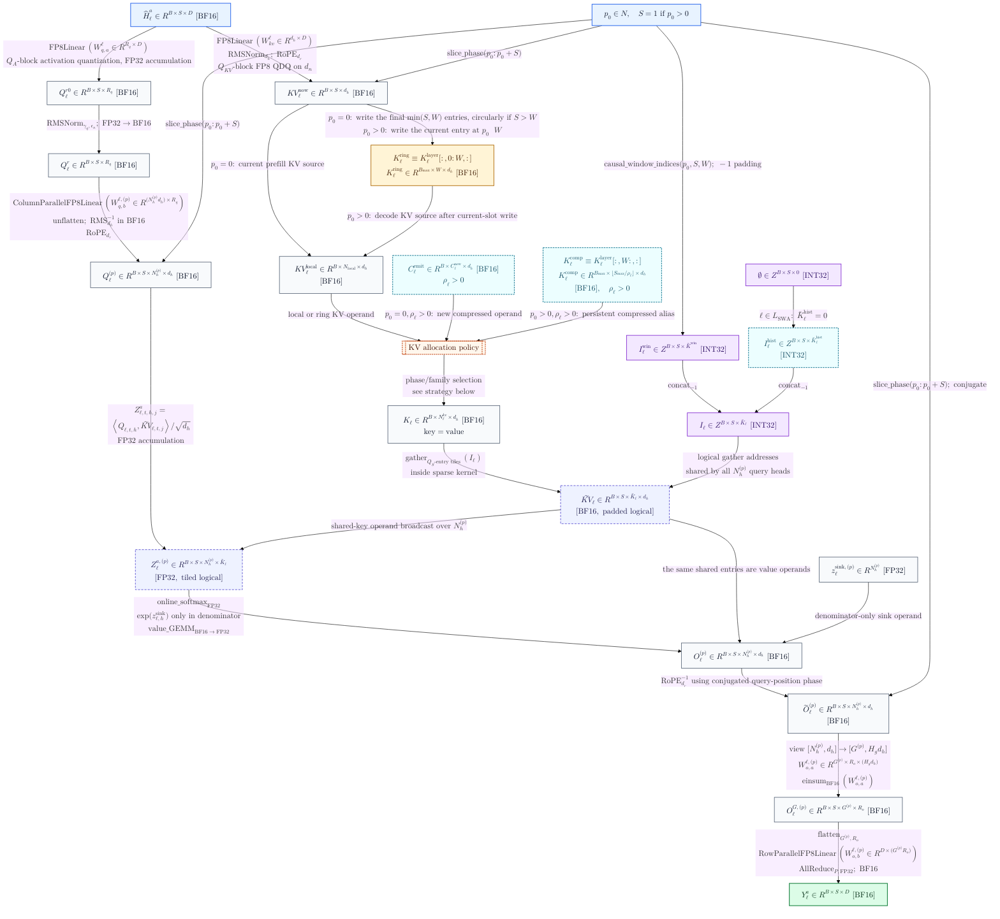

##### KV Allocation Strategy

$$
\mathbf{KV}_{\ell}^{\mathrm{bank}} =
\begin{cases}
\mathbf{KV}^{\mathrm{local}}_{\ell}, & p_0 = 0,\ \rho_\ell = 0 \\
\operatorname{concat}(\mathbf{KV}^{\mathrm{local}}_{\ell},\ \mathbf{C}_{\ell}^{\mathrm{emit}}), & p_0 = 0,\ \rho_\ell > 0 \\
\mathcal{K}_{\ell}^{\mathrm{ring}}, & p_0 > 0,\ \rho_\ell = 0 \\
\operatorname{select}\left(\mathcal{K}_{\ell}^{\mathrm{layer}}\right), & p_0 > 0,\ \rho_\ell > 0 \end{cases} \tag{1}
$$

In compressed decode, the ring and compressed regions are alias slices of one existing contiguous
layer allocation; selecting the bank performs no concatenation or copy.

#### CSA compressed-history and lightning-indexer paths

Applies only when $\ell\in\mathcal L_{\mathrm{CSA}}$.

##### CSA attention-compressor path

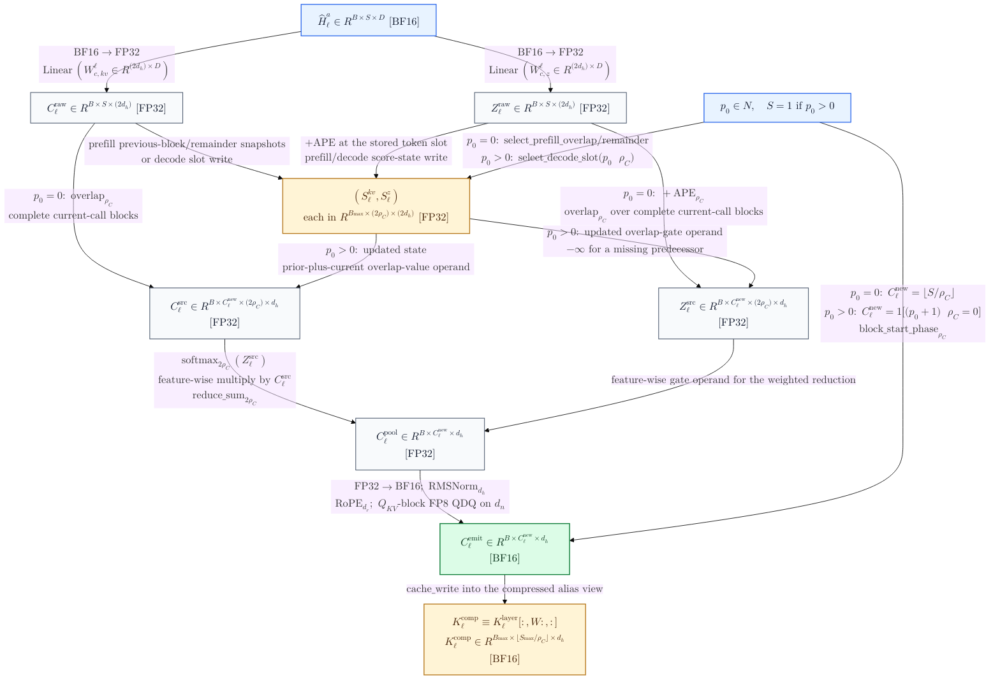

##### CSA lightning-indexer path

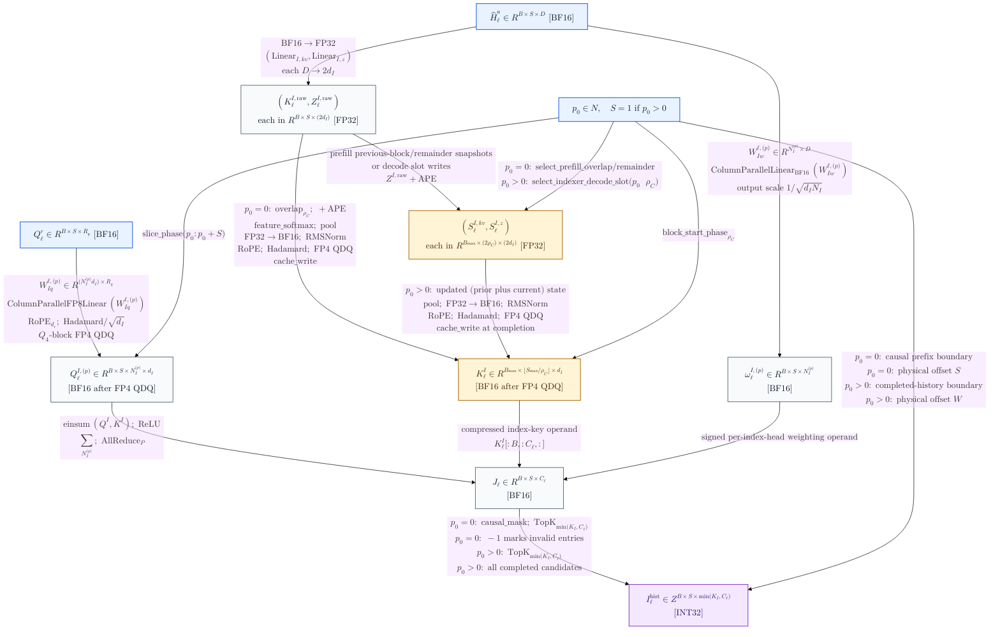

Cross-diagram interfaces (semantic identity, not a copy or runtime edge):
$\texttt{C\_QR}\equiv\texttt{A\_QR}$,
$\texttt{C\_CEMIT}\equiv\texttt{A\_CEMIT}$,
$\texttt{C\_CCACHE}\equiv\texttt{A\_CCACHE}$, and
$\texttt{C\_IHIST}\equiv\texttt{A\_IHIST}$.

#### HCA compressed-history path

Applies only when $\ell\in\mathcal L_{\mathrm{HCA}}$. Each of its value and gate projections emits one $d_h$-wide branch;
Compared to CSA, it has no overlap transform, no lightning indexer, and deterministically enumerates every causally visible completed compressed block.

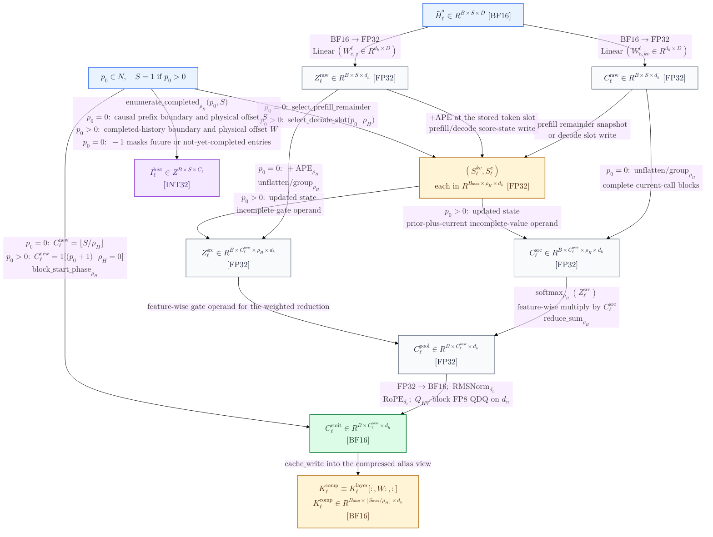

Cross-diagram interfaces (ditto):
$\texttt{H\_CEMIT}\equiv\texttt{A\_CEMIT}$,
$\texttt{H\_CCACHE}\equiv\texttt{A\_CCACHE}$, and
$\texttt{H\_IHIST}\equiv\texttt{A\_IHIST}$.

#### MoE-side mHC and DeepSeekMoE

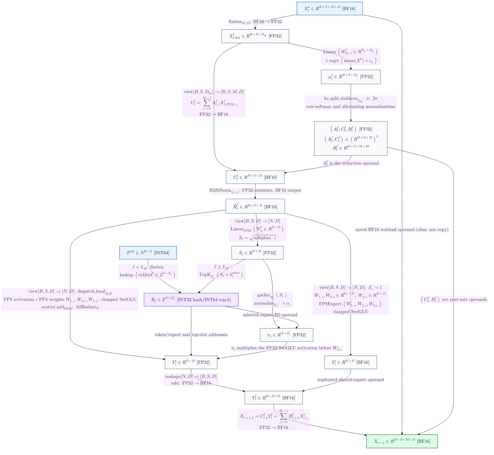

### Final reduction, LM head, and main return

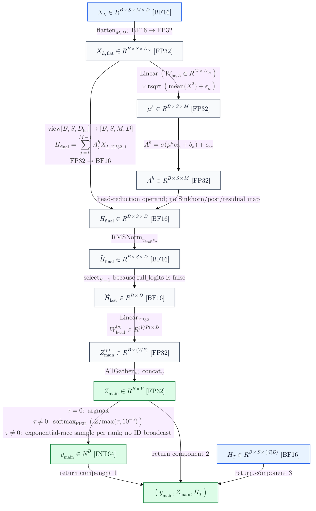

### Separate DSpark forward_spec API

DSpark block's internal dataflow.
`forward_spec` is separately callable, not an unconditional tail of `Transformer.forward`.

This is not a part of the original paper and appears to be a state-of-the-art frontier ongoing research work, so I'll skip here.

```mermaid
%%{init: {"theme": "base", "flowchart": {"htmlLabels": true, "curve": "basis", "nodeSpacing": 24, "rankSpacing": 36}}}%%
flowchart TD
    POS["$$p_0\in\mathbb N,\quad S=1\ \mathrm{if}\ p_0>0$$"]
    TAP["$$\mathbf H_{\mathcal T}\in\mathbb R^{B\times S\times(|\mathcal T|D)}\;[\mathrm{BF16}]$$"]
    YMAIN["$$\mathbf y_{\mathrm{main}}\in\mathbb N^{B}\;[\mathrm{INT64}]$$"]

    DSID["$$\begin{gathered} \mathbf T_D=[\mathbf y_{\mathrm{main}},t_{\mathrm{noise}},\ldots,t_{\mathrm{noise}}] \\\\ \mathbf T_D\in\mathbb N^{B\times K_D}\;[\mathrm{INT64}] \end{gathered}$$"]
    MAINX["$$\mathbf H_D^{\mathrm{main}}\in\mathbb R^{B\times S_m\times D}\;[\mathrm{BF16}]$$"]
    DX0["$$\mathbf X^D_0\in\mathbb R^{B\times K_D\times M\times D}\;[\mathrm{BF16}]$$"]
    DKCACHE["$$\begin{gathered} \left\{\mathcal K^{D,\mathrm{main}}_j\right\}_{j=0}^{L_D-1} \\\\ \mathcal K^{D,\mathrm{main}}_j\in\mathbb R^{B_{\max}\times W\times d_h}\;[\mathrm{BF16}] \end{gathered}$$"]
    NULLRET["$$\varnothing\quad\text{(forward\_spec prefill return)}$$"]

    TAP -.->|"$$\begin{gathered} \operatorname{FP8Linear}\!\left(W_D^{\mathrm{main}}\in\mathbb R^{D\times(|\mathcal T|D)}\right) \\\\ \operatorname{RMSNorm} \end{gathered}$$"| MAINX
    YMAIN -.->|"$$\begin{gathered} \operatorname{fill}_{K_D}(t_{\mathrm{noise}}) \\\\ \mathbf T_D[:,0]=\mathbf y_{\mathrm{main}} \end{gathered}$$"| DSID
    DSID -->|"$$\begin{gathered} \operatorname{shared\ EmbedShard}_{P} \\\\ \operatorname{AllReduce}_{P};\ \operatorname{repeat}_{M} \end{gathered}$$"| DX0
    MAINX -->|"$$\begin{gathered} \forall j\lt L_D:\ \operatorname{FP8Linear}(W_{kv}^{D,j}) \\\\ \operatorname{RMSNorm};\ \operatorname{RoPE}_{d_r,\theta_{\mathrm{local}}} \\\\ \mathrm{FP8\ QDQ};\ \operatorname{ring\_write} \end{gathered}$$"| DKCACHE
    POS -->|"$$\operatorname{main\ phase\ slice}(p_0:p_0+S_m)$$"| DKCACHE
    DX0 -->|"$$p_0=0:\ \text{all DSpark blocks bypass mHC, draft attention, and MoE}$$"| NULLRET
    DKCACHE -->|"$$p_0=0:\ \text{cache side effect only}$$"| NULLRET

    DXJ["$$\begin{gathered} \mathbf X^D_j\in\mathbb R^{B\times K_D\times M\times D}\;[\mathrm{BF16}] \\\\ 0\leq j\lt L_D \end{gathered}$$"]
    DUA["$$\widehat{\mathbf H}^{D,a}_j\in\mathbb R^{B\times K_D\times D}\;[\mathrm{BF16}]$$"]
    DQ["$$\mathbf Q^{D,(p)}_j\in\mathbb R^{B\times K_D\times N_h^{(p)}\times d_h}\;[\mathrm{BF16}]$$"]
    DKV["$$\mathbf{KV}^{D,\mathrm{draft}}_j\in\mathbb R^{B\times K_D\times d_h}\;[\mathrm{BF16}]$$"]
    DBANK["$$\mathcal K^D_j\in\mathbb R^{B\times(W+K_D)\times d_h}\;[\mathrm{BF16}]$$"]
    DI["$$\mathbf I^D_j\in\mathbb Z^{B\times K_D\times(\min(W,p_0+1)+K_D)}\;[\mathrm{INT32}]$$"]
    DO["$$\mathbf O^{D,(p)}_j\in\mathbb R^{B\times K_D\times N_h^{(p)}\times d_h}\;[\mathrm{BF16}]$$"]
    DYA["$$\mathbf Y^{D,a}_j\in\mathbb R^{B\times K_D\times D}\;[\mathrm{BF16}]$$"]
    DXA["$$\mathbf X^{D,a}_j\in\mathbb R^{B\times K_D\times M\times D}\;[\mathrm{BF16}]$$"]
    DUF["$$\widehat{\mathbf H}^{D,f}_j\in\mathbb R^{B\times K_D\times D}\;[\mathrm{BF16}]$$"]
    DYF["$$\mathbf Y^{D,f}_j\in\mathbb R^{B\times K_D\times D}\;[\mathrm{BF16}]$$"]
    DXNEXT["$$\mathbf X^D_{j+1}\in\mathbb R^{B\times K_D\times M\times D}\;[\mathrm{BF16}]$$"]
    DXEND["$$\mathbf X^D_{L_D}\in\mathbb R^{B\times K_D\times M\times D}\;[\mathrm{BF16}]$$"]

    DX0 -->|"$$p_0>0:\ j=0$$"| DXJ
    DXJ -->|"$$\begin{gathered} \text{same FP32 map generation as the main block} \\\\ \operatorname{mHCpre}^{a}_{j} \\\\ \operatorname{RMSNorm} \end{gathered}$$"| DUA
    DUA -->|"$$\begin{gathered} \operatorname{FP8Linear}_{q,a};\ \operatorname{RMSNorm}_{R_q} \\\\ \operatorname{FP8Linear}_{q,b};\ \operatorname{head\ RMS}^{-1}_{\mathrm{BF16}} \\\\ \operatorname{RoPE}_{d_r}\text{ at }p_0+S_m,\ldots,p_0+S_m+K_D-1 \end{gathered}$$"| DQ
    POS -->|"$$\operatorname{draft\ phase\ slice}(p_0+S_m:p_0+S_m+K_D)$$"| DQ
    DUA -->|"$$\begin{gathered} \operatorname{FP8Linear}_{kv};\ \operatorname{RMSNorm} \\\\ \operatorname{RoPE}_{d_r};\ \mathrm{FP8\ QDQ} \end{gathered}$$"| DKV
    POS -->|"$$\operatorname{draft\ phase\ slice}(p_0+S_m:p_0+S_m+K_D)$$"| DKV
    DKCACHE -->|"$$\operatorname{concat}_{1}\ \text{with current draft KV}$$"| DBANK
    DKV -->|"$$\operatorname{concat}_{1}\ \text{after the }W\text{-slot main ring}$$"| DBANK
    POS -->|"$$\begin{gathered} [0,\ldots,\min(W,p_0+1)-1] \\\\ {}\Vert\ [W,\ldots,W+K_D-1]\ \text{for every draft query} \end{gathered}$$"| DI
    DQ -->|"$$\begin{gathered} \operatorname{sparse\_attn}\!\left(\mathcal K^D_j,\mathbf I^D_j,\mathbf z_j^{\mathrm{sink}}\right) \\\\ \text{all }K_D\text{ draft entries are mutually visible} \end{gathered}$$"| DO
    DBANK -->|"$$\text{shared key/value operand}$$"| DO
    DI -->|"$$\text{gather-address operand}$$"| DO
    DO -->|"$$\begin{gathered} \operatorname{RoPE}^{-1}_{d_r};\ \operatorname{grouped}\ W_{o,a}^{D,j} \\\\ \operatorname{RowParallelFP8Linear}\ W_{o,b}^{D,j} \\\\ \operatorname{AllReduce}_{P} \end{gathered}$$"| DYA
    DXJ -->|"$$\operatorname{mHCpost}^{a}_{j}\!\left(\mathbf Y^{D,a}_j,\mathbf X^D_j\right)$$"| DXA
    DYA -->|"$$\text{attention-result operand}$$"| DXA
    DXA -->|"$$\operatorname{mHCpre}^{f}_{j};\ \operatorname{RMSNorm}$$"| DUF
    DUF -->|"$$\begin{gathered} \operatorname{DeepSeekMoE}_{E,E_a,E_s,D_e}\ \text{with learned routing} \\\\ \operatorname{AllReduce}_{P} \end{gathered}$$"| DYF
    DXA -->|"$$\operatorname{mHCpost}^{f}_{j}\!\left(\mathbf Y^{D,f}_j,\mathbf X^{D,a}_j\right)$$"| DXNEXT
    DYF -->|"$$\text{MoE-result operand}$$"| DXNEXT
    DXNEXT -->|"$$j+1\lt L_D:\ \text{next DSpark stage}$$"| DXJ
    DXNEXT -->|"$$j=L_D-1:\ \text{exit refinement stack}$$"| DXEND

    DH["$$\mathbf H_D\in\mathbb R^{B\times K_D\times D}\;[\mathrm{BF16}]$$"]
    ZDBASE["$$\mathbf Z_D^{\mathrm{base}}\in\mathbb R^{B\times K_D\times V}\;[\mathrm{FP32}]$$"]
    DPREFIX["$$\begin{gathered} \mathbf d_{0:i}\in\mathbb N^{B\times(i+1)}\;[\mathrm{INT64}] \\\\ \mathbf d_0=\mathbf y_{\mathrm{main}} \end{gathered}$$"]
    MEMB["$$\mathbf E_D^M\in\mathbb R^{B\times K_D\times R_M}\;[\mathrm{BF16}]$$"]
    MBIAS["$$\begin{gathered} \mathbf Z_{D,i}^M\in\mathbb R^{B\times V}\;[\mathrm{FP32}] \\\\ 0\leq i\lt K_D \end{gathered}$$"]
    ZD["$$\begin{gathered} \mathbf Z_D=\mathbf Z_D^{\mathrm{base}}+\mathbf Z_D^M \\\\ \mathbf Z_D\in\mathbb R^{B\times K_D\times V}\;[\mathrm{FP32}] \end{gathered}$$"]
    DOUT["$$\mathbf y_D=[\mathbf d_0,\ldots,\mathbf d_{K_D}]\in\mathbb N^{B\times(K_D+1)}\;[\mathrm{INT64}]$$"]
    CONF["$$\mathbf c_D\in\mathbb R^{B\times K_D}\;[\mathrm{FP32,\ raw}]$$"]
    RETSPEC["$$\left(\mathbf y_D,\mathbf Z_D,\mathbf c_D\right)$$"]

    DXEND -->|"$$\operatorname{mHChead};\ \mathrm{FP32}\to\mathrm{BF16}$$"| DH
    DH -->|"$$\begin{gathered} \operatorname{RMSNorm} \\\\ \operatorname{shared\ ParallelHead}_{P}\!\left(W_{\mathrm{head}}^{(p)}\right)\ \text{with full logits} \\\\ \operatorname{AllGather}_{P} \end{gathered}$$"| ZDBASE
    YMAIN -->|"$$\mathbf d_0=\mathbf y_{\mathrm{main}}$$"| DPREFIX
    DPREFIX -->|"$$\begin{gathered} \forall i\lt K_D \\\\ \operatorname{MarkovEmbedShard}_{P}\!\left(W_{M,1}^{(p)}\in\mathbb R^{(V/P)\times R_M}\right) \\\\ \operatorname{AllReduce}_{P} \end{gathered}$$"| MEMB
    MEMB -->|"$$\begin{gathered} \operatorname{select}_{i} \\\\ \operatorname{MarkovHeadShard}_{P}\!\left(W_{M,2}^{(p)}\in\mathbb R^{(V/P)\times R_M}\right) \\\\ \operatorname{AllGather}_{P} \end{gathered}$$"| MBIAS
    ZDBASE -->|"$$\begin{gathered} \mathbf Z_D\leftarrow\mathbf Z_D^{\mathrm{base}} \\\\ \text{same mutable tensor before sequential position updates} \end{gathered}$$"| ZD
    MBIAS -->|"$$\begin{gathered} \operatorname{add\_inplace}\ \mathbf Z_D[:,i,:]\mathrel{+}=\mathbf Z_{D,i}^M \\\\ \text{before sampling step }i \end{gathered}$$"| ZD
    ZD -->|"$$\begin{gathered} \forall i\lt K_D,\ \tau=0:\ \arg\max \\\\ \forall i\lt K_D,\ \tau\neq0:\ \operatorname{softmax}\!\left(\mathbf Z_{D,:,i,:}/\max(\tau,10^{-5})\right) \\\\ \forall i\lt K_D,\ \tau\neq0:\ \text{exponential race per rank; no ID broadcast} \end{gathered}$$"| DOUT
    DOUT -->|"$$i+1\lt K_D:\ \text{next Markov-conditioning token}$$"| DPREFIX
    DH -->|"$$\begin{gathered} \operatorname{concat}_{D,R_M}\!\left(\mathbf H_D,\mathbf E_D^M\right) \\\\ \operatorname{Linear}_{\mathrm{FP32}}\!\left(W_c\in\mathbb R^{1\times(D+R_M)}\right) \end{gathered}$$"| CONF
    MEMB -->|"$$\text{confidence-conditioning operand}$$"| CONF
    DOUT -->|"$$\text{return component }1$$"| RETSPEC
    ZD -->|"$$\text{return component }2$$"| RETSPEC
    CONF -->|"$$\text{return component }3$$"| RETSPEC

    classDef input fill:#e8f3ff,stroke:#2563eb,color:#0f172a,stroke-width:1.5px;
    classDef data fill:#f8fafc,stroke:#475569,color:#0f172a,stroke-width:1.2px;
    classDef cache fill:#fff4d6,stroke:#b7791f,color:#422006,stroke-width:1.6px;
    classDef index fill:#f3e8ff,stroke:#7e22ce,color:#2e1065,stroke-width:1.3px;
    classDef output fill:#dcfce7,stroke:#15803d,color:#052e16,stroke-width:1.7px;
    class POS,TAP,YMAIN input;
    class DSID,MAINX,DX0,DXJ,DUA,DQ,DKV,DBANK,DO,DYA,DXA,DUF,DYF,DXNEXT,DXEND,DH,ZDBASE,DPREFIX,MEMB,MBIAS data;
    class DKCACHE cache;
    class DI index;
    class NULLRET,ZD,DOUT,CONF,RETSPEC output;
```

## Operator semantics and tensor transformations

These semantics apply across all diagrams. Diagram boundaries are explanatory only and do not
introduce runtime barriers, state duplication, or materialization.

### Main call and outer generation loop

The main embedding is vocabulary-sharded. Each rank masks IDs outside its contiguous
$V/P$ range, performs its local lookup, zeroes masked rows, and all-reduces the partial
embeddings. The embedding and LM head are distinct parameters; weights are not tied. The
four-stream expansion uses `repeat`, so
$[B,S,D]\to[B,S,1,D]\to[B,S,M,D]$ is materialized rather than a broadcast view.

After blocks in $\mathcal T$, the code computes an arithmetic mean over the $M$ residual
streams and concatenates the three $[B,S,D]$ taps into
$\mathbf H_{\mathcal T}\in\mathbb R^{B\times S\times3D}$. The final mHC head is a separate
sigmoid-weighted reduction; it does not form post or residual maps and does not run Sinkhorn.
The ordinary head selects only the last sequence position, computes FP32 local vocabulary
logits, and all-gathers them. ([model.py, lines 877-926](inference/model.py#L877-L926).)

The supplied generation loop stores prompts from column zero, so they are left-aligned and
right-padded despite its "left-padded" docstring. It first calls the model on the shortest common
prompt prefix and then calls it one token at a time; ground-truth prompt tokens override sampled
tokens for longer prompts. It consumes only return component 0 and never calls
`forward_spec`. ([generate.py, lines 19-56](inference/generate.py#L19-L56).)

The exact sampler is greedy only when $\tau=0$. For every $\tau\neq0$, including an unvalidated
negative CLI value, it samples by exponential race from
$\operatorname{softmax}(\mathbf Z/\max(\tau,10^{-5}))$. This rule is shared by the main and
DSpark/Markov paths. ([model.py, lines 939-946](inference/model.py#L939-L946).)

### mHC pre/post mapping

For either attention or MoE, let
$\mathbf R[b,s,j,d]\in\mathbb R^{B\times S\times M\times D}$ be the saved BF16 residual.
The code aliases this tensor, then separately flattens and upcasts it for map generation and the
pre-reduction:
$$
\widehat{\mathbf R}
=
\frac{\operatorname{vec}(\mathbf R)_{\mathrm{FP32}}}
{\sqrt{\operatorname{mean}(\operatorname{vec}(\mathbf R)^2)+\epsilon_n}},
\qquad
\boldsymbol\mu=\widehat{\mathbf R}W_{\mathrm{hc}}^{\mathsf T}.
$$

The fused kernel splits $\boldsymbol\mu$ into $M$, $M$, and $M^2$ values:

$$
A_j=\sigma(\mu_j\alpha_0+b_j)+\epsilon_{\mathrm{hc}},
\qquad
C_k=2\sigma(\mu_{M+k}\alpha_1+b_{M+k}),
$$

and forms $B_{j,k}$ by a stabilized row softmax plus $\epsilon_{\mathrm{hc}}$, one column
normalization, and then $I_{\mathrm{SK}}-1$ row/column normalization pairs. The executable
update is

$$
U[b,s,d]=\sum_{j=0}^{M-1}A[b,s,j]R_{\mathrm{FP32}}[b,s,j,d],
$$

$$
R'[b,s,k,d]
=C[b,s,k]F(U)[b,s,d]
+\sum_{j=0}^{M-1}B[b,s,j,k]R[b,s,j,d].
$$

The $B[j,k]$ orientation follows
`comb.unsqueeze(-1) * residual.unsqueeze(-2)` followed by
`sum(dim=2)`. The paper's conceptual update is Equation (1), while the stabilized
finite algorithm above is code-specific. (Paper: Section 2.2, pp. 7-8; implementation:
[model.py, lines 652-716](inference/model.py#L652-L716) and
[kernel.py, lines 371-438](inference/kernel.py#L371-L438).)

### Attention layouts, caches, and visibility

No $[B,N_h,S,d_h]$ transpose occurs. The query stays
$[B,S,N_h^{(p)},d_h]$. Shared KV has no head axis, and one vector is used as both key and
value for every query head. The selected index tensor is also shared across heads. The full
padded logical gather $[B,S,\bar K_\ell,d_h]$ and logit tensor
$[B,S,N_h^{(p)},\bar K_\ell]$ are not allocated: the TileLang kernel gathers $Q_S$ entries
per tile, masks $-1$ slots so only $K_{\ell,t}$ entries are valid for query $t$, and keeps
scores/online-softmax state in fragments.

The active KV source differs by phase:

- Prefill ($p_0=0$): attention reads the complete current-call KV tensor and appends newly
  completed compressed entries in a temporary tensor. Independently, the last $W$ local entries
  and all completed compressed entries are written to persistent caches. Compressed indices are
  offset by $S$.
- Decode ($p_0>0,S=1$): the current local entry is written to ring slot $p_0\bmod W$, a newly
  completed compression is written when $(p_0+1)\bmod\rho_\ell=0$, and attention reads the
  persistent layout $[\text{window ring}\mid\text{compressed history}]$. Compressed indices are
  offset by $W$.

The ring and compressed-history regions are aliasing slices $[0:W]$ and $[W:]$ of one contiguous
per-layer allocation, not separately allocated buffers. The compressor receives the latter view.

The code uses a reference-specific completion-boundary rule: a compressed block becomes visible
to the query at that block's final token. The resulting entry can contain the current token but
never a future token, so the implementation remains autoregressively causal. The paper says that
a query attends only to preceding compressed blocks and cannot access other tokens in its own
compressed block (Section 2.3.3, p. 13), while the boundary in Equation (16) depends on its token
indexing convention. The prose and equations therefore do not cleanly resolve this exact boundary,
and the diagrams follow the executable code. ([model.py, lines 260-282 and
442-548](inference/model.py#L260-L548); paper: Sections 2.3.1-2.3.3, pp. 9-13.)

For a local head $h$, the fused attention computes

$$
a_{t,h,j}
=
\frac{\exp\!\left(q_{t,h}^{\mathsf T}kv_j/\sqrt{d_h}\right)}
{\exp(z^{\mathrm{sink}}_h)+
\sum_{k\in\mathcal I_{\ell,t}}
\exp\!\left(q_{t,h}^{\mathsf T}kv_k/\sqrt{d_h}\right)}.
$$

The sink has no value vector, so real attention weights can sum below one. Scores, running
maxima, denominators, and output accumulators are FP32; score tiles are cast to BF16 for the
value GEMM, and the final output is BF16. If $N_h^{(p)}<16$, the wrapper pads to 16 heads,
then narrows and calls `contiguous()`. ([kernel.py, lines
276-368](inference/kernel.py#L276-L368); paper: Equation (27), p. 13.)

### CSA/HCA compression and the lightning indexer

Compression gates are feature-wise. With projected values $C_{r,f}$ and gate logits
$Z_{r,f}$ for source position $r$ and feature $f$:
$$
\alpha_{r,f}
=
\frac{\exp(Z_{r,f} + \text{APE}_{r,f})}
{\sum_{u \in \mathcal{B}}\exp(Z_{u,f} + \text{APE}_{u,f})},\qquad 

C_f^{\mathrm{new}} 
= 
\sum_{r \in \mathcal{B}} \alpha_{r,f}C_{r,f}.
$$

HCA uses one non-overlapping $\rho_H$-token source block. CSA projects two $d_h$ branches.
For compressed block $i$, the implementation's overlap transform combines one branch from
block $i-1$ with the other branch from block $i$, for $2\rho_C$ source vectors in total; the
missing predecessor of block zero has zero values and $-\infty$ gate logits. Output length
still shrinks by $\rho_C$. In decode, FP32 state buffers retain incomplete values and scores.

The CSA indexer has its own overlap-$\rho_C$ compressor and a distinct pair of FP32 incomplete
state buffers of shape $[B_{\max},2\rho_C,2d_I]$; it does not reuse the attention compressor's
state. Its score is

$$
J_{t,c}
=
\sum_{h=1}^{N_I}
\omega^I_{t,h}\,
\operatorname{ReLU}\!\left(
\left\langle q^I_{t,h},k^I_c\right\rangle
\right),
\qquad
\omega^I\ \text{includes}\ d_I^{-1/2}N_I^{-1/2}.
$$

Rank-local head contributions are all-reduced before causal masking and top-$K_I$ selection.
HCA has no learned indexer and enumerates every completed compressed entry. The first two
layers have no compressed history. (Paper: Equations (9)-(26) and Figures 3-4, pp. 9-12;
implementation: [model.py, lines 285-439](inference/model.py#L285-L439).)

### RoPE and YaRN formulation

Adjacent coordinate pairs are reinterpreted as complex values:

$$
(x_0,x_1,x_2,x_3,\ldots)
\mapsto
(x_0+i x_1,x_2+i x_3,\ldots).
$$

For $j=0,\ldots,d_r/2-1$, base frequency is

$$
\omega_j=\theta^{-2j/d_r}.
$$

When $S_{\mathrm{orig}}>0$, the code computes

$$
\ell_c=
\max\!\left(
\left\lfloor
\frac{d_r\log(S_{\mathrm{orig}}/(2\pi\beta_f))}
{2\log\theta}
\right\rfloor,0
\right),
$$

$$
h_c=
\min\!\left(
\left\lceil
\frac{d_r\log(S_{\mathrm{orig}}/(2\pi\beta_s))}
{2\log\theta}
\right\rceil,d_r-1
\right),
$$

$$
s_j=
1-\operatorname{clip}\!\left(\frac{j-\ell_c}{h_c-\ell_c},0,1\right),
\qquad
\widetilde\omega_j=
\frac{\omega_j}{f_Y}(1-s_j)+\omega_j s_j,
\qquad
f_{t,j}=e^{it\widetilde\omega_j}.
$$

Compressed layers use $(\theta,S_{\mathrm{orig}})=(\theta_{\mathrm{comp}},S_{\mathrm{orig}})$.
Pure-window and DSpark layers disable interpolation and use
$\theta_{\mathrm{local}}$. Main queries and local KV use positions
$p_0,\ldots,p_0+S-1$; a compressed entry uses its block-start position. Only the trailing
$d_r$ dimensions are cast to FP32, complex-multiplied, and copied back in place. Core attention
output uses the conjugate phase at the query position. The paper describes this negative-position
correction but uses an overloaded index symbol; the code unambiguously uses the query-position
frequency. For CSA and HCA, partial query/KV/output RoPE and the attention sink agree with
Section 2.3.3 of the paper. The reference additionally applies the same inverse-RoPE/sink
machinery to pure-window and DSpark attention paths; the paper does not specify those cases.
([model.py, lines 205-250 and 368-378](inference/model.py#L205-L378); paper:
Section 2.3.3, p. 13.)

### MoE routing and expert arithmetic

All $E$ FP32 affinities are computed even for hash-routed layers because the unbiased affinity
still supplies the mixture weight:

$$
s_e(x)=\sqrt{\operatorname{softplus}
\left(xW_{g,e}^{\mathsf T}\right)}.
$$

For $\ell<L_H$, IDs come from the fixed $V\times E_a$ token-to-expert table. For later
layers, an FP32 bias changes only top-$E_a$ selection. Selected weights are gathered from
unbiased $s_e$, normalized over $E_a$, and multiplied by $\alpha_r$.

For selected expert $e$:

$$
g_e=xW_{1,e}^{\mathsf T},
\qquad
u_e=xW_{3,e}^{\mathsf T},
$$

$$
v_e=
\operatorname{SiLU}\!\left(\min(g_e,c_{\mathrm{SwiGLU}})\right)
\odot
\operatorname{clip}\!\left(u_e,-c_{\mathrm{SwiGLU}},c_{\mathrm{SwiGLU}}\right),
\qquad
y_e=(\pi_e v_e)W_{2,e}^{\mathsf T}.
$$

Each rank instantiates a contiguous $E/P$ expert-ID range, selects local token rows with
`torch.where`, scatter-adds BF16 expert outputs into an FP32 dense tensor, and
all-reduces that tensor. The replicated shared FP8 expert is added afterward. This reference
path has no all-to-all dispatch. ([model.py, lines 551-649](inference/model.py#L551-L649).)

### DSpark API semantics

The DSpark path is an exposed proposal API, not an unconditional tail of
`Transformer.forward`.

- **Prefill, $p_0=0$.** Stage zero projects the three target-layer taps to
  $\mathbf H_D^{\mathrm{main}}$. Every DSpark stage projects that main hidden sequence into its
  own local KV ring. The draft tensor passes through all stages unchanged; mHC, draft attention,
  MoE, the output head, Markov chain, and confidence head are bypassed, and
  `forward_spec` returns `None`.
- **Decode, $p_0>0$.** The expected main conditioning length is $S_m=1$.
  Each of $L_D$ stages runs a full mHC-attention-mHC-MoE block. Five draft queries/entries use
  future positions $p_0+1,\ldots,p_0+K_D$ and all five draft entries are mutually visible in
  each stage; there is no triangular mask within the draft block.
- **Heads.** After the last stage, a DSpark-specific mHC head and norm feed the
  shared main vocabulary head with full logits. A sequential rank-$R_M$ Markov embedding/head
  adds a vocabulary bias conditioned on the previously sampled draft token. The confidence head
  is one FP32 linear over $[\mathbf H_D\mid\mathbf E_D^M]$ and returns raw, uncalibrated scores.

The return shapes are $[B,K_D+1]$ IDs, $[B,K_D,V]$ mutated base-plus-Markov logits, and
$[B,K_D]$ confidence scores. The repository contains no proposal acceptance, rejection, or
verification controller; an external scheduler would be required for speculative decoding.
([model.py, lines 743-874 and 928-936](inference/model.py#L743-L936).)

## Reshape, copy, and contiguity map

| Data transition     | Exact mapping                                     | Storage behavior                                                            |
| ------------------- | ------------------------------------------------- | --------------------------------------------------------------------------- |
| embedding expansion | $[B,S,D]\to[B,S,1,D]\to[B,S,M,D]$                 | `unsqueeze` view, then `repeat` copy                                        |
| mHC generator       | $[B,S,M,D]\to[B,S,MD]$                            | `flatten(2)`, then `float()` allocation                                     |
| mHC pre-reduction   | FP32 $[B,S,MD]\to[B,S,M,D]$                       | `view(shape)` of the upcast tensor                                          |
| main query          | $[B,S,N_h^{(p)}d_h]\to[B,S,N_h^{(p)},d_h]$        | `unflatten` view when strides permit                                        |
| indexer query       | $[B,S,N_I^{(p)}d_I]\to[B,S,N_I^{(p)},d_I]$        | `unflatten` view when strides permit                                        |
| CSA grouping        | $[B,C,\rho_C,2d]\to[B,C,2\rho_C,d]$               | explicit newly allocated overlap tensor                                     |
| HCA grouping        | $[B,C,\rho_H,d]$                                  | `unflatten` view before reduction                                           |
| attention grouping  | $[B,S,N_h^{(p)},d_h]\to[B,S,G^{(p)},H_gd_h]$      | `view`; no sequence/head transpose                                          |
| output latent       | $[B,S,G^{(p)},R_o]\to[B,S,G^{(p)}R_o]$            | `flatten(2)` view when possible                                             |
| MoE rows            | $[B,S,D]\leftrightarrow[BS,D]$                    | `view`                                                                      |
| target tap          | $[B,S,M,D]\to[B,S,D]$                             | reduction allocation; three taps concatenate to $[B,S,3D]$                  |
| index helpers       | runtime arguments $\to[B,S,K]$                    | returned tensors explicitly call `contiguous()`                             |
| sparse-head padding | $N_h^{(p)}\to16$ only if $N_h^{(p)}<16$           | concatenate zeros; output narrows and calls `contiguous()`                  |
| in-place QDQ        | BF16 $\to$ FP8/FP4 quantized temporary $\to$ BF16 | quantized temporary allocated, then copied back into the input slice/tensor |

## Precision, collectives, and numerical-risk audit

| Region                        | Stored/input data                       | Executable compute and reduction                                                         |
| ----------------------------- | --------------------------------------- | ---------------------------------------------------------------------------------------- |
| embedding                     | BF16 local $[V/P,D]$                    | local lookup, BF16 all-reduce                                                            |
| mHC maps/post mix             | BF16 residual; FP32 parameters          | FP32 RMS, linear, sigmoid, Sinkhorn, weighted sums; BF16 boundary                        |
| FP8 `Linear` projection paths | FP8 E4M3 weights with E8M0 scales       | $Q_A$-block FP8 activation quantization, FP32 scale-corrected accumulation, BF16 output  |
| grouped attention $W_{o,a}$   | BF16 weight and BF16 attention input    | grouped BF16 `einsum`, BF16 output                                                       |
| compressor                    | FP32 weights, APE, and incomplete state | FP32 projections, feature-wise softmax, weighted reduction; BF16 norm/cache output       |
| reference KV cache            | physically BF16                         | leading $d_n$ dimensions undergo in-place FP8 QDQ; trailing $d_r$ stay BF16              |
| reference indexer Q/K         | physically BF16 after QDQ               | Hadamard plus in-place FP4 QDQ; PyTorch score tensor remains BF16; score all-reduce      |
| sparse attention              | BF16 Q/KV/output                        | FP32 logits, online max/sum, sink denominator, and value accumulator                     |
| routed experts                | FP8 activations, packed FP4 weights     | FP32 scale-corrected GEMM accumulators; FP32 nonlinear/route weighting and dense combine |
| shared expert                 | FP8 weights                             | same clamped SwiGLU topology; BF16 expert output                                         |
| routed combine                | BF16 per-expert outputs                 | FP32 scatter-add and all-reduce; BF16 block boundary                                     |
| main/Markov heads             | FP32 sharded weights                    | FP32 logits and vocabulary all-gather                                                    |
| sampling                      | FP32 global logits                      | FP32 softmax/exponential-race or argmax                                                  |

Numerically sensitive reductions are deliberately visible across the diagrams. `RMSNorm` and
mHC reciprocal-RMS calculations, mHC sigmoid/Sinkhorn denominators, compressor softmax, sparse-attention
running maxima and denominator, sparse value accumulation, routed dense accumulation, routed
all-reduce, final logits, and sampling softmax use FP32 where the implementation explicitly
does so. The per-head query RMS rescaling and lightning-indexer einsum/head reduction have no
explicit FP32 upcast and therefore remain BF16-sensitive paths in this reference.

The distributed communication points are:

- embedding all-reduce;
- row-parallel attention-output FP32 all-reduce;
- CSA index-score all-reduce;
- routed-MoE FP32 all-reduce;
- main and Markov vocabulary-head all-gathers;
- Markov-embedding all-reduce; and
- the interactive launcher's one prompt-object broadcast from rank 0 per interactive turn, before
  tokenization and generation.

Sampled main and DSpark token IDs are not broadcast. Every rank samples independently after the
vocabulary-logit all-gather; the launcher seeds all ranks identically and therefore relies on
synchronized RNG consumption and execution rather than explicit sampled-token synchronization.

There is no pipeline-parallel or all-to-all expert path in these files. Required sharding
compatibility is $P\mid V$, $P\mid N_h$, $P\mid N_I$, $P\mid G$, and $P\mid E$; some
conditions are asserted indirectly by sharded linear sizes and later reshapes.

### Implemented fusion versus candidates

Objective implementation facts:

- `sparse_attn_kernel` fuses indexed tile gathering, dot products, online softmax,
  attention-sink handling, value accumulation, and BF16 output.
- `hc_split_sinkhorn_kernel` fuses map splitting, pre/post sigmoid constraints, and
  finite Sinkhorn normalization.
- Activation quantization and quantized GEMM are dedicated TileLang kernels, but they are
  separate Python-level calls in `linear`; this document does not call them one fused
  launch.

Engineering candidates, not implemented facts, are RMSNorm plus projection, RoPE plus cache
write, compressor projection/gating/pooling, grouped $W_{o,a}$ plus $W_{o,b}$, and a
dispatch/expert/combine mega-kernel. These candidates require compiler/runtime work beyond the
checked-in reference.

## Paper-to-reference reconciliation

The architecture represented across the diagrams agrees with the paper on the mHC residual topology, dynamic-map
concept, sigmoid constraints, expansion factor, and configured iteration count; the executable
finite Sinkhorn realization remains code-specific as documented under "mHC pre/post mapping" above. It also
agrees on 43 Flash blocks, the two initial window layers, interleaved CSA/HCA, shared-key/value
MQA, partial/inverse RoPE and the attention sink in CSA/HCA, DeepSeekMoE, hash routing in the
first three MoE layers, and the core Flash dimensions enumerated in Section 4.2.1.
(DeepSeek-V4 paper: Figure 2 and Sections 2.1-2.3, pp. 6-13; Flash setup, p. 24.)

The paper also describes a fuller production stack that is not this reference execution:

| Paper production design                                                                                                                   | Checked-in reference behavior represented across the diagrams                         |
| ----------------------------------------------------------------------------------------------------------------------------------------- | ------------------------------------------------------------------------------------- |
| physically mixed KV storage: BF16 rotary tail and FP8 non-rotary dimensions                                                               | physical BF16 cache with in-place FP8 quantize/dequantize simulation                  |
| native FP4 lightning-indexer QK during inference/rollout                                                                                  | BF16 Q/K tensors after FP4 quantize/dequantize simulation, followed by PyTorch einsum |
| expert waves with dispatch and combine all-to-all in a mega-kernel                                                                        | all tokens on every rank, local expert loop, dense scatter-add, final all-reduce      |
| heterogeneous block-managed classical/state caches, plus an on-disk shared-prefix cache with deployment-selectable SWA storage strategies | one contiguous per-layer ring-plus-compressed tensor and in-memory incomplete state   |

Separately, the paper reports MTP depth $1$ in Section 4.2.1 (p. 24), whereas the checked-in
configuration and code implement three DSpark refinement stages under the `mtp.\*`
namespace. The paper does not establish that DSpark is its MTP implementation, so these are not
treated as equivalent concepts.

The production distinctions come from the paper's Sections 2.3.4, 3.1, 3.5, and 5.2.1
(pp. 13, 15-16, 21-23, and 33-34). They are not silently projected onto the reference diagrams.

## Implementation anchors

- Configuration: [config-Flash-0731.json](inference/config-Flash-0731.json)
- Model arguments, sharded embedding/linears, RMSNorm: [model.py, lines 34-202](inference/model.py#L34-L202)
- RoPE and index helpers: [model.py, lines 205-282](inference/model.py#L205-L282)
- Compressor and lightning indexer: [model.py, lines 285-439](inference/model.py#L285-L439)
- Main attention: [model.py, lines 442-548](inference/model.py#L442-L548)
- Router, experts, and MoE: [model.py, lines 551-649](inference/model.py#L551-L649)
- Block mHC: [model.py, lines 652-716](inference/model.py#L652-L716)
- Main/Markov vocabulary heads and DSpark: [model.py, lines 719-874](inference/model.py#L719-L874)
- Full model forward APIs and sampler: [model.py, lines 877-946](inference/model.py#L877-L946)
- Quantization, sparse attention, mHC Sinkhorn, and FP4 GEMM:
  [kernel.py](inference/kernel.py)
- Actual CLI generation loop: [generate.py, lines 19-56](inference/generate.py#L19-L56)
- Paper architecture and Flash setup: [2606.19348v1.pdf](2606.19348v1.pdf), Sections
  2.1-2.3 and 4.2.1, Figures 2-4, pp. 6-13 and 24

## (Legacy) Comprehensive Mermaid logical dataflow graph

See [V4FlashLegacy](./V4FlashLegacy.mmd)
