# Hierarchical logical dataflow diagrams

The architecture is split into eleven independently renderable views. The end-to-end
overview is the only block-centric abstraction: its four double-bordered nodes denote the four
top-level execution regions, and its edge labels name the boundary data or control flow. Except for
explicitly styled policy nodes that compact multi-way branch rules, every rectangular node below is
a tensor, tuple of tensors, index state, persistent buffer, or returned data bundle. Operators,
weights, casts, reshapes, branch predicates, cache writes, and collectives remain on edges. Policy
nodes are compact references to case tables immediately below their diagrams.

Repeated boundary tensors are cross-diagram references to the same semantic state. They do not
introduce a copy, synchronization point, runtime barrier, or additional materialization. Colors are
consistent across diagrams: gray is intermediate data, blue is an external or boundary input,
amber is persistent mutable state, purple is an index, dashed indigo is a logical tile-materialized
tensor, green is an output, dashed cyan in the shared-attention view marks a compressed interface
supplied by a layer-variant diagram, and dashed orange marks a policy reference.

CSA and HCA are mutually exclusive main-layer alternatives, not consecutive stages. CSA uses
overlapping ratio-$\rho_C$ compression plus lightning-indexer top-$K_I$ selection; HCA uses
non-overlapping ratio-$\rho_H$ compression and enumerates every completed compressed entry. Both
feed their compressed-history outputs into the same window-plus-history index assembly,
shared-KV sparse-attention kernel, inverse-RoPE correction, and grouped output projection. The two
initial SWA layers use that same shared core with empty compressed-history interfaces.

## End-to-end overview

The four top-level execution blocks and the four outer entry/state objects.

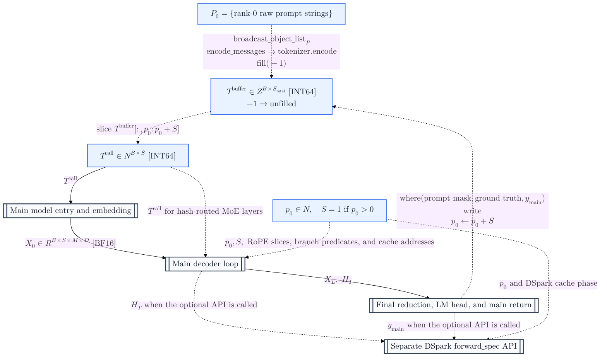

## Main model entry and embedding

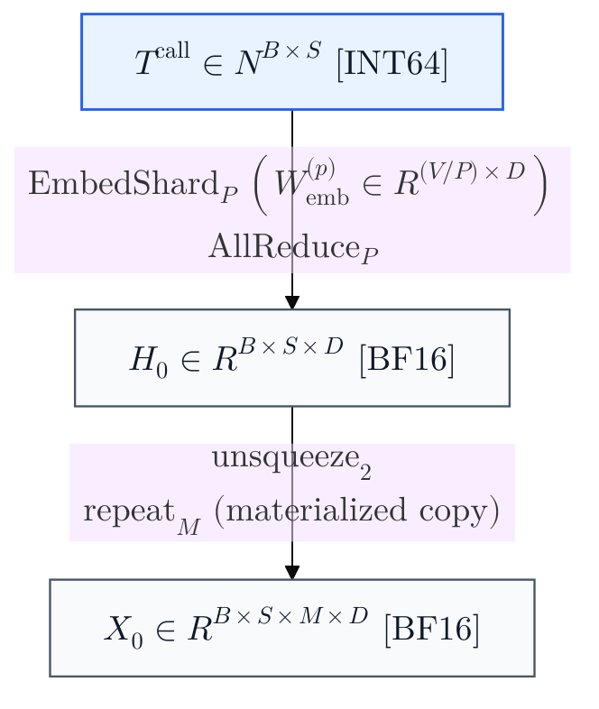

## Main decoder loop

### One-level decoder-loop flow

This view contracts each decoder sub-block to one labeled transformation while preserving the
boundary tensors (including the mHC map bundles), target taps, loop back-edge, and final exit.

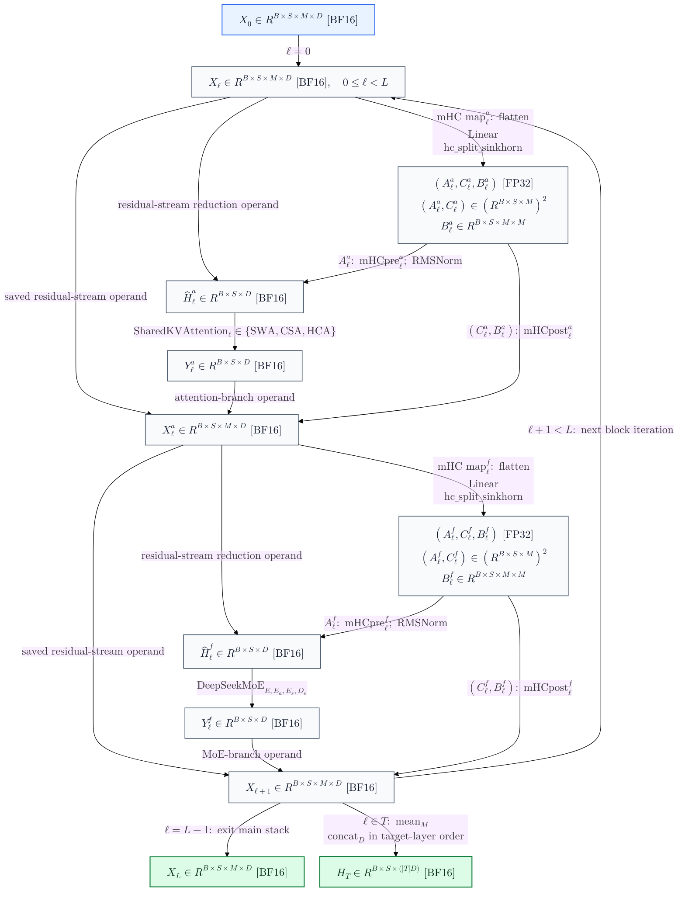

### Attention-side mHC

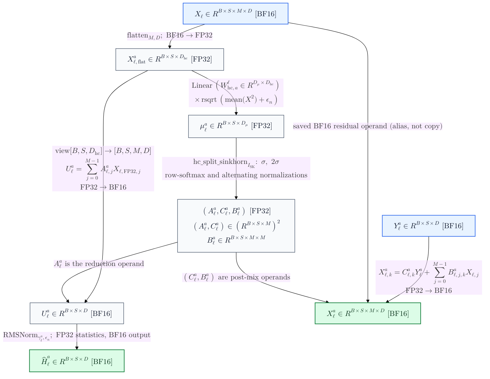

### Shared query, local-KV, and sparse-attention core

The compressed-history interfaces consumed below are piecewise data states:

$$
\mathbf I_{\ell}^{\mathrm{hist}}=
\begin{cases}
\varnothing, & \ell\in\mathcal L_{\mathrm{SWA}},\\
\mathbf I_{\ell}^{\mathrm{CSA}}, & \ell\in\mathcal L_{\mathrm{CSA}},\\
\mathbf I_{\ell}^{\mathrm{HCA}}, & \ell\in\mathcal L_{\mathrm{HCA}},
\end{cases}
$$

Here $\mathbf I_{\ell}^{\mathrm{CSA}}$ and $\mathbf I_{\ell}^{\mathrm{HCA}}$ denote the history-index outputs of the two family-specific diagrams below.

For $\rho_\ell>0$, the active compressed KV operand is
$\mathbf C_{\ell}^{\mathrm{emit}}$ during prefill or the post-update persistent
$\mathcal K_{\ell}^{\mathrm{comp}}$ alias view during decode. On CSA layers, the same normalized
query latent $\mathbf Q^r_\ell$ produced by the shared query stem also supplies the
lightning-indexer query projection. The history-index tensor and phase-active compressed-KV
operand are logically empty in SWA: no `Compressor`, `Indexer`, or compressed-cache region is
instantiated on an SWA layer, whose layer cache is exactly the $W$-entry ring.

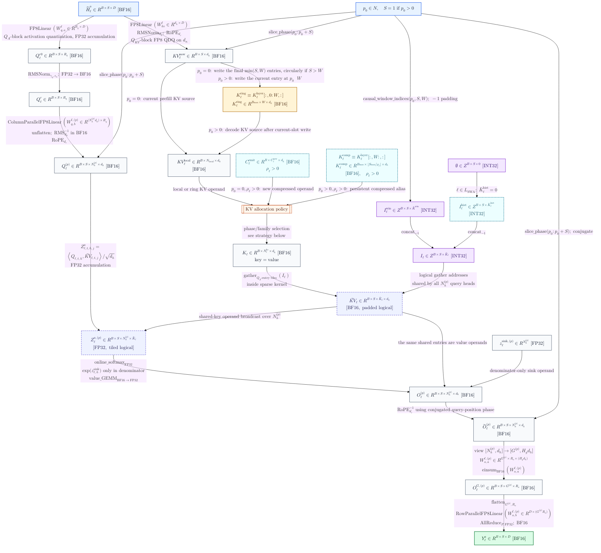

#### KV Allocation Strategy

$$
\mathbf{KV}_{\ell}^{\mathrm{bank}} =
\begin{cases}
\mathbf{KV}^{\mathrm{local}}_{\ell}, & p_0 = 0,\ \rho_\ell = 0 \\
\operatorname{concat}(\mathbf{KV}^{\mathrm{local}}_{\ell},\ \mathbf{C}_{\ell}^{\mathrm{emit}}), & p_0 = 0,\ \rho_\ell > 0 \\
\mathcal{K}_{\ell}^{\mathrm{ring}}, & p_0 > 0,\ \rho_\ell = 0 \\
\operatorname{select}\left(\mathcal{K}_{\ell}^{\mathrm{layer}}\right), & p_0 > 0,\ \rho_\ell > 0 \end{cases} \tag{1}
$$

In compressed decode, the ring and compressed regions are alias slices of one existing contiguous
layer allocation; selecting the bank performs no concatenation or copy.

### CSA compressed-history and lightning-indexer paths

Applies only when $\ell\in\mathcal L_{\mathrm{CSA}}$.

#### CSA attention-compressor path

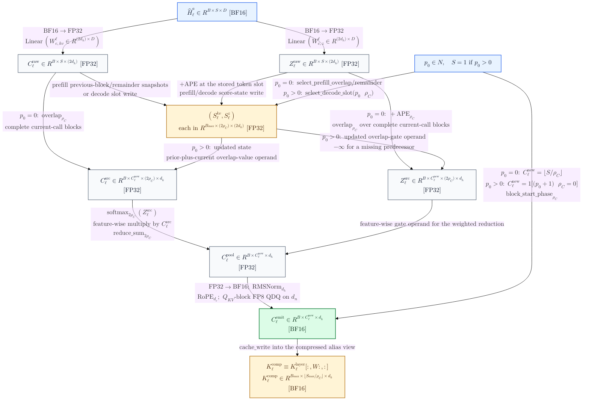

#### CSA lightning-indexer path

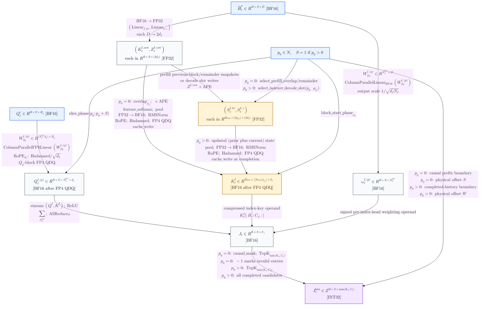

Cross-diagram interfaces (semantic identity, not a copy or runtime edge):
$\texttt{C\_QR}\equiv\texttt{A\_QR}$,
$\texttt{C\_CEMIT}\equiv\texttt{A\_CEMIT}$,
$\texttt{C\_CCACHE}\equiv\texttt{A\_CCACHE}$, and
$\texttt{C\_IHIST}\equiv\texttt{A\_IHIST}$.

### HCA compressed-history path

Applies only when $\ell\in\mathcal L_{\mathrm{HCA}}$. Each of its value and gate projections emits one $d_h$-wide branch;
Compared to CSA, it has no overlap transform, no lightning indexer, and deterministically enumerates every causally visible completed compressed block.

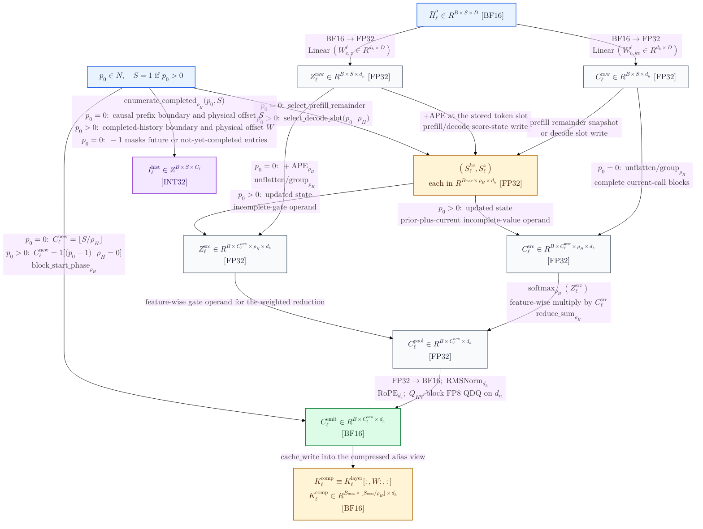

Cross-diagram interfaces (ditto):
$\texttt{H\_CEMIT}\equiv\texttt{A\_CEMIT}$,
$\texttt{H\_CCACHE}\equiv\texttt{A\_CCACHE}$, and
$\texttt{H\_IHIST}\equiv\texttt{A\_IHIST}$.

### MoE-side mHC and DeepSeekMoE

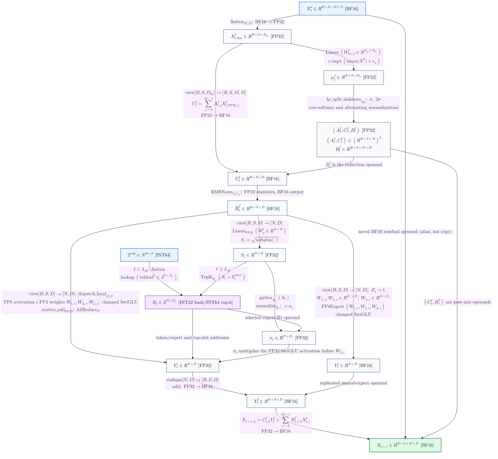

## Final reduction, LM head, and main return

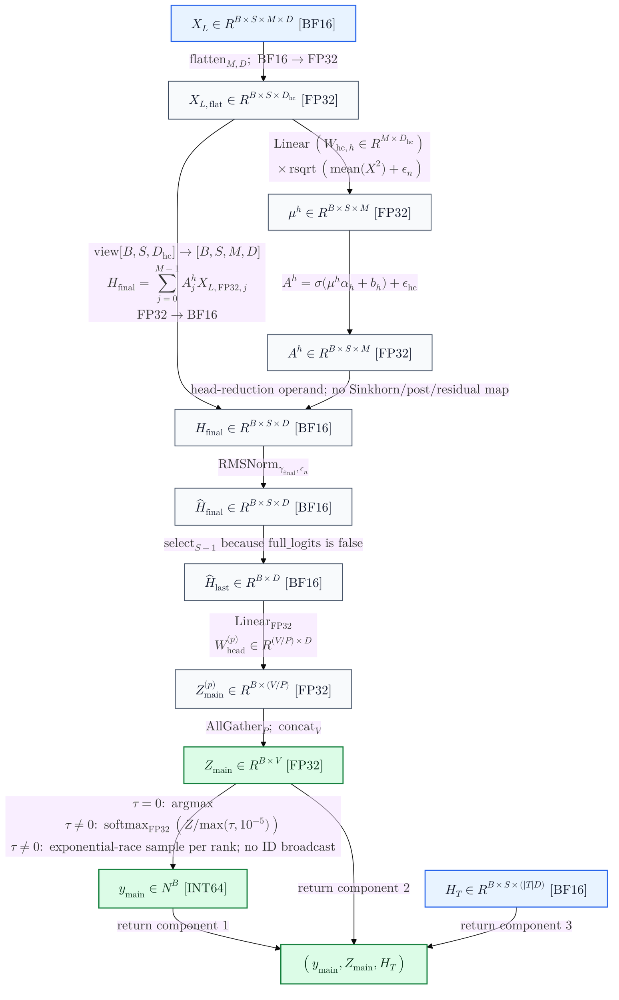

## Separate DSpark forward_spec API

DSpark block's internal dataflow.
`forward_spec` is separately callable, not an unconditional tail of `Transformer.forward`.

This is not a part of the original paper and appears to be a state-of-the-art frontier ongoing research work, so I'll skip here.

```mermaid
%%{init: {"theme": "base", "flowchart": {"htmlLabels": true, "curve": "basis", "nodeSpacing": 24, "rankSpacing": 36}}}%%
flowchart TD
    POS["$$p_0\in\mathbb N,\quad S=1\ \mathrm{if}\ p_0>0$$"]
    TAP["$$\mathbf H_{\mathcal T}\in\mathbb R^{B\times S\times(|\mathcal T|D)}\;[\mathrm{BF16}]$$"]
    YMAIN["$$\mathbf y_{\mathrm{main}}\in\mathbb N^{B}\;[\mathrm{INT64}]$$"]

    DSID["$$\begin{gathered} \mathbf T_D=[\mathbf y_{\mathrm{main}},t_{\mathrm{noise}},\ldots,t_{\mathrm{noise}}] \\\\ \mathbf T_D\in\mathbb N^{B\times K_D}\;[\mathrm{INT64}] \end{gathered}$$"]
    MAINX["$$\mathbf H_D^{\mathrm{main}}\in\mathbb R^{B\times S_m\times D}\;[\mathrm{BF16}]$$"]
    DX0["$$\mathbf X^D_0\in\mathbb R^{B\times K_D\times M\times D}\;[\mathrm{BF16}]$$"]
    DKCACHE["$$\begin{gathered} \left\{\mathcal K^{D,\mathrm{main}}_j\right\}_{j=0}^{L_D-1} \\\\ \mathcal K^{D,\mathrm{main}}_j\in\mathbb R^{B_{\max}\times W\times d_h}\;[\mathrm{BF16}] \end{gathered}$$"]
    NULLRET["$$\varnothing\quad\text{(forward\_spec prefill return)}$$"]

    TAP -.->|"$$\begin{gathered} \operatorname{FP8Linear}\!\left(W_D^{\mathrm{main}}\in\mathbb R^{D\times(|\mathcal T|D)}\right) \\\\ \operatorname{RMSNorm} \end{gathered}$$"| MAINX
    YMAIN -.->|"$$\begin{gathered} \operatorname{fill}_{K_D}(t_{\mathrm{noise}}) \\\\ \mathbf T_D[:,0]=\mathbf y_{\mathrm{main}} \end{gathered}$$"| DSID
    DSID -->|"$$\begin{gathered} \operatorname{shared\ EmbedShard}_{P} \\\\ \operatorname{AllReduce}_{P};\ \operatorname{repeat}_{M} \end{gathered}$$"| DX0
    MAINX -->|"$$\begin{gathered} \forall j\lt L_D:\ \operatorname{FP8Linear}(W_{kv}^{D,j}) \\\\ \operatorname{RMSNorm};\ \operatorname{RoPE}_{d_r,\theta_{\mathrm{local}}} \\\\ \mathrm{FP8\ QDQ};\ \operatorname{ring\_write} \end{gathered}$$"| DKCACHE
    POS -->|"$$\operatorname{main\ phase\ slice}(p_0:p_0+S_m)$$"| DKCACHE
    DX0 -->|"$$p_0=0:\ \text{all DSpark blocks bypass mHC, draft attention, and MoE}$$"| NULLRET
    DKCACHE -->|"$$p_0=0:\ \text{cache side effect only}$$"| NULLRET

    DXJ["$$\begin{gathered} \mathbf X^D_j\in\mathbb R^{B\times K_D\times M\times D}\;[\mathrm{BF16}] \\\\ 0\leq j\lt L_D \end{gathered}$$"]
    DUA["$$\widehat{\mathbf H}^{D,a}_j\in\mathbb R^{B\times K_D\times D}\;[\mathrm{BF16}]$$"]
    DQ["$$\mathbf Q^{D,(p)}_j\in\mathbb R^{B\times K_D\times N_h^{(p)}\times d_h}\;[\mathrm{BF16}]$$"]
    DKV["$$\mathbf{KV}^{D,\mathrm{draft}}_j\in\mathbb R^{B\times K_D\times d_h}\;[\mathrm{BF16}]$$"]
    DBANK["$$\mathcal K^D_j\in\mathbb R^{B\times(W+K_D)\times d_h}\;[\mathrm{BF16}]$$"]
    DI["$$\mathbf I^D_j\in\mathbb Z^{B\times K_D\times(\min(W,p_0+1)+K_D)}\;[\mathrm{INT32}]$$"]
    DO["$$\mathbf O^{D,(p)}_j\in\mathbb R^{B\times K_D\times N_h^{(p)}\times d_h}\;[\mathrm{BF16}]$$"]
    DYA["$$\mathbf Y^{D,a}_j\in\mathbb R^{B\times K_D\times D}\;[\mathrm{BF16}]$$"]
    DXA["$$\mathbf X^{D,a}_j\in\mathbb R^{B\times K_D\times M\times D}\;[\mathrm{BF16}]$$"]
    DUF["$$\widehat{\mathbf H}^{D,f}_j\in\mathbb R^{B\times K_D\times D}\;[\mathrm{BF16}]$$"]
    DYF["$$\mathbf Y^{D,f}_j\in\mathbb R^{B\times K_D\times D}\;[\mathrm{BF16}]$$"]
    DXNEXT["$$\mathbf X^D_{j+1}\in\mathbb R^{B\times K_D\times M\times D}\;[\mathrm{BF16}]$$"]
    DXEND["$$\mathbf X^D_{L_D}\in\mathbb R^{B\times K_D\times M\times D}\;[\mathrm{BF16}]$$"]

    DX0 -->|"$$p_0>0:\ j=0$$"| DXJ
    DXJ -->|"$$\begin{gathered} \text{same FP32 map generation as the main block} \\\\ \operatorname{mHCpre}^{a}_{j} \\\\ \operatorname{RMSNorm} \end{gathered}$$"| DUA
    DUA -->|"$$\begin{gathered} \operatorname{FP8Linear}_{q,a};\ \operatorname{RMSNorm}_{R_q} \\\\ \operatorname{FP8Linear}_{q,b};\ \operatorname{head\ RMS}^{-1}_{\mathrm{BF16}} \\\\ \operatorname{RoPE}_{d_r}\text{ at }p_0+S_m,\ldots,p_0+S_m+K_D-1 \end{gathered}$$"| DQ
    POS -->|"$$\operatorname{draft\ phase\ slice}(p_0+S_m:p_0+S_m+K_D)$$"| DQ
    DUA -->|"$$\begin{gathered} \operatorname{FP8Linear}_{kv};\ \operatorname{RMSNorm} \\\\ \operatorname{RoPE}_{d_r};\ \mathrm{FP8\ QDQ} \end{gathered}$$"| DKV
    POS -->|"$$\operatorname{draft\ phase\ slice}(p_0+S_m:p_0+S_m+K_D)$$"| DKV
    DKCACHE -->|"$$\operatorname{concat}_{1}\ \text{with current draft KV}$$"| DBANK
    DKV -->|"$$\operatorname{concat}_{1}\ \text{after the }W\text{-slot main ring}$$"| DBANK
    POS -->|"$$\begin{gathered} [0,\ldots,\min(W,p_0+1)-1] \\\\ {}\Vert\ [W,\ldots,W+K_D-1]\ \text{for every draft query} \end{gathered}$$"| DI
    DQ -->|"$$\begin{gathered} \operatorname{sparse\_attn}\!\left(\mathcal K^D_j,\mathbf I^D_j,\mathbf z_j^{\mathrm{sink}}\right) \\\\ \text{all }K_D\text{ draft entries are mutually visible} \end{gathered}$$"| DO
    DBANK -->|"$$\text{shared key/value operand}$$"| DO
    DI -->|"$$\text{gather-address operand}$$"| DO
    DO -->|"$$\begin{gathered} \operatorname{RoPE}^{-1}_{d_r};\ \operatorname{grouped}\ W_{o,a}^{D,j} \\\\ \operatorname{RowParallelFP8Linear}\ W_{o,b}^{D,j} \\\\ \operatorname{AllReduce}_{P} \end{gathered}$$"| DYA
    DXJ -->|"$$\operatorname{mHCpost}^{a}_{j}\!\left(\mathbf Y^{D,a}_j,\mathbf X^D_j\right)$$"| DXA
    DYA -->|"$$\text{attention-result operand}$$"| DXA
    DXA -->|"$$\operatorname{mHCpre}^{f}_{j};\ \operatorname{RMSNorm}$$"| DUF
    DUF -->|"$$\begin{gathered} \operatorname{DeepSeekMoE}_{E,E_a,E_s,D_e}\ \text{with learned routing} \\\\ \operatorname{AllReduce}_{P} \end{gathered}$$"| DYF
    DXA -->|"$$\operatorname{mHCpost}^{f}_{j}\!\left(\mathbf Y^{D,f}_j,\mathbf X^{D,a}_j\right)$$"| DXNEXT
    DYF -->|"$$\text{MoE-result operand}$$"| DXNEXT
    DXNEXT -->|"$$j+1\lt L_D:\ \text{next DSpark stage}$$"| DXJ
    DXNEXT -->|"$$j=L_D-1:\ \text{exit refinement stack}$$"| DXEND

    DH["$$\mathbf H_D\in\mathbb R^{B\times K_D\times D}\;[\mathrm{BF16}]$$"]
    ZDBASE["$$\mathbf Z_D^{\mathrm{base}}\in\mathbb R^{B\times K_D\times V}\;[\mathrm{FP32}]$$"]
    DPREFIX["$$\begin{gathered} \mathbf d_{0:i}\in\mathbb N^{B\times(i+1)}\;[\mathrm{INT64}] \\\\ \mathbf d_0=\mathbf y_{\mathrm{main}} \end{gathered}$$"]
    MEMB["$$\mathbf E_D^M\in\mathbb R^{B\times K_D\times R_M}\;[\mathrm{BF16}]$$"]
    MBIAS["$$\begin{gathered} \mathbf Z_{D,i}^M\in\mathbb R^{B\times V}\;[\mathrm{FP32}] \\\\ 0\leq i\lt K_D \end{gathered}$$"]
    ZD["$$\begin{gathered} \mathbf Z_D=\mathbf Z_D^{\mathrm{base}}+\mathbf Z_D^M \\\\ \mathbf Z_D\in\mathbb R^{B\times K_D\times V}\;[\mathrm{FP32}] \end{gathered}$$"]
    DOUT["$$\mathbf y_D=[\mathbf d_0,\ldots,\mathbf d_{K_D}]\in\mathbb N^{B\times(K_D+1)}\;[\mathrm{INT64}]$$"]
    CONF["$$\mathbf c_D\in\mathbb R^{B\times K_D}\;[\mathrm{FP32,\ raw}]$$"]
    RETSPEC["$$\left(\mathbf y_D,\mathbf Z_D,\mathbf c_D\right)$$"]

    DXEND -->|"$$\operatorname{mHChead};\ \mathrm{FP32}\to\mathrm{BF16}$$"| DH
    DH -->|"$$\begin{gathered} \operatorname{RMSNorm} \\\\ \operatorname{shared\ ParallelHead}_{P}\!\left(W_{\mathrm{head}}^{(p)}\right)\ \text{with full logits} \\\\ \operatorname{AllGather}_{P} \end{gathered}$$"| ZDBASE
    YMAIN -->|"$$\mathbf d_0=\mathbf y_{\mathrm{main}}$$"| DPREFIX
    DPREFIX -->|"$$\begin{gathered} \forall i\lt K_D \\\\ \operatorname{MarkovEmbedShard}_{P}\!\left(W_{M,1}^{(p)}\in\mathbb R^{(V/P)\times R_M}\right) \\\\ \operatorname{AllReduce}_{P} \end{gathered}$$"| MEMB
    MEMB -->|"$$\begin{gathered} \operatorname{select}_{i} \\\\ \operatorname{MarkovHeadShard}_{P}\!\left(W_{M,2}^{(p)}\in\mathbb R^{(V/P)\times R_M}\right) \\\\ \operatorname{AllGather}_{P} \end{gathered}$$"| MBIAS
    ZDBASE -->|"$$\begin{gathered} \mathbf Z_D\leftarrow\mathbf Z_D^{\mathrm{base}} \\\\ \text{same mutable tensor before sequential position updates} \end{gathered}$$"| ZD
    MBIAS -->|"$$\begin{gathered} \operatorname{add\_inplace}\ \mathbf Z_D[:,i,:]\mathrel{+}=\mathbf Z_{D,i}^M \\\\ \text{before sampling step }i \end{gathered}$$"| ZD
    ZD -->|"$$\begin{gathered} \forall i\lt K_D,\ \tau=0:\ \arg\max \\\\ \forall i\lt K_D,\ \tau\neq0:\ \operatorname{softmax}\!\left(\mathbf Z_{D,:,i,:}/\max(\tau,10^{-5})\right) \\\\ \forall i\lt K_D,\ \tau\neq0:\ \text{exponential race per rank; no ID broadcast} \end{gathered}$$"| DOUT
    DOUT -->|"$$i+1\lt K_D:\ \text{next Markov-conditioning token}$$"| DPREFIX
    DH -->|"$$\begin{gathered} \operatorname{concat}_{D,R_M}\!\left(\mathbf H_D,\mathbf E_D^M\right) \\\\ \operatorname{Linear}_{\mathrm{FP32}}\!\left(W_c\in\mathbb R^{1\times(D+R_M)}\right) \end{gathered}$$"| CONF
    MEMB -->|"$$\text{confidence-conditioning operand}$$"| CONF
    DOUT -->|"$$\text{return component }1$$"| RETSPEC
    ZD -->|"$$\text{return component }2$$"| RETSPEC
    CONF -->|"$$\text{return component }3$$"| RETSPEC

    classDef input fill:#e8f3ff,stroke:#2563eb,color:#0f172a,stroke-width:1.5px;
    classDef data fill:#f8fafc,stroke:#475569,color:#0f172a,stroke-width:1.2px;
    classDef cache fill:#fff4d6,stroke:#b7791f,color:#422006,stroke-width:1.6px;
    classDef index fill:#f3e8ff,stroke:#7e22ce,color:#2e1065,stroke-width:1.3px;
    classDef output fill:#dcfce7,stroke:#15803d,color:#052e16,stroke-width:1.7px;
    class POS,TAP,YMAIN input;
    class DSID,MAINX,DX0,DXJ,DUA,DQ,DKV,DBANK,DO,DYA,DXA,DUF,DYF,DXNEXT,DXEND,DH,ZDBASE,DPREFIX,MEMB,MBIAS data;
    class DKCACHE cache;
    class DI index;
    class NULLRET,ZD,DOUT,CONF,RETSPEC output;
```
