# DeepSeek-V4-Flash Attention Dataflow

This specification covers the main decoder attention sublayer, from the expanded
residual input $\mathbf X_\ell$ through mHC ingress, SWA/CSA/HCA attention, and the post-attention
residual $\mathbf X_\ell^a$. All numerical specializations use [config-Flash-0731.json](../inference/config-Flash-0731.json);

> Note: the repository's [inference/config.json](../inference/config.json)
> selects [**Pro**](https://huggingface.co/deepseek-ai/DeepSeek-V4-Pro-0813), with different dimensions;
> nonetheless the [**Flash**](https://huggingface.co/deepseek-ai/DeepSeek-V4-Flash-0731) has almost the same architecture.

The [DeepSeek-V4 paper](../2606.19348v1.pdf), §§2.2–2.3, Figures 2–4, Equations (1)–(27),
§3.5/Figure 6, §4.2.1, and §5.2.1 supplies the architectural cross-check.
Executable details follow [model.py](../inference/model.py), [kernel.py](../inference/kernel.py), and
[convert.py](../inference/convert.py).

> The distinction is stated explicitly beside its first relevant graph
> where the paper describes a production optimization or omits a detail.

## Contracts

- In A–H, rectangular nodes are tensors, views, index state, or persistent buffers. Solid edges
  carry primitive operations; multiple input edges with the **same operation ID** belong to one
  operation. Dashed edges bind ports or express control/alias dependencies without tensor work.
- `inline Pn` references a reusable expansion in B a.k.a. **Kernels** or **Primitives**.
- _Blue_ marks inputs, _green_ outputs, _amber_ persistent state/weights, _purple_ indices, and dashed
  indigo logical on-chip tiles. These tiles do not imply full global gather/logit allocations.
  The indexer in F0 does materialize scores in the reference.
- The overview graphs below use rounded graph-call nodes and solid **port bindings**.
  Definitions and stored weight layouts appear beside the detailed graph that first uses them.
  Links to referenced graphs sit below each diagram.
- _Sequence length_ $n$, _hidden width_ $d$, _head width_ $c$, _latent widths_ $d_c,d_g$,
  _head count_ $n_h$, _compression rates_ $m,m'$, and _window_ $n_{\mathrm{win}}$.
  Batch, rank, phase, and storage annotations extend the paper. All slices are zero-based and
  half-open. Stored matrix symbols use $[\mathrm{out},\mathrm{in}]$: the transpose of the paper's
  corresponding right-multiplying matrix, without an extra runtime transpose.
- **Prefill means $p_0 = 0$, $n \ge 1$; the nonzero-position path requires $p_0 > 0$, $n = 1$.**
  Cache operations use active batch rows `:B`, and views retain parent strides. Initialization,
  request-slot reuse, and numerical requirements in [J](#runtime-contract) are part of the contract.

## Overview

Select one family per layer: [CSA](#overview-csa), [HCA](#overview-hca), or [SWA](#overview-swa).
Each rounded node expands into its referenced detailed graph; rectangular nodes retain the
intermediate tensor and cache ports. The shared local-window branch runs in every family.
Solid edges bind tensor ports; dashed cache edges express an alias/state dependency.

### CSA layer

The lightning-indexer group takes the shared query latent $\mathbf C_\ell^Q$ and its own
compressed-key cache $\mathcal K_\ell^I$, then produces the selected main-bank addresses
$\mathbf{Idx}_\ell^{\mathrm{CSA}}$. Its scores $\mathbf I_\ell$ are distinct from these integer
addresses. Main compression uses $c_\star=c=512$; index compression uses $c_\star=c_I=128$,
with separate parameters and state. See [C](#c), [E](#e), and [F0](#f0) for their definitions.

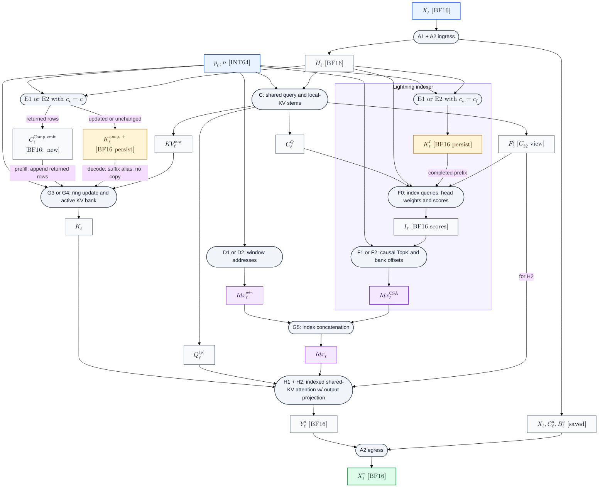
```mermaid
%%{init: {"theme": "base", "flowchart": {"htmlLabels": true, "curve": "basis", "nodeSpacing": 24, "rankSpacing": 34}}}%%
flowchart TD
    I1_X["$$\mathbf X_{\ell}\;[\mathrm{BF16}]$$"]
    I1_PHASE["$$p_0,n\;[\mathrm{INT64}]$$"]
    I1_MHC(["A1 + A2 ingress"])
    I1_H["$$\mathbf H_{\ell}\;[\mathrm{BF16}]$$"]
    I1_SAVE["$$\mathbf X_{\ell},\mathbf C_{\ell}^{a},\mathbf B_{\ell}^{a}\;[\mathrm{saved}]$$"]
    I1_C(["C: shared query and local-KV stems"])
    I1_Q["$$\mathbf Q_{\ell}^{(p)}$$"]
    I1_QR["$$\mathbf C_{\ell}^{Q}$$"]
    I1_FQ["$$\mathbf F_{\ell}^{q}\;[\mathbb{C}_{32} \text{ view}]$$"]
    I1_KVN["$$\mathbf{KV}_{\ell}^{\mathrm{now}}$$"]
    I1_D(["D1 or D2: window addresses"])
    I1_IW["$$\mathbf{Idx}_{\ell}^{\mathrm{win}}$$"]
    subgraph I1_INDEXER["Lightning indexer"]
        direction TD
        I1_EI(["$$\text{E1 or E2 with}\ c_{\star}=c_I$$"])
        I1_KI["$$\mathcal K_{\ell}^{I}\;[\mathrm{BF16\ persist}]$$"]
        I1_F0(["F0: index queries, head weights and scores"])
        I1_J["$$\mathbf I_{\ell}\;[\mathrm{BF16\ scores}]$$"]
        I1_FK(["F1 or F2: causal TopK and bank offsets"])
        I1_IH["$$\mathbf{Idx}_{\ell}^{\mathrm{CSA}}$$"]
    end
    I1_EM(["$$\text{E1 or E2 with}\ c_{\star}=c$$"])
    I1_CE["$$\begin{gathered} \mathbf C_{\ell}^{\mathrm{Comp,emit}} \\\\ [\mathrm{BF16};\ \text{new}] \end{gathered}$$"]
    I1_COMP["$$\begin{gathered} \mathcal K_{\ell}^{\mathrm{comp},+} \\\\ [\mathrm{BF16\ persist}] \end{gathered}$$"]
    I1_BANK(["G3 or G4: ring update and active KV bank"])
    I1_K["$$\mathcal K_{\ell}$$"]
    I1_G5(["G5: index concatenation"])
    I1_I["$$\mathbf{Idx}_{\ell}$$"]
    I1_ATT(["H1 + H2: indexed shared-KV attention w/ output projection"])
    I1_Y["$$\mathbf Y_{\ell}^{a}\;[\mathrm{BF16}]$$"]
    I1_POST(["A2 egress"])
    I1_OUT["$$\mathbf X_{\ell}^{a}\;[\mathrm{BF16}]$$"]

    I1_X --> I1_MHC
    I1_MHC --> I1_H
    I1_MHC --> I1_SAVE
    I1_PHASE --> I1_C
    I1_H --> I1_C
    I1_C --> I1_Q
    I1_C --> I1_QR
    I1_C --> I1_FQ
    I1_C --> I1_KVN

    I1_PHASE --> I1_D
    I1_D --> I1_IW
    I1_PHASE --> I1_EI
    I1_EI --> I1_KI
    I1_QR --> I1_F0
    I1_H --> I1_F0
    I1_H --> I1_EI
    I1_KI -->|"completed prefix"| I1_F0
    I1_FQ --> I1_F0
    I1_F0 --> I1_J
    I1_PHASE --> I1_FK
    I1_J --> I1_FK
    I1_FK --> I1_IH

    I1_PHASE --> I1_EM
    I1_H --> I1_EM
    I1_EM -->|"returned rows"| I1_CE
    I1_EM -->|"updated or unchanged"| I1_COMP
    I1_PHASE --> I1_BANK
    I1_CE -->|"prefill: append returned rows"| I1_BANK
    I1_COMP -.->|"decode: suffix alias, no copy"| I1_BANK
    I1_KVN --> I1_BANK
    I1_BANK --> I1_K
    I1_IW --> I1_G5
    I1_IH --> I1_G5
    I1_G5 --> I1_I

    I1_K --> I1_ATT
    I1_Q --> I1_ATT
    I1_I --> I1_ATT
    I1_FQ -->|"for H2"| I1_ATT
    I1_ATT --> I1_Y
    I1_Y --> I1_POST
    I1_SAVE --> I1_POST
    I1_POST --> I1_OUT

    classDef input fill:#e8f3ff,stroke:#2563eb,color:#0f172a,stroke-width:1.5px;
    classDef stage fill:#f1f5f9,stroke:#334155,color:#0f172a,stroke-width:1.3px;
    classDef data fill:#f8fafc,stroke:#475569,color:#0f172a,stroke-width:1.05px;
    classDef cache fill:#fff4d6,stroke:#b7791f,color:#422006,stroke-width:1.4px;
    classDef index fill:#f3e8ff,stroke:#7e22ce,color:#2e1065,stroke-width:1.3px;
    classDef output fill:#dcfce7,stroke:#15803d,color:#052e16,stroke-width:1.7px;
    class I1_X,I1_PHASE input;
    class I1_MHC,I1_C,I1_D,I1_EI,I1_F0,I1_FK,I1_EM,I1_BANK,I1_G5,I1_ATT,I1_POST stage;
    class I1_H,I1_SAVE,I1_Q,I1_QR,I1_FQ,I1_KVN,I1_J,I1_Y data;
    class I1_KI,I1_COMP cache;
    class I1_CE,I1_K data;
    class I1_IW,I1_IH,I1_I index;
    class I1_OUT output;
    style I1_INDEXER fill:#f5f3ff,stroke:#a78bfa,stroke-width:1.2px;
```

Subgraphs: [A1 maps](#a1), [A2 ingress/egress](#a2), [C stems](#c),
[D1](#d1) / [D2](#d2), [E1](#e1) / [E2](#e2), [F0 scores](#f0),
[F1](#f1) / [F2](#f2), [G3](#g3) / [G4](#g4), [G5](#g5),
[H1 attention](#h1), [H2 output](#h2).

**Emitted rows, persistent cache, and active bank are separate ports.** The following applies
to both CSA and HCA; all three use BF16 storage in this reference. The selected compression
rate is $m_\ell=m=4$ for CSA or $m_\ell=m'=128$ for HCA.

| Port                                  | Lifetime and role                                                                                                                                                                                                                                                                                                                                                      |
| ------------------------------------- | ---------------------------------------------------------------------------------------------------------------------------------------------------------------------------------------------------------------------------------------------------------------------------------------------------------------------------------------------------------------------- |
| $\mathbf C_\ell^{\mathrm{Comp,emit}}$ | Newly completed main-compressor rows returned by this call, shape $[B,n_\ell^{\mathrm{new}},c]$. Prefill returns $\lfloor n/m_\ell\rfloor$ rows when nonzero; decode returns one row only at a block boundary. With no completed block, the return is `None`, so this port is absent.                                                                                  |
| $\mathcal K_\ell^{\mathrm{comp},+}$   | Persistent **main** compressed-cache suffix after the call: $\mathcal K_\ell^{\mathrm{layer}}[:,n_{\mathrm{win}}:,:]$. The compressor writes each emitted row into its block slot. With no emission, this suffix is unchanged; earlier completed rows remain available. The $+$ marks post-state, not an additional tensor or concatenation.                           |
| $\mathcal K_\ell$                     | Bank passed to H1. **Prefill:** current-call $\mathbf{KV}_\ell^{\mathrm{now}}$ concatenated with returned $\mathbf C_\ell^{\mathrm{Comp,emit}}$, or current KV alone when the return is `None`. **Decode:** an active-batch view of the persistent layer allocation, containing the local ring and compressed suffix; the returned emission is not concatenated again. |

The two compressor output arrows expose its returned rows and its cache side effect; they
do not request two compression runs. The **index** cache $\mathcal K_\ell^I$ is independent:
F0 reads its completed prefix after index compression, and selected block IDs address the
corresponding rows of the **main** bank. During decode the bank includes unused capacity;
only valid addresses make completed rows readable.
Ref: [Compressor](../inference/model.py#L285-L383),
[Indexer](../inference/model.py#L408-L439), [bank assembly](../inference/model.py#L521-L538);
detailed ports in [E1-C](#e1-c), [E2-C](#e2-c), [G3](#g3), and [G4](#g4).

### HCA layer

HCA uses deterministic addresses for all causally visible completed blocks. Its emission and
cache ports have the same meanings as the [table above](#overview-compressed-ports), with
compression rate $m'=128$ and main width $c=512$.

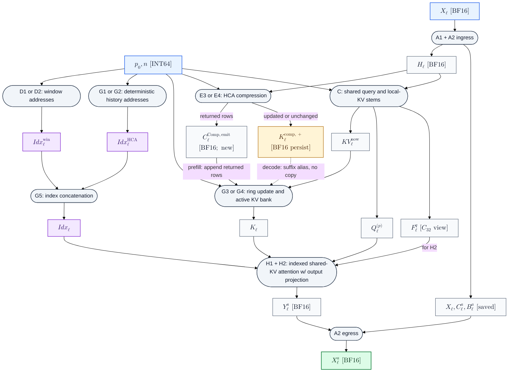
```mermaid
%%{init: {"theme": "base", "flowchart": {"htmlLabels": true, "curve": "basis", "nodeSpacing": 24, "rankSpacing": 34}}}%%
flowchart TD
    I2_X["$$\mathbf X_{\ell}\;[\mathrm{BF16}]$$"]
    I2_PHASE["$$p_0,n\;[\mathrm{INT64}]$$"]
    I2_MHC(["A1 + A2 ingress"])
    I2_H["$$\mathbf H_{\ell}\;[\mathrm{BF16}]$$"]
    I2_SAVE["$$\mathbf X_{\ell},\mathbf C_{\ell}^{a},\mathbf B_{\ell}^{a}\;[\mathrm{saved}]$$"]
    I2_C(["C: shared query and local-KV stems"])
    I2_Q["$$\mathbf Q_{\ell}^{(p)}$$"]
    I2_FQ["$$\mathbf F_{\ell}^{q}\;[\mathbb{C}_{32} \text{ view}]$$"]
    I2_KVN["$$\mathbf{KV}_{\ell}^{\mathrm{now}}$$"]
    I2_D(["D1 or D2: window addresses"])
    I2_E(["E3 or E4: HCA compression"])
    I2_IW["$$\mathbf{Idx}_{\ell}^{\mathrm{win}}$$"]
    I2_CE["$$\begin{gathered} \mathbf C_{\ell}^{\mathrm{Comp,emit}} \\\\ [\mathrm{BF16};\ \text{new}] \end{gathered}$$"]
    I2_COMP["$$\begin{gathered} \mathcal K_{\ell}^{\mathrm{comp},+} \\\\ [\mathrm{BF16\ persist}] \end{gathered}$$"]
    I2_GH(["G1 or G2: deterministic history addresses"])
    I2_IH["$$\mathbf{Idx}_{\ell}^{\mathrm{HCA}}$$"]
    I2_BANK(["G3 or G4: ring update and active KV bank"])
    I2_K["$$\mathcal K_{\ell}$$"]
    I2_G5(["G5: index concatenation"])
    I2_I["$$\mathbf{Idx}_{\ell}$$"]
    I2_ATT(["H1 + H2: indexed shared-KV attention w/ output projection"])
    I2_Y["$$\mathbf Y_{\ell}^{a}\;[\mathrm{BF16}]$$"]
    I2_POST(["A2 egress"])
    I2_OUT["$$\mathbf X_{\ell}^{a}\;[\mathrm{BF16}]$$"]

    I2_PHASE --> I2_D
    I2_D --> I2_IW
    I2_H --> I2_E
    I2_PHASE --> I2_GH
    I2_PHASE --> I2_BANK
    I2_PHASE --> I2_E
    I2_E -->|"returned rows"| I2_CE
    I2_E -->|"updated or unchanged"| I2_COMP
    I2_GH --> I2_IH
    I2_KVN --> I2_BANK
    I2_CE -->|"prefill: append returned rows"| I2_BANK
    I2_COMP -.->|"decode: suffix alias, no copy"| I2_BANK
    I2_BANK --> I2_K
    I2_IW --> I2_G5
    I2_IH --> I2_G5
    I2_G5 --> I2_I

    I2_X --> I2_MHC
    I2_MHC --> I2_H
    I2_MHC --> I2_SAVE
    I2_H --> I2_C
    I2_PHASE --> I2_C
    I2_C --> I2_KVN
    I2_C --> I2_Q
    I2_C --> I2_FQ

    I2_Q --> I2_ATT
    I2_K --> I2_ATT
    I2_I --> I2_ATT
    I2_FQ -->|"for H2"| I2_ATT
    I2_ATT --> I2_Y
    I2_Y --> I2_POST
    I2_SAVE --> I2_POST
    I2_POST --> I2_OUT

    classDef input fill:#e8f3ff,stroke:#2563eb,color:#0f172a,stroke-width:1.5px;
    classDef stage fill:#f1f5f9,stroke:#334155,color:#0f172a,stroke-width:1.3px;
    classDef data fill:#f8fafc,stroke:#475569,color:#0f172a,stroke-width:1.05px;
    classDef cache fill:#fff4d6,stroke:#b7791f,color:#422006,stroke-width:1.4px;
    classDef index fill:#f3e8ff,stroke:#7e22ce,color:#2e1065,stroke-width:1.3px;
    classDef output fill:#dcfce7,stroke:#15803d,color:#052e16,stroke-width:1.7px;
    class I2_X,I2_PHASE input;
    class I2_MHC,I2_C,I2_D,I2_E,I2_GH,I2_BANK,I2_G5,I2_ATT,I2_POST stage;
    class I2_H,I2_SAVE,I2_Q,I2_FQ,I2_KVN,I2_Y data;
    class I2_COMP cache;
    class I2_CE,I2_K data;
    class I2_IW,I2_IH,I2_I index;
    class I2_OUT output;
```

Subgraphs: [A1 maps](#a1), [A2 ingress/egress](#a2), [C stems](#c),
[D1](#d1) / [D2](#d2), [E3](#e3) / [E4](#e4), [G1](#g1) / [G2](#g2),
[G3](#g3) / [G4](#g4), [G5](#g5), [H1 attention](#h1), [H2 output](#h2).

### SWA layer

G3/G4 receive no compressed port, and G5 retains the window addresses directly.
Prefill attends through the full current-call KV tensor with causal-window addresses;
decode reads the persistent local ring. Ref: [Attention::forward](../inference/model.py#L490-L548).

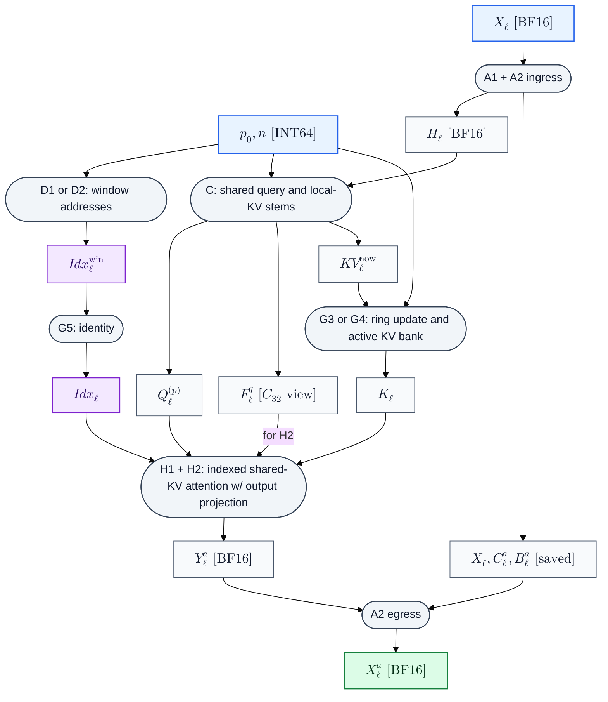
```mermaid
%%{init: {"theme": "base", "flowchart": {"htmlLabels": true, "curve": "basis", "nodeSpacing": 24, "rankSpacing": 34}}}%%
flowchart TD
    I0_X["$$\mathbf X_{\ell}\;[\mathrm{BF16}]$$"]
    I0_PHASE["$$p_0,n\;[\mathrm{INT64}]$$"]
    I0_MHC(["A1 + A2 ingress"])
    I0_H["$$\mathbf H_{\ell}\;[\mathrm{BF16}]$$"]
    I0_SAVE["$$\mathbf X_{\ell},\mathbf C_{\ell}^{a},\mathbf B_{\ell}^{a}\;[\mathrm{saved}]$$"]
    I0_C(["C: shared query and local-KV stems"])
    I0_Q["$$\mathbf Q_{\ell}^{(p)}$$"]
    I0_FQ["$$\mathbf F_{\ell}^{q}\;[\mathbb{C}_{32} \text{ view}]$$"]
    I0_KVN["$$\mathbf{KV}_{\ell}^{\mathrm{now}}$$"]
    I0_D(["D1 or D2: window addresses"])
    I0_IW["$$\mathbf{Idx}_{\ell}^{\mathrm{win}}$$"]
    I0_BANK(["G3 or G4: ring update and active KV bank"])
    I0_K["$$\mathcal K_{\ell}$$"]
    I0_G5(["G5: identity"])
    I0_I["$$\mathbf{Idx}_{\ell}$$"]
    I0_ATT(["H1 + H2: indexed shared-KV attention w/ output projection"])
    I0_Y["$$\mathbf Y_{\ell}^{a}\;[\mathrm{BF16}]$$"]
    I0_POST(["A2 egress"])
    I0_OUT["$$\mathbf X_{\ell}^{a}\;[\mathrm{BF16}]$$"]

    I0_X --> I0_MHC
    I0_MHC --> I0_H
    I0_MHC --> I0_SAVE
    I0_PHASE --> I0_D
    I0_H --> I0_C
    I0_PHASE --> I0_C
    I0_C --> I0_Q
    I0_C --> I0_FQ
    I0_C --> I0_KVN
    I0_D --> I0_IW
    I0_PHASE --> I0_BANK
    I0_KVN --> I0_BANK
    I0_BANK --> I0_K
    I0_IW --> I0_G5
    I0_G5 --> I0_I
    I0_Q --> I0_ATT
    I0_K --> I0_ATT
    I0_I --> I0_ATT
    I0_FQ -->|"for H2"| I0_ATT
    I0_ATT --> I0_Y
    I0_Y --> I0_POST
    I0_SAVE --> I0_POST
    I0_POST --> I0_OUT

    classDef input fill:#e8f3ff,stroke:#2563eb,color:#0f172a,stroke-width:1.5px;
    classDef stage fill:#f1f5f9,stroke:#334155,color:#0f172a,stroke-width:1.3px;
    classDef data fill:#f8fafc,stroke:#475569,color:#0f172a,stroke-width:1.05px;
    classDef index fill:#f3e8ff,stroke:#7e22ce,color:#2e1065,stroke-width:1.3px;
    classDef output fill:#dcfce7,stroke:#15803d,color:#052e16,stroke-width:1.7px;
    class I0_X,I0_PHASE input;
    class I0_MHC,I0_C,I0_D,I0_BANK,I0_G5,I0_ATT,I0_POST stage;
    class I0_H,I0_SAVE,I0_Q,I0_FQ,I0_KVN,I0_K,I0_Y data;
    class I0_IW,I0_I index;
    class I0_OUT output;
```

Subgraphs: [A1 maps](#a1), [A2 ingress/egress](#a2), [C stems](#c),
[D1](#d1) / [D2](#d2), [G3](#g3) / [G4](#g4), [G5 identity](#g5),
[H1 attention](#h1), [H2 output](#h2).

| Family / Flash main layers (zero-based)           | Detailed path                                                                                             |
| ------------------------------------------------- | --------------------------------------------------------------------------------------------------------- |
| SWA: 0, 1                    | A1 → A2 ingress → C → D1/D2 → G3/G4 without compression → G5 identity → H1/H2 → A2 egress                 |
| CSA: 2, 4, …, 42 (21 layers) | A1 → A2 ingress → C → D1/D2; E1/E2 main and index instances → F0 → F1/F2 → G3/G4 → G5 → H1/H2 → A2 egress |
| HCA: 3, 5, …, 41 (20 layers) | A1 → A2 ingress → C → D1/D2; E3/E4 → G1/G2 → G3/G4 → G5 → H1/H2 → A2 egress                               |

The arrows above show dependencies, not a mandatory order between independent branches. In the
Python CSA call, indexer compression/scoring/selection precedes the local-ring write and the main
compressor. Any NPU reordering must still finish each cache write before its same-call reader.
The 43 main-layer assignments match the Flash JSON and paper §4.2.1; later auxiliary-layer
entries in `compress_ratios` are outside this main-attention specification.

## A. Shared mHC attention wrapper

Implementation references: [model.py, lines 652-700](../inference/model.py#L652-L700) and
[kernel.py, lines 372-438](../inference/kernel.py#L372-L438).
For A21, bind the last $n_{\mathrm{hc}}^2$ bias entries as a row-major $[n_{\mathrm{hc}},n_{\mathrm{hc}}]$ parameter view.
The two matrix axes of $\mathbf B_\ell^a$ are source stream, destination stream.

### A1. Dynamic attention-map generation and constrained residual map

| Symbol / parameter                                                                  | Meaning and stored shape                                                             | Flash / source                                                                                  |
| ----------------------------------------------------------------------------------- | ------------------------------------------------------------------------------------ | ----------------------------------------------------------------------------------------------- |
| $B,n,p_0$                                                                           | Active batch, call length, absolute first-token position                             | Runtime; `x.shape[:2]`, `start_pos`                                                             |
| $d,n_{\mathrm{hc}}$                                                                 | Hidden width, residual-stream count (paper $d,n_{\mathrm{hc}}$)                      | 4096, 4                                                                                         |
| $d_{\mathrm{hc}},d_\mu$                                                             | $n_{\mathrm{hc}}d$ flattened width; $n_{\mathrm{hc}}(n_{\mathrm{hc}}+2)$ map outputs | 16384, 24                                                                                       |
| $\epsilon_n,\epsilon_{\mathrm{hc}},t_{\max}$                                        | Norm epsilon, mHC epsilon, finite Sinkhorn passes                                    | $10^{-6},10^{-6},20$                                                                            |
| $\mathbf X_\ell,\mathbf A_\ell^a,\mathbf B_\ell^a,\mathbf C_\ell^a$                 | Residual and pre/residual/post maps; superscript $a$ marks the attention sublayer    | BF16 residual; FP32 maps                                                                        |
| $W_\ell^{\mathrm{hc}}$                                                              | `hc_attn_fn`, $[d_\mu,d_{\mathrm{hc}}]$; packed rows **pre, post, res**              | FP32; corresponds to paper $W_\ell^{\mathrm{pre}},W_\ell^{\mathrm{post}},W_\ell^{\mathrm{res}}$ |
| $\alpha_\ell^{\mathrm{pre}},\alpha_\ell^{\mathrm{post}},\alpha_\ell^{\mathrm{res}}$ | `hc_attn_scale[0:3]` in that order                                                   | Three FP32 scalars                                                                              |
| $S_\ell^{\mathrm{pre}},S_\ell^{\mathrm{post}},S_\ell^{\mathrm{res}}$                | `hc_attn_base`: slices $[0:4]$, $[4:8]$, $[8:24]$; last slice viewed as $[4,4]$      | FP32; paper's static biases                                                                     |

The implementation applies the FP32 linear **before** multiplying by reciprocal RMS; moving
RMS normalization before the linear can change rounding. Its finite Sinkhorn realization is
row-softmax plus epsilon, one column normalization, then $t_{\max}-1$ row/column pairs. It is
not an exact doubly stochastic projection: finite iteration and epsilon remain visible.
The stored residual map has axes **source, destination**, so its matrix is the transpose of
the paper's left-multiplying $B_\ell$ in Eq. (1). The graph follows that stored orientation.
(Sources: paper Eqs. (1)–(8); `hc_pre`, `hc_post`, `hc_split_sinkhorn_kernel` cited above.)

```mermaid
%%{init: {"theme": "base", "flowchart": {"htmlLabels": true, "curve": "basis", "nodeSpacing": 18, "rankSpacing": 28}}}%%
flowchart TD
    A_X["$$\mathbf X_{\ell}\in\mathbb R^{B\times n\times n_{\mathrm{hc}}\times d}\;[\mathrm{BF16}]$$"]
    A_XF16["$$\mathbf X_{\ell,\mathrm{flat}}^{16}\in\mathbb R^{B\times n\times d_{\mathrm{hc}}}\;[\mathrm{BF16\ view}]$$"]
    A_XF32["$$\mathbf X_{\ell,\mathrm{flat}}^{32}\in\mathbb R^{B\times n\times d_{\mathrm{hc}}}\;[\mathrm{FP32}]$$"]
    A_SQ["$$\mathbf E_{\ell}^{a}\in\mathbb R^{B\times n\times d_{\mathrm{hc}}}\;[\mathrm{FP32}]$$"]
    A_MEAN["$$\mathbf v_{\ell}^{a}\in\mathbb R^{B\times n\times1}\;[\mathrm{FP32}]$$"]
    A_VEPS["$$\mathbf v_{\ell,\epsilon}^{a}\in\mathbb R^{B\times n\times1}\;[\mathrm{FP32}]$$"]
    A_RSQ["$$\mathbf r_{\ell}^{a}\in\mathbb R^{B\times n\times1}\;[\mathrm{FP32}]$$"]
    A_MRAW["$$\boldsymbol\mu_{\ell}^{a,\mathrm{raw}}\in\mathbb R^{B\times n\times d_{\mu}}\;[\mathrm{FP32}]$$"]
    A_MU["$$\boldsymbol\mu_{\ell}^{a}\in\mathbb R^{B\times n\times d_{\mu}}\;[\mathrm{FP32}]$$"]

    A_ARAW["$$\widetilde{\mathbf A}_{\ell}^{a}\in\mathbb R^{B\times n\times n_{\mathrm{hc}}}\;[\mathrm{FP32\ view}]$$"]
    A_AS["$$\widetilde{\mathbf A}_{\ell}^{a,s}\in\mathbb R^{B\times n\times n_{\mathrm{hc}}}\;[\mathrm{FP32}]$$"]
    A_AB["$$\widetilde{\mathbf A}_{\ell}^{a,b}\in\mathbb R^{B\times n\times n_{\mathrm{hc}}}\;[\mathrm{FP32}]$$"]
    A_ASIG["$$\widetilde{\mathbf A}_{\ell}^{a,\sigma}\in\mathbb R^{B\times n\times n_{\mathrm{hc}}}\;[\mathrm{FP32}]$$"]
    A_A["$$\mathbf A_{\ell}^{a}\in\mathbb R^{B\times n\times n_{\mathrm{hc}}}\;[\mathrm{FP32}]$$"]

    A_CRAW["$$\widetilde{\mathbf C}_{\ell}^{a}\in\mathbb R^{B\times n\times n_{\mathrm{hc}}}\;[\mathrm{FP32\ view}]$$"]
    A_CS["$$\widetilde{\mathbf C}_{\ell}^{a,s}\in\mathbb R^{B\times n\times n_{\mathrm{hc}}}\;[\mathrm{FP32}]$$"]
    A_CB["$$\widetilde{\mathbf C}_{\ell}^{a,b}\in\mathbb R^{B\times n\times n_{\mathrm{hc}}}\;[\mathrm{FP32}]$$"]
    A_CSIG["$$\widetilde{\mathbf C}_{\ell}^{a,\sigma}\in\mathbb R^{B\times n\times n_{\mathrm{hc}}}\;[\mathrm{FP32}]$$"]
    A_C["$$\mathbf C_{\ell}^{a}\in\mathbb R^{B\times n\times n_{\mathrm{hc}}}\;[\mathrm{FP32}]$$"]

    A_BFLAT["$$\widetilde{\mathbf B}_{\ell}^{a,f}\in\mathbb R^{B\times n\times n_{\mathrm{hc}}^2}\;[\mathrm{FP32\ view}]$$"]
    A_BRAW["$$\widetilde{\mathbf B}_{\ell}^{a}\in\mathbb R^{B\times n\times n_{\mathrm{hc}}\times n_{\mathrm{hc}}}\;[\mathrm{FP32\ view}]$$"]
    A_BS["$$\widetilde{\mathbf B}_{\ell}^{a,s}\in\mathbb R^{B\times n\times n_{\mathrm{hc}}\times n_{\mathrm{hc}}}\;[\mathrm{FP32}]$$"]
    A_BB["$$\widetilde{\mathbf B}_{\ell}^{a,b}\in\mathbb R^{B\times n\times n_{\mathrm{hc}}\times n_{\mathrm{hc}}}\;[\mathrm{FP32}]$$"]
    A_RMAX["$$\mathbf m_{\ell}^{a,B}\in\mathbb R^{B\times n\times n_{\mathrm{hc}}\times1}\;[\mathrm{FP32}]$$"]
    A_BCTR["$$\widetilde{\mathbf B}_{\ell}^{a,c}\in\mathbb R^{B\times n\times n_{\mathrm{hc}}\times n_{\mathrm{hc}}}\;[\mathrm{FP32}]$$"]
    A_BEXP["$$\widetilde{\mathbf B}_{\ell}^{a,e}\in\mathbb R^{B\times n\times n_{\mathrm{hc}}\times n_{\mathrm{hc}}}\;[\mathrm{FP32}]$$"]
    A_RSUM0["$$\mathbf d_{\ell}^{a,B,0}\in\mathbb R^{B\times n\times n_{\mathrm{hc}}\times1}\;[\mathrm{FP32}]$$"]
    A_BRSM["$$\widetilde{\mathbf B}_{\ell}^{a,r0}\in\mathbb R^{B\times n\times n_{\mathrm{hc}}\times n_{\mathrm{hc}}}\;[\mathrm{FP32}]$$"]
    A_BEPS["$$\mathbf B_{\ell}^{a,0}\in\mathbb R^{B\times n\times n_{\mathrm{hc}}\times n_{\mathrm{hc}}}\;[\mathrm{FP32}]$$"]
    A_CSUM0["$$\mathbf c_{\ell}^{a,B,0}\in\mathbb R^{B\times n\times1\times n_{\mathrm{hc}}}\;[\mathrm{FP32}]$$"]
    A_CDEN0["$$\mathbf c_{\ell,\epsilon}^{a,B,0}\in\mathbb R^{B\times n\times1\times n_{\mathrm{hc}}}\;[\mathrm{FP32}]$$"]
    A_B1["$$\mathbf B_{\ell}^{a,1}\in\mathbb R^{B\times n\times n_{\mathrm{hc}}\times n_{\mathrm{hc}}}\;[\mathrm{FP32}]$$"]

    A_BR["$$\mathbf B_{\ell}^{a,r}\in\mathbb R^{B\times n\times n_{\mathrm{hc}}\times n_{\mathrm{hc}}}\;[\mathrm{FP32}],\quad1\le r\lt t_{\max}$$"]
    A_RSUM["$$\mathbf d_{\ell}^{a,B,r}\in\mathbb R^{B\times n\times n_{\mathrm{hc}}\times1}\;[\mathrm{FP32}]$$"]
    A_RDEN["$$\mathbf d_{\ell,\epsilon}^{a,B,r}\in\mathbb R^{B\times n\times n_{\mathrm{hc}}\times1}\;[\mathrm{FP32}]$$"]
    A_BRN["$$\mathbf B_{\ell}^{a,r+\frac12}\in\mathbb R^{B\times n\times n_{\mathrm{hc}}\times n_{\mathrm{hc}}}\;[\mathrm{FP32}]$$"]
    A_CSUM["$$\mathbf c_{\ell}^{a,B,r}\in\mathbb R^{B\times n\times1\times n_{\mathrm{hc}}}\;[\mathrm{FP32}]$$"]
    A_CDEN["$$\mathbf c_{\ell,\epsilon}^{a,B,r}\in\mathbb R^{B\times n\times1\times n_{\mathrm{hc}}}\;[\mathrm{FP32}]$$"]
    A_BNEXT["$$\mathbf B_{\ell}^{a,r+1}\in\mathbb R^{B\times n\times n_{\mathrm{hc}}\times n_{\mathrm{hc}}}\;[\mathrm{FP32}]$$"]
    A_B["$$\mathbf B_{\ell}^{a}\in\mathbb R^{B\times n\times n_{\mathrm{hc}}\times n_{\mathrm{hc}}}\;[\mathrm{FP32}]$$"]

    A_X -->|"$$[\mathrm{A01}]\ \operatorname{FlattenView}_{n_{\mathrm{hc}},d\rightarrow d_{\mathrm{hc}}}$$"| A_XF16
    A_XF16 -->|"$$[\mathrm{A02}]\ \operatorname{Cast}_{\mathrm{BF16}\rightarrow\mathrm{FP32}}$$"| A_XF32
    A_XF32 -->|"$$[\mathrm{A03}]\ \operatorname{Square}$$"| A_SQ
    A_SQ -->|"$$[\mathrm{A04}]\ \operatorname{ReduceMean}_{d_{\mathrm{hc}}}$$"| A_MEAN
    A_MEAN -->|"$$[\mathrm{A05}]\ \operatorname{AddScalar}(\epsilon_n)$$"| A_VEPS
    A_VEPS -->|"$$[\mathrm{A06}]\ \operatorname{Rsqrt}$$"| A_RSQ
    A_XF32 -->|"$$[\mathrm{A07}]\ \operatorname{GEMM}\!\left(W_{\ell}^{\mathrm{hc}}\in\mathbb R^{d_{\mu}\times d_{\mathrm{hc}}}\right)$$"| A_MRAW
    A_MRAW & A_RSQ -->|"$$[\mathrm{A08}]\ \operatorname{MulBcast}$$"| A_MU

    A_MU -->|"$$[\mathrm{A09}]\ \operatorname{SliceView}_{0:n_{\mathrm{hc}}}$$"| A_ARAW
    A_ARAW -->|"$$[\mathrm{A10}]\ \operatorname{MulScalar}(\alpha_{\ell}^{\mathrm{pre}}\;[\mathrm{FP32}])$$"| A_AS
    A_AS -->|"$$[\mathrm{A11}]\ \operatorname{AddBcast}(S_{\ell}^{\mathrm{pre}}\;[\mathrm{FP32}])$$"| A_AB
    A_AB -->|"$$[\mathrm{A12}]\ \operatorname{Sigmoid}$$"| A_ASIG
    A_ASIG -->|"$$[\mathrm{A13}]\ \operatorname{AddScalar}(\epsilon_{\mathrm{hc}})$$"| A_A

    A_MU -->|"$$[\mathrm{A14}]\ \operatorname{SliceView}_{n_{\mathrm{hc}}:2n_{\mathrm{hc}}}$$"| A_CRAW
    A_CRAW -->|"$$[\mathrm{A15}]\ \operatorname{MulScalar}(\alpha_{\ell}^{\mathrm{post}}\;[\mathrm{FP32}])$$"| A_CS
    A_CS -->|"$$[\mathrm{A16}]\ \operatorname{AddBcast}(S_{\ell}^{\mathrm{post}}\;[\mathrm{FP32}])$$"| A_CB
    A_CB -->|"$$[\mathrm{A17}]\ \operatorname{Sigmoid}$$"| A_CSIG
    A_CSIG -->|"$$[\mathrm{A18}]\ \operatorname{MulScalar}(2)$$"| A_C

    A_MU -->|"$$[\mathrm{A19a}]\ \operatorname{SliceView}_{2n_{\mathrm{hc}}:d_{\mu}}$$"| A_BFLAT
    A_BFLAT -->|"$$[\mathrm{A19b}]\ \operatorname{ReshapeView}_{n_{\mathrm{hc}},n_{\mathrm{hc}}}$$"| A_BRAW
    A_BRAW -->|"$$[\mathrm{A20}]\ \operatorname{MulScalar}(\alpha_{\ell}^{\mathrm{res}}\;[\mathrm{FP32}])$$"| A_BS
    A_BS -->|"$$[\mathrm{A21}]\ \operatorname{AddBcast}(S_{\ell}^{\mathrm{res}}\;[\mathrm{FP32}])$$"| A_BB
    A_BB -->|"$$[\mathrm{A22}]\ \operatorname{ReduceMax}_{\mathrm{columns}}$$"| A_RMAX
    A_BB & A_RMAX -->|"$$[\mathrm{A23}]\ \operatorname{SubBcast}$$"| A_BCTR
    A_BCTR -->|"$$[\mathrm{A24}]\ \operatorname{Exp}$$"| A_BEXP
    A_BEXP -->|"$$[\mathrm{A25}]\ \operatorname{ReduceSum}_{\mathrm{columns}}$$"| A_RSUM0
    A_BEXP & A_RSUM0 -->|"$$[\mathrm{A26}]\ \operatorname{DivBcast}$$"| A_BRSM
    A_BRSM -->|"$$[\mathrm{A27}]\ \operatorname{AddScalar}(\epsilon_{\mathrm{hc}})$$"| A_BEPS
    A_BEPS -->|"$$[\mathrm{A28}]\ \operatorname{ReduceSum}_{\mathrm{rows}}$$"| A_CSUM0
    A_CSUM0 -->|"$$[\mathrm{A29}]\ \operatorname{AddScalar}(\epsilon_{\mathrm{hc}})$$"| A_CDEN0
    A_BEPS & A_CDEN0 -->|"$$[\mathrm{A30}]\ \operatorname{DivBcast}$$"| A_B1

    A_B1 -.->|"$$r\leftarrow1\ \text{(identity)}$$"| A_BR
    A_BR -->|"$$[\mathrm{A31}]\ \operatorname{ReduceSum}_{\mathrm{columns}}$$"| A_RSUM
    A_RSUM -->|"$$[\mathrm{A32}]\ \operatorname{AddScalar}(\epsilon_{\mathrm{hc}})$$"| A_RDEN
    A_BR & A_RDEN -->|"$$[\mathrm{A33}]\ \operatorname{DivBcast}$$"| A_BRN
    A_BRN -->|"$$[\mathrm{A34}]\ \operatorname{ReduceSum}_{\mathrm{rows}}$$"| A_CSUM
    A_CSUM -->|"$$[\mathrm{A35}]\ \operatorname{AddScalar}(\epsilon_{\mathrm{hc}})$$"| A_CDEN
    A_BRN & A_CDEN -->|"$$[\mathrm{A36}]\ \operatorname{DivBcast}$$"| A_BNEXT
    A_BNEXT -.->|"$$r+1\lt t_{\max}:\ r\leftarrow r+1$$"| A_BR
    A_BNEXT -.->|"$$r+1=t_{\max}:\ \text{identity}$$"| A_B

    classDef input fill:#e8f3ff,stroke:#2563eb,color:#0f172a,stroke-width:1.5px;
    classDef data fill:#f8fafc,stroke:#475569,color:#0f172a,stroke-width:1.1px;
    classDef output fill:#dcfce7,stroke:#15803d,color:#052e16,stroke-width:1.6px;
    class A_X input;
    class A_XF16,A_XF32,A_SQ,A_MEAN,A_VEPS,A_RSQ,A_MRAW,A_MU,A_ARAW,A_AS,A_AB,A_ASIG,A_CRAW,A_CS,A_CB,A_CSIG,A_BFLAT,A_BRAW,A_BS,A_BB,A_RMAX,A_BCTR,A_BEXP,A_RSUM0,A_BRSM,A_BEPS,A_CSUM0,A_CDEN0,A_B1,A_BR,A_RSUM,A_RDEN,A_BRN,A_CSUM,A_CDEN,A_BNEXT data;
    class A_A,A_C,A_B output;
```

Subgraphs: [A2 uses maps and FP32 residual](#a2).

### A2. Pre-reduction, attention normalization, and post-attention residual mix

The center family port is replaced by the selected [SWA](#path-swa), [CSA](#path-csa), or [HCA](#path-hca) path.
No operation is attached to a dashed port edge. A2 also receives A1's A02 output, so the
FP32 residual used by the pre-reduction is the same allocation used to generate the maps.
B02 and B07 add trailing singleton axes to the pre/post maps. B08 broadcasts over destination streams, and B09 reduces the source stream (axis 2).

| Symbol / parameter | Definition                                                                        |
| ------------------ | --------------------------------------------------------------------------------- |
| $\mathbf U_\ell^a$ | BF16 pre-mixed hidden state, $[B,n,d]$, after FP32 stream reduction               |
| $\gamma_\ell^a$    | `attn_norm.weight`, learned FP32 $[d]$ gain; use [P5](#p5)                        |
| $\mathbf H_\ell$   | Normalized attention input, $[B,n,d]$; corresponds to paper $H$ / per-token $h_t$ |
| $\mathbf Y_\ell^a$ | Attention result, $[B,n,d]$; corresponds to paper's final $\hat o_t$              |
| $\mathbf X_\ell^a$ | BF16 post-attention residual, $[B,n,n_{\mathrm{hc}},d]$                           |

For destination stream $k$ and source stream $j$, the output is
$\operatorname{BF16}(C_\ell^a[b,t,k]Y_\ell^a[b,t,f]+\sum_j B_\ell^a[b,t,j,k]X_\ell[b,t,j,f])$.
Both terms and their sum are FP32. No feed-forward operations are included here.

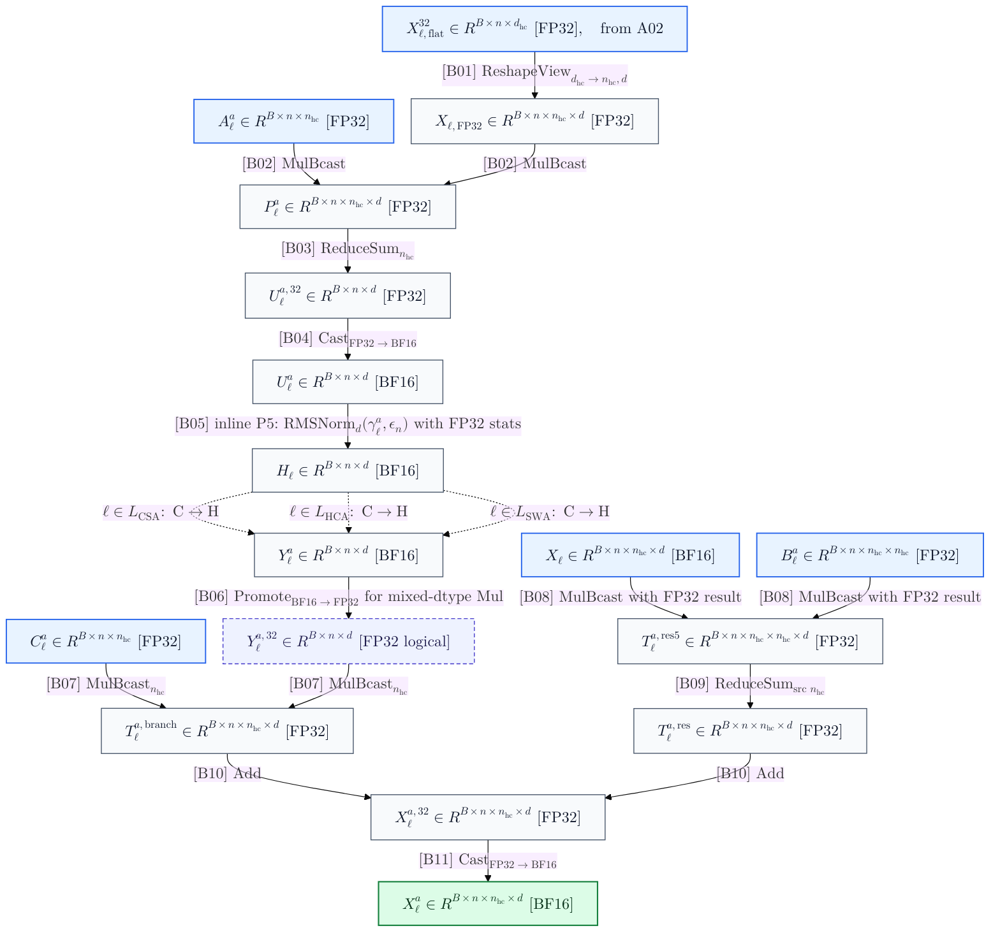
```mermaid
%%{init: {"theme": "base", "flowchart": {"htmlLabels": true, "curve": "basis", "nodeSpacing": 22, "rankSpacing": 32}}}%%
flowchart TD
    B_X["$$\mathbf X_{\ell}\in\mathbb R^{B\times n\times n_{\mathrm{hc}}\times d}\;[\mathrm{BF16}]$$"]
    B_XFLAT["$$\mathbf X_{\ell,\mathrm{flat}}^{32}\in\mathbb R^{B\times n\times d_{\mathrm{hc}}}\;[\mathrm{FP32}],\quad\text{from A02}$$"]
    B_XFP["$$\mathbf X_{\ell,\mathrm{FP32}}\in\mathbb R^{B\times n\times n_{\mathrm{hc}}\times d}\;[\mathrm{FP32}]$$"]
    B_A["$$\mathbf A_{\ell}^{a}\in\mathbb R^{B\times n\times n_{\mathrm{hc}}}\;[\mathrm{FP32}]$$"]
    B_AX["$$\mathbf P_{\ell}^{a}\in\mathbb R^{B\times n\times n_{\mathrm{hc}}\times d}\;[\mathrm{FP32}]$$"]
    B_UFP["$$\mathbf U_{\ell}^{a,32}\in\mathbb R^{B\times n\times d}\;[\mathrm{FP32}]$$"]
    B_U["$$\mathbf U_{\ell}^{a}\in\mathbb R^{B\times n\times d}\;[\mathrm{BF16}]$$"]
    B_H["$$\mathbf H_{\ell}\in\mathbb R^{B\times n\times d}\;[\mathrm{BF16}]$$"]
    B_Y["$$\mathbf Y_{\ell}^{a}\in\mathbb R^{B\times n\times d}\;[\mathrm{BF16}]$$"]
    B_C["$$\mathbf C_{\ell}^{a}\in\mathbb R^{B\times n\times n_{\mathrm{hc}}}\;[\mathrm{FP32}]$$"]
    B_B["$$\mathbf B_{\ell}^{a}\in\mathbb R^{B\times n\times n_{\mathrm{hc}}\times n_{\mathrm{hc}}}\;[\mathrm{FP32}]$$"]
    B_YFP["$$\mathbf Y_{\ell}^{a,32}\in\mathbb R^{B\times n\times d}\;[\mathrm{FP32\ logical}]$$"]
    B_CY["$$\mathbf T_{\ell}^{a,\mathrm{branch}}\in\mathbb R^{B\times n\times n_{\mathrm{hc}}\times d}\;[\mathrm{FP32}]$$"]
    B_BX5["$$\mathbf T_{\ell}^{a,\mathrm{res5}}\in\mathbb R^{B\times n\times n_{\mathrm{hc}}\times n_{\mathrm{hc}}\times d}\;[\mathrm{FP32}]$$"]
    B_BX["$$\mathbf T_{\ell}^{a,\mathrm{res}}\in\mathbb R^{B\times n\times n_{\mathrm{hc}}\times d}\;[\mathrm{FP32}]$$"]
    B_SUM["$$\mathbf X_{\ell}^{a,32}\in\mathbb R^{B\times n\times n_{\mathrm{hc}}\times d}\;[\mathrm{FP32}]$$"]
    B_OUT["$$\mathbf X_{\ell}^{a}\in\mathbb R^{B\times n\times n_{\mathrm{hc}}\times d}\;[\mathrm{BF16}]$$"]

    B_XFLAT -->|"$$[\mathrm{B01}]\ \operatorname{ReshapeView}_{d_{\mathrm{hc}}\rightarrow n_{\mathrm{hc}},d}$$"| B_XFP
    B_A & B_XFP -->|"$$[\mathrm{B02}]\ \operatorname{MulBcast}$$"| B_AX
    B_AX -->|"$$[\mathrm{B03}]\ \operatorname{ReduceSum}_{n_{\mathrm{hc}}}$$"| B_UFP
    B_UFP -->|"$$[\mathrm{B04}]\ \operatorname{Cast}_{\mathrm{FP32}\rightarrow\mathrm{BF16}}$$"| B_U
    B_U -->|"$$[\mathrm{B05}]\ \text{inline P5: }\operatorname{RMSNorm}_{d}(\gamma_{\ell}^{a},\epsilon_n)\ \text{with FP32 stats}$$"| B_H
    B_H -.->|"$$\ell\in\mathcal L_{\mathrm{CSA}}:\ \mathrm{C} \to \mathrm{H}$$"| B_Y
    B_H -.->|"$$\ell\in\mathcal L_{\mathrm{HCA}}:\ \mathrm{C} \to \mathrm{H}$$"| B_Y

    B_H -.->|"$$\ell\in\mathcal L_{\mathrm{SWA}}:\ \mathrm{C} \to \mathrm{H}$$"| B_Y

    B_Y -->|"$$[\mathrm{B06}]\ \operatorname{Promote}_{\mathrm{BF16}\rightarrow\mathrm{FP32}}\ \text{for mixed-dtype Mul}$$"| B_YFP
    B_C & B_YFP -->|"$$[\mathrm{B07}]\ \operatorname{MulBcast}_{n_{\mathrm{hc}}}$$"| B_CY
    B_X & B_B -->|"$$[\mathrm{B08}]\ \operatorname{MulBcast}\ \text{with FP32 result}$$"| B_BX5
    B_BX5 -->|"$$[\mathrm{B09}]\ \operatorname{ReduceSum}_{\mathrm{src}\ n_{\mathrm{hc}}}$$"| B_BX
    B_CY & B_BX -->|"$$[\mathrm{B10}]\ \operatorname{Add}$$"| B_SUM
    B_SUM -->|"$$[\mathrm{B11}]\ \operatorname{Cast}_{\mathrm{FP32}\rightarrow\mathrm{BF16}}$$"| B_OUT

    classDef input fill:#e8f3ff,stroke:#2563eb,color:#0f172a,stroke-width:1.5px;
    classDef data fill:#f8fafc,stroke:#475569,color:#0f172a,stroke-width:1.1px;
    classDef logical fill:#eef2ff,stroke:#4338ca,color:#1e1b4b,stroke-width:1.1px,stroke-dasharray:5 3;
    classDef output fill:#dcfce7,stroke:#15803d,color:#052e16,stroke-width:1.7px;
    class B_X,B_XFLAT,B_A,B_C,B_B input;
    class B_XFP,B_AX,B_UFP,B_U,B_H,B_Y,B_CY,B_BX5,B_BX,B_SUM data;
    class B_YFP logical;
    class B_OUT output;
```

Subgraphs: [A1 map inputs](#a1), [family paths C–H](#attention-overview), [P5 RMSNorm](#p5).

## B. Reusable primitive expansions

The metavariables $R_\star$, $K_\star$, and $N_\star$ in this section describe
flattened local row count, reduction width, and output width.
Each later splice names its concrete input, output, and stored weight.

### P1. BF16 activation quantization and scaled FP8 GEMM

The exact activation quantization and per-reduction-block scale correction
in [kernel.py, lines 22-125 and 203-273](../inference/kernel.py#L22-L273)
are exposed here, hence you may see some concrete numbers.

| Symbol                      | Kernel contract                                                                                   |
| --------------------------- | ------------------------------------------------------------------------------------------------- |
| $R_\star,K_\star,N_\star$   | Flattened row count, reduction width, output width; leading tensor axes are restored on output    |
| $Q_A$                       | 128; one activation scale per row and 128 features, one weight scale per $128\times128$ block     |
| $\mathcal D_w,\mathcal D_s$ | Configured FP8 E4M3 weights and FP8 E8M0 scale storage; `scale_fmt="ue8m0"`                       |
| $W_\star,\mathbf S_\star^w$ | Contiguous stored weights $[N_\star,K_\star]$ and scales $[\lceil N_\star/128\rceil,K_\star/128]$ |

Requires $K_\star \bmod 128 \equiv 0$. The activation scale is
$2^s \text{ where } {s = \lceil\log_2(\max(\operatorname{absmax}(x),10^{-4})/448)\rceil}$.
P1.05–P1.06 mean the exact FP32 exponent-bit helpers in `kernel.py`, not approximate logarithms.
For each K block, initialize the partial GEMM accumulator to zero, apply
$s_x[r,j]s_w[\lfloor o/128\rfloor,j]$, add to a separate zero-initialized FP32 accumulator,
then clear the partial accumulator. The graph preserves this scale-correction order.
The quantizer and GEMM are separate reference launches. This specialization covers FP8 attention
linears; BF16/FP32 linears use direct matrix multiplication with no P1 activation quantizer.

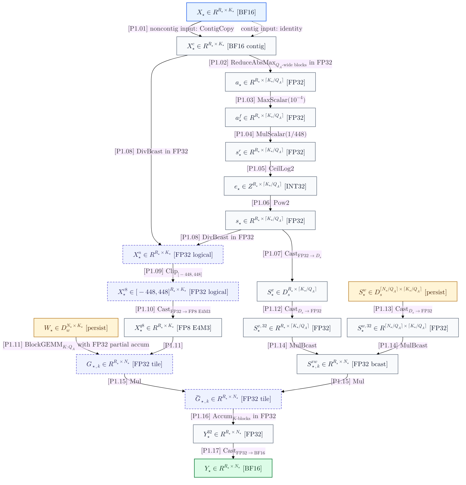
```mermaid
%%{init: {"theme": "base", "flowchart": {"htmlLabels": true, "curve": "basis", "nodeSpacing": 18, "rankSpacing": 26}}}%%
flowchart TD
    P1_X["$$\mathbf X_{\star}\in\mathbb R^{R_{\star}\times K_{\star}}\;[\mathrm{BF16}]$$"]
    P1_XC["$$\mathbf X_{\star}^{c}\in\mathbb R^{R_{\star}\times K_{\star}}\;[\mathrm{BF16\ contig}]$$"]
    P1_AMAX["$$\mathbf a_{\star}\in\mathbb R^{R_{\star}\times\lceil K_{\star}/Q_A\rceil}\;[\mathrm{FP32}]$$"]
    P1_AF["$$\mathbf a_{\star}^{f}\in\mathbb R^{R_{\star}\times\lceil K_{\star}/Q_A\rceil}\;[\mathrm{FP32}]$$"]
    P1_SR["$$\mathbf s_{\star}^{r}\in\mathbb R^{R_{\star}\times\lceil K_{\star}/Q_A\rceil}\;[\mathrm{FP32}]$$"]
    P1_SE["$$\mathbf e_{\star}\in\mathbb Z^{R_{\star}\times\lceil K_{\star}/Q_A\rceil}\;[\mathrm{INT32}]$$"]
    P1_SFP["$$\mathbf s_{\star}\in\mathbb R^{R_{\star}\times\lceil K_{\star}/Q_A\rceil}\;[\mathrm{FP32}]$$"]
    P1_SST["$$\mathbf S_{\star}^{x}\in\mathcal D_s^{R_{\star}\times\lceil K_{\star}/Q_A\rceil}$$"]
    P1_NORM["$$\mathbf X_{\star}^{n}\in\mathbb R^{R_{\star}\times K_{\star}}\;[\mathrm{FP32\ logical}]$$"]
    P1_CLIP["$$\mathbf X_{\star}^{c8}\in[-448,448]^{R_{\star}\times K_{\star}}\;[\mathrm{FP32\ logical}]$$"]
    P1_Q["$$\mathbf X_{\star}^{q8}\in\mathbb R^{R_{\star}\times K_{\star}}\;[\mathrm{FP8\ E4M3}]$$"]
    P1_W["$$W_{\star}\in\mathcal D_w^{N_{\star}\times K_{\star}}\;[\mathrm{persist}]$$"]
    P1_WS["$$\mathbf S_{\star}^{w}\in\mathcal D_s^{\lceil N_{\star}/Q_A\rceil\times\lceil K_{\star}/Q_A\rceil}\;[\mathrm{persist}]$$"]
    P1_G["$$\mathbf G_{\star,k}\in\mathbb R^{R_{\star}\times N_{\star}}\;[\mathrm{FP32\ tile}]$$"]
    P1_SX32["$$\mathbf S_{\star}^{x,32}\in\mathbb R^{R_{\star}\times\lceil K_{\star}/Q_A\rceil}\;[\mathrm{FP32}]$$"]
    P1_SW32["$$\mathbf S_{\star}^{w,32}\in\mathbb R^{\lceil N_{\star}/Q_A\rceil\times\lceil K_{\star}/Q_A\rceil}\;[\mathrm{FP32}]$$"]
    P1_SP["$$\mathbf S_{\star,k}^{xw}\in\mathbb R^{R_{\star}\times N_{\star}}\;[\mathrm{FP32\ bcast}]$$"]
    P1_GS["$$\widetilde{\mathbf G}_{\star,k}\in\mathbb R^{R_{\star}\times N_{\star}}\;[\mathrm{FP32\ tile}]$$"]
    P1_ACC["$$\mathbf Y_{\star}^{32}\in\mathbb R^{R_{\star}\times N_{\star}}\;[\mathrm{FP32}]$$"]
    P1_Y["$$\mathbf Y_{\star}\in\mathbb R^{R_{\star}\times N_{\star}}\;[\mathrm{BF16}]$$"]

    P1_X -->|"$$[\mathrm{P1.01}]\ \text{noncontig input: }\operatorname{ContigCopy}$$"| P1_XC
    P1_X -.->|"$$\text{contig input: identity}$$"| P1_XC
    P1_XC -->|"$$[\mathrm{P1.02}]\ \operatorname{ReduceAbsMax}_{Q_A\text{-wide blocks}}\ \text{in FP32}$$"| P1_AMAX
    P1_AMAX -->|"$$[\mathrm{P1.03}]\ \operatorname{MaxScalar}(10^{-4})$$"| P1_AF
    P1_AF -->|"$$[\mathrm{P1.04}]\ \operatorname{MulScalar}(1/448)$$"| P1_SR
    P1_SR -->|"$$[\mathrm{P1.05}]\ \operatorname{CeilLog2}$$"| P1_SE
    P1_SE -->|"$$[\mathrm{P1.06}]\ \operatorname{Pow2}$$"| P1_SFP
    P1_SFP -->|"$$[\mathrm{P1.07}]\ \operatorname{Cast}_{\mathrm{FP32}\rightarrow\mathcal D_s}$$"| P1_SST
    P1_XC & P1_SFP -->|"$$[\mathrm{P1.08}]\ \operatorname{DivBcast}\ \text{in FP32}$$"| P1_NORM
    P1_NORM -->|"$$[\mathrm{P1.09}]\ \operatorname{Clip}_{[-448,448]}$$"| P1_CLIP
    P1_CLIP -->|"$$[\mathrm{P1.10}]\ \operatorname{Cast}_{\mathrm{FP32}\rightarrow\mathrm{FP8\ E4M3}}$$"| P1_Q
    P1_W -->|"$$[\mathrm{P1.11}]\ \operatorname{BlockGEMM}_{K:Q_A}\ \text{with FP32 partial accum}$$"| P1_G
    P1_Q -->|"$$[\mathrm{P1.11}]$$"| P1_G
    P1_SST -->|"$$[\mathrm{P1.12}]\ \operatorname{Cast}_{\mathcal D_s\rightarrow\mathrm{FP32}}$$"| P1_SX32
    P1_WS -->|"$$[\mathrm{P1.13}]\ \operatorname{Cast}_{\mathcal D_s\rightarrow\mathrm{FP32}}$$"| P1_SW32
    P1_SX32 & P1_SW32 -->|"$$[\mathrm{P1.14}]\ \operatorname{MulBcast}$$"| P1_SP
    P1_G & P1_SP -->|"$$[\mathrm{P1.15}]\ \operatorname{Mul}$$"| P1_GS
    P1_GS -->|"$$[\mathrm{P1.16}]\ \operatorname{Accum}_{K\text{-blocks}}\ \text{in FP32}$$"| P1_ACC
    P1_ACC -->|"$$[\mathrm{P1.17}]\ \operatorname{Cast}_{\mathrm{FP32}\rightarrow\mathrm{BF16}}$$"| P1_Y

    classDef input fill:#e8f3ff,stroke:#2563eb,color:#0f172a,stroke-width:1.5px;
    classDef weight fill:#fff4d6,stroke:#b7791f,color:#422006,stroke-width:1.4px;
    classDef data fill:#f8fafc,stroke:#475569,color:#0f172a,stroke-width:1.1px;
    classDef logical fill:#eef2ff,stroke:#4338ca,color:#1e1b4b,stroke-width:1.1px,stroke-dasharray:5 3;
    classDef output fill:#dcfce7,stroke:#15803d,color:#052e16,stroke-width:1.6px;
    class P1_X input;
    class P1_W,P1_WS weight;
    class P1_XC,P1_AMAX,P1_AF,P1_SR,P1_SE,P1_SFP,P1_SST,P1_Q,P1_SX32,P1_SW32,P1_SP,P1_ACC data;
    class P1_NORM,P1_CLIP,P1_G,P1_GS logical;
    class P1_Y output;
```

Subgraphs: [C projections](#c), [F0 index query](#f0), [H2 output](#h2).

### P2. Forward or inverse partial RoPE write-back

$n_\star$ is the operand's sequence extent: the call length for queries/local KV/output, the emitted block count for prefill compression, and one for a decode emission.
Complex values use two FP32 components (i.e., PyTorch `complex64`).

| Symbol                                           | Meaning / value                                                                                             |
| ------------------------------------------------ | ----------------------------------------------------------------------------------------------------------- |
| $c,c_I,c_r,c_n$                                  | Main head width 512, index head width 128, rotary tail 64, main non-rotary width $c-c_r=448$                |
| $n_\star,\mathbf F_\star$                        | Operand sequence extent and the selected complex64 phase rows; rank-3 KV or rank-4 multi-head operand       |
| $n_{\max}$                                       | Allocated RoPE/cache horizon; `ModelArgs.max_seq_len=4096`; interactive `generate.py` overrides it to 65536 |
| $\theta_{\mathrm{local}},\theta_{\mathrm{comp}}$ | `rope_theta=10000`, `compress_rope_theta=160000`                                                            |
| $n_{\mathrm{orig}},f_Y,\beta_f,\beta_s$          | `original_seq_len=65536`, `rope_factor=16`, `beta_fast=32`, `beta_slow=1`                                   |

The phase table is produced once at construction by `precompute_freqs_cis` (formula below).
For a complex pair $(a,b)$ and phase $(\cos\phi,\sin\phi)$, P2.07 computes
$(a\cos\phi-b\sin\phi,\ a\sin\phi+b\cos\phi)$ in FP32. Inverse RoPE negates the phase's
imaginary part. Pair adjacent tail coordinates; leave the leading coordinates untouched.

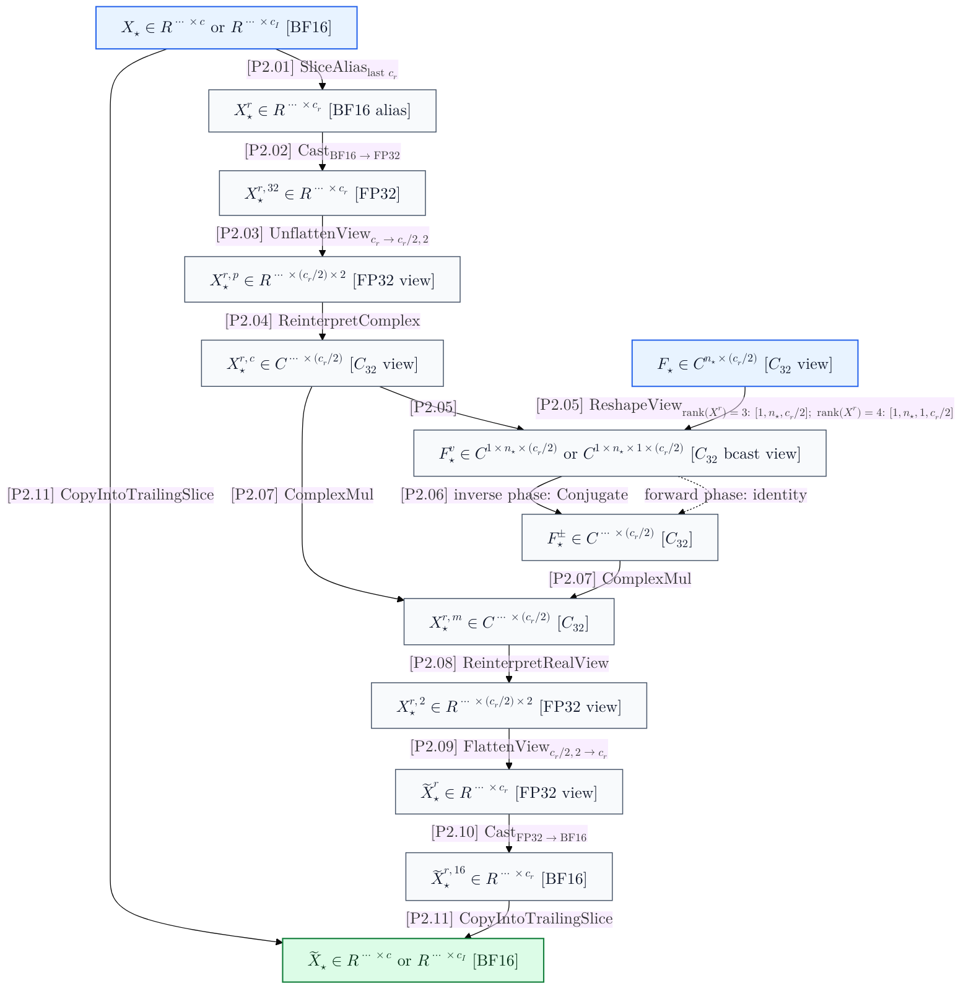
```mermaid
%%{init: {"theme": "base", "flowchart": {"htmlLabels": true, "curve": "basis", "nodeSpacing": 18, "rankSpacing": 26}}}%%
flowchart TD
    P2_X["$$\mathbf X_{\star}\in\mathbb R^{\cdots\times c}\ \text{or}\ \mathbb R^{\cdots\times c_I}\;[\mathrm{BF16}]$$"]
    P2_TAIL["$$\mathbf X_{\star}^{r}\in\mathbb R^{\cdots\times c_r}\;[\mathrm{BF16\ alias}]$$"]
    P2_FP["$$\mathbf X_{\star}^{r,32}\in\mathbb R^{\cdots\times c_r}\;[\mathrm{FP32}]$$"]
    P2_PAIR["$$\mathbf X_{\star}^{r,p}\in\mathbb R^{\cdots\times(c_r/2)\times2}\;[\mathrm{FP32\ view}]$$"]
    P2_CX["$$\mathbf X_{\star}^{r,c}\in\mathbb C^{\cdots\times(c_r/2)}\;[\mathbb{C}_{32} \text{ view}]$$"]
    P2_F["$$\mathbf F_{\star}\in\mathbb C^{n_{\star}\times(c_r/2)}\;[\mathbb{C}_{32} \text{ view}]$$"]
    P2_FV["$$\mathbf F_{\star}^{v}\in\mathbb C^{1\times n_{\star}\times(c_r/2)}\ \text{or}\ \mathbb C^{1\times n_{\star}\times1\times(c_r/2)}\;[\mathbb{C}_{32} \text{ bcast view}]$$"]
    P2_FDIR["$$\mathbf F_{\star}^{\pm}\in\mathbb C^{\cdots\times(c_r/2)}\;[\mathbb{C}_{32}]$$"]
    P2_CM["$$\mathbf X_{\star}^{r,m}\in\mathbb C^{\cdots\times(c_r/2)}\;[\mathbb{C}_{32}]$$"]
    P2_REAL["$$\mathbf X_{\star}^{r,2}\in\mathbb R^{\cdots\times(c_r/2)\times2}\;[\mathrm{FP32\ view}]$$"]
    P2_FLAT["$$\widetilde{\mathbf X}_{\star}^{r}\in\mathbb R^{\cdots\times c_r}\;[\mathrm{FP32\ view}]$$"]
    P2_BF["$$\widetilde{\mathbf X}_{\star}^{r,16}\in\mathbb R^{\cdots\times c_r}\;[\mathrm{BF16}]$$"]
    P2_Y["$$\widetilde{\mathbf X}_{\star}\in\mathbb R^{\cdots\times c}\ \text{or}\ \mathbb R^{\cdots\times c_I}\;[\mathrm{BF16}]$$"]

    P2_X -->|"$$[\mathrm{P2.01}]\ \operatorname{SliceAlias}_{\mathrm{last}\ c_r}$$"| P2_TAIL
    P2_TAIL -->|"$$[\mathrm{P2.02}]\ \operatorname{Cast}_{\mathrm{BF16}\rightarrow\mathrm{FP32}}$$"| P2_FP
    P2_FP -->|"$$[\mathrm{P2.03}]\ \operatorname{UnflattenView}_{c_r\rightarrow c_r/2,2}$$"| P2_PAIR
    P2_PAIR -->|"$$[\mathrm{P2.04}]\ \operatorname{ReinterpretComplex}$$"| P2_CX
    P2_CX -->|"$$[\mathrm{P2.05}]$$"| P2_FV
    P2_F -->|"$$[\mathrm{P2.05}]\ \operatorname{ReshapeView}_{\mathrm{rank}(\mathbf X^r)=3:\,[1,n_{\star},c_r/2];\ \mathrm{rank}(\mathbf X^r)=4:\,[1,n_{\star},1,c_r/2]}$$"| P2_FV
    P2_FV -->|"$$[\mathrm{P2.06}]\ \text{inverse phase: }\operatorname{Conjugate}$$"| P2_FDIR
    P2_FV -.->|"$$\text{forward phase: identity}$$"| P2_FDIR
    P2_CX & P2_FDIR -->|"$$[\mathrm{P2.07}]\ \operatorname{ComplexMul}$$"| P2_CM
    P2_CM -->|"$$[\mathrm{P2.08}]\ \operatorname{ReinterpretRealView}$$"| P2_REAL
    P2_REAL -->|"$$[\mathrm{P2.09}]\ \operatorname{FlattenView}_{c_r/2,2\rightarrow c_r}$$"| P2_FLAT
    P2_FLAT -->|"$$[\mathrm{P2.10}]\ \operatorname{Cast}_{\mathrm{FP32}\rightarrow\mathrm{BF16}}$$"| P2_BF
    P2_X & P2_BF -->|"$$[\mathrm{P2.11}]\ \operatorname{CopyIntoTrailingSlice}$$"| P2_Y

    classDef input fill:#e8f3ff,stroke:#2563eb,color:#0f172a,stroke-width:1.5px;
    classDef data fill:#f8fafc,stroke:#475569,color:#0f172a,stroke-width:1.1px;
    classDef output fill:#dcfce7,stroke:#15803d,color:#052e16,stroke-width:1.6px;
    class P2_X,P2_F input;
    class P2_TAIL,P2_FP,P2_PAIR,P2_CX,P2_FV,P2_FDIR,P2_CM,P2_REAL,P2_FLAT,P2_BF data;
    class P2_Y output;
```

Subgraphs: [phase-table construction](#rope-table), [C callers](#c), [E emission callers](#e), [F0](#f0), [H2](#h2).

**P2 table construction and phase bindings.** For $j=0,\ldots,c_r/2-1$,
$\omega_j=\theta^{-2j/c_r}$. Compressed layers compute

$$
l_c=\max\!\left(\left\lfloor\frac{c_r\log(n_{\mathrm{orig}}/(2\pi\beta_f))}{2\log\theta}\right\rfloor,0\right),\qquad
h_c=\min\!\left(\left\lceil\frac{c_r\log(n_{\mathrm{orig}}/(2\pi\beta_s))}{2\log\theta}\right\rceil,c_r-1\right),
$$

$$
h'_c=\begin{cases}h_c+0.001,&h_c=l_c,\\h_c,&\text{otherwise},\end{cases}\qquad
a_j=1-\operatorname{clip}\!\left(\frac{j-l_c}{h'_c-l_c},0,1\right),\qquad
\widetilde\omega_j=(\omega_j/f_Y)(1-a_j)+\omega_j a_j,
$$

$$
\mathcal F_\ell[t,j]=\operatorname{polar}(1,t\widetilde\omega_j),\quad 0\le t<n_{\max}.
$$

CSA/HCA use $\theta=\theta_{\mathrm{comp}}$ and this interpolation; SWA sets the effective
original length to zero, skips correction, and uses $\omega_j$ with $\theta_{\mathrm{local}}$.
Frequency tensors and trigonometry are FP32, with complex64 storage. The code clamps the upper
correction bound to **$c_r-1$**, even though the ramp has $c_r/2$ entries; preserve this detail.
It adds no separate YaRN attention-amplitude multiplier. The phase at query position $p_0+t$
is also used for local KV and for inverse output RoPE. A compressed entry at block index $i$
uses its **block-start** phase $m_\ell i$, never its final token's phase.
(Source: [model.py, lines 206–250](../inference/model.py#L206-L250),
[compressor phase selection](../inference/model.py#L367-L378),
[layer setup](../inference/model.py#L479-L488); paper §2.3.3 describes partial/inverse RoPE,
while these exact YaRN and block-position rules come from code.)

### P3. In-place FP8 Q/DQ of non-rotary KV dimensions

$Q_{KV}=64$ features per quantization block, so the main non-rotary prefix has seven scales
per KV row. Reuse P1's FP8 absmax/scale/cast arithmetic with this block width and dequantization
enabled. The scale tensor is temporary; the returned full-width KV remains BF16. This is
**simulated FP8**, whereas paper §2.3.4 describes physically mixed FP8/BF16 KV storage.
(Source: [act_quant](../inference/kernel.py#L41-L125), [local KV](../inference/model.py#L510-L512).)

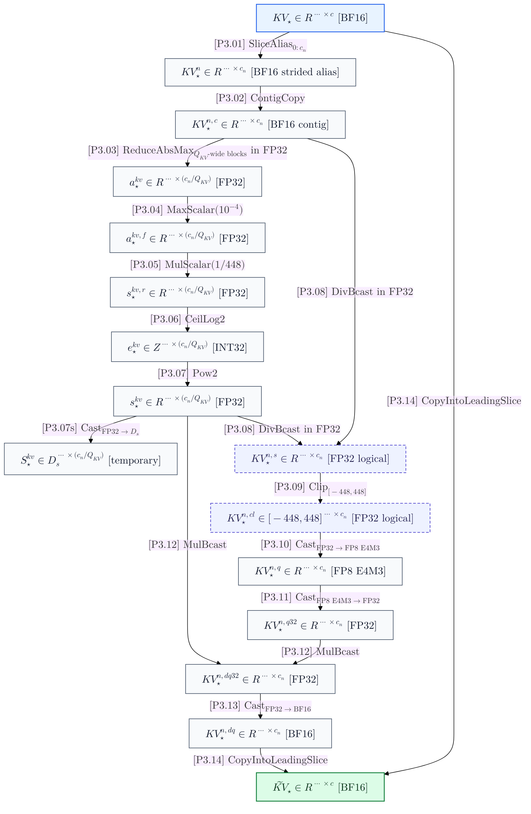
```mermaid
%%{init: {"theme": "base", "flowchart": {"htmlLabels": true, "curve": "basis", "nodeSpacing": 18, "rankSpacing": 26}}}%%
flowchart TD
    P3_X["$$\mathbf{KV}_{\star}\in\mathbb R^{\cdots\times c}\;[\mathrm{BF16}]$$"]
    P3_NR["$$\mathbf{KV}_{\star}^{n}\in\mathbb R^{\cdots\times c_n}\;[\mathrm{BF16\ strided\ alias}]$$"]
    P3_C["$$\mathbf{KV}_{\star}^{n,c}\in\mathbb R^{\cdots\times c_n}\;[\mathrm{BF16\ contig}]$$"]
    P3_A["$$\mathbf a_{\star}^{kv}\in\mathbb R^{\cdots\times(c_n/Q_{KV})}\;[\mathrm{FP32}]$$"]
    P3_AF["$$\mathbf a_{\star}^{kv,f}\in\mathbb R^{\cdots\times(c_n/Q_{KV})}\;[\mathrm{FP32}]$$"]
    P3_SR["$$\mathbf s_{\star}^{kv,r}\in\mathbb R^{\cdots\times(c_n/Q_{KV})}\;[\mathrm{FP32}]$$"]
    P3_SE["$$\mathbf e_{\star}^{kv}\in\mathbb Z^{\cdots\times(c_n/Q_{KV})}\;[\mathrm{INT32}]$$"]
    P3_S["$$\mathbf s_{\star}^{kv}\in\mathbb R^{\cdots\times(c_n/Q_{KV})}\;[\mathrm{FP32}]$$"]
    P3_SST["$$\mathbf S_{\star}^{kv}\in\mathcal D_s^{\cdots\times(c_n/Q_{KV})}\;[\mathrm{temporary}]$$"]
    P3_SN["$$\mathbf{KV}_{\star}^{n,s}\in\mathbb R^{\cdots\times c_n}\;[\mathrm{FP32\ logical}]$$"]
    P3_CL["$$\mathbf{KV}_{\star}^{n,cl}\in[-448,448]^{\cdots\times c_n}\;[\mathrm{FP32\ logical}]$$"]
    P3_Q["$$\mathbf{KV}_{\star}^{n,q}\in\mathbb R^{\cdots\times c_n}\;[\mathrm{FP8\ E4M3}]$$"]
    P3_Q32["$$\mathbf{KV}_{\star}^{n,q32}\in\mathbb R^{\cdots\times c_n}\;[\mathrm{FP32}]$$"]
    P3_DQ["$$\mathbf{KV}_{\star}^{n,dq32}\in\mathbb R^{\cdots\times c_n}\;[\mathrm{FP32}]$$"]
    P3_BF["$$\mathbf{KV}_{\star}^{n,dq}\in\mathbb R^{\cdots\times c_n}\;[\mathrm{BF16}]$$"]
    P3_Y["$$\widetilde{\mathbf{KV}}_{\star}\in\mathbb R^{\cdots\times c}\;[\mathrm{BF16}]$$"]

    P3_X -->|"$$[\mathrm{P3.01}]\ \operatorname{SliceAlias}_{0:c_n}$$"| P3_NR
    P3_NR -->|"$$[\mathrm{P3.02}]\ \operatorname{ContigCopy}$$"| P3_C
    P3_C -->|"$$[\mathrm{P3.03}]\ \operatorname{ReduceAbsMax}_{Q_{KV}\text{-wide blocks}}\ \text{in FP32}$$"| P3_A
    P3_A -->|"$$[\mathrm{P3.04}]\ \operatorname{MaxScalar}(10^{-4})$$"| P3_AF
    P3_AF -->|"$$[\mathrm{P3.05}]\ \operatorname{MulScalar}(1/448)$$"| P3_SR
    P3_SR -->|"$$[\mathrm{P3.06}]\ \operatorname{CeilLog2}$$"| P3_SE
    P3_SE -->|"$$[\mathrm{P3.07}]\ \operatorname{Pow2}$$"| P3_S
    P3_S -->|"$$[\mathrm{P3.07s}]\ \operatorname{Cast}_{\mathrm{FP32}\rightarrow\mathcal D_s}$$"| P3_SST
    P3_C & P3_S -->|"$$[\mathrm{P3.08}]\ \operatorname{DivBcast}\ \text{in FP32}$$"| P3_SN
    P3_SN -->|"$$[\mathrm{P3.09}]\ \operatorname{Clip}_{[-448,448]}$$"| P3_CL
    P3_CL -->|"$$[\mathrm{P3.10}]\ \operatorname{Cast}_{\mathrm{FP32}\rightarrow\mathrm{FP8\ E4M3}}$$"| P3_Q
    P3_Q -->|"$$[\mathrm{P3.11}]\ \operatorname{Cast}_{\mathrm{FP8\ E4M3}\rightarrow\mathrm{FP32}}$$"| P3_Q32
    P3_Q32 & P3_S -->|"$$[\mathrm{P3.12}]\ \operatorname{MulBcast}$$"| P3_DQ
    P3_DQ -->|"$$[\mathrm{P3.13}]\ \operatorname{Cast}_{\mathrm{FP32}\rightarrow\mathrm{BF16}}$$"| P3_BF
    P3_X & P3_BF -->|"$$[\mathrm{P3.14}]\ \operatorname{CopyIntoLeadingSlice}$$"| P3_Y

    classDef input fill:#e8f3ff,stroke:#2563eb,color:#0f172a,stroke-width:1.5px;
    classDef data fill:#f8fafc,stroke:#475569,color:#0f172a,stroke-width:1.1px;
    classDef logical fill:#eef2ff,stroke:#4338ca,color:#1e1b4b,stroke-width:1.1px,stroke-dasharray:5 3;
    classDef output fill:#dcfce7,stroke:#15803d,color:#052e16,stroke-width:1.6px;
    class P3_X input;
    class P3_NR,P3_C,P3_A,P3_AF,P3_SR,P3_SE,P3_S,P3_SST,P3_Q,P3_Q32,P3_DQ,P3_BF data;
    class P3_SN,P3_CL logical;
    class P3_Y output;
```

Subgraphs: [shared FP8 scale arithmetic](#p1), [local KV](#c), [compressed KV](#e).

### P4. Normalized Hadamard rotation and in-place FP4 Q/DQ

`rotate_activation` calls `hadamard_transform(x, scale=x.size(-1)**-0.5)` once. P4.00-P4.02c
expand its FP32 butterfly/scale computation and BF16 output boundary; there is no BF16
rounding between the transform and normalization, and no sampled sign matrix.
The transform boundaries follow its
[upstream load/butterfly/store implementation](https://github.com/Dao-AILab/fast-hadamard-transform/blob/master/csrc/fast_hadamard_transform_common.h).

$Q_4=32$ and $c_I=128$, giving four FP4 scale groups per index query/key row.
`fp4_act_quant` always allocates E8M0 scales, including when other quantizers use a different
scale dtype. The scale floor is $2^{-126}$ and the FP4 E2M1 magnitudes are
$\{0,\tfrac12,1,\tfrac32,2,3,4,6\}$. Both Q and K undergo the same normalized Hadamard
transform **after** partial RoPE; this mixes and quantizes all 128 coordinates.

P4.01 expands into seven butterfly stages. At stage $a=0,\ldots,6$, pair coordinates
$i$ and $i+2^a$ in each group of $2^{a+1}$, read both old values $(u,v)$, and write
$(u+v,u-v)$ in FP32. Scale once by $128^{-1/2}$, then cast to BF16 before FP4 Q/DQ.
The butterfly grouping is a mathematical lowering expansion; GPU reduction order is an
additional numerical constraint for bitwise matching. The reference returns BF16 Q/K after
Q/DQ and computes scores with BF16 `einsum`; paper §5.2.1 describes native FP4 inference.
(Source: [model.py](../inference/model.py#L253-L258), [fp4_act_quant](../inference/kernel.py#L129-L200).)

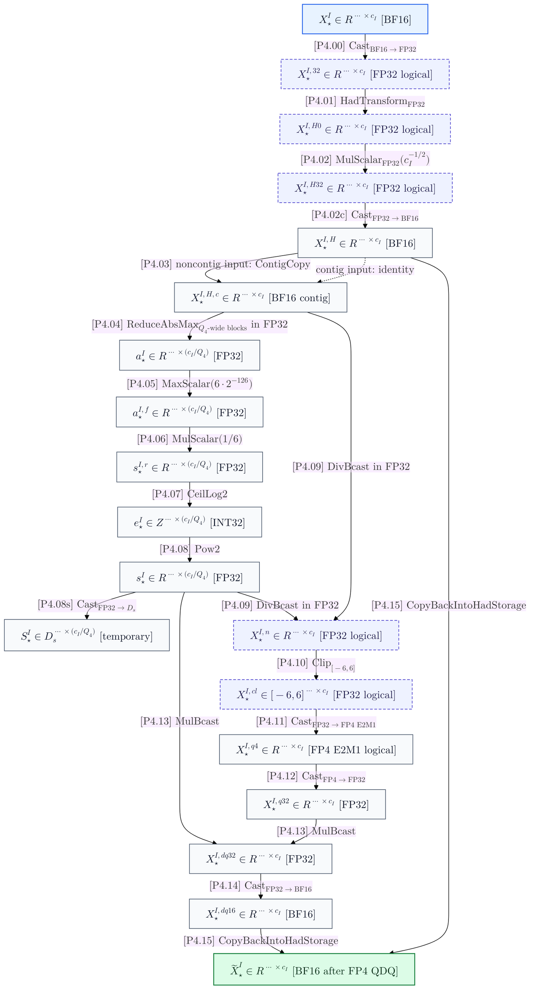
```mermaid
%%{init: {"theme": "base", "flowchart": {"htmlLabels": true, "curve": "basis", "nodeSpacing": 18, "rankSpacing": 26}}}%%
flowchart TD
    P4_X["$$\mathbf X_{\star}^{I}\in\mathbb R^{\cdots\times c_I}\;[\mathrm{BF16}]$$"]
    P4_X32["$$\mathbf X_{\star}^{I,32}\in\mathbb R^{\cdots\times c_I}\;[\mathrm{FP32\ logical}]$$"]
    P4_H0["$$\mathbf X_{\star}^{I,H0}\in\mathbb R^{\cdots\times c_I}\;[\mathrm{FP32\ logical}]$$"]
    P4_H32["$$\mathbf X_{\star}^{I,H32}\in\mathbb R^{\cdots\times c_I}\;[\mathrm{FP32\ logical}]$$"]
    P4_H["$$\mathbf X_{\star}^{I,H}\in\mathbb R^{\cdots\times c_I}\;[\mathrm{BF16}]$$"]
    P4_C["$$\mathbf X_{\star}^{I,H,c}\in\mathbb R^{\cdots\times c_I}\;[\mathrm{BF16\ contig}]$$"]
    P4_A["$$\mathbf a_{\star}^{I}\in\mathbb R^{\cdots\times(c_I/Q_4)}\;[\mathrm{FP32}]$$"]
    P4_AF["$$\mathbf a_{\star}^{I,f}\in\mathbb R^{\cdots\times(c_I/Q_4)}\;[\mathrm{FP32}]$$"]
    P4_SR["$$\mathbf s_{\star}^{I,r}\in\mathbb R^{\cdots\times(c_I/Q_4)}\;[\mathrm{FP32}]$$"]
    P4_SE["$$\mathbf e_{\star}^{I}\in\mathbb Z^{\cdots\times(c_I/Q_4)}\;[\mathrm{INT32}]$$"]
    P4_S["$$\mathbf s_{\star}^{I}\in\mathbb R^{\cdots\times(c_I/Q_4)}\;[\mathrm{FP32}]$$"]
    P4_SST["$$\mathbf S_{\star}^{I}\in\mathcal D_s^{\cdots\times(c_I/Q_4)}\;[\mathrm{temporary}]$$"]
    P4_N["$$\mathbf X_{\star}^{I,n}\in\mathbb R^{\cdots\times c_I}\;[\mathrm{FP32\ logical}]$$"]
    P4_CL["$$\mathbf X_{\star}^{I,cl}\in[-6,6]^{\cdots\times c_I}\;[\mathrm{FP32\ logical}]$$"]
    P4_Q["$$\mathbf X_{\star}^{I,q4}\in\mathbb R^{\cdots\times c_I}\;[\mathrm{FP4\ E2M1\ logical}]$$"]
    P4_Q32["$$\mathbf X_{\star}^{I,q32}\in\mathbb R^{\cdots\times c_I}\;[\mathrm{FP32}]$$"]
    P4_DQ["$$\mathbf X_{\star}^{I,dq32}\in\mathbb R^{\cdots\times c_I}\;[\mathrm{FP32}]$$"]
    P4_BF["$$\mathbf X_{\star}^{I,dq16}\in\mathbb R^{\cdots\times c_I}\;[\mathrm{BF16}]$$"]
    P4_Y["$$\widetilde{\mathbf X}_{\star}^{I}\in\mathbb R^{\cdots\times c_I}\;[\mathrm{BF16\ after\ FP4\ QDQ}]$$"]

    P4_X -->|"$$[\mathrm{P4.00}]\ \operatorname{Cast}_{\mathrm{BF16}\rightarrow\mathrm{FP32}}$$"| P4_X32
    P4_X32 -->|"$$[\mathrm{P4.01}]\ \operatorname{HadTransform}_{\mathrm{FP32}}$$"| P4_H0
    P4_H0 -->|"$$[\mathrm{P4.02}]\ \operatorname{MulScalar}_{\mathrm{FP32}}(c_I^{-1/2})$$"| P4_H32
    P4_H32 -->|"$$[\mathrm{P4.02c}]\ \operatorname{Cast}_{\mathrm{FP32}\rightarrow\mathrm{BF16}}$$"| P4_H
    P4_H -.->|"$$\text{contig input: identity}$$"| P4_C
    P4_H -->|"$$[\mathrm{P4.03}]\ \text{noncontig input: }\operatorname{ContigCopy}$$"| P4_C
    P4_C -->|"$$[\mathrm{P4.04}]\ \operatorname{ReduceAbsMax}_{Q_4\text{-wide blocks}}\ \text{in FP32}$$"| P4_A
    P4_A -->|"$$[\mathrm{P4.05}]\ \operatorname{MaxScalar}(6\cdot2^{-126})$$"| P4_AF
    P4_AF -->|"$$[\mathrm{P4.06}]\ \operatorname{MulScalar}(1/6)$$"| P4_SR
    P4_SR -->|"$$[\mathrm{P4.07}]\ \operatorname{CeilLog2}$$"| P4_SE
    P4_SE -->|"$$[\mathrm{P4.08}]\ \operatorname{Pow2}$$"| P4_S
    P4_S -->|"$$[\mathrm{P4.08s}]\ \operatorname{Cast}_{\mathrm{FP32}\rightarrow\mathcal D_s}$$"| P4_SST
    P4_C & P4_S -->|"$$[\mathrm{P4.09}]\ \operatorname{DivBcast}\ \text{in FP32}$$"| P4_N
    P4_N -->|"$$[\mathrm{P4.10}]\ \operatorname{Clip}_{[-6,6]}$$"| P4_CL
    P4_CL -->|"$$[\mathrm{P4.11}]\ \operatorname{Cast}_{\mathrm{FP32}\rightarrow\mathrm{FP4\ E2M1}}$$"| P4_Q
    P4_Q -->|"$$[\mathrm{P4.12}]\ \operatorname{Cast}_{\mathrm{FP4}\rightarrow\mathrm{FP32}}$$"| P4_Q32
    P4_Q32 & P4_S -->|"$$[\mathrm{P4.13}]\ \operatorname{MulBcast}$$"| P4_DQ
    P4_DQ -->|"$$[\mathrm{P4.14}]\ \operatorname{Cast}_{\mathrm{FP32}\rightarrow\mathrm{BF16}}$$"| P4_BF
    P4_H & P4_BF -->|"$$[\mathrm{P4.15}]\ \operatorname{CopyBackIntoHadStorage}$$"| P4_Y

    classDef input fill:#e8f3ff,stroke:#2563eb,color:#0f172a,stroke-width:1.5px;
    classDef data fill:#f8fafc,stroke:#475569,color:#0f172a,stroke-width:1.1px;
    classDef logical fill:#eef2ff,stroke:#4338ca,color:#1e1b4b,stroke-width:1.1px,stroke-dasharray:5 3;
    classDef output fill:#dcfce7,stroke:#15803d,color:#052e16,stroke-width:1.6px;
    class P4_X input;
    class P4_H,P4_C,P4_A,P4_AF,P4_SR,P4_SE,P4_S,P4_SST,P4_Q,P4_Q32,P4_DQ,P4_BF data;
    class P4_X32,P4_H0,P4_H32,P4_N,P4_CL logical;
    class P4_Y output;
```

Subgraphs: [index queries](#f0), [prefill index keys](#e1-c), [decode index keys](#e2-c).

### P5. Learned RMSNorm with explicit precision boundaries

Use this one kernel for A2's attention norm, the query latent norm, the local-KV norm, and
every main/index compressor norm. $F_\star$ is the final feature extent; $\gamma_\star$ is the
module's distinct learned FP32 vector $[F_\star]$. It is **not** C06–C10's staged BF16 head rescale.
(Source: [RMSNorm::forward](../inference/model.py#L189-L202).)

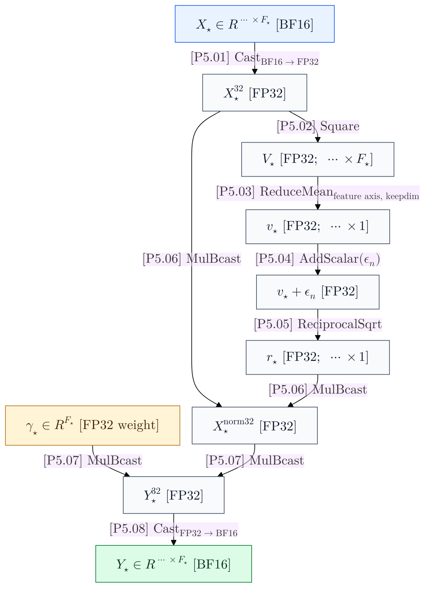
```mermaid
%%{init: {"theme": "base", "flowchart": {"htmlLabels": true, "curve": "basis", "nodeSpacing": 18, "rankSpacing": 26}}}%%
flowchart TD
    P5_X["$$\mathbf X_\star\in\mathbb R^{\cdots\times F_\star}\ [\mathrm{BF16}]$$"]
    P5_G["$$\gamma_\star\in\mathbb R^{F_\star}\ [\mathrm{FP32\ weight}]$$"]
    P5_X32["$$\mathbf X_\star^{32}\ [\mathrm{FP32}]$$"]
    P5_SQ["$$\mathbf V_\star\ [\mathrm{FP32};\ \cdots\times F_\star]$$"]
    P5_MEAN["$$\mathbf v_\star\ [\mathrm{FP32};\ \cdots\times1]$$"]
    P5_E["$$\mathbf v_\star+\epsilon_n\ [\mathrm{FP32}]$$"]
    P5_R["$$\mathbf r_\star\ [\mathrm{FP32};\ \cdots\times1]$$"]
    P5_N["$$\mathbf X_\star^{\mathrm{norm32}}\ [\mathrm{FP32}]$$"]
    P5_Y32["$$\mathbf Y_\star^{32}\ [\mathrm{FP32}]$$"]
    P5_Y["$$\mathbf Y_\star\in\mathbb R^{\cdots\times F_\star}\ [\mathrm{BF16}]$$"]

    P5_X -->|"$$[\mathrm{P5.01}]\ \operatorname{Cast}_{\mathrm{BF16}\rightarrow\mathrm{FP32}}$$"| P5_X32
    P5_X32 -->|"$$[\mathrm{P5.02}]\ \operatorname{Square}$$"| P5_SQ
    P5_SQ -->|"$$[\mathrm{P5.03}]\ \operatorname{ReduceMean}_{\text{feature axis, keepdim}}$$"| P5_MEAN
    P5_MEAN -->|"$$[\mathrm{P5.04}]\ \operatorname{AddScalar}(\epsilon_n)$$"| P5_E
    P5_E -->|"$$[\mathrm{P5.05}]\ \operatorname{ReciprocalSqrt}$$"| P5_R
    P5_X32 & P5_R -->|"$$[\mathrm{P5.06}]\ \operatorname{MulBcast}$$"| P5_N
    P5_G & P5_N -->|"$$[\mathrm{P5.07}]\ \operatorname{MulBcast}$$"| P5_Y32
    P5_Y32 -->|"$$[\mathrm{P5.08}]\ \operatorname{Cast}_{\mathrm{FP32}\rightarrow\mathrm{BF16}}$$"| P5_Y

    classDef input fill:#e8f3ff,stroke:#2563eb,color:#0f172a;
    classDef weight fill:#fff4d6,stroke:#b7791f,color:#422006;
    classDef data fill:#f8fafc,stroke:#475569,color:#0f172a;
    classDef output fill:#dcfce7,stroke:#15803d,color:#052e16;
    class P5_X input;
    class P5_G weight;
    class P5_X32,P5_SQ,P5_MEAN,P5_E,P5_R,P5_N,P5_Y32 data;
    class P5_Y output;
```

Call sites: [A2](#a2), [C](#c), [E1-C](#e1-c), [E2-C](#e2-c),
[E3-B](#e3-b), [E4-B](#e4-b). Compressor callers supply an already BF16-rounded pool;
the preceding FP32→BF16 cast remains mandatory even when fused with P5.

### P6. Feature-wise softmax and gated pooling

This is the common pool for both compressor instances and both phases. Values
$\mathbf C_\star$ and **bias-adjusted** logits $\mathbf Z_\star$ have FP32 shape
$[\ldots,L_\star,c_\star]$. Here $m=4$, $m'=128$, $c_\star\in\{c,c_I\}$, and
$L_\star=2m$ for CSA or $L_\star=m'$ for HCA;
softmax normalizes the **source-token axis independently for every feature**, never the
feature axis. Paper $S^a,S^b$ (or HCA $S$) are the corresponding slices of $\mathbf S_\star$.
(Source: [Compressor::forward](../inference/model.py#L322-L366); paper Eqs. (11)–(12), (22)–(23).)

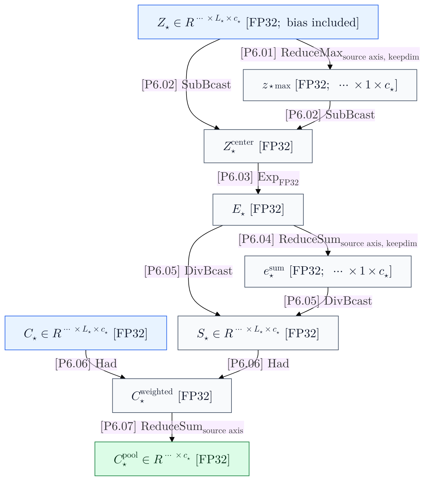
```mermaid
%%{init: {"theme": "base", "flowchart": {"htmlLabels": true, "curve": "basis", "nodeSpacing": 18, "rankSpacing": 26}}}%%
flowchart TD
    P6_C["$$\mathbf C_\star\in\mathbb R^{\cdots\times L_\star\times c_\star}\ [\mathrm{FP32}]$$"]
    P6_Z["$$\mathbf Z_\star\in\mathbb R^{\cdots\times L_\star\times c_\star}\ [\mathrm{FP32};\ \mathrm{bias\ included}]$$"]
    P6_MAX["$$\mathbf z_\star^{\max}\ [\mathrm{FP32};\ \cdots\times1\times c_\star]$$"]
    P6_CTR["$$\mathbf Z_\star^{\mathrm{center}}\ [\mathrm{FP32}]$$"]
    P6_EXP["$$\mathbf E_\star\ [\mathrm{FP32}]$$"]
    P6_SUM["$$\mathbf e_\star^{\mathrm{sum}}\ [\mathrm{FP32};\ \cdots\times1\times c_\star]$$"]
    P6_S["$$\mathbf S_\star\in\mathbb R^{\cdots\times L_\star\times c_\star}\ [\mathrm{FP32}]$$"]
    P6_MUL["$$\mathbf C_\star^{\mathrm{weighted}}\ [\mathrm{FP32}]$$"]
    P6_OUT["$$\mathbf C_\star^{\mathrm{pool}}\in\mathbb R^{\cdots\times c_\star}\ [\mathrm{FP32}]$$"]
    P6_Z -->|"$$[\mathrm{P6.01}]\ \operatorname{ReduceMax}_{\text{source axis, keepdim}}$$"| P6_MAX
    P6_Z & P6_MAX -->|"$$[\mathrm{P6.02}]\ \operatorname{SubBcast}$$"| P6_CTR
    P6_CTR -->|"$$[\mathrm{P6.03}]\ \operatorname{Exp}_{\mathrm{FP32}}$$"| P6_EXP
    P6_EXP -->|"$$[\mathrm{P6.04}]\ \operatorname{ReduceSum}_{\text{source axis, keepdim}}$$"| P6_SUM
    P6_EXP & P6_SUM -->|"$$[\mathrm{P6.05}]\ \operatorname{DivBcast}$$"| P6_S
    P6_C & P6_S -->|"$$[\mathrm{P6.06}]\ \operatorname{Had}$$"| P6_MUL
    P6_MUL -->|"$$[\mathrm{P6.07}]\ \operatorname{ReduceSum}_{\text{source axis}}$$"| P6_OUT
    classDef input fill:#e8f3ff,stroke:#2563eb,color:#0f172a;
    classDef data fill:#f8fafc,stroke:#475569,color:#0f172a;
    classDef output fill:#dcfce7,stroke:#15803d,color:#052e16;
    class P6_C,P6_Z input;
    class P6_MAX,P6_CTR,P6_EXP,P6_SUM,P6_S,P6_MUL data;
    class P6_OUT output;
```

Call sites: [E1-B](#e1-b), [E2-B](#e2-b), [E3-A](#e3-a), [E4-B](#e4-b).
Their existing softmax edge binds P6.01–P6.05; the following multiply/reduce edges bind
P6.06–P6.07. Retain the pool nodes and operation IDs at each site. A completed block has
finite current-block scores for every feature; CSA's missing predecessor is padded with
zero values and $-\infty$ logits. An empty prefill block axis produces an empty output,
not a reduction of a nonempty all-$-\infty$ block. This is a mathematical operator expansion;
PyTorch does not fix a portable bitwise reduction tree for its FP32 softmax.

## C. Shared main-query and current-token shared-KV stems

This graph is executed by SWA, CSA, and HCA.
The normalized query latent is also exported to the CSA lightning indexer.
It is unused by an HCA-specific side path.
Reference implementation: [model.py, lines 490-513](../inference/model.py#L490-L513).

| Symbol / parameter                                     | Stored shape / meaning                                      | Flash                              |
| ------------------------------------------------------ | ----------------------------------------------------------- | ---------------------------------- |
| $P,(p)$                                                | Tensor-parallel size and rank                               | Runtime, valid sizes are $1,2,4,8$ |
| $n_h,n_h^{(p)},d_c$                                    | Main heads, $n_h/P$ local heads, query latent width         | 64, $64/P$, 1024                   |
| $W_\ell^{DQ}$                                          | `wq_a.weight`, $[d_c,d]$; paper $W^{DQ}$ in Eqs. (13), (24) | FP8 + P1 scales                    |
| $\gamma_q$                                             | `q_norm.weight`, $[d_c]$                                    | FP32                               |
| $\mathbf C_\ell^Q$                                     | Normalized query latent, $[B,n,d_c]$; batched paper $c_t^Q$ | BF16, shared with indexer          |
| $W_\ell^{UQ,(p)}$                                      | `wq_b.weight`, $[n_h^{(p)}c,d_c]$; paper $W^{UQ}$           | FP8 + P1 scales                    |
| $W_\ell^{KV,\mathrm{win}}$                             | `wkv.weight`, $[c,d]$; distinct from compressor projection  | FP8 + P1 scales                    |
| $\gamma_{kv}$                                          | `kv_norm.weight`, $[c]$                                     | FP32                               |
| $\mathcal F_\ell,\mathbf F_\ell^q$                     | Full phase table and view $[p_0:p_0+n]$                     | Complex64; [P2 table](#rope-table) |
| $\mathbf Q_\ell^{(p)},\mathbf{KV}_\ell^{\mathrm{now}}$ | Main queries $[B,n,n_h^{(p)},c]$ and shared KV $[B,n,c]$    | BF16                               |

The latent norm is an implementation refinement of paper Eq. (13)/(24).
The main per-head norm C06–C10 has **no learned gain** and returns BF16 at every displayed
step. It cannot be replaced by P5 without changing arithmetic. KV has one shared head;
there is no separate value projection or sequence/head transpose. The same stored KV vector
serves as key and value. SWA uses this complete stem too.

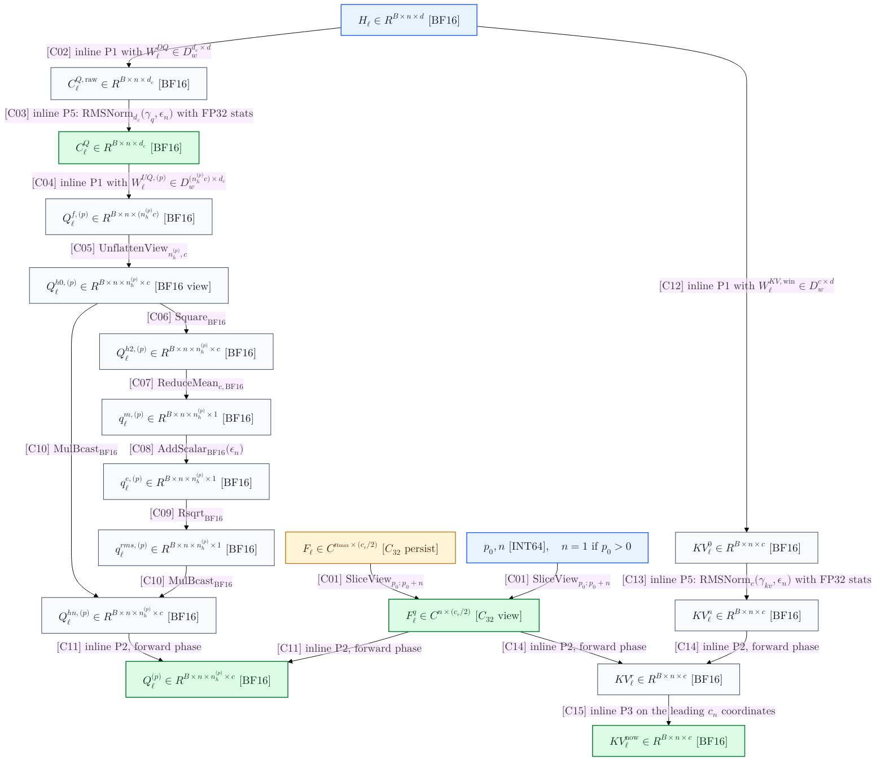
```mermaid
%%{init: {"theme": "base", "flowchart": {"htmlLabels": true, "curve": "basis", "nodeSpacing": 20, "rankSpacing": 30}}}%%
flowchart TD
    C_H["$$\mathbf H_{\ell}\in\mathbb R^{B\times n\times d}\;[\mathrm{BF16}]$$"]
    C_POS["$$p_0,n\;[\mathrm{INT64}],\quad n=1\ \mathrm{if}\ p_0\gt0$$"]
    C_FALL["$$\mathcal F_{\ell}\in\mathbb C^{n_{\max}\times(c_r/2)}\;[\mathbb{C}_{32} \text{ persist}]$$"]
    C_F["$$\mathbf F_{\ell}^{q}\in\mathbb C^{n\times(c_r/2)}\;[\mathbb{C}_{32} \text{ view}]$$"]

    C_QR0["$$\mathbf C_{\ell}^{Q,\mathrm{raw}}\in\mathbb R^{B\times n\times d_c}\;[\mathrm{BF16}]$$"]
    C_QR["$$\mathbf C_{\ell}^{Q}\in\mathbb R^{B\times n\times d_c}\;[\mathrm{BF16}]$$"]
    C_QFL["$$\mathbf Q_{\ell}^{f,(p)}\in\mathbb R^{B\times n\times(n_h^{(p)}c)}\;[\mathrm{BF16}]$$"]
    C_QH0["$$\mathbf Q_{\ell}^{h0,(p)}\in\mathbb R^{B\times n\times n_h^{(p)}\times c}\;[\mathrm{BF16\ view}]$$"]
    C_QSQ["$$\mathbf Q_{\ell}^{h2,(p)}\in\mathbb R^{B\times n\times n_h^{(p)}\times c}\;[\mathrm{BF16}]$$"]
    C_QM["$$\mathbf q_{\ell}^{m,(p)}\in\mathbb R^{B\times n\times n_h^{(p)}\times1}\;[\mathrm{BF16}]$$"]
    C_QE["$$\mathbf q_{\ell}^{e,(p)}\in\mathbb R^{B\times n\times n_h^{(p)}\times1}\;[\mathrm{BF16}]$$"]
    C_QRMS["$$\mathbf q_{\ell}^{rms,(p)}\in\mathbb R^{B\times n\times n_h^{(p)}\times1}\;[\mathrm{BF16}]$$"]
    C_QN["$$\mathbf Q_{\ell}^{hn,(p)}\in\mathbb R^{B\times n\times n_h^{(p)}\times c}\;[\mathrm{BF16}]$$"]
    C_Q["$$\mathbf Q_{\ell}^{(p)}\in\mathbb R^{B\times n\times n_h^{(p)}\times c}\;[\mathrm{BF16}]$$"]

    C_KV0["$$\mathbf{KV}_{\ell}^{0}\in\mathbb R^{B\times n\times c}\;[\mathrm{BF16}]$$"]
    C_KVN["$$\mathbf{KV}_{\ell}^{n}\in\mathbb R^{B\times n\times c}\;[\mathrm{BF16}]$$"]
    C_KVR["$$\mathbf{KV}_{\ell}^{r}\in\mathbb R^{B\times n\times c}\;[\mathrm{BF16}]$$"]
    C_KVNOW["$$\mathbf{KV}_{\ell}^{\mathrm{now}}\in\mathbb R^{B\times n\times c}\;[\mathrm{BF16}]$$"]

    C_FALL & C_POS -->|"$$[\mathrm{C01}]\ \operatorname{SliceView}_{p_0:p_0+n}$$"| C_F

    C_H -->|"$$[\mathrm{C02}]\ \text{inline P1 with }W_{\ell}^{DQ}\in\mathcal D_w^{d_c\times d}$$"| C_QR0
    C_QR0 -->|"$$[\mathrm{C03}]\ \text{inline P5: }\operatorname{RMSNorm}_{d_c}(\gamma_q,\epsilon_n)\ \text{with FP32 stats}$$"| C_QR
    C_QR -->|"$$[\mathrm{C04}]\ \text{inline P1 with }W_{\ell}^{UQ,(p)}\in\mathcal D_w^{(n_h^{(p)}c)\times d_c}$$"| C_QFL
    C_QFL -->|"$$[\mathrm{C05}]\ \operatorname{UnflattenView}_{n_h^{(p)},c}$$"| C_QH0
    C_QH0 -->|"$$[\mathrm{C06}]\ \operatorname{Square}_{\mathrm{BF16}}$$"| C_QSQ
    C_QSQ -->|"$$[\mathrm{C07}]\ \operatorname{ReduceMean}_{c,\mathrm{BF16}}$$"| C_QM
    C_QM -->|"$$[\mathrm{C08}]\ \operatorname{AddScalar}_{\mathrm{BF16}}(\epsilon_n)$$"| C_QE
    C_QE -->|"$$[\mathrm{C09}]\ \operatorname{Rsqrt}_{\mathrm{BF16}}$$"| C_QRMS
    C_QH0 & C_QRMS -->|"$$[\mathrm{C10}]\ \operatorname{MulBcast}_{\mathrm{BF16}}$$"| C_QN
    C_QN & C_F -->|"$$[\mathrm{C11}]\ \text{inline P2, forward phase}$$"| C_Q

    C_H -->|"$$[\mathrm{C12}]\ \text{inline P1 with }W_{\ell}^{KV,\mathrm{win}}\in\mathcal D_w^{c\times d}$$"| C_KV0
    C_KV0 -->|"$$[\mathrm{C13}]\ \text{inline P5: }\operatorname{RMSNorm}_{c}(\gamma_{kv},\epsilon_n)\ \text{with FP32 stats}$$"| C_KVN
    C_F & C_KVN -->|"$$[\mathrm{C14}]\ \text{inline P2, forward phase}$$"| C_KVR
    C_KVR -->|"$$[\mathrm{C15}]\ \text{inline P3 on the leading }c_n\text{ coordinates}$$"| C_KVNOW

    classDef input fill:#e8f3ff,stroke:#2563eb,color:#0f172a,stroke-width:1.5px;
    classDef cache fill:#fff4d6,stroke:#b7791f,color:#422006,stroke-width:1.4px;
    classDef data fill:#f8fafc,stroke:#475569,color:#0f172a,stroke-width:1.1px;
    classDef output fill:#dcfce7,stroke:#15803d,color:#052e16,stroke-width:1.6px;
    class C_H,C_POS input;
    class C_FALL cache;
    class C_QR0,C_QFL,C_QH0,C_QSQ,C_QM,C_QE,C_QRMS,C_QN,C_KV0,C_KVN,C_KVR data;
    class C_F,C_QR,C_Q,C_KVNOW output;
```

Subgraphs: [A2 input](#a2), [P1 FP8 GEMM](#p1), [P2 RoPE](#p2), [P3 QDQ](#p3), [P5 RMSNorm](#p5), [indexer latent consumer](#f0), [core query consumer](#h1).

## D. Causal-window index

This is the exact arithmetic expansion of [model.py, lines 260-271](../inference/model.py#L260-L271).
It produces gather addresses only; it does not gather KV data.
`get_window_topk_idxs` uses `lru_cache(1)`: layers with identical window, batch, call-length,
and start-position arguments can reuse the resulting immutable index tensor. D1/D2 describe
the computation on a cache miss, not an additional kernel required on every layer.

### D1. Prefill window indices

| Symbol                             | Meaning / exact width                                                                           |
| ---------------------------------- | ----------------------------------------------------------------------------------------------- |
| $n_{\mathrm{win}}$                 | `window_size=128`; includes the current token                                                   |
| $t$                                | Zero-based row within this call; absolute query position $p_0+t$                                |
| $\bar K^{\mathrm{win}}$            | Fixed window-address width: $\min(n,n_{\mathrm{win}})$ in prefill, $n_{\mathrm{win}}$ in decode |
| $\mathbf{Idx}_\ell^{\mathrm{win}}$ | INT32 gather addresses, $[B,n,\bar K^{\mathrm{win}}]$; invalid slots are $-1$                   |

Prefill address $j$ is $\max(t-n_{\mathrm{win}}+1,0)+j$, replaced by $-1$ when greater than $t$.
Decode reads ring slots in chronological order, ending at $p_0\bmod n_{\mathrm{win}}$.
The number of valid local entries is $\min(p_0+t+1,n_{\mathrm{win}})$, distinct from the
fixed physical address width. The index list is shared across all query heads.

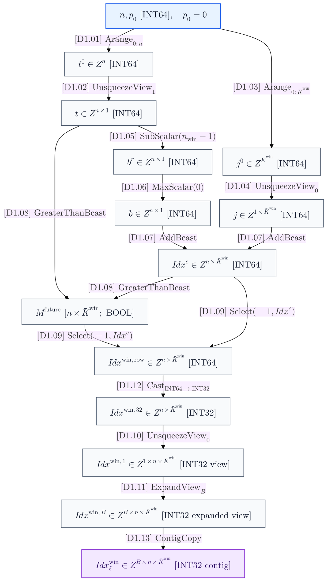
```mermaid
%%{init: {"theme": "base", "flowchart": {"htmlLabels": true, "curve": "basis", "nodeSpacing": 20, "rankSpacing": 28}}}%%
flowchart TD
    D1_S["$$n,p_0\;[\mathrm{INT64}],\quad p_0=0$$"]
    D1_T0["$$\mathbf t^{0}\in\mathbb Z^{n}\;[\mathrm{INT64}]$$"]
    D1_T["$$\mathbf t\in\mathbb Z^{n\times1}\;[\mathrm{INT64}]$$"]
    D1_J0["$$\mathbf j^{0}\in\mathbb Z^{\bar K^{\mathrm{win}}}\;[\mathrm{INT64}]$$"]
    D1_J["$$\mathbf j\in\mathbb Z^{1\times\bar K^{\mathrm{win}}}\;[\mathrm{INT64}]$$"]
    D1_BR["$$\mathbf b^{r}\in\mathbb Z^{n\times1}\;[\mathrm{INT64}]$$"]
    D1_B["$$\mathbf b\in\mathbb Z^{n\times1}\;[\mathrm{INT64}]$$"]
    D1_CAND["$$\mathbf{Idx}^{c}\in\mathbb Z^{n\times\bar K^{\mathrm{win}}}\;[\mathrm{INT64}]$$"]
    D1_MASK["$$\mathbf M^{\mathrm{future}}\;[n\times\bar K^{\mathrm{win}};\ \mathrm{BOOL}]$$"]
    D1_ROW["$$\mathbf{Idx}^{\mathrm{win,row}}\in\mathbb Z^{n\times\bar K^{\mathrm{win}}}\;[\mathrm{INT64}]$$"]
    D1_UNS["$$\mathbf{Idx}^{\mathrm{win},1}\in\mathbb Z^{1\times n\times\bar K^{\mathrm{win}}}\;[\mathrm{INT32\ view}]$$"]
    D1_EXP["$$\mathbf{Idx}^{\mathrm{win},B}\in\mathbb Z^{B\times n\times\bar K^{\mathrm{win}}}\;[\mathrm{INT32\ expanded\ view}]$$"]
    D1_CAST["$$\mathbf{Idx}^{\mathrm{win},32}\in\mathbb Z^{n\times\bar K^{\mathrm{win}}}\;[\mathrm{INT32}]$$"]
    D1_OUT["$$\mathbf{Idx}_{\ell}^{\mathrm{win}}\in\mathbb Z^{B\times n\times\bar K^{\mathrm{win}}}\;[\mathrm{INT32\ contig}]$$"]

    D1_S -->|"$$[\mathrm{D1.01}]\ \operatorname{Arange}_{0:n}$$"| D1_T0
    D1_T0 -->|"$$[\mathrm{D1.02}]\ \operatorname{UnsqueezeView}_{1}$$"| D1_T
    D1_S -->|"$$[\mathrm{D1.03}]\ \operatorname{Arange}_{0:\bar K^{\mathrm{win}}}$$"| D1_J0
    D1_J0 -->|"$$[\mathrm{D1.04}]\ \operatorname{UnsqueezeView}_{0}$$"| D1_J
    D1_T -->|"$$[\mathrm{D1.05}]\ \operatorname{SubScalar}(n_{\mathrm{win}}-1)$$"| D1_BR
    D1_BR -->|"$$[\mathrm{D1.06}]\ \operatorname{MaxScalar}(0)$$"| D1_B
    D1_B & D1_J -->|"$$[\mathrm{D1.07}]\ \operatorname{AddBcast}$$"| D1_CAND
    D1_T & D1_CAND -->|"$$[\mathrm{D1.08}]\ \operatorname{GreaterThanBcast}$$"| D1_MASK
    D1_MASK & D1_CAND -->|"$$[\mathrm{D1.09}]\ \operatorname{Select}(-1,\mathbf{Idx}^c)$$"| D1_ROW
    D1_CAST -->|"$$[\mathrm{D1.10}]\ \operatorname{UnsqueezeView}_{0}$$"| D1_UNS
    D1_UNS -->|"$$[\mathrm{D1.11}]\ \operatorname{ExpandView}_{B}$$"| D1_EXP
    D1_ROW -->|"$$[\mathrm{D1.12}]\ \operatorname{Cast}_{\mathrm{INT64}\rightarrow\mathrm{INT32}}$$"| D1_CAST
    D1_EXP -->|"$$[\mathrm{D1.13}]\ \operatorname{ContigCopy}$$"| D1_OUT

    classDef input fill:#e8f3ff,stroke:#2563eb,color:#0f172a,stroke-width:1.5px;
    classDef data fill:#f8fafc,stroke:#475569,color:#0f172a,stroke-width:1.1px;
    classDef index fill:#f3e8ff,stroke:#7e22ce,color:#2e1065,stroke-width:1.3px;
    class D1_S input;
    class D1_T0,D1_T,D1_J0,D1_J,D1_BR,D1_B,D1_CAND,D1_MASK,D1_ROW,D1_UNS,D1_EXP,D1_CAST data;
    class D1_OUT index;
```

Subgraphs: [prefill bank](#g3), [index-list assembly](#g5).

### D2. Single-token decode window indices

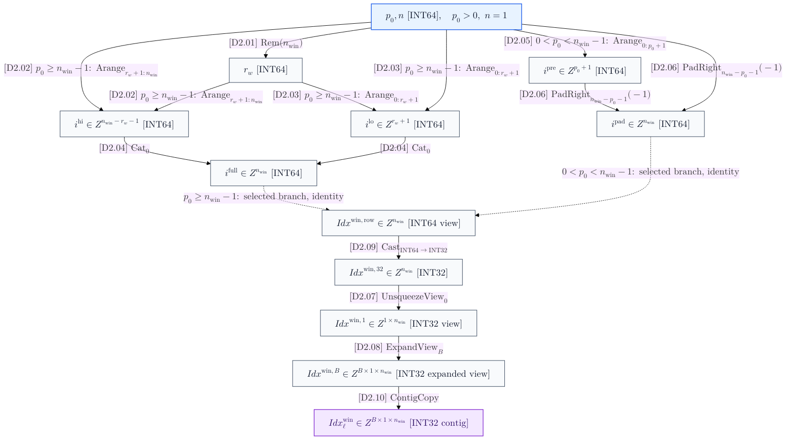
```mermaid
%%{init: {"theme": "base", "flowchart": {"htmlLabels": true, "curve": "basis", "nodeSpacing": 20, "rankSpacing": 28}}}%%
flowchart TD
    D2_P["$$p_0,n\;[\mathrm{INT64}],\quad p_0\gt0,\ n=1$$"]
    D2_R["$$r_w\;[\mathrm{INT64}]$$"]
    D2_HI["$$\mathbf i^{\mathrm{hi}}\in\mathbb Z^{n_{\mathrm{win}}-r_w-1}\;[\mathrm{INT64}]$$"]
    D2_LO["$$\mathbf i^{\mathrm{lo}}\in\mathbb Z^{r_w+1}\;[\mathrm{INT64}]$$"]
    D2_FULL["$$\mathbf i^{\mathrm{full}}\in\mathbb Z^{n_{\mathrm{win}}}\;[\mathrm{INT64}]$$"]
    D2_PRE["$$\mathbf i^{\mathrm{pre}}\in\mathbb Z^{p_0+1}\;[\mathrm{INT64}]$$"]
    D2_PAD["$$\mathbf i^{\mathrm{pad}}\in\mathbb Z^{n_{\mathrm{win}}}\;[\mathrm{INT64}]$$"]
    D2_ROW["$$\mathbf{Idx}^{\mathrm{win,row}}\in\mathbb Z^{n_{\mathrm{win}}}\;[\mathrm{INT64\ view}]$$"]
    D2_UNS["$$\mathbf{Idx}^{\mathrm{win},1}\in\mathbb Z^{1\times n_{\mathrm{win}}}\;[\mathrm{INT32\ view}]$$"]
    D2_EXP["$$\mathbf{Idx}^{\mathrm{win},B}\in\mathbb Z^{B\times1\times n_{\mathrm{win}}}\;[\mathrm{INT32\ expanded\ view}]$$"]
    D2_CAST["$$\mathbf{Idx}^{\mathrm{win},32}\in\mathbb Z^{n_{\mathrm{win}}}\;[\mathrm{INT32}]$$"]
    D2_OUT["$$\mathbf{Idx}_{\ell}^{\mathrm{win}}\in\mathbb Z^{B\times1\times n_{\mathrm{win}}}\;[\mathrm{INT32\ contig}]$$"]

    D2_P -->|"$$[\mathrm{D2.01}]\ \operatorname{Rem}(n_{\mathrm{win}})$$"| D2_R
    D2_P & D2_R -->|"$$[\mathrm{D2.02}]\ p_0\ge n_{\mathrm{win}}-1:\ \operatorname{Arange}_{r_w+1:n_{\mathrm{win}}}$$"| D2_HI
    D2_R & D2_P -->|"$$[\mathrm{D2.03}]\ p_0\ge n_{\mathrm{win}}-1:\ \operatorname{Arange}_{0:r_w+1}$$"| D2_LO
    D2_HI & D2_LO -->|"$$[\mathrm{D2.04}]\ \operatorname{Cat}_{0}$$"| D2_FULL
    D2_P -->|"$$[\mathrm{D2.05}]\ 0\lt p_0\lt n_{\mathrm{win}}-1:\ \operatorname{Arange}_{0:p_0+1}$$"| D2_PRE
    D2_PRE & D2_P -->|"$$[\mathrm{D2.06}]\ \operatorname{PadRight}_{n_{\mathrm{win}}-p_0-1}(-1)$$"| D2_PAD
    D2_FULL -.->|"$$p_0\ge n_{\mathrm{win}}-1:\ \text{selected branch, identity}$$"| D2_ROW
    D2_PAD -.->|"$$0\lt p_0\lt n_{\mathrm{win}}-1:\ \text{selected branch, identity}$$"| D2_ROW
    D2_CAST -->|"$$[\mathrm{D2.07}]\ \operatorname{UnsqueezeView}_{0}$$"| D2_UNS
    D2_UNS -->|"$$[\mathrm{D2.08}]\ \operatorname{ExpandView}_{B}$$"| D2_EXP
    D2_ROW -->|"$$[\mathrm{D2.09}]\ \operatorname{Cast}_{\mathrm{INT64}\rightarrow\mathrm{INT32}}$$"| D2_CAST
    D2_EXP -->|"$$[\mathrm{D2.10}]\ \operatorname{ContigCopy}$$"| D2_OUT

    classDef input fill:#e8f3ff,stroke:#2563eb,color:#0f172a,stroke-width:1.5px;
    classDef data fill:#f8fafc,stroke:#475569,color:#0f172a,stroke-width:1.1px;
    classDef index fill:#f3e8ff,stroke:#7e22ce,color:#2e1065,stroke-width:1.3px;
    class D2_P input;
    class D2_R,D2_HI,D2_LO,D2_FULL,D2_PRE,D2_PAD,D2_ROW,D2_UNS,D2_EXP,D2_CAST data;
    class D2_OUT index;
```

Subgraphs: [decode bank](#g4), [index-list assembly](#g5).

## E. Compression state machines

The CSA overlap state machine is executed twice with independent parameters and buffers. In
E1/E2, $c_\star=c$ denotes the main attention-compressor instance and $c_\star=c_I$ denotes
the lightning-indexer compressor instance.

| CSA instance      | Raw projected width | Persistent incomplete states                     | Post-pooling path             | Persistent completed cache        |
| ----------------- | ------------------- | ------------------------------------------------ | ----------------------------- | --------------------------------- |
| Main attention    | $2c$                | $(\mathcal S_\ell^{kv},\mathcal S_\ell^z)$       | RMSNorm, block-start RoPE, P3 | $\mathcal K_\ell^{\mathrm{comp}}$ |
| Lightning indexer | $2c_I$              | $(\mathcal S_\ell^{I,kv},\mathcal S_\ell^{I,z})$ | RMSNorm, block-start RoPE, P4 | $\mathcal K_\ell^I$               |

The two rows are two executions, not aliases. Implementation references for all four state machines:
[model.py, lines 285-383](../inference/model.py#L285-L383).

For CSA branch lettering, the projected second half is paper branch $a$ (the current block),
whereas the projected first half is paper branch $b$ (the preceding block). The executable code
names these operands by half and time rather than by the paper's letters.

> A repeated node ID is the same tensor or persistent state exposed again as a diagram port;
> it performs no copy, packing, or concatenation.
> A guard in a diagram or subgraph title applies to every operation in that scope and replaces repeated guard arrows.

### E1. CSA overlapping compression - prefill

E1-A's completed-block and remainder state writes are independent: when both predicates hold,
both lanes execute. E1-B still constructs the logical pool when the completed-prefix length is zero;
the no-emission exit therefore remains after pooling.

#### E1-A. Projection, compression plan, and incomplete-state writes

| Symbol / parameter                                                            | Meaning and stored shape                                                                                                                      |
| ----------------------------------------------------------------------------- | --------------------------------------------------------------------------------------------------------------------------------------------- |
| $m,m',m_\ell$                                                                 | CSA rate 4, HCA rate 128, selected layer rate; $m_\ell=0$ for SWA                                                                             |
| $n_\ell^{\mathrm{comp}}$                                                      | Completed block count after call: $\lfloor(p_0+n)/m_\ell\rfloor$ for compressed layers                                                        |
| $n_\ell^{\mathrm{new}}$                                                       | Newly emitted entries: $\lfloor n/m_\ell\rfloor$ in prefill; $\mathbf1[(p_0+1)\bmod m_\ell=0]$ in decode; zero for SWA                        |
| $c_\star$                                                                     | 512 for main compressor, 128 for index compressor; two independent executions                                                                 |
| $r_C,s_C,e_C^{\mathrm{pre}}$                                                  | Prefill remainder $n\bmod m$, complete-prefix length $n-r_C$, emission guard $[n\ge m]$                                                       |
| $W_{\ell,\star}^{KV}$                                                         | `compressor.wkv.weight`, FP32 $[2c_\star,d]$, packed **paper $b$ first, $a$ second**                                                          |
| $W_{\ell,\star}^{Z}$                                                          | `compressor.wgate.weight`, FP32 $[2c_\star,d]$, same branch order                                                                             |
| $\mathbf B_{C,\star}$                                                         | `compressor.ape`, FP32 $[m,2c_\star]$; packed $[B^b\mid B^a]$ from paper Eq. (11)                                                             |
| $\gamma_{C,\star}$                                                            | Each instance's `compressor.norm.weight`, distinct learned FP32 $[c_\star]$                                                                   |
| $\mathbf C_{\ell,\star}^{\mathrm{raw}},\mathbf Z_{\ell,\star}^{\mathrm{raw}}$ | FP32 packed values $[C^b\mid C^a]$ and gate logits $[Z^b\mid Z^a]$, before positional bias                                                    |
| $\mathcal S_{\ell,\star}^{kv},\mathcal S_{\ell,\star}^{z}$                    | Independent FP32 buffers $[B_{\max},2m,2c_\star]$; front $m$ token slots = preceding block, rear $m$ = current block                          |
| $B_{\max}$                                                                    | Allocated batch capacity, `max_batch_size` (default 4, interactive generation 1); only `:B` is active                                         |
| $\mathcal K_\ell^{\mathrm{comp}},\mathcal K_\ell^I$                           | Main completed-cache suffix $[B_{\max},\lfloor n_{\max}/m\rfloor,c]$ and independent index cache $[B_{\max},\lfloor n_{\max}/m\rfloor,c_I]$   |
| $\mathbf C_\ell^{\mathrm{Comp,emit}},\mathbf K_\ell^{\mathrm{IComp,emit}}$    | Returned completed vectors after norm/RoPE/QDQ; correspond to paper $C^{\mathrm{Comp}}$, $K^{\mathrm{IComp}}$ with implementation refinements |

All these weights are replicated across tensor-parallel ranks. The compressor checkpoint
projections are BF16 but the runtime parameters are FP32; they bypass P1. Feature-wise pooling
uses [P6](#p6), followed by the explicitly shown BF16 cast, [P5](#p5), and RoPE/QDQ tail.
The code gathers source slots in **preceding $b$, current $a$** order, while paper Eq. (11)
writes current $a$, preceding $b$. The branches agree mathematically when values, gates,
and biases are permuted together; retain the code's order for numerical matching.

**Initialization and slot reuse.** At construction, completed caches and `kv_state` are zero;
`score_state` is $-\infty$. A new `start_pos=0` call only overwrites the shown slices, so it
is not a reset. In particular, a reused CSA slot with a new prefill shorter than four tokens
retains the old preceding block; its first decode emission can mix sequences. Restore the
initial incomplete state for reused slots before prefill. This is a caller obligation, not a
hidden operation in the forward graph. Consecutive calls must keep the same sequence in each
batch slot; there is no per-example position/length mask.
(Source: [Compressor initialization and forward](../inference/model.py#L285-L383).)

```mermaid
%%{init: {"theme": "base", "layout": "elk", "flowchart": {"htmlLabels": true, "curve": "basis", "nodeSpacing": 22, "rankSpacing": 32}}}%%
flowchart LR
    E1_H["$$\mathbf H_{\ell}\in\mathbb R^{B\times n\times d}\;[\mathrm{BF16}],\quad p_0=0$$"]
    E1_S["$$n\;[\mathrm{INT64}]$$"]

    subgraph E1_PROJ["Projection"]
        direction TD
        E1_H32["$$\mathbf H_{\ell}^{32}\in\mathbb R^{B\times n\times d}\;[\mathrm{FP32}]$$"]
        E1_V["$$\mathbf C_{\ell,\star}^{\mathrm{raw}}\in\mathbb R^{B\times n\times(2c_\star)}\;[\mathrm{FP32}]$$"]
        E1_Z["$$\mathbf Z_{\ell,\star}^{\mathrm{raw}}\in\mathbb R^{B\times n\times(2c_\star)}\;[\mathrm{FP32}]$$"]
    end

    subgraph E1_PLAN["Prefill compression"]
        direction TD
        E1_REM["$$r_C\;[\mathrm{INT64}]$$"]
        E1_CUT["$$s_C\;[\mathrm{INT64}]$$"]
        E1_READY["$$e_C^{\mathrm{pre}}\;[\mathrm{BOOL}]$$"]
    end

    subgraph E1_LAST["Trailing completed block state — execute when $$s_C\ge{m}$$"]
        direction TD
        E1_LASTV["$$\mathbf C_{\ell,\star}^{\mathrm{last}}\in\mathbb R^{B\times{m}\times(2c_\star)}\;[\mathrm{FP32\ view}]$$"]
        E1_LASTZ["$$\mathbf Z_{\ell,\star}^{\mathrm{last}}\in\mathbb R^{B\times{m}\times(2c_\star)}\;[\mathrm{FP32\ view}]$$"]
        E1_LASTZA["$$\mathbf Z_{\ell,\star}^{\mathrm{last+ape}}\in\mathbb R^{B\times{m}\times(2c_\star)}\;[\mathrm{FP32}]$$"]
        E1_PREVV["$$\mathcal S_{\ell,\star}^{kv}[:,0:{m},:]\;[\mathrm{FP32\ persist}]$$"]
        E1_PREVZ["$$\mathcal S_{\ell,\star}^{z}[:,0:{m},:]\;[\mathrm{FP32\ persist}]$$"]
    end

    subgraph E1_REMAINDER["Current remainder state — execute when $$r_C\gt0$$"]
        direction TD
        E1_REMV["$$\mathbf C_{\ell,\star}^{\mathrm{rem}}\in\mathbb R^{B\times r_C\times(2c_\star)}\;[\mathrm{FP32\ view}]$$"]
        E1_REMZ["$$\mathbf Z_{\ell,\star}^{\mathrm{rem}}\in\mathbb R^{B\times r_C\times(2c_\star)}\;[\mathrm{FP32\ view}]$$"]
        E1_REMZA["$$\mathbf Z_{\ell,\star}^{\mathrm{rem+ape}}\in\mathbb R^{B\times r_C\times(2c_\star)}\;[\mathrm{FP32}]$$"]
        E1_CURV["$$\begin{gathered} \mathcal S_{\ell,\star}^{kv,+}\in\mathbb R^{B_{\max}\times(2{m})\times(2c_\star)}\\\\ [\mathrm{FP32\ persist};\ \mathrm{current\ half\ written}] \end{gathered}$$"]
        E1_CURZ["$$\begin{gathered} \mathcal S_{\ell,\star}^{z,+}\in\mathbb R^{B_{\max}\times(2{m})\times(2c_\star)}\\\\ [\mathrm{FP32\ persist};\ \mathrm{current\ half\ written}] \end{gathered}$$"]
    end

    E1_H -->|"$$[\mathrm{E1.01}]\ \operatorname{Cast}_{\mathrm{BF16}\rightarrow\mathrm{FP32}}$$"| E1_H32
    E1_H32 -->|"$$[\mathrm{E1.02}]\ \operatorname{GEMM}(W_{\ell,\star}^{KV}\in\mathbb R^{(2c_\star)\times d}) $$"| E1_V
    E1_H32 -->|"$$[\mathrm{E1.03}]\ \operatorname{GEMM}(W_{\ell,\star}^{Z}\in\mathbb R^{(2c_\star)\times d}) $$"| E1_Z

    E1_S -->|"$$[\mathrm{E1.04}]\ \operatorname{Rem}({m})$$"| E1_REM
    E1_S -->|"$$[\mathrm{E1.05}]\ \operatorname{Sub}$$"| E1_CUT
    E1_REM -->|"$$[\mathrm{E1.05}]$$"| E1_CUT
    E1_S -->|"$$[\mathrm{E1.05g}]\ \operatorname{GreaterEqScalar}({m})$$"| E1_READY

    E1_V -->|"$$[\mathrm{E1.06}]\ \operatorname{SliceView}_{\mathrm{trailing}}$$"| E1_LASTV
    E1_CUT -->|"$$[\mathrm{E1.06}]$$"| E1_LASTV
    E1_Z -->|"$$[\mathrm{E1.07}]\ \operatorname{SliceView}_{\mathrm{trailing}}$$"| E1_LASTZ
    E1_CUT -->|"$$[\mathrm{E1.07}]$$"| E1_LASTZ
    E1_LASTZ -->|"$$[\mathrm{E1.08}]\ \operatorname{AddBcast}(\mathbf B_{C,\star})$$"| E1_LASTZA
    E1_LASTV -->|"$$[\mathrm{E1.09V}]\ \operatorname{CacheWrite}_{\mathrm{half}}$$"| E1_PREVV
    E1_LASTZA -->|"$$[\mathrm{E1.09Z}]\ \operatorname{CacheWrite}_{\mathrm{half}}$$"| E1_PREVZ

    E1_V -->|"$$[\mathrm{E1.10}]\ \operatorname{SliceView}_{\mathrm{rem}}$$"| E1_REMV
    E1_CUT -->|"$$[\mathrm{E1.10}]$$"| E1_REMV
    E1_S -->|"$$[\mathrm{E1.10}]$$"| E1_REMV
    E1_Z -->|"$$[\mathrm{E1.11}]\ \operatorname{SliceView}_{\mathrm{rem}}$$"| E1_REMZ
    E1_CUT -->|"$$[\mathrm{E1.11}]$$"| E1_REMZ
    E1_S -->|"$$[\mathrm{E1.11}]$$"| E1_REMZ
    E1_REMZ -->|"$$[\mathrm{E1.12}]\ \operatorname{AddBcast}(\mathbf B_{C,\star}[0:r_C])$$"| E1_REMZA
    E1_REMV -->|"$$[\mathrm{E1.13V}]\ \operatorname{CacheWrite}_{\mathrm{half}}$$"| E1_CURV
    E1_REMZA -->|"$$[\mathrm{E1.13Z}]\ \operatorname{CacheWrite}_{\mathrm{half}}$$"| E1_CURZ

    classDef input fill:#e8f3ff,stroke:#2563eb,color:#0f172a,stroke-width:1.5px;
    classDef data fill:#f8fafc,stroke:#475569,color:#0f172a,stroke-width:1.05px;
    classDef cache fill:#fff4d6,stroke:#b7791f,color:#422006,stroke-width:1.4px;
    class E1_H,E1_S input;
    class E1_PREVV,E1_PREVZ,E1_CURV,E1_CURZ cache;
    class E1_H32,E1_V,E1_Z,E1_REM,E1_CUT,E1_READY,E1_LASTV,E1_LASTZ,E1_LASTZA,E1_REMV,E1_REMZ,E1_REMZA data;
    style E1_PROJ fill:#f8fbff,stroke:#60a5fa,stroke-width:1px;
    style E1_PLAN fill:#f8fafc,stroke:#94a3b8,stroke-width:1px;
    style E1_LAST fill:#fffaf0,stroke:#d97706,stroke-width:1px;
    style E1_REMAINDER fill:#f0fdf4,stroke:#22c55e,stroke-width:1px;
```

Subgraphs: [attention input](#c), [completed-prefix pooling](#e1-b), [next-call state insertion](#e2-a).

#### E1-B. Completed-prefix source construction and pooling

```mermaid
%%{init: {"theme": "base", "layout": "elk", "flowchart": {"htmlLabels": true, "curve": "basis", "nodeSpacing": 20, "rankSpacing": 30}}}%%
flowchart LR
    E1_H["$$\mathbf H_{\ell}\in\mathbb R^{B\times n\times d}\;[\mathrm{BF16\ port}]$$"]
    E1_CUT["$$s_C\;[\mathrm{INT64\ port}]$$"]
    E1_Z["$$\mathbf Z_{\ell,\star}^{\mathrm{raw}}\in\mathbb R^{B\times n\times(2c_\star)}\;[\mathrm{FP32\ port}]$$"]
    E1_V["$$\mathbf C_{\ell,\star}^{\mathrm{raw}}\in\mathbb R^{B\times n\times(2c_\star)}\;[\mathrm{FP32\ port}]$$"]

    subgraph E1_GROUP["Completed-prefix grouping"]
        direction TD
        E1_VP["$$\mathbf C_{\ell,\star}^{\mathrm{prefix}}\in\mathbb R^{B\times s_C\times(2c_\star)}\;[\mathrm{FP32\ view}]$$"]
        E1_ZP["$$\mathbf Z_{\ell,\star}^{\mathrm{prefix}}\in\mathbb R^{B\times s_C\times(2c_\star)}\;[\mathrm{FP32\ view}]$$"]
        E1_VG["$$\mathbf C_{\ell,\star}^{\mathrm{group}}\in\mathbb R^{B\times n_{\ell}^{\mathrm{new}}\times{m}\times(2c_\star)}\;[\mathrm{FP32\ view}]$$"]
        E1_ZG["$$\mathbf Z_{\ell,\star}^{\mathrm{group}}\in\mathbb R^{B\times n_{\ell}^{\mathrm{new}}\times{m}\times(2c_\star)}\;[\mathrm{FP32\ view}]$$"]
        E1_ZA["$$\mathbf Z_{\ell,\star}^{\mathrm{group+ape}}\in\mathbb R^{B\times n_{\ell}^{\mathrm{new}}\times{m}\times(2c_\star)}\;[\mathrm{FP32}]$$"]
    end

    subgraph E1_VALUE["Value"]
        direction TD
        E1_SRCV0["$$\mathbf C_{\ell,\star}^{\mathrm{src0}}\in\mathbb R^{B\times n_{\ell}^{\mathrm{new}}\times(2{m})\times c_\star}\;[\mathrm{FP32\ allocated\ zeros}]$$"]
        E1_VB["$$\mathbf C_{\ell,\star}^{a,\mathrm{cur}}\in\mathbb R^{B\times n_{\ell}^{\mathrm{new}}\times{m}\times c_\star}\;[\mathrm{FP32\ view}]$$"]
        E1_VA["$$\mathbf C_{\ell,\star}^{b,\mathrm{prev}}\in\mathbb R^{B\times\max(n_{\ell}^{\mathrm{new}}-1,0)\times{m}\times c_\star}\;[\mathrm{FP32\ view}]$$"]
        E1_SRCV1["$$\mathbf C_{\ell,\star}^{\mathrm{src1}}\in\mathbb R^{B\times n_{\ell}^{\mathrm{new}}\times(2{m})\times c_\star}\;[\mathrm{FP32}]$$"]
        E1_SRCV["$$\mathbf C_{\ell,\star}^{\mathrm{src}}\in\mathbb R^{B\times n_{\ell}^{\mathrm{new}}\times(2{m})\times c_\star}\;[\mathrm{FP32}]$$"]
    end

    subgraph E1_SCORE["Score"]
        direction TD
        E1_SRCZ0["$$\mathbf Z_{\ell,\star}^{\mathrm{src0}}\in\mathbb R^{B\times n_{\ell}^{\mathrm{new}}\times(2{m})\times c_\star}\;[\mathrm{FP32\ allocated}\ -\infty]$$"]
        E1_ZB["$$\mathbf Z_{\ell,\star}^{a,\mathrm{cur}}\in\mathbb R^{B\times n_{\ell}^{\mathrm{new}}\times{m}\times c_\star}\;[\mathrm{FP32\ view}]$$"]
        E1_ZAA["$$\mathbf Z_{\ell,\star}^{b,\mathrm{prev}}\in\mathbb R^{B\times\max(n_{\ell}^{\mathrm{new}}-1,0)\times{m}\times c_\star}\;[\mathrm{FP32\ view}]$$"]
        E1_SRCZ1["$$\mathbf Z_{\ell,\star}^{\mathrm{src1}}\in\mathbb R^{B\times n_{\ell}^{\mathrm{new}}\times(2{m})\times c_\star}\;[\mathrm{FP32}]$$"]
        E1_SRCZ["$$\mathbf Z_{\ell,\star}^{\mathrm{src}}\in\mathbb R^{B\times n_{\ell}^{\mathrm{new}}\times(2{m})\times c_\star}\;[\mathrm{FP32}]$$"]
    end

    subgraph E1_POOLING["Learned pooling"]
        direction TD
        E1_READY["$$e_C^{\mathrm{pre}}\;[\mathrm{BOOL\ port}]$$"]
        E1_CURV["$$\begin{gathered} \mathcal S_{\ell,\star}^{kv,+}\in\mathbb R^{B_{\max}\times(2{m})\times(2c_\star)}\\\\ [\mathrm{FP32\ persist};\ \mathrm{current\ half\ written}] \end{gathered}$$"]
        E1_CURZ["$$\begin{gathered} \mathcal S_{\ell,\star}^{z,+}\in\mathbb R^{B_{\max}\times(2{m})\times(2c_\star)}\\\\ [\mathrm{FP32\ persist};\ \mathrm{current\ half\ written}] \end{gathered}$$"]
        E1_W["$$\mathbf S_{\ell,\star}^{\mathrm{pool}}\in\mathbb R^{B\times n_{\ell}^{\mathrm{new}}\times(2{m})\times c_\star}\;[\mathrm{FP32}]$$"]
        E1_MUL["$$\mathbf C_{\ell,\star}^{\mathrm{weighted}}\in\mathbb R^{B\times n_{\ell}^{\mathrm{new}}\times(2{m})\times c_\star}\;[\mathrm{FP32}]$$"]
        E1_POOL["$$\mathbf C_{\ell,\star}^{\mathrm{pool}}\in\mathbb R^{B\times n_{\ell}^{\mathrm{new}}\times c_\star}\;[\mathrm{FP32}]$$"]
    end

    E1_STATEONLY["$$\begin{gathered} (\mathcal S_{\ell,\star}^{kv,+},\mathcal S_{\ell,\star}^{z,+})\\\\ [\mathrm{FP32\ persist};\ \mathrm{no\ compressed\ emission}] \end{gathered}$$"]

    E1_V -->|"$$[\mathrm{E1.14}]\ \operatorname{SliceView}_{\mathrm{completed\ prefix}}$$"| E1_VP
    E1_CUT -->|"$$[\mathrm{E1.14}]$$"| E1_VP
    E1_CUT -->|"$$[\mathrm{E1.15}]$$"| E1_ZP
    E1_Z -->|"$$[\mathrm{E1.15}]\ \operatorname{SliceView}_{\mathrm{completed\ prefix}}$$"| E1_ZP
    E1_VP -->|"$$[\mathrm{E1.16}]\ \operatorname{UnflattenView}_{n_{\ell}^{\mathrm{new}},{m}}$$"| E1_VG
    E1_ZP -->|"$$[\mathrm{E1.17}]\ \operatorname{UnflattenView}_{n_{\ell}^{\mathrm{new}},{m}}$$"| E1_ZG
    E1_ZG -->|"$$[\mathrm{E1.18}]\ \operatorname{AddBcast}(\mathbf B_{C,\star})$$"| E1_ZA

    E1_CUT -->|"$$[\mathrm{E1.19}]$$"| E1_SRCV0
    E1_H -->|"$$[\mathrm{E1.19}]\ \operatorname{AllocateFill}(0)$$"| E1_SRCV0
    E1_VG -->|"$$[\mathrm{E1.21}]\ \operatorname{SliceView}_{\mathrm{current}\ a}$$"| E1_VB
    E1_VG -->|"$$[\mathrm{E1.23}]\ \operatorname{SliceView}_{\mathrm{preceding}\ b}$$"| E1_VA
    E1_SRCV0 -->|"$$[\mathrm{E1.25}]\ \operatorname{CopyIntoSlots}_{\mathrm{current}}$$"| E1_SRCV1
    E1_VB -->|"$$[\mathrm{E1.25}]$$"| E1_SRCV1
    E1_SRCV1 -->|"$$[\mathrm{E1.26}]\ \operatorname{CopyIntoBlocks}_{\mathrm{preceding}}$$"| E1_SRCV
    E1_VA -->|"$$[\mathrm{E1.26}]$$"| E1_SRCV

    E1_H -->|"$$[\mathrm{E1.20}]\ \operatorname{AllocateFill}(-\infty)$$"| E1_SRCZ0
    E1_CUT -->|"$$[\mathrm{E1.20}]$$"| E1_SRCZ0
    E1_ZA -->|"$$[\mathrm{E1.22}]\ \operatorname{SliceView}_{\mathrm{current}\ a}$$"| E1_ZB
    E1_ZA -->|"$$[\mathrm{E1.24}]\ \operatorname{SliceView}_{\mathrm{preceding}\ b}$$"| E1_ZAA
    E1_ZB -->|"$$[\mathrm{E1.27}]$$"| E1_SRCZ1
    E1_SRCZ0 -->|"$$[\mathrm{E1.27}]\ \operatorname{CopyIntoSlots}_{\mathrm{current}}$$"| E1_SRCZ1
    E1_ZAA -->|"$$[\mathrm{E1.28}]$$"| E1_SRCZ
    E1_SRCZ1 -->|"$$[\mathrm{E1.28}]\ \operatorname{CopyIntoBlocks}_{\mathrm{preceding}}$$"| E1_SRCZ

    E1_SRCZ -->|"$$[\mathrm{E1.29}]\ \text{inline P6.01–05: }\operatorname{Softmax}_{\mathrm{src},\mathrm{FP32}}$$"| E1_W
    E1_SRCV -->|"$$[\mathrm{E1.30}]\ \operatorname{Mul}$$"| E1_MUL
    E1_W -->|"$$[\mathrm{E1.30}]$$"| E1_MUL
    E1_MUL -->|"$$[\mathrm{E1.31}]\ \operatorname{ReduceSum}_{\mathrm{src}}$$"| E1_POOL

    E1_CURV -.->|"post-write value state"| E1_STATEONLY
    E1_CURZ -.->|"post-write score state"| E1_STATEONLY
    E1_POOL -.->|"zero-block pool when flag is false"| E1_STATEONLY
    E1_READY -.->|"$$\neg e_C^{\mathrm{pre}}:\ \text{state-only return after pool}$$"| E1_STATEONLY

    classDef input fill:#e8f3ff,stroke:#2563eb,color:#0f172a,stroke-width:1.5px;
    classDef data fill:#f8fafc,stroke:#475569,color:#0f172a,stroke-width:1.05px;
    classDef cache fill:#fff4d6,stroke:#b7791f,color:#422006,stroke-width:1.4px;
    classDef terminal fill:#fef2f2,stroke:#b91c1c,color:#450a0a,stroke-width:1.3px;
    class E1_H,E1_V,E1_Z,E1_CUT,E1_READY input;
    class E1_CURV,E1_CURZ cache;
    class E1_VP,E1_ZP,E1_VG,E1_ZG,E1_ZA,E1_SRCV0,E1_VB,E1_VA,E1_SRCV1,E1_SRCV,E1_SRCZ0,E1_ZB,E1_ZAA,E1_SRCZ1,E1_SRCZ,E1_W,E1_MUL,E1_POOL data;
    class E1_STATEONLY terminal;
    style E1_GROUP fill:#f8fafc,stroke:#94a3b8,stroke-width:1px;
    style E1_VALUE fill:#f0fdf4,stroke:#22c55e,stroke-width:1px;
    style E1_SCORE fill:#fff7ed,stroke:#f97316,stroke-width:1px;
    style E1_POOLING fill:#faf5ff,stroke:#a78bfa,stroke-width:1px;
```

Subgraphs: [projection/state inputs](#e1-a), [P6 gated pool](#p6), [emission tail](#e1-c).

#### E1-C. Emission and completed-cache writes

Only execute when $e_C^{\mathrm{pre}}=\mathrm{true}$.

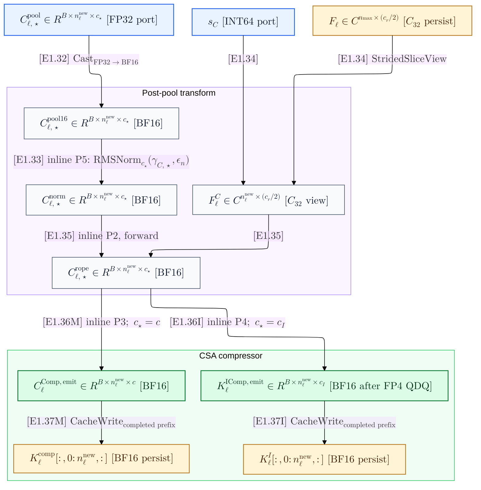
```mermaid
%%{init: {"theme": "base", "layout": "elk", "flowchart": {"htmlLabels": true, "curve": "basis", "nodeSpacing": 22, "rankSpacing": 32}}}%%
flowchart TB
    E1_POOL["$$\mathbf C_{\ell,\star}^{\mathrm{pool}}\in\mathbb R^{B\times n_{\ell}^{\mathrm{new}}\times c_\star}\;[\mathrm{FP32\ port}]$$"]
    E1_CUT["$$s_C\;[\mathrm{INT64\ port}]$$"]
    E1_FALL["$$\mathcal F_{\ell}\in\mathbb C^{n_{\max}\times(c_r/2)}\;[\mathbb C_{32}\ \mathrm{persist}]$$"]

    subgraph E1_POST["Post-pool transform"]
        direction TD
        E1_BF["$$\mathbf C_{\ell,\star}^{\mathrm{pool16}}\in\mathbb R^{B\times n_{\ell}^{\mathrm{new}}\times c_\star}\;[\mathrm{BF16}]$$"]
        E1_N["$$\mathbf C_{\ell,\star}^{\mathrm{norm}}\in\mathbb R^{B\times n_{\ell}^{\mathrm{new}}\times c_\star}\;[\mathrm{BF16}]$$"]
        E1_FB["$$\mathbf F_{\ell}^{C}\in\mathbb C^{n_{\ell}^{\mathrm{new}}\times(c_r/2)}\;[\mathbb C_{32}\ \mathrm{view}]$$"]
        E1_R["$$\mathbf C_{\ell,\star}^{\mathrm{rope}}\in\mathbb R^{B\times n_{\ell}^{\mathrm{new}}\times c_\star}\;[\mathrm{BF16}]$$"]
    end

    subgraph E1_INSTANCES["CSA compressor"]
        direction TD
        E1_MAIN["$$\mathbf C_{\ell}^{\mathrm{Comp,emit}}\in\mathbb R^{B\times n_{\ell}^{\mathrm{new}}\times c}\;[\mathrm{BF16}]$$"]
        E1_INDEX["$$\mathbf K_{\ell}^{\mathrm{IComp,emit}}\in\mathbb R^{B\times n_{\ell}^{\mathrm{new}}\times c_I}\;[\mathrm{BF16\ after\ FP4\ QDQ}]$$"]
        E1_MCACHE["$$\mathcal K_{\ell}^{\mathrm{comp}}[:,0:n_{\ell}^{\mathrm{new}},:]\;[\mathrm{BF16\ persist}]$$"]
        E1_ICACHE["$$\mathcal K_{\ell}^{I}[:,0:n_{\ell}^{\mathrm{new}},:]\;[\mathrm{BF16\ persist}]$$"]
    end

    E1_POOL -->|"$$[\mathrm{E1.32}]\ \operatorname{Cast}_{\mathrm{FP32}\rightarrow\mathrm{BF16}}$$"| E1_BF
    E1_BF -->|"$$[\mathrm{E1.33}]\ \text{inline P5: }\operatorname{RMSNorm}_{c_\star}(\gamma_{C,\star},\epsilon_n)$$"| E1_N
    E1_FALL -->|"$$[\mathrm{E1.34}]\ \operatorname{StridedSliceView}$$"| E1_FB
    E1_CUT -->|"$$[\mathrm{E1.34}]$$"| E1_FB
    E1_N -->|"$$[\mathrm{E1.35}]\ \text{inline P2, forward}$$"| E1_R
    E1_FB -->|"$$[\mathrm{E1.35}]$$"| E1_R
    E1_R -->|"$$[\mathrm{E1.36M}]\ \text{inline P3};\ c_\star=c$$"| E1_MAIN
    E1_R -->|"$$[\mathrm{E1.36I}]\ \text{inline P4};\ c_\star=c_I$$"| E1_INDEX
    E1_MAIN -->|"$$[\mathrm{E1.37M}]\ \operatorname{CacheWrite}_{\mathrm{completed\ prefix}}$$"| E1_MCACHE
    E1_INDEX -->|"$$[\mathrm{E1.37I}]\ \operatorname{CacheWrite}_{\mathrm{completed\ prefix}}$$"| E1_ICACHE

    classDef input fill:#e8f3ff,stroke:#2563eb,color:#0f172a,stroke-width:1.5px;
    classDef data fill:#f8fafc,stroke:#475569,color:#0f172a,stroke-width:1.05px;
    classDef cache fill:#fff4d6,stroke:#b7791f,color:#422006,stroke-width:1.4px;
    classDef output fill:#dcfce7,stroke:#15803d,color:#052e16,stroke-width:1.6px;
    class E1_POOL,E1_CUT input;
    class E1_FALL,E1_MCACHE,E1_ICACHE cache;
    class E1_BF,E1_N,E1_FB,E1_R data;
    class E1_MAIN,E1_INDEX output;
    style E1_POST fill:#faf5ff,stroke:#a78bfa,stroke-width:1px;
    style E1_INSTANCES fill:#f0fdf4,stroke:#22c55e,stroke-width:1px;
```

Subgraphs: [pooled input](#e1-b), [P5 norm](#p5), [P2 RoPE](#p2), [P3 main KV](#p3), [P4 index KV](#p4), [main bank](#g3), [index scores](#f0).

| IDs           | Operation detail                                                                                                                                                                                                                                    |
| ------------- | --------------------------------------------------------------------------------------------------------------------------------------------------------------------------------------------------------------------------------------------------- |
| E1.04-E1.05g  | $r_C=n\bmod{m}$, $s_C=n-r_C$, and $e_C^{\mathrm{pre}}=[n\ge{m}]$.                                                                                                                                                                                   |
| E1.06-E1.13Z  | For $s_C\ge{m}$, slice $s_C-{m}:s_C$, add $\mathbf B_{C,\star}\in\mathbb R^{{m}\times2c_\star}$ to the score lane, and write slots $0:{m}$. For $r_C>0$, slice $s_C:n$, add $\mathbf B_{C,\star}[0:r_C,0:2c_\star]$, and write slots ${m}:{m}+r_C$. |
| E1.14-E1.18   | Slice $0:s_C$, view it as $n_\ell^{\mathrm{new}}\times{m}$, and add $\mathbf B_{C,\star}$ to grouped scores.                                                                                                                                        |
| E1.19-E1.28   | Allocate values with zero and scores with $-\infty$; paper-$a$ uses the current second half in slots ${m}:2{m}$, while paper-$b$ uses the preceding first half in blocks $1:$, slots $0:{m}$.                                                       |
| E1.29-E1.31   | Softmax and reduction use the $2{m}$ source axis in FP32.                                                                                                                                                                                           |
| E1.32-E1.35   | Cast the pool to BF16, apply RMSNorm with FP32 statistics over $c_\star$, take $\mathcal F_\ell[0:s_C:{m}]$, then apply inline P2 with the forward block-start phase.                                                                               |
| E1.36M-E1.37I | The main execution uses P3 and writes $\mathcal K_\ell^{\mathrm{comp}}[:,0:n_\ell^{\mathrm{new}},:]$; the index execution uses P4 and writes $\mathcal K_\ell^I[:,0:n_\ell^{\mathrm{new}},:]$.                                                      |

### E2. CSA overlapping compression - single-token decode

The completion predicate can be computed before the token write, as in Python, but both writes
must complete before pooling or a no-emission return. Consequently, E2-A owns the
no-emission exit, while E2-B and E2-C are both guarded by the already-computed $e_C$.

#### E2-A. Projection, token insertion, and completion test

$r_C=p_0\bmod m$ is the token offset, $p_0^+=p_0+1$, and $e_C=[p_0^+\bmod m=0]$.
Both the main and index instances write **all $2c_\star$ coordinates** at rear slot $m+r_C$.
On completion, pool previous first-half and current second-half features, then copy the
**entire** rear state to the front. Retaining both projection halves is necessary for the next
block even though the current pool consumes only one half from each time block.

```mermaid
%%{init: {"theme": "base", "layout": "elk", "flowchart": {"htmlLabels": true, "curve": "basis", "nodeSpacing": 22, "rankSpacing": 32}}}%%
flowchart LR
    E2_H["$$\mathbf H_{\ell}\in\mathbb R^{B\times1\times d}\;[\mathrm{BF16}],\quad p_0\gt0$$"]
    E2_P["$$p_0,n\;[\mathrm{INT64}],\quad p_0\gt0,\ n=1$$"]
    E2_SVIN["$$\mathcal S_{\ell,\star}^{kv}\in\mathbb R^{B_{\max}\times(2{m})\times(2c_\star)}\;[\mathrm{FP32\ persist}]$$"]
    E2_SZIN["$$\mathcal S_{\ell,\star}^{z}\in\mathbb R^{B_{\max}\times(2{m})\times(2c_\star)}\;[\mathrm{FP32\ persist}]$$"]

    subgraph E2_PROJ["Projection"]
        direction TD
        E2_H32["$$\mathbf H_{\ell}^{32}\in\mathbb R^{B\times1\times d}\;[\mathrm{FP32}]$$"]
        E2_V["$$\mathbf C_{\ell,\star}^{\mathrm{raw}}\in\mathbb R^{B\times1\times(2c_\star)}\;[\mathrm{FP32}]$$"]
        E2_Z["$$\mathbf Z_{\ell,\star}^{\mathrm{raw}}\in\mathbb R^{B\times1\times(2c_\star)}\;[\mathrm{FP32}]$$"]
    end

    subgraph E2_INSERT["Persistent token insertion"]
        direction TD
        E2_R["$$r_C\;[\mathrm{INT64}]$$"]
        E2_ZA["$$\mathbf Z_{\ell,\star}^{\mathrm{raw+ape}}\in\mathbb R^{B\times1\times(2c_\star)}\;[\mathrm{FP32}]$$"]
        E2_V0["$$\mathbf C_{\ell,\star}^{\mathrm{raw0}}\in\mathbb R^{B\times(2c_\star)}\;[\mathrm{FP32\ view}]$$"]
        E2_Z0["$$\mathbf Z_{\ell,\star}^{\mathrm{raw0+ape}}\in\mathbb R^{B\times(2c_\star)}\;[\mathrm{FP32\ view}]$$"]
        E2_STATEV["$$\mathcal S_{\ell,\star}^{kv,+}\in\mathbb R^{B_{\max}\times(2{m})\times(2c_\star)}\;[\mathrm{FP32\ persist\ after\ write}]$$"]
        E2_STATEZ["$$\mathcal S_{\ell,\star}^{z,+}\in\mathbb R^{B_{\max}\times(2{m})\times(2c_\star)}\;[\mathrm{FP32\ persist\ after\ write}]$$"]
    end

    subgraph E2_CLOCK["Advance block clock"]
        direction TD
        E2_P1["$$p_0^{+}\;[\mathrm{INT64}]$$"]
        E2_FREM["$$r_C^{+}\;[\mathrm{INT64}]$$"]
        E2_FLAG["$$e_C\;[\mathrm{BOOL}]$$"]
    end

    E2_STATEONLY["$$\begin{gathered} (\mathcal S_{\ell,\star}^{kv,+},\mathcal S_{\ell,\star}^{z,+}) \\\\ [\mathrm{FP32\ persist};\ \mathrm{no\ compressed\ emission}] \end{gathered}$$"]

    E2_H -->|"$$[\mathrm{E2.01}]\ \operatorname{Cast}_{\mathrm{BF16}\rightarrow\mathrm{FP32}}$$"| E2_H32
    E2_H32 -->|"$$[\mathrm{E2.02}]\ \operatorname{GEMM}(W_{\ell,\star}^{KV})$$"| E2_V
    E2_H32 -->|"$$[\mathrm{E2.03}]\ \operatorname{GEMM}(W_{\ell,\star}^{Z})$$"| E2_Z

    E2_P -->|"$$[\mathrm{E2.04}]\ \operatorname{Rem}({m})$$"| E2_R
    E2_Z -->|"$$[\mathrm{E2.05}]\ \operatorname{AddBcast}(\mathbf B_{C,\star}[r_C])$$"| E2_ZA
    E2_R -->|"$$[\mathrm{E2.05}]$$"| E2_ZA
    E2_V -->|"$$[\mathrm{E2.06}]\ \operatorname{SqueezeView}_{n}$$"| E2_V0
    E2_ZA -->|"$$[\mathrm{E2.07}]\ \operatorname{SqueezeView}_{n}$$"| E2_Z0
    E2_V0 -->|"$$[\mathrm{E2.08}]\ \operatorname{CacheWrite}_{\mathrm{token}}$$"| E2_STATEV
    E2_SVIN -->|"$$[\mathrm{E2.08}]$$"| E2_STATEV
    E2_R -->|"$$[\mathrm{E2.08}]$$"| E2_STATEV
    E2_SZIN -->|"$$[\mathrm{E2.09}]$$"| E2_STATEZ
    E2_Z0 -->|"$$[\mathrm{E2.09}]\ \operatorname{CacheWrite}_{\mathrm{token}}$$"| E2_STATEZ
    E2_R -->|"$$[\mathrm{E2.09}]$$"| E2_STATEZ

    E2_P -->|"$$[\mathrm{E2.10}]\ \operatorname{AddScalar}(1)$$"| E2_P1
    E2_P1 -->|"$$[\mathrm{E2.11}]\ \operatorname{Rem}({m})$$"| E2_FREM
    E2_FREM -->|"$$[\mathrm{E2.12}]\ \operatorname{EqScalar}(0)$$"| E2_FLAG

    E2_STATEV -.->|"post-write value state"| E2_STATEONLY
    E2_STATEZ -.->|"post-write score state"| E2_STATEONLY
    E2_FLAG -.->|"$$\neg e_C:\ \text{state-only return after writes}$$"| E2_STATEONLY

    classDef input fill:#e8f3ff,stroke:#2563eb,color:#0f172a,stroke-width:1.5px;
    classDef data fill:#f8fafc,stroke:#475569,color:#0f172a,stroke-width:1.05px;
    classDef cache fill:#fff4d6,stroke:#b7791f,color:#422006,stroke-width:1.4px;
    classDef control fill:#ffedd5,stroke:#c2410c,color:#431407,stroke-width:1.3px;
    classDef terminal fill:#fef2f2,stroke:#b91c1c,color:#450a0a,stroke-width:1.3px;
    class E2_H,E2_P input;
    class E2_SVIN,E2_SZIN,E2_STATEV,E2_STATEZ cache;
    class E2_H32,E2_V,E2_Z,E2_R,E2_ZA,E2_V0,E2_Z0,E2_P1,E2_FREM data;
    class E2_FLAG control;
    class E2_STATEONLY terminal;
    style E2_PROJ fill:#f8fbff,stroke:#60a5fa,stroke-width:1px;
    style E2_INSERT fill:#fffaf0,stroke:#d97706,stroke-width:1px;
    style E2_CLOCK fill:#f8fafc,stroke:#94a3b8,stroke-width:1px;
```

Subgraphs: [prefill state](#e1-a), [completion pool](#e2-b), [emission tail](#e2-c).

#### E2-B. Completed overlapping pool and state roll — execute only when $e_C=\mathrm{true}$

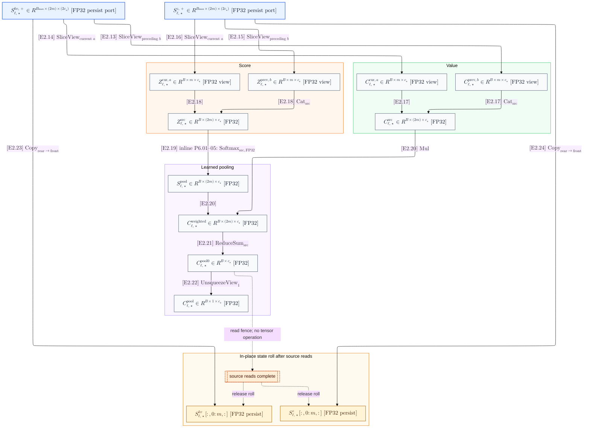
```mermaid
%%{init: {"theme": "base", "layout": "elk", "flowchart": {"htmlLabels": true, "curve": "basis", "nodeSpacing": 20, "rankSpacing": 30}}}%%
flowchart TB
    E2_STATEV["$$\mathcal S_{\ell,\star}^{kv,+}\in\mathbb R^{B_{\max}\times(2{m})\times(2c_\star)}\;[\mathrm{FP32\ persist\ port}]$$"]
    E2_STATEZ["$$\mathcal S_{\ell,\star}^{z,+}\in\mathbb R^{B_{\max}\times(2{m})\times(2c_\star)}\;[\mathrm{FP32\ persist\ port}]$$"]

    subgraph E2_VALUE["Value"]
        direction TD
        E2_PVA["$$\mathbf C_{\ell,\star}^{\mathrm{prev},b}\in\mathbb R^{B\times{m}\times c_\star}\;[\mathrm{FP32\ view}]$$"]
        E2_CVB["$$\mathbf C_{\ell,\star}^{\mathrm{cur},a}\in\mathbb R^{B\times{m}\times c_\star}\;[\mathrm{FP32\ view}]$$"]
        E2_SV["$$\mathbf C_{\ell,\star}^{\mathrm{src}}\in\mathbb R^{B\times(2{m})\times c_\star}\;[\mathrm{FP32}]$$"]
    end

    subgraph E2_SCORE["Score"]
        direction TD
        E2_PZA["$$\mathbf Z_{\ell,\star}^{\mathrm{prev},b}\in\mathbb R^{B\times{m}\times c_\star}\;[\mathrm{FP32\ view}]$$"]
        E2_CZB["$$\mathbf Z_{\ell,\star}^{\mathrm{cur},a}\in\mathbb R^{B\times{m}\times c_\star}\;[\mathrm{FP32\ view}]$$"]
        E2_SZ["$$\mathbf Z_{\ell,\star}^{\mathrm{src}}\in\mathbb R^{B\times(2{m})\times c_\star}\;[\mathrm{FP32}]$$"]
    end

    subgraph E2_POOLING["Learned pooling"]
        direction TD
        E2_W["$$\mathbf S_{\ell,\star}^{\mathrm{pool}}\in\mathbb R^{B\times(2{m})\times c_\star}\;[\mathrm{FP32}]$$"]
        E2_M["$$\mathbf C_{\ell,\star}^{\mathrm{weighted}}\in\mathbb R^{B\times(2{m})\times c_\star}\;[\mathrm{FP32}]$$"]
        E2_POOL0["$$\mathbf C_{\ell,\star}^{\mathrm{pool0}}\in\mathbb R^{B\times c_\star}\;[\mathrm{FP32}]$$"]
        E2_POOL["$$\mathbf C_{\ell,\star}^{\mathrm{pool}}\in\mathbb R^{B\times1\times c_\star}\;[\mathrm{FP32}]$$"]
    end

    subgraph E2_ROLL["In-place state roll after source reads"]
        direction TD
        E2_FENCE[["source reads complete"]]
        E2_ROLLV["$$\mathcal S_{\ell,\star}^{kv}[:,0:{m},:]\;[\mathrm{FP32\ persist}]$$"]
        E2_ROLLZ["$$\mathcal S_{\ell,\star}^{z}[:,0:{m},:]\;[\mathrm{FP32\ persist}]$$"]
    end

    E2_STATEV -->|"$$[\mathrm{E2.13}]\ \operatorname{SliceView}_{\mathrm{preceding}\ b}$$"| E2_PVA
    E2_STATEV -->|"$$[\mathrm{E2.14}]\ \operatorname{SliceView}_{\mathrm{current}\ a}$$"| E2_CVB
    E2_PVA -->|"$$[\mathrm{E2.17}]\ \operatorname{Cat}_{\mathrm{src}}$$"| E2_SV
    E2_CVB -->|"$$[\mathrm{E2.17}]$$"| E2_SV

    E2_STATEZ -->|"$$[\mathrm{E2.15}]\ \operatorname{SliceView}_{\mathrm{preceding}\ b}$$"| E2_PZA
    E2_STATEZ -->|"$$[\mathrm{E2.16}]\ \operatorname{SliceView}_{\mathrm{current}\ a}$$"| E2_CZB
    E2_PZA -->|"$$[\mathrm{E2.18}]\ \operatorname{Cat}_{\mathrm{src}}$$"| E2_SZ
    E2_CZB -->|"$$[\mathrm{E2.18}]$$"| E2_SZ

    E2_SZ -->|"$$[\mathrm{E2.19}]\ \text{inline P6.01–05: }\operatorname{Softmax}_{\mathrm{src},\mathrm{FP32}}$$"| E2_W
    E2_SV -->|"$$[\mathrm{E2.20}]\ \operatorname{Mul}$$"| E2_M
    E2_W -->|"$$[\mathrm{E2.20}]$$"| E2_M
    E2_M -->|"$$[\mathrm{E2.21}]\ \operatorname{ReduceSum}_{\mathrm{src}}$$"| E2_POOL0
    E2_POOL0 -->|"$$[\mathrm{E2.22}]\ \operatorname{UnsqueezeView}_{1}$$"| E2_POOL

    E2_POOL0 -.->|"read fence; no tensor operation"| E2_FENCE
    E2_STATEV -->|"$$[\mathrm{E2.23}]\ \operatorname{Copy}_{\mathrm{rear}\rightarrow\mathrm{front}}$$"| E2_ROLLV
    E2_STATEZ -->|"$$[\mathrm{E2.24}]\ \operatorname{Copy}_{\mathrm{rear}\rightarrow\mathrm{front}}$$"| E2_ROLLZ
    E2_FENCE -.->|"release roll"| E2_ROLLV
    E2_FENCE -.->|"release roll"| E2_ROLLZ

    classDef input fill:#e8f3ff,stroke:#2563eb,color:#0f172a,stroke-width:1.5px;
    classDef data fill:#f8fafc,stroke:#475569,color:#0f172a,stroke-width:1.05px;
    classDef cache fill:#fff4d6,stroke:#b7791f,color:#422006,stroke-width:1.4px;
    classDef control fill:#ffedd5,stroke:#c2410c,color:#431407,stroke-width:1.3px,stroke-dasharray:4 2;
    class E2_STATEV,E2_STATEZ input;
    class E2_ROLLV,E2_ROLLZ cache;
    class E2_PVA,E2_CVB,E2_SV,E2_PZA,E2_CZB,E2_SZ,E2_W,E2_M,E2_POOL0,E2_POOL data;
    class E2_FENCE control;
    style E2_VALUE fill:#f0fdf4,stroke:#22c55e,stroke-width:1px;
    style E2_SCORE fill:#fff7ed,stroke:#f97316,stroke-width:1px;
    style E2_POOLING fill:#faf5ff,stroke:#a78bfa,stroke-width:1px;
    style E2_ROLL fill:#fffaf0,stroke:#d97706,stroke-width:1px;
```

Subgraphs: [updated state](#e2-a), [P6 gated pool](#p6), [emission](#e2-c).

#### E2-C. Emission and completed-cache writes — execute only when $e_C=\mathrm{true}$

$p_C=p_0+1-m$ is the completed block's starting position; $i_C=\lfloor p_0/m\rfloor$
is its destination slot in the selected completed cache. E2.31M/E2.31I expose
the source `squeeze(1)` from $[B,1,c_\star]$ to a $[B,c_\star]$ slot.

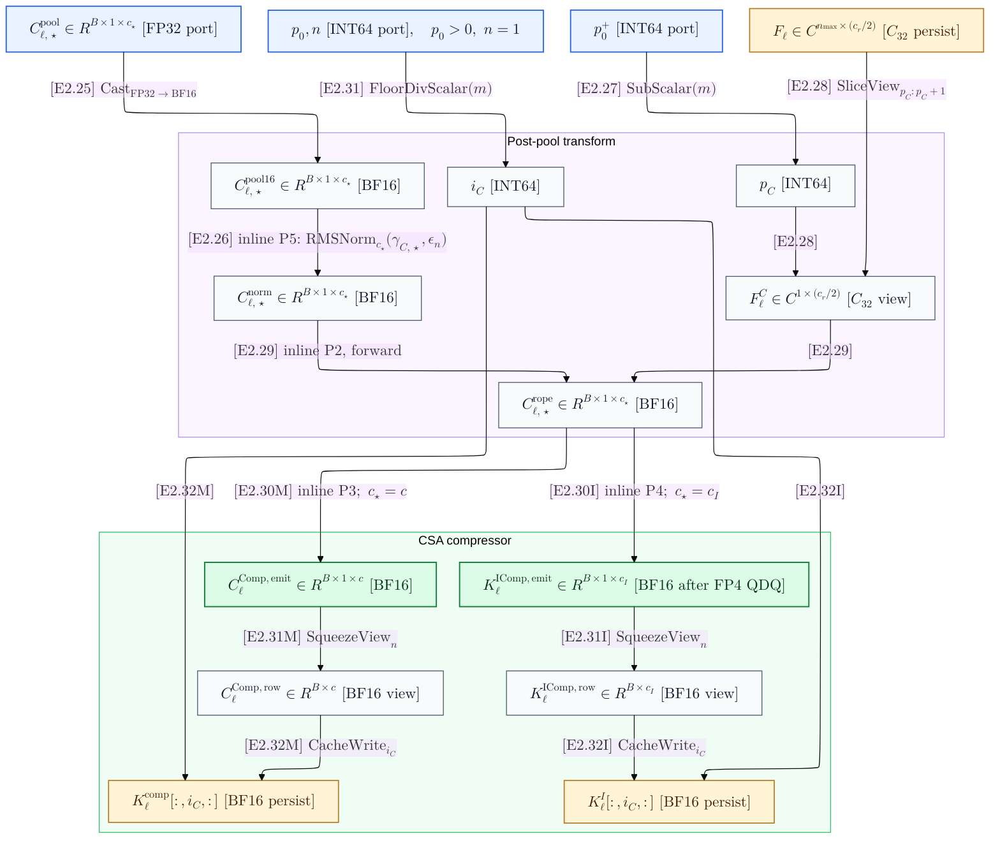
```mermaid
%%{init: {"theme": "base", "layout": "elk", "flowchart": {"htmlLabels": true, "curve": "basis", "nodeSpacing": 22, "rankSpacing": 32}}}%%
flowchart TB
    E2_POOL["$$\mathbf C_{\ell,\star}^{\mathrm{pool}}\in\mathbb R^{B\times1\times c_\star}\;[\mathrm{FP32\ port}]$$"]
    E2_P["$$p_0,n\;[\mathrm{INT64\ port}],\quad p_0\gt0,\ n=1$$"]
    E2_P1["$$p_0^{+}\;[\mathrm{INT64\ port}]$$"]
    E2_FALL["$$\mathcal F_{\ell}\in\mathbb C^{n_{\max}\times(c_r/2)}\;[\mathbb C_{32}\ \mathrm{persist}]$$"]

    subgraph E2_POST["Post-pool transform"]
        direction TD
        E2_BF["$$\mathbf C_{\ell,\star}^{\mathrm{pool16}}\in\mathbb R^{B\times1\times c_\star}\;[\mathrm{BF16}]$$"]
        E2_N["$$\mathbf C_{\ell,\star}^{\mathrm{norm}}\in\mathbb R^{B\times1\times c_\star}\;[\mathrm{BF16}]$$"]
        E2_BPOS["$$p_C\;[\mathrm{INT64}]$$"]
        E2_FB["$$\mathbf F_{\ell}^{C}\in\mathbb C^{1\times(c_r/2)}\;[\mathbb C_{32}\ \mathrm{view}]$$"]
        E2_ROPE["$$\mathbf C_{\ell,\star}^{\mathrm{rope}}\in\mathbb R^{B\times1\times c_\star}\;[\mathrm{BF16}]$$"]
        E2_CIDX["$$i_C\;[\mathrm{INT64}]$$"]
    end

    subgraph E2_INSTANCES["CSA compressor"]
        direction TD
        E2_MAIN["$$\mathbf C_{\ell}^{\mathrm{Comp,emit}}\in\mathbb R^{B\times1\times c}\;[\mathrm{BF16}]$$"]
        E2_INDEX["$$\mathbf K_{\ell}^{\mathrm{IComp,emit}}\in\mathbb R^{B\times1\times c_I}\;[\mathrm{BF16\ after\ FP4\ QDQ}]$$"]
        E2_MROW["$$\mathbf C_{\ell}^{\mathrm{Comp,row}}\in\mathbb R^{B\times c}\;[\mathrm{BF16\ view}]$$"]
        E2_IROW["$$\mathbf K_{\ell}^{\mathrm{IComp,row}}\in\mathbb R^{B\times c_I}\;[\mathrm{BF16\ view}]$$"]
        E2_MCACHE["$$\mathcal K_{\ell}^{\mathrm{comp}}[:,i_C,:]\;[\mathrm{BF16\ persist}]$$"]
        E2_ICACHE["$$\mathcal K_{\ell}^{I}[:,i_C,:]\;[\mathrm{BF16\ persist}]$$"]
    end

    E2_POOL -->|"$$[\mathrm{E2.25}]\ \operatorname{Cast}_{\mathrm{FP32}\rightarrow\mathrm{BF16}}$$"| E2_BF
    E2_BF -->|"$$[\mathrm{E2.26}]\ \text{inline P5: }\operatorname{RMSNorm}_{c_\star}(\gamma_{C,\star},\epsilon_n)$$"| E2_N
    E2_P1 -->|"$$[\mathrm{E2.27}]\ \operatorname{SubScalar}({m})$$"| E2_BPOS
    E2_FALL -->|"$$[\mathrm{E2.28}]\ \operatorname{SliceView}_{p_C:p_C+1}$$"| E2_FB
    E2_BPOS -->|"$$[\mathrm{E2.28}]$$"| E2_FB
    E2_N -->|"$$[\mathrm{E2.29}]\ \text{inline P2, forward}$$"| E2_ROPE
    E2_FB -->|"$$[\mathrm{E2.29}]$$"| E2_ROPE
    E2_ROPE -->|"$$[\mathrm{E2.30M}]\ \text{inline P3};\ c_\star=c$$"| E2_MAIN
    E2_ROPE -->|"$$[\mathrm{E2.30I}]\ \text{inline P4};\ c_\star=c_I$$"| E2_INDEX
    E2_P -->|"$$[\mathrm{E2.31}]\ \operatorname{FloorDivScalar}({m})$$"| E2_CIDX
    E2_MAIN -->|"$$[\mathrm{E2.31M}]\ \operatorname{SqueezeView}_{n}$$"| E2_MROW
    E2_INDEX -->|"$$[\mathrm{E2.31I}]\ \operatorname{SqueezeView}_{n}$$"| E2_IROW
    E2_MROW -->|"$$[\mathrm{E2.32M}]\ \operatorname{CacheWrite}_{i_C}$$"| E2_MCACHE
    E2_CIDX -->|"$$[\mathrm{E2.32M}]$$"| E2_MCACHE
    E2_IROW -->|"$$[\mathrm{E2.32I}]\ \operatorname{CacheWrite}_{i_C}$$"| E2_ICACHE
    E2_CIDX -->|"$$[\mathrm{E2.32I}]$$"| E2_ICACHE

    classDef input fill:#e8f3ff,stroke:#2563eb,color:#0f172a,stroke-width:1.5px;
    classDef data fill:#f8fafc,stroke:#475569,color:#0f172a,stroke-width:1.05px;
    classDef cache fill:#fff4d6,stroke:#b7791f,color:#422006,stroke-width:1.4px;
    classDef output fill:#dcfce7,stroke:#15803d,color:#052e16,stroke-width:1.6px;
    class E2_POOL,E2_P,E2_P1 input;
    class E2_FALL,E2_MCACHE,E2_ICACHE cache;
    class E2_BF,E2_N,E2_BPOS,E2_FB,E2_ROPE,E2_CIDX,E2_MROW,E2_IROW data;
    class E2_MAIN,E2_INDEX output;
    style E2_POST fill:#faf5ff,stroke:#a78bfa,stroke-width:1px;
    style E2_INSTANCES fill:#f0fdf4,stroke:#22c55e,stroke-width:1px;
```

Subgraphs: [pooled input](#e2-b), [P5 norm](#p5), [P2 RoPE](#p2), [P3 main KV](#p3), [P4 index KV](#p4), [main bank](#g4), [index scores](#f0).

E2 operation details moved out of long arrows:

| IDs           | Exact operation detail                                                                                                                                                                                                                      |
| ------------- | ------------------------------------------------------------------------------------------------------------------------------------------------------------------------------------------------------------------------------------------- |
| E2.02-E2.03   | The two projection weights have shape $(2c_\star)\times d$.                                                                                                                                                                                 |
| E2.04-E2.09   | $r_C=p_0\bmod{m}$; add $\mathbf B_{C,\star}[r_C,0:2c_\star]$ to the score, squeeze the singleton sequence axis, and write both token tensors into persistent slot ${m}+r_C$.                                                                |
| E2.10-E2.12   | $p_0^+=p_0+1$, $r_C^+=p_0^+\bmod{m}$, and $e_C=[r_C^+=0]$. When false, the two token writes remain committed and execution stops before E2.13.                                                                                              |
| E2.13-E2.18   | Slice preceding paper-$b$ from $:B,0:{m},0:c_\star$ and current paper-$a$ from $:B,{m}:2{m},c_\star:2c_\star$, then concatenate in preceding-$b$, current-$a$ order.                                                                        |
| E2.19-E2.22   | Softmax and reduction use the $2{m}$ source axis in FP32; the reduced vector is viewed as a one-token sequence.                                                                                                                             |
| E2.23-E2.24   | After all source reads complete, copy $:B,{m}:2{m},0:2c_\star$ into $:B,0:{m},0:2c_\star$ in place. The read fence is a scheduling dependency, not a tensor operation.                                                                      |
| E2.25-E2.29   | Cast to BF16, apply RMSNorm with FP32 statistics over $c_\star$, compute $p_C=p_0^+-{m}$, take $\mathcal F_\ell[p_C:p_C+1]$, and apply inline P2 with the forward block-start phase.                                                        |
| E2.30M-E2.32I | The main execution uses P3 and the index execution uses P4. Each final write squeezes the sequence axis from $[B,1,c_\star]$ to $[B,c_\star]$. Both use $i_C=\lfloor p_0/{m}\rfloor$ and write their respective completed-cache slot $i_C$. |

### E3. HCA non-overlapping compression - prefill

E3-A retains both incomplete-state handling and the complete-prefix pool. The remainder lane is
guarded by $r_H>0$, whereas complete-block emission is guarded separately by
$e_H^{\mathrm{pre}}$ after the pool has been formed.

#### E3-A. Projection, remainder state, and complete-prefix pooling

| Parameter / state                                    | HCA binding                                                                                 |
| ---------------------------------------------------- | ------------------------------------------------------------------------------------------- |
| $W_\ell^{KV,\mathrm{comp}},W_\ell^{Z,\mathrm{comp}}$ | `compressor.wkv.weight`, `wgate.weight`, FP32 $[c,d]$; paper $W^{KV},W^Z$ in Eqs. (20)–(21) |
| $\mathbf B_H,\gamma_H$                               | `ape`: FP32 $[m',c]$; `norm.weight`: learned FP32 $[c]$                                     |
| $\mathcal S_\ell^{kv},\mathcal S_\ell^z$             | FP32 $[B_{\max},m',c]$ incomplete-state buffers; initialized to zero / $-\infty$            |
| $r_H,s_H,e_H^{\mathrm{pre}}$                         | $n\bmod m'$, $n-r_H$, $[n\ge m']$                                                           |
| $\mathcal K_\ell^{\mathrm{comp}}$                    | Main-cache suffix $[B_{\max},\lfloor n_{\max}/m'\rfloor,c]$; no indexer cache               |

HCA uses the same [P6](#p6) pool and [P5](#p5) norm, with one non-overlapping $m'$-token
source block. Its prefill and decode branches have been checked against the non-overlap
branches in `Compressor::forward`; no CSA front/rear rollover is present.

```mermaid
%%{init: {"theme": "base", "layout": "elk", "flowchart": {"htmlLabels": true, "curve": "basis", "nodeSpacing": 22, "rankSpacing": 32}}}%%
flowchart LR
    E3_H["$$\mathbf H_{\ell}\in\mathbb R^{B\times n\times d}\;[\mathrm{BF16}],\quad p_0=0$$"]
    E3_S["$$n\;[\mathrm{INT64}]$$"]

    subgraph E3_PROJ["Projection"]
        direction TD
        E3_H32["$$\mathbf H_{\ell}^{32}\in\mathbb R^{B\times n\times d}\;[\mathrm{FP32}]$$"]
        E3_C["$$\mathbf C_{\ell}^{\mathrm{raw}}\in\mathbb R^{B\times n\times c}\;[\mathrm{FP32}]$$"]
        E3_Z["$$\mathbf Z_{\ell}^{\mathrm{raw}}\in\mathbb R^{B\times n\times c}\;[\mathrm{FP32}]$$"]
    end

    subgraph E3_PLAN["Prefill compression plan"]
        direction TD
        E3_REM["$$r_H\;[\mathrm{INT64}]$$"]
        E3_CUT["$$s_H\;[\mathrm{INT64}]$$"]
        E3_READY["$$e_H^{\mathrm{pre}}\;[\mathrm{BOOL}]$$"]
    end

    subgraph E3_REMAINDER["Incomplete remainder state — execute only when $$r_H\gt0$$"]
        direction TD
        E3_CR["$$\mathbf C_{\ell}^{\mathrm{rem}}\in\mathbb R^{B\times r_H\times c}\;[\mathrm{FP32\ view}]$$"]
        E3_ZR["$$\mathbf Z_{\ell}^{\mathrm{rem}}\in\mathbb R^{B\times r_H\times c}\;[\mathrm{FP32\ view}]$$"]
        E3_ZRA["$$\mathbf Z_{\ell}^{\mathrm{rem+ape}}\in\mathbb R^{B\times r_H\times c}\;[\mathrm{FP32}]$$"]
        E3_SCV["$$\mathcal S_{\ell}^{kv}[:,0:r_H,:]\;[\mathrm{FP32\ persist}]$$"]
        E3_SCZ["$$\mathcal S_{\ell}^{z}[:,0:r_H,:]\;[\mathrm{FP32\ persist}]$$"]
    end

    subgraph E3_PREFIX["Complete-prefix grouping and pooling"]
        direction TD
        E3_CP["$$\mathbf C_{\ell}^{\mathrm{prefix}}\in\mathbb R^{B\times s_H\times c}\;[\mathrm{FP32\ view}]$$"]
        E3_ZP["$$\mathbf Z_{\ell}^{\mathrm{prefix}}\in\mathbb R^{B\times s_H\times c}\;[\mathrm{FP32\ view}]$$"]
        E3_CG["$$\mathbf C_{\ell}^{\mathrm{src}}\in\mathbb R^{B\times n_{\ell}^{\mathrm{new}}\times{m'}\times c}\;[\mathrm{FP32\ view}]$$"]
        E3_ZG["$$\mathbf Z_{\ell}^{\mathrm{group}}\in\mathbb R^{B\times n_{\ell}^{\mathrm{new}}\times{m'}\times c}\;[\mathrm{FP32\ view}]$$"]
        E3_ZA["$$\mathbf Z_{\ell}^{\mathrm{src}}\in\mathbb R^{B\times n_{\ell}^{\mathrm{new}}\times{m'}\times c}\;[\mathrm{FP32}]$$"]
        E3_W["$$\mathbf S_{\ell}^{\mathrm{pool}}\in\mathbb R^{B\times n_{\ell}^{\mathrm{new}}\times{m'}\times c}\;[\mathrm{FP32}]$$"]
        E3_M["$$\mathbf C_{\ell}^{\mathrm{weighted}}\in\mathbb R^{B\times n_{\ell}^{\mathrm{new}}\times{m'}\times c}\;[\mathrm{FP32}]$$"]
        E3_POOL["$$\mathbf C_{\ell}^{\mathrm{pool}}\in\mathbb R^{B\times n_{\ell}^{\mathrm{new}}\times c}\;[\mathrm{FP32}]$$"]
    end

    E3_STATEONLY["$$\begin{gathered} (\mathcal S_{\ell}^{kv,+},\mathcal S_{\ell}^{z,+}) \\\\ [\mathrm{FP32\ persist};\ \mathrm{no\ compressed\ emission}] \end{gathered}$$"]

    E3_H -->|"$$[\mathrm{E3.01}]\ \operatorname{Cast}_{\mathrm{BF16}\rightarrow\mathrm{FP32}}$$"| E3_H32
    E3_H32 -->|"$$[\mathrm{E3.02}]\ \operatorname{GEMM}(W_{\ell}^{KV,\mathrm{comp}})$$"| E3_C
    E3_H32 -->|"$$[\mathrm{E3.03}]\ \operatorname{GEMM}(W_{\ell}^{Z,\mathrm{comp}})$$"| E3_Z

    E3_S -->|"$$[\mathrm{E3.04}]\ \operatorname{Rem}({m'})$$"| E3_REM
    E3_S -->|"$$[\mathrm{E3.05}]\ \operatorname{Sub}$$"| E3_CUT
    E3_REM -->|"$$[\mathrm{E3.05}]$$"| E3_CUT
    E3_S -->|"$$[\mathrm{E3.05g}]\ \operatorname{GreaterEqScalar}({m'})$$"| E3_READY

    E3_C -->|"$$[\mathrm{E3.06}]\ \operatorname{SliceView}_{\mathrm{remainder}}$$"| E3_CR
    E3_CUT -->|"$$[\mathrm{E3.06}]$$"| E3_CR
    E3_Z -->|"$$[\mathrm{E3.07}]\ \operatorname{SliceView}_{\mathrm{remainder}}$$"| E3_ZR
    E3_CUT -->|"$$[\mathrm{E3.07}]$$"| E3_ZR
    E3_ZR -->|"$$[\mathrm{E3.08}]\ \operatorname{AddBcast}(\mathbf B_H[0:r_H])$$"| E3_ZRA
    E3_CR -->|"$$[\mathrm{E3.09}]\ \operatorname{CacheWrite}_{\mathrm{remainder}}$$"| E3_SCV
    E3_ZRA -->|"$$[\mathrm{E3.10}]\ \operatorname{CacheWrite}_{\mathrm{remainder}}$$"| E3_SCZ

    E3_C -->|"$$[\mathrm{E3.11}]\ \operatorname{SliceView}_{\mathrm{completed\ prefix}}$$"| E3_CP
    E3_CUT -->|"$$[\mathrm{E3.11}]$$"| E3_CP
    E3_Z -->|"$$[\mathrm{E3.12}]\ \operatorname{SliceView}_{\mathrm{completed\ prefix}}$$"| E3_ZP
    E3_CUT -->|"$$[\mathrm{E3.12}]$$"| E3_ZP
    E3_CP -->|"$$[\mathrm{E3.13}]\ \operatorname{UnflattenView}_{n_{\ell}^{\mathrm{new}},{m'}}$$"| E3_CG
    E3_ZP -->|"$$[\mathrm{E3.14}]\ \operatorname{UnflattenView}_{n_{\ell}^{\mathrm{new}},{m'}}$$"| E3_ZG
    E3_ZG -->|"$$[\mathrm{E3.15}]\ \operatorname{AddBcast}(\mathbf B_H)$$"| E3_ZA
    E3_ZA -->|"$$[\mathrm{E3.16}]\ \text{inline P6.01–05: }\operatorname{Softmax}_{\mathrm{src},\mathrm{FP32}}$$"| E3_W
    E3_CG -->|"$$[\mathrm{E3.17}]\ \operatorname{Mul}$$"| E3_M
    E3_W -->|"$$[\mathrm{E3.17}]$$"| E3_M
    E3_M -->|"$$[\mathrm{E3.18}]\ \operatorname{ReduceSum}_{\mathrm{src}}$$"| E3_POOL

    E3_SCV -.->|"post-write value state"| E3_STATEONLY
    E3_SCZ -.->|"post-write score state"| E3_STATEONLY
    E3_POOL -.->|"zero-block pool when flag is false"| E3_STATEONLY
    E3_READY -.->|"$$\neg e_H^{\mathrm{pre}}:\ \text{no completed-emission tail}$$"| E3_STATEONLY

    classDef input fill:#e8f3ff,stroke:#2563eb,color:#0f172a,stroke-width:1.5px;
    classDef data fill:#f8fafc,stroke:#475569,color:#0f172a,stroke-width:1.05px;
    classDef cache fill:#fff4d6,stroke:#b7791f,color:#422006,stroke-width:1.4px;
    classDef terminal fill:#fef2f2,stroke:#b91c1c,color:#450a0a,stroke-width:1.3px;
    class E3_H,E3_S input;
    class E3_SCV,E3_SCZ cache;
    class E3_H32,E3_C,E3_Z,E3_REM,E3_CUT,E3_READY,E3_CR,E3_ZR,E3_ZRA,E3_CP,E3_ZP,E3_CG,E3_ZG,E3_ZA,E3_W,E3_M,E3_POOL data;
    class E3_STATEONLY terminal;
    style E3_PROJ fill:#f8fbff,stroke:#60a5fa,stroke-width:1px;
    style E3_PLAN fill:#f8fafc,stroke:#94a3b8,stroke-width:1px;
    style E3_REMAINDER fill:#fffaf0,stroke:#d97706,stroke-width:1px;
    style E3_PREFIX fill:#faf5ff,stroke:#a78bfa,stroke-width:1px;
```

Subgraphs: [attention input](#c), [P6 gated pool](#p6), [emission](#e3-b), [next-call state](#e4-a).

#### E3-B. Completed-prefill emission — execute only when $e_H^{\mathrm{pre}}=\mathrm{true}$

```mermaid
%%{init: {"theme": "base", "layout": "elk", "flowchart": {"htmlLabels": true, "curve": "basis", "nodeSpacing": 22, "rankSpacing": 32}}}%%
flowchart TB
    E3_POOL["$$\mathbf C_{\ell}^{\mathrm{pool}}\in\mathbb R^{B\times n_{\ell}^{\mathrm{new}}\times c}\;[\mathrm{FP32\ port}]$$"]
    E3_CUT["$$s_H\;[\mathrm{INT64\ port}]$$"]
    E3_FALL["$$\mathcal F_{\ell}\in\mathbb C^{n_{\max}\times(c_r/2)}\;[\mathbb C_{32}\ \mathrm{persist}]$$"]
    E3_BF["$$\mathbf C_{\ell}^{\mathrm{pool16}}\in\mathbb R^{B\times n_{\ell}^{\mathrm{new}}\times c}\;[\mathrm{BF16}]$$"]
    E3_N["$$\mathbf C_{\ell}^{\mathrm{norm}}\in\mathbb R^{B\times n_{\ell}^{\mathrm{new}}\times c}\;[\mathrm{BF16}]$$"]
    E3_FB["$$\mathbf F_{\ell}^{H}\in\mathbb C^{n_{\ell}^{\mathrm{new}}\times(c_r/2)}\;[\mathbb C_{32}\ \mathrm{view}]$$"]
    E3_R["$$\mathbf C_{\ell}^{\mathrm{rope}}\in\mathbb R^{B\times n_{\ell}^{\mathrm{new}}\times c}\;[\mathrm{BF16}]$$"]
    E3_OUT["$$\mathbf C_{\ell}^{\mathrm{Comp,emit}}\in\mathbb R^{B\times n_{\ell}^{\mathrm{new}}\times c}\;[\mathrm{BF16}]$$"]
    E3_CACHE["$$\mathcal K_{\ell}^{\mathrm{comp}}[:,0:n_{\ell}^{\mathrm{new}},:]\;[\mathrm{BF16\ persist}]$$"]

    E3_POOL -->|"$$[\mathrm{E3.19}]\ \operatorname{Cast}_{\mathrm{FP32}\rightarrow\mathrm{BF16}}$$"| E3_BF
    E3_BF -->|"$$[\mathrm{E3.20}]\ \text{inline P5: }\operatorname{RMSNorm}_{c}(\gamma_H,\epsilon_n)$$"| E3_N
    E3_FALL -->|"$$[\mathrm{E3.21}]\ \operatorname{StridedSliceView}$$"| E3_FB
    E3_CUT -->|"$$[\mathrm{E3.21}]$$"| E3_FB
    E3_N -->|"$$[\mathrm{E3.22}]\ \text{inline P2, forward}$$"| E3_R
    E3_FB -->|"$$[\mathrm{E3.22}]$$"| E3_R
    E3_R -->|"$$[\mathrm{E3.23}]\ \text{inline P3}_{\mathrm{leading}\ c_n}$$"| E3_OUT
    E3_OUT -->|"$$[\mathrm{E3.24}]\ \operatorname{CacheWrite}_{\mathrm{completed\ prefix}}$$"| E3_CACHE

    classDef input fill:#e8f3ff,stroke:#2563eb,color:#0f172a,stroke-width:1.5px;
    classDef data fill:#f8fafc,stroke:#475569,color:#0f172a,stroke-width:1.05px;
    classDef cache fill:#fff4d6,stroke:#b7791f,color:#422006,stroke-width:1.4px;
    classDef output fill:#dcfce7,stroke:#15803d,color:#052e16,stroke-width:1.6px;
    class E3_POOL,E3_CUT input;
    class E3_FALL,E3_CACHE cache;
    class E3_BF,E3_N,E3_FB,E3_R data;
    class E3_OUT output;
```

Subgraphs: [pooled input](#e3-a), [P5 norm](#p5), [P2 RoPE](#p2), [P3 QDQ](#p3), [prefill bank](#g3).

E3 operation details moved out of long arrows:

| IDs          | Exact operation detail                                                                                                                                 |
| ------------ | ------------------------------------------------------------------------------------------------------------------------------------------------------ |
| E3.02-E3.03  | Both projection matrices have shape $c\times d$.                                                                                                       |
| E3.04-E3.05g | $r_H=n\bmod{m'}$, $s_H=n-r_H$, and $e_H^{\mathrm{pre}}=[n\ge{m'}]$.                                                                                    |
| E3.06-E3.10  | When $r_H>0$, slice $s_H:n$, add $\mathbf B_H[0:r_H,0:c]$ to scores, and write values and adjusted scores into persistent slots $0:r_H$.               |
| E3.11-E3.15  | Slice $0:s_H$, view $s_H$ as $n_\ell^{\mathrm{new}}\times{m'}$, and add $\mathbf B_H\in\mathbb R^{{m'}\times c}$ to the grouped scores.                |
| E3.16-E3.18  | Softmax and reduction use the ${m'}$ source axis in FP32.                                                                                              |
| E3.19-E3.22  | Cast to BF16, apply RMSNorm with FP32 statistics over $c$, take $\mathcal F_\ell[0:s_H:{m'}]$, and apply inline P2 with the forward block-start phase. |
| E3.23-E3.24  | Apply inline P3 to the leading $c_n$ coordinates and write emitted vectors to $\mathcal K_\ell^{\mathrm{comp}}[:,0:n_\ell^{\mathrm{new}},:]$.          |

### E4. HCA non-overlapping compression - single-token decode

E4-A commits both persistent token writes before pooling or returning. The completion predicate
may be computed earlier. The false path exits with the post-write state; E4-B is the completed-block path only.

#### E4-A. Projection, token insertion, and completion test

$r_H=p_0\bmod m'$ is the state slot; $p_0^+=p_0+1$ and $e_H=[p_0^+\bmod m'=0]$.
This branch fills the existing non-overlapping block, without a front/rear state roll.

```mermaid
%%{init: {"theme": "base", "layout": "elk", "flowchart": {"htmlLabels": true, "curve": "basis", "nodeSpacing": 22, "rankSpacing": 32}}}%%
flowchart LR
    E4_H["$$\mathbf H_{\ell}\in\mathbb R^{B\times1\times d}\;[\mathrm{BF16}]$$"]
    E4_P["$$p_0,n\;[\mathrm{INT64}],\quad p_0\gt0,\ n=1$$"]
    E4_SVIN["$$\mathcal S_{\ell}^{kv}\in\mathbb R^{B_{\max}\times{m'}\times c}\;[\mathrm{FP32\ persist}]$$"]
    E4_SZIN["$$\mathcal S_{\ell}^{z}\in\mathbb R^{B_{\max}\times{m'}\times c}\;[\mathrm{FP32\ persist}]$$"]

    subgraph E4_PROJ["Projection"]
        direction TD
        E4_H32["$$\mathbf H_{\ell}^{32}\in\mathbb R^{B\times1\times d}\;[\mathrm{FP32}]$$"]
        E4_C["$$\mathbf C_{\ell}^{\mathrm{raw}}\in\mathbb R^{B\times1\times c}\;[\mathrm{FP32}]$$"]
        E4_Z["$$\mathbf Z_{\ell}^{\mathrm{raw}}\in\mathbb R^{B\times1\times c}\;[\mathrm{FP32}]$$"]
    end

    subgraph E4_INSERT["Current-token state insertion"]
        direction TD
        E4_R["$$r_H\;[\mathrm{INT64}]$$"]
        E4_ZA["$$\mathbf Z_{\ell}^{\mathrm{raw+ape}}\in\mathbb R^{B\times1\times c}\;[\mathrm{FP32}]$$"]
        E4_CV0["$$\mathbf C_{\ell}^{\mathrm{raw0}}\in\mathbb R^{B\times c}\;[\mathrm{FP32\ view}]$$"]
        E4_CZ0["$$\mathbf Z_{\ell}^{\mathrm{raw0+ape}}\in\mathbb R^{B\times c}\;[\mathrm{FP32\ view}]$$"]
        E4_STATEV["$$\begin{gathered} \mathcal S_{\ell}^{kv,+}\in\mathbb R^{B_{\max}\times{m'}\times c} \\\\ [\mathrm{FP32\ persist\ after\ write}] \end{gathered}$$"]
        E4_STATEZ["$$\begin{gathered} \mathcal S_{\ell}^{z,+}\in\mathbb R^{B_{\max}\times{m'}\times c} \\\\ [\mathrm{FP32\ persist\ after\ write}] \end{gathered}$$"]
    end

    subgraph E4_CLOCK["Completion clock"]
        direction TD
        E4_P1["$$p_0^{+}\;[\mathrm{INT64}]$$"]
        E4_FREM["$$r_H^{+}\;[\mathrm{INT64}]$$"]
        E4_FLAG["$$e_H\;[\mathrm{BOOL}]$$"]
    end

    E4_STATEONLY["$$\begin{gathered} (\mathcal S_{\ell}^{kv,+},\mathcal S_{\ell}^{z,+}) \\\\ [\mathrm{FP32\ persist};\ \mathrm{no\ compressed\ emission}] \end{gathered}$$"]

    E4_H -->|"$$[\mathrm{E4.01}]\ \operatorname{Cast}_{\mathrm{BF16}\rightarrow\mathrm{FP32}}$$"| E4_H32
    E4_H32 -->|"$$[\mathrm{E4.02}]\ \operatorname{GEMM}(W_{\ell}^{KV,\mathrm{comp}})$$"| E4_C
    E4_H32 -->|"$$[\mathrm{E4.03}]\ \operatorname{GEMM}(W_{\ell}^{Z,\mathrm{comp}})$$"| E4_Z

    E4_P -->|"$$[\mathrm{E4.04}]\ \operatorname{Rem}({m'})$$"| E4_R
    E4_Z -->|"$$[\mathrm{E4.05}]\ \operatorname{AddBcast}(\mathbf B_H[r_H])$$"| E4_ZA
    E4_R -->|"$$[\mathrm{E4.05}]$$"| E4_ZA
    E4_C -->|"$$[\mathrm{E4.06}]\ \operatorname{SqueezeView}_{n}$$"| E4_CV0
    E4_R -->|"$$[\mathrm{E4.06}]$$"| E4_CV0
    E4_SVIN -->|"$$[\mathrm{E4.07}]$$"| E4_STATEV
    E4_CV0 -->|"$$[\mathrm{E4.07}]\ \operatorname{CacheWrite}_{r_H}$$"| E4_STATEV
    E4_R -->|"$$[\mathrm{E4.07}]$$"| E4_STATEV
    E4_ZA -->|"$$[\mathrm{E4.08}]\ \operatorname{SqueezeView}_{n}$$"| E4_CZ0
    E4_R -->|"$$[\mathrm{E4.08}]$$"| E4_CZ0
    E4_SZIN -->|"$$[\mathrm{E4.09}]$$"| E4_STATEZ
    E4_CZ0 -->|"$$[\mathrm{E4.09}]\ \operatorname{CacheWrite}_{r_H}$$"| E4_STATEZ
    E4_R -->|"$$[\mathrm{E4.09}]$$"| E4_STATEZ

    E4_P -->|"$$[\mathrm{E4.10}]\ \operatorname{AddScalar}(1)$$"| E4_P1
    E4_P1 -->|"$$[\mathrm{E4.11}]\ \operatorname{Rem}({m'})$$"| E4_FREM
    E4_FREM -->|"$$[\mathrm{E4.12}]\ \operatorname{EqScalar}(0)$$"| E4_FLAG

    E4_STATEV -.->|"post-write value state"| E4_STATEONLY
    E4_STATEZ -.->|"post-write score state"| E4_STATEONLY
    E4_FLAG -.->|"$$\neg e_H:\ \text{no completed-block tail}$$"| E4_STATEONLY

    classDef input fill:#e8f3ff,stroke:#2563eb,color:#0f172a,stroke-width:1.5px;
    classDef data fill:#f8fafc,stroke:#475569,color:#0f172a,stroke-width:1.05px;
    classDef cache fill:#fff4d6,stroke:#b7791f,color:#422006,stroke-width:1.4px;
    classDef terminal fill:#fef2f2,stroke:#b91c1c,color:#450a0a,stroke-width:1.3px;
    class E4_H,E4_P input;
    class E4_SVIN,E4_SZIN,E4_STATEV,E4_STATEZ cache;
    class E4_H32,E4_C,E4_Z,E4_R,E4_ZA,E4_CV0,E4_CZ0,E4_P1,E4_FREM,E4_FLAG data;
    class E4_STATEONLY terminal;
    style E4_PROJ fill:#f8fbff,stroke:#60a5fa,stroke-width:1px;
    style E4_INSERT fill:#fffaf0,stroke:#d97706,stroke-width:1px;
    style E4_CLOCK fill:#f8fafc,stroke:#94a3b8,stroke-width:1px;
```

Subgraphs: [prefill state](#e3-a), [completed-block pool/emission](#e4-b).

#### E4-B. Completed-block pooling and emission — execute only when $e_H=\mathrm{true}$

$p_H=p_0+1-m'$ is the RoPE block-start position, and $i_H=\lfloor p_0/m'\rfloor$
is the completed-cache destination slot. E4.23s exposes the source
`squeeze(1)` from $[B,1,c]$ to $[B,c]$ before the cache write.

```mermaid
%%{init: {"theme": "base", "layout": "elk", "flowchart": {"htmlLabels": true, "curve": "basis", "nodeSpacing": 22, "rankSpacing": 32}}}%%
flowchart TB
    E4_STATEV["$$\mathcal S_{\ell}^{kv,+}\in\mathbb R^{B_{\max}\times{m'}\times c}\;[\mathrm{FP32\ port}]$$"]
    E4_STATEZ["$$\mathcal S_{\ell}^{z,+}\in\mathbb R^{B_{\max}\times{m'}\times c}\;[\mathrm{FP32\ port}]$$"]
    E4_P["$$p_0,n\;[\mathrm{INT64\ port}],\quad p_0\gt0,\ n=1$$"]
    E4_P1["$$p_0^{+}\;[\mathrm{INT64\ port}]$$"]
    E4_FALL["$$\mathcal F_{\ell}\in\mathbb C^{n_{\max}\times(c_r/2)}\;[\mathbb C_{32}\ \mathrm{persist}]$$"]

    subgraph E4_POOLING["Completed-block pooling"]
        direction TD
        E4_W["$$\mathbf S_{\ell}^{\mathrm{pool}}\in\mathbb R^{B\times{m'}\times c}\;[\mathrm{FP32}]$$"]
        E4_M["$$\mathbf C_{\ell}^{\mathrm{weighted}}\in\mathbb R^{B\times{m'}\times c}\;[\mathrm{FP32}]$$"]
        E4_PV["$$\mathbf C_{\ell}^{\mathrm{pool0}}\in\mathbb R^{B\times c}\;[\mathrm{FP32}]$$"]
        E4_POOL["$$\mathbf C_{\ell}^{\mathrm{pool}}\in\mathbb R^{B\times1\times c}\;[\mathrm{FP32\ view}]$$"]
        E4_BF["$$\mathbf C_{\ell}^{\mathrm{pool16}}\in\mathbb R^{B\times1\times c}\;[\mathrm{BF16}]$$"]
        E4_N["$$\mathbf C_{\ell}^{\mathrm{norm}}\in\mathbb R^{B\times1\times c}\;[\mathrm{BF16}]$$"]
    end

    subgraph E4_POSITION["Position, RoPE, and compressed-cache write"]
        direction TD
        E4_BP["$$p_H\;[\mathrm{INT64}]$$"]
        E4_FB["$$\mathbf F_{\ell}^{H}\in\mathbb C^{1\times(c_r/2)}\;[\mathbb C_{32}\ \mathrm{view}]$$"]
        E4_ROPE["$$\mathbf C_{\ell}^{\mathrm{rope}}\in\mathbb R^{B\times1\times c}\;[\mathrm{BF16}]$$"]
        E4_OUT["$$\mathbf C_{\ell}^{\mathrm{Comp,emit}}\in\mathbb R^{B\times1\times c}\;[\mathrm{BF16}]$$"]
        E4_ROW["$$\mathbf C_{\ell}^{\mathrm{Comp,row}}\in\mathbb R^{B\times c}\;[\mathrm{BF16\ view}]$$"]
        E4_CIDX["$$i_H\;[\mathrm{INT64}]$$"]
        E4_CACHE["$$\mathcal K_{\ell}^{\mathrm{comp}}[:,i_H,:]\;[\mathrm{BF16\ persist}]$$"]
    end

    E4_STATEZ -->|"$$[\mathrm{E4.13}]\ \text{inline P6.01–05: }\operatorname{Softmax}_{\mathrm{src},\mathrm{FP32}}$$"| E4_W
    E4_W -->|"$$[\mathrm{E4.14}]$$"| E4_M
    E4_STATEV -->|"$$[\mathrm{E4.14}]\ \operatorname{Mul}$$"| E4_M
    E4_M -->|"$$[\mathrm{E4.15}]\ \operatorname{ReduceSum}_{\mathrm{src}}$$"| E4_PV
    E4_PV -->|"$$[\mathrm{E4.16}]\ \operatorname{UnsqueezeView}_{1}$$"| E4_POOL
    E4_POOL -->|"$$[\mathrm{E4.17}]\ \operatorname{Cast}_{\mathrm{FP32}\rightarrow\mathrm{BF16}}$$"| E4_BF
    E4_BF -->|"$$[\mathrm{E4.18}]\ \text{inline P5: }\operatorname{RMSNorm}_{c}(\gamma_H,\epsilon_n)$$"| E4_N

    E4_P1 -->|"$$[\mathrm{E4.19}]\ \operatorname{SubScalar}({m'})$$"| E4_BP
    E4_BP -->|"$$[\mathrm{E4.20}]$$"| E4_FB
    E4_FALL -->|"$$[\mathrm{E4.20}]\ \operatorname{SliceView}$$"| E4_FB
    E4_N -->|"$$[\mathrm{E4.21}]\ \text{inline P2, forward}$$"| E4_ROPE
    E4_FB -->|"$$[\mathrm{E4.21}]$$"| E4_ROPE
    E4_ROPE -->|"$$[\mathrm{E4.22}]\ \text{inline P3}_{\mathrm{leading}\ c_n}$$"| E4_OUT
    E4_P -->|"$$[\mathrm{E4.23}]\ \operatorname{FloorDivScalar}({m'})$$"| E4_CIDX
    E4_OUT -->|"$$[\mathrm{E4.23s}]\ \operatorname{SqueezeView}_{n}$$"| E4_ROW
    E4_ROW -->|"$$[\mathrm{E4.24}]\ \operatorname{CacheWrite}_{i_H}$$"| E4_CACHE
    E4_CIDX -->|"$$[\mathrm{E4.24}]$$"| E4_CACHE

    classDef input fill:#e8f3ff,stroke:#2563eb,color:#0f172a,stroke-width:1.5px;
    classDef data fill:#f8fafc,stroke:#475569,color:#0f172a,stroke-width:1.05px;
    classDef cache fill:#fff4d6,stroke:#b7791f,color:#422006,stroke-width:1.4px;
    classDef output fill:#dcfce7,stroke:#15803d,color:#052e16,stroke-width:1.6px;
    class E4_STATEV,E4_STATEZ,E4_P,E4_P1 input;
    class E4_FALL,E4_CACHE cache;
    class E4_W,E4_M,E4_PV,E4_POOL,E4_BF,E4_N,E4_BP,E4_FB,E4_ROPE,E4_CIDX,E4_ROW data;
    class E4_OUT output;
    style E4_POOLING fill:#faf5ff,stroke:#a78bfa,stroke-width:1px;
    style E4_POSITION fill:#f0fdf4,stroke:#4ade80,stroke-width:1px;
```

Subgraphs: [updated state](#e4-a), [P6 pool](#p6), [P5 norm](#p5), [P2 RoPE](#p2), [P3 QDQ](#p3), [decode bank](#g4).

E4 operation details moved out of long arrows:

| IDs         | Exact operation detail                                                                                                                                                                                  |
| ----------- | ------------------------------------------------------------------------------------------------------------------------------------------------------------------------------------------------------- |
| E4.02-E4.03 | Both projection matrices have shape $c\times d$.                                                                                                                                                        |
| E4.04-E4.09 | $r_H=p_0\bmod{m'}$; add $\mathbf B_H[r_H,0:c]$ to the score, squeeze the singleton sequence axis, and write the value and adjusted score into persistent slot $r_H$.                                    |
| E4.10-E4.12 | $p_0^{+}=p_0+1$, $r_H^{+}=p_0^{+}\bmod{m'}$, and $e_H=[r_H^{+}=0]$; if false, the two writes remain committed and execution stops before E4.13.                                                         |
| E4.13-E4.16 | Softmax and reduction use the ${m'}$ source axis in FP32; the reduced vector is viewed with a singleton sequence axis.                                                                                  |
| E4.17-E4.21 | Cast to BF16, apply RMSNorm with FP32 statistics over $c$, set $p_H=p_0^{+}-{m'}$, take $\mathcal F_\ell[p_H:p_H+1]$, and apply inline P2 with the forward block-start phase.                           |
| E4.22-E4.24 | Apply inline P3 to the leading $c_n$ coordinates, squeeze the sequence axis for the $[B,c]$ cache slot, set $i_H=\lfloor p_0/{m'}\rfloor$, and write the emitted vector to compressed-cache slot $i_H$. |

## F. CSA lightning indexer

Applies only to $\ell\in\mathcal L_{\mathrm{CSA}}$.
The index-key cache consumed in F0 has already been updated by the $c_\star=c_I$ execution of E1 or E2.
The main attention compressor state/cache is not an operand.
Reference implementation: [model.py, lines 386-439](../inference/model.py#L386-L439).

### F0. Index-query construction and distributed score reduction

| Symbol / parameter            | Meaning and stored shape                                                        | Flash                                |
| ----------------------------- | ------------------------------------------------------------------------------- | ------------------------------------ |
| $n_h^I,n_h^{I,(p)},c_I,k$     | Global/local index heads, index head width, maximum selected compressed entries | 64, $64/P$, 128, 512                 |
| $W_\ell^{IUQ,(p)}$            | `indexer.wq_b.weight`, $[n_h^{I,(p)}c_I,d_c]$; paper $W^{IUQ}$                  | FP8 + P1 scales                      |
| $W_\ell^{w,(p)}$              | `indexer.weights_proj.weight`, $[n_h^{I,(p)},d]$; paper $W^w$                   | BF16                                 |
| $\mathbf w_\ell^{I,(p)}$      | Signed head weights, $[B,n,n_h^{I,(p)}]$; includes $(c_I n_h^I)^{-1/2}$         | BF16                                 |
| $\mathbf I_\ell$              | Reduced index **scores**, $[B,n,n_\ell^{\mathrm{comp}}]$; paper $I_{t,s}$       | BF16                                 |
| $\mathbf{Idx}$                | Integer **addresses**, distinguished from paper's score symbol $I$              | INT64 TopK output → INT32 core input |
| $\bar K_\ell^{\mathrm{hist}}$ | Physical history-address width: $\min(k,n_\ell^{\mathrm{comp}})$ for CSA        | Same width for every query row       |

In exact arithmetic, $I_{t,s}=\sum_h w^I_{t,h}\operatorname{ReLU}(q^I_{t,h}\cdot K_s^{\mathrm{IComp}})$.
The graph preserves the reference's BF16 boundaries after dot product, weight scaling,
weighted product, head reduction, and score all-reduce. ReLU applies only to the dot product;
head weights stay signed. The scale uses **global** $n_h^I$, never local head count. Queries
do not get an additional index-head RMSNorm. The normalized query latent from C is reused,
but the main and index compressor weights, states, and caches are independent.

The reference materializes $[B,n,n_h^{I,(p)},n_\ell^{\mathrm{comp}}]$ dot/product tensors and
the reduced score tensor. A tiled NPU indexer is a lowering option; maintain the BF16
rounding points and the all-reduce-before-TopK dependency. This is different from H1, whose
gathered KV and score tiles are already on-chip in the source.

```mermaid
%%{init: {"theme": "base", "flowchart": {"htmlLabels": true, "curve": "basis", "nodeSpacing": 18, "rankSpacing": 28}}}%%
flowchart TD
    F0_H["$$\mathbf H_{\ell}\in\mathbb R^{B\times n\times d}\;[\mathrm{BF16}]$$"]
    F0_QR["$$\mathbf C_{\ell}^{Q}\in\mathbb R^{B\times n\times d_c}\;[\mathrm{BF16}]$$"]
    F0_F["$$\mathbf F_{\ell}^{q}\in\mathbb C^{n\times(c_r/2)}\;[\mathbb{C}_{32} \text{ view}]$$"]
    F0_KIC["$$\mathcal K_{\ell}^{I}[:B,:n_{\ell}^{\mathrm{comp}},:]\in\mathbb R^{B\times n_{\ell}^{\mathrm{comp}}\times c_I}\;[\mathrm{BF16\ after\ FP4\ QDQ\ view}]$$"]
    F0_QFL["$$\mathbf Q_{\ell}^{I,f,(p)}\in\mathbb R^{B\times n\times(n_h^{I,(p)}c_I)}\;[\mathrm{BF16}]$$"]
    F0_QH["$$\mathbf Q_{\ell}^{I,h,(p)}\in\mathbb R^{B\times n\times n_h^{I,(p)}\times c_I}\;[\mathrm{BF16\ view}]$$"]
    F0_QRPE["$$\mathbf Q_{\ell}^{I,r,(p)}\in\mathbb R^{B\times n\times n_h^{I,(p)}\times c_I}\;[\mathrm{BF16}]$$"]
    F0_Q["$$\mathbf Q_{\ell}^{I,(p)}\in\mathbb R^{B\times n\times n_h^{I,(p)}\times c_I}\;[\mathrm{BF16\ after\ FP4\ QDQ}]$$"]
    F0_WR["$$\mathbf w_{\ell}^{I,\mathrm{raw},(p)}\in\mathbb R^{B\times n\times n_h^{I,(p)}}\;[\mathrm{BF16}]$$"]
    F0_W["$$\mathbf w_{\ell}^{I,(p)}\in\mathbb R^{B\times n\times n_h^{I,(p)}}\;[\mathrm{BF16}]$$"]
    F0_DOT["$$\mathbf D_{\ell}^{I,(p)}\in\mathbb R^{B\times n\times n_h^{I,(p)}\times n_{\ell}^{\mathrm{comp}}}\;[\mathrm{BF16}]$$"]
    F0_RELU["$$\mathbf R_{\ell}^{I,(p)}\in\mathbb R_{\ge0}^{B\times n\times n_h^{I,(p)}\times n_{\ell}^{\mathrm{comp}}}\;[\mathrm{BF16}]$$"]
    F0_MUL["$$\mathbf U_{\ell}^{I,(p)}\in\mathbb R^{B\times n\times n_h^{I,(p)}\times n_{\ell}^{\mathrm{comp}}}\;[\mathrm{BF16}]$$"]
    F0_JL["$$\mathbf I_{\ell}^{(p)}\in\mathbb R^{B\times n\times n_{\ell}^{\mathrm{comp}}}\;[\mathrm{BF16}]$$"]
    F0_J["$$\mathbf I_{\ell}\in\mathbb R^{B\times n\times n_{\ell}^{\mathrm{comp}}}\;[\mathrm{BF16}]$$"]

    F0_QR -->|"$$[\mathrm{F0.01}]\ \text{inline P1 with }W_{\ell}^{IUQ,(p)}\in\mathcal D_w^{(n_h^{I,(p)}c_I)\times d_c}$$"| F0_QFL
    F0_QFL -->|"$$[\mathrm{F0.02}]\ \operatorname{UnflattenView}_{n_h^{I,(p)},c_I}$$"| F0_QH
    F0_F & F0_QH -->|"$$[\mathrm{F0.03}]\ \text{inline P2, forward query phase}$$"| F0_QRPE
    F0_QRPE -->|"$$[\mathrm{F0.04}]\ \text{inline P4 over the full }c_I\text{ axis}$$"| F0_Q
    F0_H -->|"$$[\mathrm{F0.05}]\ \operatorname{GEMM}_{\mathrm{BF16}}\!\left(W_{\ell}^{w,(p)}\in\mathbb R^{n_h^{I,(p)}\times d}\right)$$"| F0_WR
    F0_WR -->|"$$[\mathrm{F0.06}]\ \operatorname{MulScalar}\!\left((c_I n_h^I)^{-1/2}\right)_{\mathrm{BF16}}$$"| F0_W
    F0_KIC & F0_Q -->|"$$[\mathrm{F0.07}]\ \operatorname{BatchMatMul}_{\mathrm{BF16}}\ \text{over }c_I$$"| F0_DOT
    F0_DOT -->|"$$[\mathrm{F0.08}]\ \operatorname{ReLUInPlace}_{\mathrm{BF16}}$$"| F0_RELU
    F0_RELU & F0_W -->|"$$[\mathrm{F0.09}]\ \operatorname{MulBcast}_{\mathrm{BF16}}$$"| F0_MUL
    F0_MUL -->|"$$[\mathrm{F0.10}]\ \operatorname{ReduceSum}_{n_h^{I,(p)},\mathrm{BF16}}$$"| F0_JL
    F0_JL -->|"$$[\mathrm{F0.11}]\ P\gt1:\ \operatorname{AllReduceSum}_{P,\mathrm{BF16}}$$"| F0_J
    F0_JL -.->|"$$P=1:\ \text{identity}$$"| F0_J

    classDef input fill:#e8f3ff,stroke:#2563eb,color:#0f172a,stroke-width:1.5px;
    classDef cache fill:#fff4d6,stroke:#b7791f,color:#422006,stroke-width:1.4px;
    classDef data fill:#f8fafc,stroke:#475569,color:#0f172a,stroke-width:1.05px;
    classDef output fill:#dcfce7,stroke:#15803d,color:#052e16,stroke-width:1.6px;
    class F0_H,F0_QR,F0_F input;
    class F0_KIC cache;
    class F0_QFL,F0_QH,F0_QRPE,F0_Q,F0_WR,F0_W,F0_DOT,F0_RELU,F0_MUL,F0_JL data;
    class F0_J output;
```

Subgraphs: [query latent/input](#c), [prefill index compressor](#e1), [decode index compressor](#e2), [P1](#p1), [P2](#p2), [P4](#p4), [prefill selection](#f1), [decode selection](#f2).

### F1. CSA prefill causal mask and TopK addresses

**Visibility and address contract.** For absolute zero-based query position $t$ in prefill,
visible compressed block indices satisfy $i<\lfloor(t+1)/m\rfloor$. Offset valid selected
indices by **$n$**, not by the window length. TopK has call-wide width
$\bar K_\ell^{\mathrm{hist}}$ even for early rows; mask again after selection so future
block indices selected from $-\infty$ ties become $-1$. With no completed blocks, TopK(0)
and all history tensors are empty, while the local-window path remains active.

The additive mask uses the configured BF16 default allocation dtype, and `index_score += mask`
is an in-place BF16 update. Scores and TopK values remain BF16; returned indices are INT64.
PyTorch's tied TopK indices have no stable ordering guarantee, so a different tie policy can
change the selected KV entries. (Sources: [Indexer::forward](../inference/model.py#L429-L439),
[PyTorch TopK](https://docs.pytorch.org/docs/2.14/generated/torch.topk.html).)

**Paper/code boundary.** The code exposes a completed block at its final token
($t=m-1,2m-1,\ldots$); it contains no future token. Paper §2.3.3 says a query cannot access
its own compressed block, so its prose does not specify this exact boundary consistently
with the reference. This document uses the executable $\lfloor(t+1)/m\rfloor$ rule.

```mermaid
%%{init: {"theme": "base", "flowchart": {"htmlLabels": true, "curve": "basis", "nodeSpacing": 18, "rankSpacing": 28}}}%%
flowchart TD
    F1_J["$$\mathbf I_{\ell}\in\mathbb R^{B\times n\times n_{\ell}^{\mathrm{comp}}}\;[\mathrm{BF16}],\quad p_0=0$$"]
    F1_S["$$n,n_{\ell}^{\mathrm{comp}}\;[\mathrm{INT64}]$$"]
    F1_T0["$$\mathbf t^{0}\in\mathbb Z^{n}\;[\mathrm{INT64}]$$"]
    F1_T["$$\mathbf t\in\mathbb Z^{n\times1}\;[\mathrm{INT64}]$$"]
    F1_T1["$$\mathbf t^{+}\in\mathbb Z^{n\times1}\;[\mathrm{INT64}]$$"]
    F1_LIM["$$\mathbf n^{\mathrm{vis}}\in\mathbb Z^{n\times1}\;[\mathrm{INT64}]$$"]
    F1_C0["$$\mathbf i^{0}\in\mathbb Z^{n_{\ell}^{\mathrm{comp}}}\;[\mathrm{INT64}]$$"]
    F1_C["$$\mathbf i\in\mathbb Z^{n\times n_{\ell}^{\mathrm{comp}}}\;[\mathrm{INT64}]$$"]
    F1_MASK["$$\mathbf M_{\ell}^{I}\;[n\times n_{\ell}^{\mathrm{comp}};\ \mathrm{BOOL}]$$"]
    F1_ADD["$$\mathbf A_{\ell}^{I}\in\{-\infty,0\}^{n\times n_{\ell}^{\mathrm{comp}}}\;[\mathrm{BF16}]$$"]
    F1_JM["$$\mathbf I_{\ell}^{m}\in\mathbb R^{B\times n\times n_{\ell}^{\mathrm{comp}}}\;[\mathrm{BF16}]$$"]
    F1_TK["$$\left(\mathbf I_{\ell}^{K},\mathbf{Idx}_{\ell}^{K}\right)\in\mathbb R^{B\times n\times\bar K_{\ell}^{\mathrm{hist}}}\times\mathbb Z^{B\times n\times\bar K_{\ell}^{\mathrm{hist}}}\;[\mathrm{BF16},\mathrm{INT64}]$$"]
    F1_IDX["$$\mathbf{Idx}_{\ell}^{K}\in\mathbb Z^{B\times n\times\bar K_{\ell}^{\mathrm{hist}}}\;[\mathrm{INT64\ view}]$$"]
    F1_BAD["$$\mathbf M_{\ell}^{K}\;[B\times n\times\bar K_{\ell}^{\mathrm{hist}};\ \mathrm{BOOL}]$$"]
    F1_OFF["$$\mathbf{Idx}_{\ell}^{K+n}\in\mathbb Z^{B\times n\times\bar K_{\ell}^{\mathrm{hist}}}\;[\mathrm{INT64}]$$"]
    F1_SEL["$$\mathbf{Idx}_{\ell}^{\mathrm{hist64}}\in\mathbb Z^{B\times n\times\bar K_{\ell}^{\mathrm{hist}}}\;[\mathrm{INT64}]$$"]
    F1_CAST["$$\mathbf{Idx}_{\ell}^{\mathrm{hist32}}\in\mathbb Z^{B\times n\times\bar K_{\ell}^{\mathrm{hist}}}\;[\mathrm{INT32}]$$"]
    F1_OUT["$$\mathbf{Idx}_{\ell}^{\mathrm{hist}}\equiv\mathbf{Idx}_{\ell}^{\mathrm{CSA}}\in\mathbb Z^{B\times n\times\bar K_{\ell}^{\mathrm{hist}}}\;[\mathrm{INT32\ contig}]$$"]

    F1_S -->|"$$[\mathrm{F1.01}]\ \operatorname{Arange}_{0:n}$$"| F1_T0
    F1_T0 -->|"$$[\mathrm{F1.02}]\ \operatorname{UnsqueezeView}_{1}$$"| F1_T
    F1_T -->|"$$[\mathrm{F1.03}]\ \operatorname{AddScalar}(1)$$"| F1_T1
    F1_T1 -->|"$$[\mathrm{F1.04}]\ \operatorname{FloorDivScalar}({m})$$"| F1_LIM
    F1_S -->|"$$[\mathrm{F1.05}]\ \operatorname{Arange}_{0:n_{\ell}^{\mathrm{comp}}}$$"| F1_C0
    F1_C0 -->|"$$[\mathrm{F1.06}]\ \operatorname{Repeat}_{n}$$"| F1_C
    F1_LIM & F1_C -->|"$$[\mathrm{F1.07}]\ \operatorname{GreaterEqBcast}$$"| F1_MASK
    F1_MASK -->|"$$[\mathrm{F1.08}]\ \operatorname{Select}(-\infty,0)$$"| F1_ADD
    F1_ADD & F1_J -->|"$$[\mathrm{F1.09}]\ \operatorname{AddBcast}$$"| F1_JM
    F1_JM -->|"$$[\mathrm{F1.10}]\ \operatorname{TopK}_{\bar K_{\ell}^{\mathrm{hist}}}\!\left(\mathrm{largest},\ \mathrm{sorted}\right)\ \text{on compressed-position axis}$$"| F1_TK
    F1_TK -->|"$$[\mathrm{F1.11}]\ \operatorname{TupleSelectView}_{\mathrm{indices}}$$"| F1_IDX
    F1_LIM & F1_IDX -->|"$$[\mathrm{F1.12}]\ \operatorname{GreaterEqBcast}$$"| F1_BAD
    F1_IDX & F1_S -->|"$$[\mathrm{F1.13}]\ \operatorname{AddScalar}(n)$$"| F1_OFF
    F1_BAD & F1_OFF -->|"$$[\mathrm{F1.14}]\ \operatorname{Select}(-1,\mathbf{Idx}_{\ell}^{K+n})$$"| F1_SEL
    F1_SEL -->|"$$[\mathrm{F1.15}]\ \operatorname{Cast}_{\mathrm{INT64}\rightarrow\mathrm{INT32}}$$"| F1_CAST
    F1_CAST -->|"$$[\mathrm{F1.16}]\ \operatorname{ContigCopy}$$"| F1_OUT

    classDef input fill:#e8f3ff,stroke:#2563eb,color:#0f172a,stroke-width:1.5px;
    classDef data fill:#f8fafc,stroke:#475569,color:#0f172a,stroke-width:1.05px;
    classDef index fill:#f3e8ff,stroke:#7e22ce,color:#2e1065,stroke-width:1.3px;
    class F1_J,F1_S input;
    class F1_T0,F1_T,F1_T1,F1_LIM,F1_C0,F1_C,F1_MASK,F1_ADD,F1_JM,F1_TK,F1_BAD data;
    class F1_IDX,F1_OFF,F1_SEL,F1_CAST,F1_OUT index;
```

Subgraphs: [score inputs](#f0), [prefill bank](#g3), [index-list assembly](#g5).

### F2. CSA single-token decode TopK addresses

```mermaid
%%{init: {"theme": "base", "flowchart": {"htmlLabels": true, "curve": "basis", "nodeSpacing": 20, "rankSpacing": 28}}}%%
flowchart TD
    F2_J["$$\mathbf I_{\ell}\in\mathbb R^{B\times1\times n_{\ell}^{\mathrm{comp}}}\;[\mathrm{BF16}],\quad p_0\gt0$$"]
    F2_TK["$$\left(\mathbf I_{\ell}^{K},\mathbf{Idx}_{\ell}^{K}\right)\in\mathbb R^{B\times1\times\bar K_{\ell}^{\mathrm{hist}}}\times\mathbb Z^{B\times1\times\bar K_{\ell}^{\mathrm{hist}}}\;[\mathrm{BF16},\mathrm{INT64}]$$"]
    F2_IDX["$$\mathbf{Idx}_{\ell}^{K}\in\mathbb Z^{B\times1\times\bar K_{\ell}^{\mathrm{hist}}}\;[\mathrm{INT64\ view}]$$"]
    F2_OFF["$$\mathbf{Idx}_{\ell}^{K+n_{\mathrm{win}}}\in\mathbb Z^{B\times1\times\bar K_{\ell}^{\mathrm{hist}}}\;[\mathrm{INT64}]$$"]
    F2_CAST["$$\mathbf{Idx}_{\ell}^{\mathrm{hist32}}\in\mathbb Z^{B\times1\times\bar K_{\ell}^{\mathrm{hist}}}\;[\mathrm{INT32}]$$"]
    F2_OUT["$$\mathbf{Idx}_{\ell}^{\mathrm{hist}}\equiv\mathbf{Idx}_{\ell}^{\mathrm{CSA}}\in\mathbb Z^{B\times1\times\bar K_{\ell}^{\mathrm{hist}}}\;[\mathrm{INT32\ contig}]$$"]

    F2_J -->|"$$[\mathrm{F2.01}]\ \operatorname{TopK}_{\bar K_{\ell}^{\mathrm{hist}}}\!\left(\mathrm{largest},\ \mathrm{sorted}\right)\ \text{on compressed-position axis}$$"| F2_TK
    F2_TK -->|"$$[\mathrm{F2.02}]\ \operatorname{TupleSelectView}_{\mathrm{indices}}$$"| F2_IDX
    F2_IDX -->|"$$[\mathrm{F2.03}]\ \operatorname{AddScalar}(n_{\mathrm{win}})$$"| F2_OFF
    F2_OFF -->|"$$[\mathrm{F2.04}]\ \operatorname{Cast}_{\mathrm{INT64}\rightarrow\mathrm{INT32}}$$"| F2_CAST
    F2_CAST -->|"$$[\mathrm{F2.05}]\ \operatorname{ContigCopy}$$"| F2_OUT

    classDef input fill:#e8f3ff,stroke:#2563eb,color:#0f172a,stroke-width:1.5px;
    classDef data fill:#f8fafc,stroke:#475569,color:#0f172a,stroke-width:1.05px;
    classDef index fill:#f3e8ff,stroke:#7e22ce,color:#2e1065,stroke-width:1.3px;
    class F2_J input;
    class F2_TK data;
    class F2_IDX,F2_OFF,F2_CAST,F2_OUT index;
```

Subgraphs: [score inputs](#f0), [decode bank](#g4), [index-list assembly](#g5).

## G. HCA history addresses and phase-specific KV-bank assembly

### G1. HCA prefill history addresses

HCA binds $\bar K_\ell^{\mathrm{hist}}=n_\ell^{\mathrm{comp}}$ and enumerates **every**
completed block. Per-row prefill validity is $i<\lfloor(t+1)/m'\rfloor$, with address offset $n$.
Decode uses $i=0,\ldots,\lfloor(p_0+1)/m'\rfloor-1$ and offset $n_{\mathrm{win}}$.
No learned scores or TopK run. Thus HCA is dense over visible compressed history despite
using the same indexed kernel as CSA. (Source: [get_compress_topk_idxs](../inference/model.py#L275-L282).)
This helper uses `lru_cache(2)`; the full key includes compression ratio, batch, call length,
start position, and address offset. A matching cached tensor can replace G1/G2 arithmetic.

```mermaid
%%{init: {"theme": "base", "flowchart": {"htmlLabels": true, "curve": "basis", "nodeSpacing": 18, "rankSpacing": 28}}}%%
flowchart TD
    G1_S["$$n,p_0\;[\mathrm{INT64}],\quad p_0=0$$"]
    G1_T0["$$\mathbf t^{0}\in\mathbb Z^{n}\;[\mathrm{INT64}]$$"]
    G1_T["$$\mathbf t\in\mathbb Z^{n\times1}\;[\mathrm{INT64}]$$"]
    G1_T1["$$\mathbf t^{+}\in\mathbb Z^{n\times1}\;[\mathrm{INT64}]$$"]
    G1_LIM["$$\mathbf n^{\mathrm{vis}}\in\mathbb Z^{n\times1}\;[\mathrm{INT64}]$$"]
    G1_CV["$$\mathbf i^{v}\in\mathbb Z^{n_{\ell}^{\mathrm{comp}}}\;[\mathrm{INT64}]$$"]
    G1_C0["$$\mathbf i^{0}\in\mathbb Z^{1\times n_{\ell}^{\mathrm{comp}}}\;[\mathrm{INT64\ view}]$$"]
    G1_C["$$\mathbf i\in\mathbb Z^{n\times n_{\ell}^{\mathrm{comp}}}\;[\mathrm{INT64\ repeated}]$$"]
    G1_MASK["$$\mathbf M_{\ell}^{H}\;[n\times n_{\ell}^{\mathrm{comp}};\ \mathrm{BOOL}]$$"]
    G1_OFF["$$\mathbf i^{n}\in\mathbb Z^{n\times n_{\ell}^{\mathrm{comp}}}\;[\mathrm{INT64}]$$"]
    G1_ROW["$$\mathbf{Idx}_{\ell}^{H,\mathrm{row}}\in\mathbb Z^{n\times n_{\ell}^{\mathrm{comp}}}\;[\mathrm{INT64}]$$"]
    G1_UNS["$$\mathbf{Idx}_{\ell}^{H,1}\in\mathbb Z^{1\times n\times n_{\ell}^{\mathrm{comp}}}\;[\mathrm{INT32\ view}]$$"]
    G1_EXP["$$\mathbf{Idx}_{\ell}^{H,B}\in\mathbb Z^{B\times n\times n_{\ell}^{\mathrm{comp}}}\;[\mathrm{INT32\ expanded\ view}]$$"]
    G1_CAST["$$\mathbf{Idx}_{\ell}^{H,32}\in\mathbb Z^{n\times n_{\ell}^{\mathrm{comp}}}\;[\mathrm{INT32}]$$"]
    G1_OUT["$$\mathbf{Idx}_{\ell}^{\mathrm{hist}}\equiv\mathbf{Idx}_{\ell}^{\mathrm{HCA}}\in\mathbb Z^{B\times n\times\bar K_{\ell}^{\mathrm{hist}}}\;[\mathrm{INT32\ contig}]$$"]

    G1_S -->|"$$[\mathrm{G1.01}]\ \operatorname{Arange}_{0:n}$$"| G1_T0
    G1_T0 -->|"$$[\mathrm{G1.02}]\ \operatorname{UnsqueezeView}_{1}$$"| G1_T
    G1_T -->|"$$[\mathrm{G1.03}]\ \operatorname{AddScalar}(1)$$"| G1_T1
    G1_T1 -->|"$$[\mathrm{G1.04}]\ \operatorname{FloorDivScalar}({m'})$$"| G1_LIM
    G1_S -->|"$$[\mathrm{G1.05}]\ \operatorname{Arange}_{0:n_{\ell}^{\mathrm{comp}}}$$"| G1_CV
    G1_CV -->|"$$[\mathrm{G1.06}]\ \operatorname{UnsqueezeView}_{0}$$"| G1_C0
    G1_C0 -->|"$$[\mathrm{G1.07}]\ \operatorname{Repeat}_{n}$$"| G1_C
    G1_C & G1_LIM -->|"$$[\mathrm{G1.08}]\ \operatorname{GreaterEqBcast}$$"| G1_MASK
    G1_C & G1_S -->|"$$[\mathrm{G1.09}]\ \operatorname{AddScalar}(n)$$"| G1_OFF
    G1_MASK & G1_OFF -->|"$$[\mathrm{G1.10}]\ \operatorname{Select}(-1,\mathbf i^n)$$"| G1_ROW
    G1_CAST -->|"$$[\mathrm{G1.11}]\ \operatorname{UnsqueezeView}_{0}$$"| G1_UNS
    G1_UNS -->|"$$[\mathrm{G1.12}]\ \operatorname{ExpandView}_{B}$$"| G1_EXP
    G1_ROW -->|"$$[\mathrm{G1.13}]\ \operatorname{Cast}_{\mathrm{INT64}\rightarrow\mathrm{INT32}}$$"| G1_CAST
    G1_EXP -->|"$$[\mathrm{G1.14}]\ \operatorname{ContigCopy}$$"| G1_OUT

    classDef input fill:#e8f3ff,stroke:#2563eb,color:#0f172a,stroke-width:1.5px;
    classDef data fill:#f8fafc,stroke:#475569,color:#0f172a,stroke-width:1.05px;
    classDef index fill:#f3e8ff,stroke:#7e22ce,color:#2e1065,stroke-width:1.3px;
    class G1_S input;
    class G1_T0,G1_T,G1_T1,G1_LIM,G1_CV,G1_C0,G1_C,G1_MASK,G1_OFF,G1_ROW,G1_UNS,G1_EXP,G1_CAST data;
    class G1_OUT index;
```

Subgraphs: [HCA prefill compression](#e3), [prefill bank](#g3), [index-list assembly](#g5).

### G2. HCA single-token decode history addresses

```mermaid
%%{init: {"theme": "base", "flowchart": {"htmlLabels": true, "curve": "basis", "nodeSpacing": 20, "rankSpacing": 28}}}%%
flowchart TD
    G2_P["$$p_0,n\;[\mathrm{INT64}],\quad p_0\gt0,\ n=1$$"]
    G2_P1["$$p_0^{+}\;[\mathrm{INT64}]$$"]
    G2_C["$$n_{\ell}^{\mathrm{comp}}\;[\mathrm{INT64}]$$"]
    G2_ROW0["$$\mathbf i\in\mathbb Z^{n_{\ell}^{\mathrm{comp}}}\;[\mathrm{INT64}]$$"]
    G2_ROW["$$\mathbf i^{n_{\mathrm{win}}}\in\mathbb Z^{n_{\ell}^{\mathrm{comp}}}\;[\mathrm{INT64}]$$"]
    G2_UNS1["$$\mathbf{Idx}_{\ell}^{H,1}\in\mathbb Z^{1\times n_{\ell}^{\mathrm{comp}}}\;[\mathrm{INT32\ view}]$$"]
    G2_EXP["$$\mathbf{Idx}_{\ell}^{H,B}\in\mathbb Z^{B\times1\times n_{\ell}^{\mathrm{comp}}}\;[\mathrm{INT32\ expanded\ view}]$$"]
    G2_CAST["$$\mathbf{Idx}_{\ell}^{H,32}\in\mathbb Z^{n_{\ell}^{\mathrm{comp}}}\;[\mathrm{INT32}]$$"]
    G2_OUT["$$\mathbf{Idx}_{\ell}^{\mathrm{hist}}\equiv\mathbf{Idx}_{\ell}^{\mathrm{HCA}}\in\mathbb Z^{B\times1\times\bar K_{\ell}^{\mathrm{hist}}}\;[\mathrm{INT32\ contig}]$$"]

    G2_P -->|"$$[\mathrm{G2.01}]\ \operatorname{AddScalar}(1)$$"| G2_P1
    G2_P1 -->|"$$[\mathrm{G2.02}]\ \operatorname{FloorDivScalar}({m'})$$"| G2_C
    G2_C -->|"$$[\mathrm{G2.03}]\ \operatorname{Arange}_{0:n_{\ell}^{\mathrm{comp}}}$$"| G2_ROW0
    G2_ROW0 -->|"$$[\mathrm{G2.04}]\ \operatorname{AddScalar}(n_{\mathrm{win}})$$"| G2_ROW
    G2_CAST -->|"$$[\mathrm{G2.05}]\ \operatorname{UnsqueezeView}_{0}$$"| G2_UNS1
    G2_UNS1 -->|"$$[\mathrm{G2.06}]\ \operatorname{ExpandView}_{B,1,n_{\ell}^{\mathrm{comp}}}$$"| G2_EXP
    G2_ROW -->|"$$[\mathrm{G2.07}]\ \operatorname{Cast}_{\mathrm{INT64}\rightarrow\mathrm{INT32}}$$"| G2_CAST
    G2_EXP -->|"$$[\mathrm{G2.08}]\ \operatorname{ContigCopy}$$"| G2_OUT

    classDef input fill:#e8f3ff,stroke:#2563eb,color:#0f172a,stroke-width:1.5px;
    classDef data fill:#f8fafc,stroke:#475569,color:#0f172a,stroke-width:1.05px;
    classDef index fill:#f3e8ff,stroke:#7e22ce,color:#2e1065,stroke-width:1.3px;
    class G2_P input;
    class G2_P1,G2_C,G2_ROW0,G2_ROW,G2_UNS1,G2_EXP,G2_CAST data;
    class G2_OUT index;
```

Subgraphs: [HCA decode compression](#e4), [decode bank](#g4), [index-list assembly](#g5).

### G3. Prefill ring mutation and active KV bank

For CSA/HCA, bind the corresponding emitted tensor when present. SWA binds no emission and takes the identity active-bank branch.
The source predicate is $n\le n_{\mathrm{win}}$ versus $n>n_{\mathrm{win}}$; $n=n_{\mathrm{win}}$ takes Case A. The active
prefill bank is common to both cases and retains all $n$ current-call entries, while
the mutually exclusive persistent writes only prepare the ring for later decode.

| Symbol / region                    | Prefill $p_0=0$                                                                                                                           | Decode $p_0>0,n=1$                                                                        |
| ---------------------------------- | ----------------------------------------------------------------------------------------------------------------------------------------- | ----------------------------------------------------------------------------------------- |
| $N_\ell^{kv}$, active bank length  | $n+n_\ell^{\mathrm{new}}$                                                                                                                 | $n_{\mathrm{win}}+\lfloor n_{\max}/m_\ell\rfloor$ for CSA/HCA; $n_{\mathrm{win}}$ for SWA |
| Local physical region              | All $n$ current-call vectors                                                                                                              | Fixed $n_{\mathrm{win}}$-slot ring                                                        |
| Compressed address offset          | $n$                                                                                                                                       | $n_{\mathrm{win}}$                                                                        |
| $\mathcal K_\ell^{\mathrm{layer}}$ | Persistent BF16 allocation, $[B_{\max},n_{\mathrm{win}}+\lfloor n_{\max}/m_\ell\rfloor,c]$ for compressed layers; omit the suffix for SWA | Same allocation                                                                           |
| $\mathcal K_\ell^{\mathrm{ring}}$  | Prefix alias `kv_cache[:, :window_size]`                                                                                                  | Same alias                                                                                |
| $\mathcal K_\ell^{\mathrm{comp}}$  | Suffix alias `kv_cache[:, window_size:]`; compressor writes it                                                                            | Same alias                                                                                |

The physical decode capacity exceeds the completed/visible count. **Only valid gather indices**
make a cache entry readable. Bind the main compressor cache to the suffix and its phase table
to the layer table; bind the index compressor to its independent cache and the same phase
table. These lazy bindings construct aliases and must not copy storage. Parent batch strides
survive a suffix slice, which is generally noncontiguous for $B>1$.
Paper §3.5/Figure 6 describes production block-managed caches; these graphs specify the
contiguous reference allocation. (Source: [Attention setup and forward](../inference/model.py#L479-L538).)

```mermaid
%%{init: {"theme": "base", "layout": "elk", "flowchart": {"htmlLabels": true, "curve": "basis", "nodeSpacing": 22, "rankSpacing": 34}}}%%
flowchart LR
    G3_KV["$$\mathbf{KV}_{\ell}^{\mathrm{now}}\in\mathbb R^{B\times n\times c}\;[\mathrm{BF16}],\quad p_0=0$$"]
    G3_S["$$n\;[\mathrm{INT64}]$$"]
    G3_CE["$$\mathbf C_{\ell}^{\mathrm{Comp,emit}}\in\mathbb R^{B\times n_{\ell}^{\mathrm{new}}\times c}\;[\mathrm{BF16}]$$"]
    G3_RING0["$$\mathcal K_{\ell}^{\mathrm{ring},-}\in\mathbb R^{B_{\max}\times n_{\mathrm{win}}\times c}\;[\mathrm{BF16\ persist}]$$"]
    G3_FIT[/"$$\begin{gathered} n\le n_{\mathrm{win}}? \\\\ \text{runtime control, no tensor} \end{gathered}$$"/]
    G3_RINGP["$$\begin{gathered} \mathcal K_{\ell}^{\mathrm{ring},+}\in\mathbb R^{B_{\max}\times n_{\mathrm{win}}\times c} \\\\ [\mathrm{BF16\ persist};\ \text{selected post-state alias}] \end{gathered}$$"]

    subgraph G3_UPDATE["Persistent ring update, choose one"]
        direction TD

        subgraph G3_SHORT["Case A: $$\ n\le n_{\mathrm{win}}\ $$ - direct write"]
            direction TD
            G3_RING_SHORT["$$\begin{gathered} \mathcal K_{\ell,\le n_{\mathrm{win}}}^{\mathrm{ring},+}\in\mathbb R^{B_{\max}\times n_{\mathrm{win}}\times c} \\\\ [\mathrm{BF16\ persist}] \\\\ 0:n\ \text{overwritten};\ n:n_{\mathrm{win}}\ \text{preserved} \end{gathered}$$"]
        end

        subgraph G3_LONG["Case B: $$\ n\gt n_{\mathrm{win}}\ $$ - wrap-around write"]
            direction TD
            G3_CUT["$$r_w\;[\mathrm{INT64}]$$"]
            G3_TAIL["$$\mathbf{KV}_{\ell}^{\mathrm{tail}}\in\mathbb R^{B\times n_{\mathrm{win}}\times c}\;[\mathrm{BF16\ view}]$$"]
            G3_A["$$\mathbf{KV}_{\ell}^{A}\in\mathbb R^{B\times(n_{\mathrm{win}}-r_w)\times c}\;[\mathrm{BF16\ view}]$$"]
            G3_B["$$\mathbf{KV}_{\ell}^{B}\in\mathbb R^{B\times r_w\times c}\;[\mathrm{BF16\ view}]$$"]
            G3_RING_LONG1["$$\begin{gathered} \mathcal K_{\ell}^{\mathrm{ring},(1)}\in\mathbb R^{B_{\max}\times n_{\mathrm{win}}\times c} \\\\ [\mathrm{BF16\ persist}] \\\\ r_w:n_{\mathrm{win}}\ \text{updated} \end{gathered}$$"]
            G3_RING_LONG["$$\begin{gathered} \mathcal K_{\ell,\mathrm{long}}^{\mathrm{ring},+}\in\mathbb R^{B_{\max}\times n_{\mathrm{win}}\times c} \\\\ [\mathrm{BF16\ persist}] \\\\ 0:r_w\ \text{updated} \end{gathered}$$"]
        end
    end


    subgraph G3_ACTIVE["Common same-call active KV bank - independent of ring case"]
        direction TD
        G3_LOCAL["$$\mathbf{KV}_{\ell}^{\mathrm{local}}\equiv\mathbf{KV}_{\ell}^{\mathrm{now}}\in\mathbb R^{B\times n\times c}\;[\mathrm{BF16\ alias}]$$"]
        G3_BANK["$$\mathcal K_{\ell}\in\mathbb R^{B\times N_{\ell}^{kv}\times c}\;[\mathrm{BF16}]$$"]
    end

    G3_S -.->|"runtime branch predicate"| G3_FIT

    G3_KV -->|"$$[\mathrm{G3.01}]\ \operatorname{CacheWrite}_{:B,0:n,:}$$"| G3_RING_SHORT
    G3_RING0 -.->|"same persistent allocation"| G3_RING_SHORT
    G3_S -->|"$$[\mathrm{G3.01}]\ \operatorname{CacheWrite}_{:B,0:n,:}$$"| G3_RING_SHORT
    G3_FIT -.->|"yes: Case A"| G3_RING_SHORT

    G3_KV -->|"$$[\mathrm{G3.03}]\ \operatorname{SliceView}_{n-n_{\mathrm{win}}:n}$$"| G3_TAIL
    G3_FIT -.->|"no: Case B"| G3_TAIL
    G3_S -->|"$$[\mathrm{G3.03}]\ \operatorname{SliceView}_{n-n_{\mathrm{win}}:n}$$"| G3_TAIL
    G3_FIT -.->|"no: Case B"| G3_CUT
    G3_S -->|"$$[\mathrm{G3.02}]\ \operatorname{Rem}(n_{\mathrm{win}})$$"| G3_CUT
    G3_TAIL & G3_CUT -->|"$$[\mathrm{G3.04}]\ \operatorname{SliceView}_{0:n_{\mathrm{win}}-r_w}$$"| G3_A
    G3_TAIL & G3_CUT -->|"$$[\mathrm{G3.05}]\ \operatorname{SliceView}_{n_{\mathrm{win}}-r_w:n_{\mathrm{win}}}$$"| G3_B
    G3_RING0 -.->|"same persistent allocation"| G3_RING_LONG1
    G3_A & G3_CUT -->|"$$[\mathrm{G3.06}]\ \operatorname{CacheWrite}_{:B,r_w:n_{\mathrm{win}},:}$$"| G3_RING_LONG1
    G3_RING_LONG1 & G3_B & G3_CUT -->|"$$[\mathrm{G3.07}]\ \operatorname{CacheWrite}_{:B,0:r_w,:}$$"| G3_RING_LONG

    G3_RING_SHORT & G3_RING_LONG -.->|"post-state alias"| G3_RINGP

    G3_KV -.->|"identity alias; retain all $$\ n\ $$ current-call entries"| G3_LOCAL
    G3_CE -->|"$$[\mathrm{G3.08}]$$"| G3_BANK
    G3_LOCAL -->|"$$[\mathrm{G3.08}]\ n_{\ell}^{\mathrm{new}}\gt0:\ \operatorname{Cat}_{\mathrm{sequence}}$$"| G3_BANK
    G3_LOCAL -.->|"$$n_{\ell}^{\mathrm{new}}=0:\ \text{identity}$$"| G3_BANK

    classDef input fill:#e8f3ff,stroke:#2563eb,color:#0f172a,stroke-width:1.5px;
    classDef data fill:#f8fafc,stroke:#475569,color:#0f172a,stroke-width:1.05px;
    classDef cache fill:#fff4d6,stroke:#b7791f,color:#422006,stroke-width:1.4px;
    classDef control fill:#ffedd5,stroke:#c2410c,color:#431407,stroke-width:1.3px,stroke-dasharray:4 2;
    classDef output fill:#dcfce7,stroke:#15803d,color:#052e16,stroke-width:1.6px;
    class G3_KV,G3_CE,G3_S input;
    class G3_RING0,G3_RING_SHORT,G3_RING_LONG1,G3_RING_LONG,G3_RINGP cache;
    class G3_CUT,G3_TAIL,G3_A,G3_B,G3_LOCAL data;
    class G3_FIT control;
    class G3_BANK output;
    style G3_SHORT fill:#eff6ff,stroke:#60a5fa,stroke-width:1px;
    style G3_LONG fill:#eff6ff,stroke:#60a5fa,stroke-width:1px;
    style G3_ACTIVE fill:#f0fdf4,stroke:#22c55e,stroke-width:1px;
```

Subgraphs: [local KV](#c), [CSA emission](#e1-c), [HCA emission](#e3-b), [attention consumer](#h1).

### G4. Single-token decode ring mutation and no-copy active bank view

For SWA, the compressed-suffix port is absent/empty and the layer allocation contains only
the local ring. For CSA/HCA, the suffix port carries its updated or unchanged state from E2/E4.

```mermaid
%%{init: {"theme": "base", "flowchart": {"htmlLabels": true, "curve": "basis", "nodeSpacing": 20, "rankSpacing": 28}}}%%
flowchart TD
    G4_KV["$$\mathbf{KV}_{\ell}^{\mathrm{now}}\in\mathbb R^{B\times1\times c}\;[\mathrm{BF16}]$$"]
    G4_P["$$p_0,n\;[\mathrm{INT64}],\quad p_0\gt0,\ n=1$$"]
    G4_R["$$r_w\;[\mathrm{INT64}]$$"]
    G4_KVS["$$\mathbf{KV}_{\ell}^{\mathrm{now0}}\in\mathbb R^{B\times c}\;[\mathrm{BF16\ view}]$$"]
    G4_RING["$$\mathcal K_{\ell}^{\mathrm{ring}}[:,r_w,:]\in\mathbb R^{B\times c}\;[\mathrm{BF16\ persist}]$$"]
    G4_LAYER["$$\mathcal K_{\ell}^{\mathrm{layer}}\in\mathbb R^{B_{\max}\times N_{\ell}^{kv}\times c}\;[\mathrm{BF16\ persist\ allocation}]$$"]
    G4_COMP["$$\mathcal K_{\ell}^{\mathrm{comp},+}\equiv\mathcal K_{\ell}^{\mathrm{layer}}[:,n_{\mathrm{win}}:,:]\;[\mathrm{BF16\ persist\ suffix};\ \text{updated by E2/E4 or unchanged}]$$"]
    G4_LAYERP["$$\mathcal K_{\ell}^{\mathrm{layer},+}\in\mathbb R^{B_{\max}\times N_{\ell}^{kv}\times c}\;[\mathrm{BF16\ persist\ after\ active\ writes}]$$"]
    G4_BANK["$$\mathcal K_{\ell}\equiv\mathcal K_{\ell}^{\mathrm{layer},+}[:B,:,:]\in\mathbb R^{B\times N_{\ell}^{kv}\times c}\;[\mathrm{BF16\ alias}]$$"]

    G4_P -->|"$$[\mathrm{G4.01}]\ \operatorname{Rem}(n_{\mathrm{win}})$$"| G4_R
    G4_KV -->|"$$[\mathrm{G4.02}]\ \operatorname{SqueezeView}_{n}$$"| G4_KVS
    G4_KVS & G4_R -->|"$$[\mathrm{G4.03}]\ \operatorname{CacheWrite}_{r_w}$$"| G4_RING
    G4_LAYER -.->|"same backing allocation"| G4_LAYERP
    G4_RING -.->|"updated prefix alias"| G4_LAYERP
    G4_COMP -.->|"updated-or-unchanged suffix alias"| G4_LAYERP
    G4_LAYERP -->|"$$[\mathrm{G4.04}]\ \operatorname{SliceAlias}_{0:B}\ \text{(no concatenate or copy)}$$"| G4_BANK

    classDef input fill:#e8f3ff,stroke:#2563eb,color:#0f172a,stroke-width:1.5px;
    classDef cache fill:#fff4d6,stroke:#b7791f,color:#422006,stroke-width:1.4px;
    classDef data fill:#f8fafc,stroke:#475569,color:#0f172a,stroke-width:1.05px;
    classDef output fill:#dcfce7,stroke:#15803d,color:#052e16,stroke-width:1.6px;
    class G4_KV,G4_P input;
    class G4_RING,G4_LAYER,G4_COMP,G4_LAYERP cache;
    class G4_R,G4_KVS data;
    class G4_BANK output;
```

Subgraphs: [local KV](#c), [CSA state/emission](#e2-c), [HCA state/emission](#e4-b), [attention consumer](#h1).

### G5. Shared index-list assembly

$\bar K_\ell=\bar K^{\mathrm{win}}+\bar K_\ell^{\mathrm{hist}}$ is the physical index width;
invalid entries stay $-1$. Set $\bar K_\ell^{\mathrm{hist}}=0$ for SWA and keep the window
tensor directly. CSA/HCA execute `cat` even with empty history. Keep window entries first,
then history in its source order (TopK score order for CSA, chronological block order for HCA).
The local and compressed representations can contain overlapping source tokens; do not deduplicate.

```mermaid
%%{init: {"theme": "base", "flowchart": {"htmlLabels": true, "curve": "basis", "nodeSpacing": 24, "rankSpacing": 30}}}%%
flowchart TD
    G5_W["$$\mathbf{Idx}_{\ell}^{\mathrm{win}}\in\mathbb Z^{B\times n\times\bar K^{\mathrm{win}}}\;[\mathrm{INT32}]$$"]
    G5_H["$$\mathbf{Idx}_{\ell}^{\mathrm{hist}}\in\mathbb Z^{B\times n\times\bar K_{\ell}^{\mathrm{hist}}}\;[\mathrm{INT32}]$$"]
    G5_I["$$\mathbf{Idx}_{\ell}\in\mathbb Z^{B\times n\times\bar K_{\ell}}\;[\mathrm{INT32\ contig}]$$"]

    G5_W & G5_H -->|"$$[\mathrm{G5.01}]\ \text{CSA/HCA: }\operatorname{Cat}_{\mathrm{last\ axis}}\ \text{window first, history second}$$"| G5_I

    G5_W -.->|"SWA: identity"| G5_I

    classDef input fill:#e8f3ff,stroke:#2563eb,color:#0f172a,stroke-width:1.5px;
    classDef index fill:#f3e8ff,stroke:#7e22ce,color:#2e1065,stroke-width:1.3px;
    class G5_W,G5_H input;
    class G5_I index;
```

Subgraphs: [D1](#d1), [D2](#d2), [F1](#f1), [F2](#f2), [G1](#g1), [G2](#g2), [attention consumer](#h1).

## H. Shared indexed MQA core and grouped output projection

The main attention core is identical for SWA, CSA, and HCA;
only $\mathcal K_\ell$ and $\mathbf{Idx}_\ell$ differ.
The diagram-local $\widehat n_h^{(p)}$ equals $n_h^{(p)}$
unless the wrapper's minimum-head padding branch is active, in which case it equals 16.

### H1. Gather-tiled online softmax with a denominator-only sink

Reference implementation: [kernel.py, lines 277-368](../inference/kernel.py#L277-L368).

The loop body is drawn in static-single-assignment form as the state transition
$\mathcal R_u\rightarrow\mathcal R_{u+1}$. Each $\mathcal R$ box is only a diagram-level
record of three independent FP32 fragment buffers (`max_acc`, `den_acc`, and `num_acc`),
not a packed tensor. The serial loop controller aliases $\mathcal R_{u+1}$ as the next
body instance's input without a tensor operation; $u$ is the only iterator. This avoids
materializing the source-level loop-control tests or duplicating three $u-1/u$ tensor families.
The wrapper prepares both padded query and sink operands before kernel dispatch; the sink
branch is drawn beside its first consumer below only to keep the dataflow local.

#### H1-A. Setup and online-softmax tile loop

| Symbol / parameter            | Core-kernel binding                                                                                                         |
| ----------------------------- | --------------------------------------------------------------------------------------------------------------------------- |
| $Q_S$                         | 64 gathered entries per tile; $T_K=\lceil\bar K_\ell/64\rceil$                                                              |
| $\widehat n_h^{(p)}$          | $\max(n_h^{(p)},16)$; pad queries and sinks before dispatch, narrow/copy output afterward                                   |
| $\mathbf z_\ell^{\prime,(p)}$ | `attn_sink`, learned FP32 $[n_h^{(p)}]$; paper's $z'_h$                                                                     |
| $\mathcal R_u$                | Logical record of running max $[\widehat n_h^{(p)}]$, denominator sum of the same shape, numerator $[\widehat n_h^{(p)},c]$ |
| $\mathbf O_\ell^{(p)}$        | BF16 core output $[B,n,n_h^{(p)},c]$; paper $o_{t,h}$ before inverse RoPE                                                   |

For real candidates $j$, the mathematical target is

$$
s_{h,t,j}=\frac{\exp(q_{t,h}\cdot kv_j/\sqrt c)}{\exp(z'_h)+\sum_{i\in\mathcal I_t}\exp(q_{t,h}\cdot kv_i/\sqrt c)},\qquad
o_{t,h}=\sum_{j\in\mathcal I_t}s_{h,t,j}kv_j.
$$

$\mathcal I_t$ denotes valid entries of the shared address list. Local and compressed entries
share **one denominator**. The sink contributes no value vector and is not multiplied by
$c^{-1/2}$. The equation is architectural (paper Eq. (27)); the graph preserves the reference
arithmetic: FP32 exponentials contribute to the denominator, but BF16-rounded exponential
tiles feed the numerator GEMM. Do not substitute a dense FP32 softmax and assume bitwise equality.

```mermaid
%%{init: {"theme": "base", "layout": "elk", "flowchart": {"htmlLabels": true, "curve": "basis", "nodeSpacing": 22, "rankSpacing": 34}}}%%
flowchart TD
    H1_I["$$\mathbf{Idx}_{\ell}\in\mathbb Z^{B\times n\times\bar K_{\ell}}\;[\mathrm{INT32}]$$"]
    H1_Q["$$\mathbf Q_{\ell}^{(p)}\in\mathbb R^{B\times n\times n_h^{(p)}\times c}\;[\mathrm{BF16}]$$"]

    subgraph H1_QPAD["Query wrapper - pad only when $$\ n_h^{(p)}\lt16$$"]
        direction TD
        H1_QZ["$$\mathbf Q_{\ell}^{0}\in\mathbb R^{B\times n\times(16-n_h^{(p)})\times c}\;[\mathrm{BF16\ zeros}]$$"]
        H1_QK["$$\widehat{\mathbf Q}_{\ell}^{(p)}\in\mathbb R^{B\times n\times\widehat n_h^{(p)}\times c}\;[\mathrm{BF16}]$$"]
    end

    subgraph H1_SETUP["Per-query setup and serial KV-tile loop"]
        direction TD
        H1_KLEN["$$\bar K_{\ell}\;[\mathrm{INT64}]$$"]
        H1_NT["$$T_K=\lceil\bar K_{\ell}/Q_n\rceil\;[\mathrm{INT64}],\quad Q_n=64$$"]
        H1_U["$$u\;[\mathrm{INT64\ serial\ loop\ iterator};\ 0\le u\lt T_K]$$"]
        H1_QT["$$\widehat{\mathbf Q}_{\ell,b,t}^{(p)}\in\mathbb R^{\widehat n_h^{(p)}\times c}\;[\mathrm{BF16\ shared\ tile}]$$"]
    end
    subgraph H1_INIT["One-time FP32 loop-state initialization"]
        direction TD
        H1_ZERO["$$0\;[\mathrm{FP32\ scalar}]$$"]
        H1_NEGINF["$$-\infty\;[\mathrm{FP32\ scalar}]$$"]
        H1_R0["$$\begin{gathered} \mathcal R_0\ \text{(initial logical state)} \\\\ \mathtt{max\_acc}=-\infty,\quad\mathtt{den\_acc}=0,\quad\mathtt{num\_acc}=0 \\\\ [\mathrm{three\ independent\ FP32\ fragments}] \end{gathered}$$"]
    end
    subgraph H1_BODY["One body instance, repeated serially by $$\ u=0,\ldots,T_K-1\ $$ - two-stage pipeline"]
        direction TD

        subgraph H1_TILE["Load one indexed KV tile and form scaled logits"]
            direction TD

            H1_K["$$\mathcal K_{\ell}\in\mathbb R^{B\times N_{\ell}^{kv}\times c}\;[\mathrm{BF16}]$$"]

            H1_IDX["$$\mathbf i_{u}\in\mathbb Z^{Q_n}\;[\mathrm{INT32\ frag}],\quad -1\ \text{outside width or invalid}$$"]
            H1_VALID["$$\mathbf m_{u}^{v}\;[Q_n;\ \mathrm{BOOL\ frag}]$$"]
            H1_KVT["$$\widetilde{\mathbf{KV}}_{\ell,b,t,u}\in\mathbb R^{Q_n\times c}\;[\mathrm{BF16\ shared\ tile}]$$"]
            H1_S0["$$\mathbf Z_{\ell,b,t,u}^{0}\in\{0,-\infty\}^{\widehat n_h^{(p)}\times Q_n}\;[\mathrm{FP32\ frag}]$$"]
            H1_DOT["$$\mathbf Z_{\ell,b,t,u}^{d}\in\mathbb R^{\widehat n_h^{(p)}\times Q_n}\;[\mathrm{FP32\ frag}]$$"]
            H1_LOG["$$\mathbf Z_{\ell,b,t,u}^{a}\in\mathbb R^{\widehat n_h^{(p)}\times Q_n}\;[\mathrm{FP32\ frag}]$$"]
        end

        subgraph H1_STATE["Online-softmax state transition $$\ \mathcal R_u\rightarrow\mathcal R_{u+1}$$"]
            direction TD

            H1_RU["$$\begin{gathered} \mathcal R_u^{\mathrm{in}}\ \text{(logical state)} \\\\ \mathtt{max\_acc},\mathtt{den\_acc}\in\mathbb R^{\widehat n_h^{(p)}} \\\\ \mathtt{num\_acc}\in\mathbb R^{\widehat n_h^{(p)}\times c} \\\\ [\mathrm{FP32\ fragments}] \end{gathered}$$"]
            H1_MOLD["$$\mathbf m_u^{\mathrm{old}}\in\mathbb R^{\widehat n_h^{(p)}}\;[\mathrm{FP32\ frag}]$$"]
            H1_M["$$\mathbf m_u^{\mathrm{new}}\in\mathbb R^{\widehat n_h^{(p)}}\;[\mathrm{FP32\ frag}]$$"]
            H1_DIFF["$$\boldsymbol\delta_u\in\mathbb R^{\widehat n_h^{(p)}}\;[\mathrm{FP32\ frag}]$$"]
            H1_ALPHA["$$\boldsymbol\alpha_u\in\mathbb R^{\widehat n_h^{(p)}}\;[\mathrm{FP32\ frag}]$$"]
            H1_CENTER["$$\widetilde{\mathbf Z}_{\ell,b,t,u}\in\mathbb R^{\widehat n_h^{(p)}\times Q_n}\;[\mathrm{FP32\ frag}]$$"]
            H1_E["$$\mathbf E_{\ell,b,t,u}\in\mathbb R_{\ge0}^{\widehat n_h^{(p)}\times Q_n}\;[\mathrm{FP32\ frag}]$$"]
            H1_ESUM["$$\boldsymbol\eta_u\in\mathbb R^{\widehat n_h^{(p)}}\;[\mathrm{FP32\ frag}]$$"]
            H1_DS["$$\widetilde{\mathbf d}_u\in\mathbb R^{\widehat n_h^{(p)}}\;[\mathrm{FP32\ frag}]$$"]
            H1_D["$$\mathbf d_u^{\mathrm{new}}\in\mathbb R^{\widehat n_h^{(p)}}\;[\mathrm{FP32\ frag}]$$"]
            H1_EBF["$$\mathbf E_{\ell,b,t,u}^{16,f}\in\mathbb R_{\ge0}^{\widehat n_h^{(p)}\times Q_n}\;[\mathrm{BF16\ frag}]$$"]
            H1_E16["$$\mathbf E_{\ell,b,t,u}^{16}\in\mathbb R_{\ge0}^{\widehat n_h^{(p)}\times Q_n}\;[\mathrm{BF16\ shared\ tile}]$$"]
            H1_NS["$$\widetilde{\mathbf N}_u^{32}\in\mathbb R^{\widehat n_h^{(p)}\times c}\;[\mathrm{FP32\ frag}]$$"]
            H1_N["$$\mathbf N_u^{\mathrm{new},32}\in\mathbb R^{\widehat n_h^{(p)}\times c}\;[\mathrm{FP32\ frag}]$$"]
            H1_RNEXT["$$\begin{gathered} \mathcal R_{u+1}^{\mathrm{out}}\equiv\{\mathtt{max\_acc}',\mathtt{den\_acc}',\mathtt{num\_acc}'\} \\\\ [\mathrm{FP32\ fragment\ aliases};\ \text{no pack/copy}] \end{gathered}$$"]
            H1_LOOP_CTL[/"$$\begin{gathered} u+1\lt T_K? \\\\ \text{loop control, no tensor} \end{gathered}$$"/]
        end
    end

    H1_RF["$$\begin{gathered} \mathcal R_{T_K}^{\mathrm{final}}=\{\mathtt{max\_acc},\mathtt{den\_acc},\mathtt{num\_acc}\} \\\\ [\mathrm{FP32\ fragment\ aliases}] \end{gathered}$$"]

    H1_Q -->|"$$[\mathrm{H1.01}]\ n_h^{(p)}\lt16:\ \operatorname{AllocateFill}(0)$$"| H1_QZ
    H1_Q & H1_QZ -->|"$$[\mathrm{H1.03}]\ n_h^{(p)}\lt16:\ \operatorname{Cat}_{\mathrm{heads}}$$"| H1_QK
    H1_Q -.->|"$$n_h^{(p)}\ge16:\ \text{identity}$$"| H1_QK

    H1_I -->|"$$[\mathrm{H1.L01}]\ \operatorname{ShapeExtent}_{\mathrm{last\ axis}}$$"| H1_KLEN
    H1_U & H1_I -->|"$$[\mathrm{H1.06}]\ \operatorname{LoadIndexTile}_{u,Q_n}\ \text{with tail fill }-1$$"| H1_IDX
    H1_KLEN -->|"$$[\mathrm{H1.L02}]\ \operatorname{CeilDivScalar}(Q_n)$$"| H1_NT
    H1_NT -->|"$$[\mathrm{H1.L03}]\ \operatorname{SerialPipelinedLoopRange}_{0:T_K}\ (\mathrm{stages}=2)$$"| H1_U

    H1_QK -->|"$$[\mathrm{H1.05}]\ \operatorname{Copy}_{b,t}\ \text{to shared tile}$$"| H1_QT
    H1_K -->|"$$[\mathrm{H1.08}]$$"| H1_KVT
    H1_IDX -->|"$$[\mathrm{H1.07}]\ \operatorname{NotEqScalar}(-1)$$"| H1_VALID
    H1_IDX -->|"$$[\mathrm{H1.08}]\ \operatorname{IndexedGatherOrZero}_{Q_n}$$"| H1_KVT
    H1_VALID -->|"$$[\mathrm{H1.09}]\ \operatorname{Select}(\mathbf m_u^v,0,-\infty)$$"| H1_S0
    H1_QT -->|"$$[\mathrm{H1.10}]$$"| H1_DOT
    H1_S0 -->|"$$[\mathrm{H1.10}]\ \operatorname{GEMMAccum}_{\mathrm{BF16}\times\mathrm{BF16}\rightarrow\mathrm{FP32}}(\mathrm{transpose\ B})$$"| H1_DOT
    H1_KVT -->|"$$[\mathrm{H1.10}]$$"| H1_DOT
    H1_DOT -->|"$$[\mathrm{H1.11}]\ \operatorname{MulScalar}(c^{-1/2})$$"| H1_LOG

    H1_NEGINF -->|"$$[\mathrm{H1.I01}]\ \operatorname{BcastFill}_{\widehat n_h^{(p)}} \rightarrow \mathcal R_0.\mathtt{max\_acc}$$"| H1_R0
    H1_ZERO -->|"$$[\mathrm{H1.I02}]\ \operatorname{BcastFill}_{\widehat n_h^{(p)}} \rightarrow \mathcal R_0.\mathtt{den\_acc}$$"| H1_R0
    H1_ZERO -->|"$$[\mathrm{H1.I03}]\ \operatorname{BcastFill}_{\widehat n_h^{(p)},c} \rightarrow \mathcal R_0.\mathtt{num\_acc}$$"| H1_R0
    H1_R0 -.->|"$$u=0:\ \text{initial-state alias}$$"| H1_RU
    H1_MOLD & H1_M -->|"$$[\mathrm{H1.14}]\ \operatorname{Sub}(\mathbf m_u^{\mathrm{old}},\mathbf m_u^{\mathrm{new}})$$"| H1_DIFF
    H1_DIFF -->|"$$[\mathrm{H1.15}]\ \operatorname{Exp}$$"| H1_ALPHA
    H1_LOG -->|"$$[\mathrm{H1.16}]\ \operatorname{SubBcast}(\mathbf Z_{\ell,b,t,u}^{a},\mathbf m_u^{\mathrm{new}})$$"| H1_CENTER
    H1_M -.->|"$$\mathcal R_{u+1}.\mathtt{max\_acc}\ \text{alias}$$"| H1_RNEXT
    H1_M -->|"$$[\mathrm{H1.16}]\ \operatorname{SubBcast}(\mathbf Z_{\ell,b,t,u}^{a},\mathbf m_u^{\mathrm{new}})$$"| H1_CENTER
    H1_CENTER -->|"$$[\mathrm{H1.17}]\ \operatorname{Exp}$$"| H1_E
    H1_DS -->|"$$[\mathrm{H1.20}]\ \operatorname{Add}$$"| H1_D
    H1_ESUM -->|"$$[\mathrm{H1.20}]\ \operatorname{Add}$$"| H1_D
    H1_E -->|"$$[\mathrm{H1.18}]\ \operatorname{ReduceSum}_{Q_n}$$"| H1_ESUM
    H1_E -->|"$$[\mathrm{H1.21a}]\ \operatorname{Cast}_{\mathrm{FP32}\rightarrow\mathrm{BF16}}$$"| H1_EBF
    H1_EBF -->|"$$[\mathrm{H1.21b}]\ \operatorname{CopyToShared}$$"| H1_E16
    H1_LOG -->|"$$\begin{gathered}[\mathrm{H1.13a}]\ \operatorname{ReduceMax}_{Q_n}(\mathrm{no clear}) \\\\  \mathrm{dest}=\mathtt{max\_acc}\end{gathered}$$"| H1_M
    H1_RU -->|"$$[\mathrm{H1.22}]$$"| H1_NS
    H1_RU -->|"$$[\mathrm{H1.19}]$$"| H1_DS
    H1_ALPHA -->|"$$[\mathrm{H1.22}]\ \operatorname{MulBcast}(\mathtt{num\_acc},\boldsymbol\alpha_u)$$"| H1_NS
    H1_ALPHA -->|"$$[\mathrm{H1.19}]\ \operatorname{Mul}(\mathtt{den\_acc},\boldsymbol\alpha_u)$$"| H1_DS
    H1_RU -->|"$$[\mathrm{H1.12}]\ \operatorname{CopyFrag}(\mathtt{max\_acc})$$"| H1_MOLD
    H1_RU -->|"$$[\mathrm{H1.13a}]$$"| H1_M
    H1_E16-->|"$$[\mathrm{H1.23}]\ \operatorname{GEMMAccum}_{\mathrm{BF16}\times\mathrm{BF16}\rightarrow\mathrm{FP32}}$$"| H1_N
    H1_NS & H1_KVT -->|"$$[\mathrm{H1.23}]$$"| H1_N
    H1_D -.->|"$$\mathcal R_{u+1}.\mathtt{den\_acc}\ \text{alias}$$"| H1_RNEXT
    H1_N -.->|"$$\mathcal R_{u+1}.\mathtt{num\_acc}\ \text{alias}$$"| H1_RNEXT
    H1_RNEXT -.->|"post-state ready"| H1_LOOP_CTL
    H1_LOOP_CTL -.->|"no: final-state alias"| H1_RF
    H1_LOOP_CTL -.->|"yes: same fragments are $$\ \mathcal R_{u+1}^{\mathrm{in}}$$"| H1_RU

    classDef input fill:#e8f3ff,stroke:#2563eb,color:#0f172a,stroke-width:1.5px;
    classDef data fill:#f8fafc,stroke:#475569,color:#0f172a,stroke-width:1.0px;
    classDef logical fill:#eef2ff,stroke:#4338ca,color:#1e1b4b,stroke-width:1.1px,stroke-dasharray:5 3;
    classDef state fill:#f3e8ff,stroke:#7e22ce,color:#2e1065,stroke-width:1.6px;
    classDef control fill:#ffedd5,stroke:#c2410c,color:#431407,stroke-width:1.3px,stroke-dasharray:4 2;
    class H1_Q,H1_K,H1_I,H1_NEGINF,H1_ZERO input;
    class H1_QZ,H1_QK,H1_KLEN,H1_NT,H1_U data;
    class H1_QT,H1_IDX,H1_VALID,H1_KVT,H1_S0,H1_DOT,H1_LOG,H1_MOLD,H1_M,H1_DIFF,H1_ALPHA,H1_CENTER,H1_E,H1_ESUM,H1_DS,H1_D,H1_EBF,H1_E16,H1_NS,H1_N logical;
    class H1_R0,H1_RU,H1_RNEXT,H1_RF state;
    class H1_LOOP_CTL control;
    style H1_QPAD fill:#f8fbff,stroke:#60a5fa,stroke-width:1px;
    style H1_SETUP fill:#f8fafc,stroke:#94a3b8,stroke-width:1px;
    style H1_INIT fill:#faf5ff,stroke:#a78bfa,stroke-width:1px;
    style H1_TILE fill:#f8fafc,stroke:#94a3b8,stroke-width:1px;
    style H1_STATE fill:#faf5ff,stroke:#a78bfa,stroke-width:1px;
```

Subgraphs: [queries](#c), [prefill KV bank](#g3), [decode KV bank](#g4), [indices](#g5), [sink and final output](#h1-b).

#### H1-B. Sink, normalization, and output store

```mermaid
%%{init: {"theme": "base", "layout": "elk", "flowchart": {"htmlLabels": true, "curve": "basis", "nodeSpacing": 22, "rankSpacing": 34}}}%%
flowchart TD
    H1_RF["$$\begin{gathered} \mathcal R_{T_K}^{\mathrm{final}}=\{\mathtt{max\_acc},\mathtt{den\_acc},\mathtt{num\_acc}\} \\\\ [\mathrm{FP32\ fragment\ aliases}] \end{gathered}$$"]
    H1_SINK["$$\mathbf z_{\ell}^{\prime,(p)}\in\mathbb R^{n_h^{(p)}}\;[\mathrm{FP32}]$$"]

    subgraph H1_SINKPAD["Precomputed sink operand - wrapper pads before kernel dispatch when $$\ n_h^{(p)}\lt16$$"]
        direction TD
        H1_SZ["$$\mathbf z_{\ell}^{0}\in\mathbb R^{16-n_h^{(p)}}\;[\mathrm{FP32\ zeros}]$$"]
        H1_SK["$$\widehat{\mathbf z}_{\ell}^{\prime,(p)}\in\mathbb R^{\widehat n_h^{(p)}}\;[\mathrm{FP32}]$$"]
    end
    H1_SD["$$\boldsymbol\delta_{\mathrm{sink}}\in\mathbb R^{\widehat n_h^{(p)}}\;[\mathrm{FP32}]$$"]
    H1_SE["$$\boldsymbol\eta_{\mathrm{sink}}\in\mathbb R_{\ge0}^{\widehat n_h^{(p)}}\;[\mathrm{FP32}]$$"]
    H1_DEN["$$\mathbf d_{\mathrm{final}}\in\mathbb R^{\widehat n_h^{(p)}}\;[\mathrm{FP32}]$$"]
    H1_ON["$$\mathbf O_{\mathrm{final}}^{32}\in\mathbb R^{\widehat n_h^{(p)}\times c}\;[\mathrm{FP32}]$$"]
    H1_O16["$$\mathbf O_{\mathrm{final}}^{16}\in\mathbb R^{\widehat n_h^{(p)}\times c}\;[\mathrm{BF16\ frag}]$$"]
    H1_OSH["$$\mathbf O_{\mathrm{final}}^{s}\in\mathbb R^{\widehat n_h^{(p)}\times c}\;[\mathrm{BF16\ shared\ tile}]$$"]
    H1_OBF["$$\widehat{\mathbf O}_{\ell}^{(p)}\in\mathbb R^{B\times n\times\widehat n_h^{(p)}\times c}\;[\mathrm{BF16\ global}]$$"]
    H1_NAR["$$\mathbf O_{\ell}^{v,(p)}\in\mathbb R^{B\times n\times n_h^{(p)}\times c}\;[\mathrm{BF16\ view}]$$"]
    H1_OUT["$$\mathbf O_{\ell}^{(p)}\in\mathbb R^{B\times n\times n_h^{(p)}\times c}\;[\mathrm{BF16\ contig}]$$"]


    H1_SINK -->|"$$[\mathrm{H1.02}]\ n_h^{(p)}\lt16:\ \operatorname{AllocateFill}(0)$$"| H1_SZ
    H1_SINK & H1_SZ -->|"$$[\mathrm{H1.04}]\ n_h^{(p)}\lt16:\ \operatorname{Cat}_{\mathrm{heads}}$$"| H1_SK
    H1_SINK -.->|"$$n_h^{(p)}\ge16:\ \text{identity}$$"| H1_SK

    H1_SK & H1_RF -->|"$$[\mathrm{H1.24}]\ \operatorname{Sub}(\mathtt{sink},\mathtt{max\_acc})$$"| H1_SD
    H1_SD -->|"$$[\mathrm{H1.25}]\ \operatorname{Exp}$$"| H1_SE
    H1_RF & H1_SE -->|"$$[\mathrm{H1.26}]\ \operatorname{Add}(\mathtt{den\_acc},\boldsymbol\eta_{\mathrm{sink}})$$"| H1_DEN
    H1_RF & H1_DEN -->|"$$[\mathrm{H1.27}]\ \operatorname{DivBcast}(\mathtt{num\_acc},\mathbf d_{\mathrm{final}})$$"| H1_ON
    H1_ON -->|"$$[\mathrm{H1.28}]\ \operatorname{Cast}_{\mathrm{FP32}\rightarrow\mathrm{BF16}}$$"| H1_O16
    H1_O16 -->|"$$[\mathrm{H1.29}]\ \operatorname{CopyToShared}$$"| H1_OSH
    H1_OSH -->|"$$[\mathrm{H1.30}]\ \operatorname{CopyToGlobal}_{b,t}$$"| H1_OBF
    H1_OBF -->|"$$[\mathrm{H1.31}]\ n_h^{(p)}\lt16:\ \operatorname{NarrowView}_{\mathrm{axis}\ 2,\ 0:n_h^{(p)}}$$"| H1_NAR
    H1_NAR -->|"$$[\mathrm{H1.32}]\ n_h^{(p)}\lt16:\ \operatorname{ContigCopy}$$"| H1_OUT
    H1_OBF -.->|"$$n_h^{(p)}\ge16:\ \text{identity}$$"| H1_OUT

    classDef input fill:#e8f3ff,stroke:#2563eb,color:#0f172a,stroke-width:1.5px;
    classDef data fill:#f8fafc,stroke:#475569,color:#0f172a,stroke-width:1.0px;
    classDef state fill:#f3e8ff,stroke:#7e22ce,color:#2e1065,stroke-width:1.6px;
    classDef output fill:#dcfce7,stroke:#15803d,color:#052e16,stroke-width:1.6px;
    class H1_SINK input;
    class H1_SZ,H1_SK,H1_SD,H1_SE,H1_DEN,H1_ON,H1_O16,H1_OSH,H1_OBF,H1_NAR data;
    class H1_RF state;
    class H1_OUT output;
    style H1_SINKPAD fill:#f8fbff,stroke:#60a5fa,stroke-width:1px;
```

Subgraphs: [final loop state](#h1-a), [output projection](#h2).

### H2. Inverse partial RoPE and grouped two-stage output projection

Reference implementation: [model.py, lines 539-548](../inference/model.py#L539-L548).

| Symbol / parameter                               | Stored shape / interpretation                                     | Flash       |
| ------------------------------------------------ | ----------------------------------------------------------------- | ----------- |
| $g,g^{(p)},h_g$                                  | Output groups, local groups $g/P$, heads per group $n_h/g$        | 8, $8/P$, 8 |
| $d_g$                                            | Per-group intermediate output width, paper $d_g$                  | 1024        |
| $W_\ell^{Oa,(p)}$                                | `wo_a.weight`, $[g^{(p)}d_g,h_gc]$; view $[g^{(p)},d_g,h_gc]$     | BF16        |
| $W_\ell^{Ob,(p)}$                                | `wo_b.weight`, $[d,g^{(p)}d_g]$ with P1 scales                    | FP8         |
| $\mathbf O_\ell^{G,(p)},\mathbf O_\ell^{G',(p)}$ | Grouped core outputs and intermediate outputs; paper $o^G,o^{G'}$ | BF16        |

`convert.py` dequantizes checkpoint `wo_a.weight` with its FP8 block scales to BF16 and removes
that scale tensor. H2.04 consumes the converted BF16 weight: no second dequantization or P1.
Inverse RoPE uses the conjugate **query-position** phase before grouping contiguous heads.
H2.05 may require a copy if `einsum` output strides cannot collapse; a lowered grouped GEMM
may produce the required layout directly. `wo_b` first rounds each rank's local result to
BF16; for $P>1$ it then promotes to FP32, sums ranks, and casts back. There is no all-gather
of query heads or output groups.
(Sources: [weight conversion](../inference/convert.py#L123-L127),
[RowParallelLinear](../inference/model.py#L172-L186); paper §2.3.1 grouped output projection.)

```mermaid
%%{init: {"theme": "base", "flowchart": {"htmlLabels": true, "curve": "basis", "nodeSpacing": 20, "rankSpacing": 30}}}%%
flowchart TD
    H2_O["$$\mathbf O_{\ell}^{(p)}\in\mathbb R^{B\times n\times n_h^{(p)}\times c}\;[\mathrm{BF16}]$$"]
    H2_F["$$\mathbf F_{\ell}^{q}\in\mathbb C^{n\times(c_r/2)}\;[\mathbb{C}_{32} \text{ view}]$$"]
    H2_OR["$$\widetilde{\mathbf O}_{\ell}^{(p)}\in\mathbb R^{B\times n\times n_h^{(p)}\times c}\;[\mathrm{BF16}]$$"]
    H2_OGRP["$$\mathbf O_{\ell}^{G,(p)}\in\mathbb R^{B\times n\times g^{(p)}\times(h_gc)}\;[\mathrm{BF16\ view}]$$"]
    H2_WRAW["$$W_{\ell}^{Oa,(p)}\in\mathbb R^{(g^{(p)}d_g)\times(h_gc)}\;[\mathrm{BF16\ persist}]$$"]
    H2_W["$$\widetilde W_{\ell}^{Oa,(p)}\in\mathbb R^{g^{(p)}\times d_g\times(h_gc)}\;[\mathrm{BF16\ view}]$$"]
    H2_OG["$$\mathbf O_{\ell}^{G',(p)}\in\mathbb R^{B\times n\times g^{(p)}\times d_g}\;[\mathrm{BF16}]$$"]
    H2_OF["$$\mathbf O_{\ell}^{f,(p)}\in\mathbb R^{B\times n\times(g^{(p)}d_g)}\;[\mathrm{BF16\ view\ or\ copy}]$$"]
    H2_YP["$$\mathbf Y_{\ell}^{a,(p)}\in\mathbb R^{B\times n\times d}\;[\mathrm{BF16}]$$"]
    H2_Y32["$$\mathbf Y_{\ell}^{a,32,(p)}\in\mathbb R^{B\times n\times d}\;[\mathrm{FP32}]$$"]
    H2_YR["$$\mathbf Y_{\ell}^{a,32}\in\mathbb R^{B\times n\times d}\;[\mathrm{FP32}]$$"]
    H2_Y["$$\mathbf Y_{\ell}^{a}\in\mathbb R^{B\times n\times d}\;[\mathrm{BF16}]$$"]

    H2_O & H2_F -->|"$$[\mathrm{H2.01}]\ \text{inline P2 with conjugated query-position phase}$$"| H2_OR
    H2_OR -->|"$$[\mathrm{H2.02}]\ \operatorname{ReshapeView}_{n_h^{(p)},c\rightarrow g^{(p)},h_gc}$$"| H2_OGRP
    H2_WRAW -->|"$$[\mathrm{H2.03}]\ \operatorname{ReshapeView}_{g^{(p)},d_g,h_gc}$$"| H2_W
    H2_OGRP & H2_W -->|"$$[\mathrm{H2.04}]\ \operatorname{GroupedGEMM}_{\mathrm{BF16}}\ \text{over }h_gc$$"| H2_OG
    H2_OG -->|"$$[\mathrm{H2.05}]\ \operatorname{Flatten}_{g^{(p)},d_g}$$"| H2_OF
    H2_OF -->|"$$[\mathrm{H2.06}]\ \text{inline P1 with }W_{\ell}^{Ob,(p)}\in\mathcal D_w^{d\times(g^{(p)}d_g)}$$"| H2_YP
    H2_YP -->|"$$[\mathrm{H2.07}]\ P\gt1:\ \operatorname{Cast}_{\mathrm{BF16}\rightarrow\mathrm{FP32}}$$"| H2_Y32
    H2_Y32 -->|"$$[\mathrm{H2.08}]\ P\gt1:\ \operatorname{AllReduceSum}_{P,\mathrm{FP32}}$$"| H2_YR
    H2_YR -->|"$$[\mathrm{H2.09}]\ P\gt1:\ \operatorname{Cast}_{\mathrm{FP32}\rightarrow\mathrm{BF16}}$$"| H2_Y
    H2_YP -.->|"$$P=1:\ \text{identity}$$"| H2_Y

    classDef input fill:#e8f3ff,stroke:#2563eb,color:#0f172a,stroke-width:1.5px;
    classDef weight fill:#fff4d6,stroke:#b7791f,color:#422006,stroke-width:1.4px;
    classDef data fill:#f8fafc,stroke:#475569,color:#0f172a,stroke-width:1.05px;
    classDef output fill:#dcfce7,stroke:#15803d,color:#052e16,stroke-width:1.6px;
    class H2_O,H2_F input;
    class H2_WRAW weight;
    class H2_OR,H2_OGRP,H2_W,H2_OG,H2_OF,H2_YP,H2_Y32,H2_YR data;
    class H2_Y output;
```

Subgraphs: [core output](#h1-b), [P2 inverse RoPE](#p2), [P1 output GEMM](#p1), [A2 egress](#a2).

## I. Kernel reuse and source traceability

### I0. Reusable kernels and fusion boundaries

This is a lowering inventory, not a claim that the Python reference already fuses every row.
A–H keep their detailed dataflow so a common kernel can be substituted without losing the
operation, state, or dtype contract.

| Common kernel / template            | Call sites / variants                                 | Required boundary                                                                               |
| ----------------------------------- | ----------------------------------------------------- | ----------------------------------------------------------------------------------------------- |
| Block quantization core             | P1.02–P1.10, P3.03–P3.13, P4.04–P4.14                 | Parameterize block size, FP8/FP4 range, scale floor and Q/DQ mode; FP8 floor differs from FP4   |
| Scaled FP8 GEMM                     | P1 at C02/C04/C12/F0.01/H2.06                         | Clear per-block partials; apply both scales before FP32 accumulation                            |
| Partial rotary transform            | P2 at main Q/KV, index Q, every emission, core output | Forward/inverse flag, explicit phase positions, BF16 write-back; preserve untouched prefix      |
| Normalized Hadamard + FP4 Q/DQ      | P4 at index queries and index-compressor emissions    | Full $c_I$ transform; BF16 boundary before quantization                                         |
| Learned RMSNorm                     | P5 at B05/C03/C13/E1.33/E2.26/E3.20/E4.18             | Distinct gains; explicit FP32 statistics, output BF16                                           |
| Reciprocal-RMS reductions           | A03–A06 and C06–C10                                   | Share scalar/reduction machinery only; A is FP32, C has staged BF16 outputs                     |
| Compressor dual projection          | E1.01–03/E2.01–03/E3.01–03/E4.01–03                   | Cast input to FP32, two FP32 GEMMs; packed width $2c_\star$ versus $c$                          |
| Feature-wise gated pool             | P6 bound to E1.29–31/E2.19–21/E3.16–18/E4.13–15       | Source axis $2m$ or $m'$; source/gate correspondence and FP32 pool                              |
| Emission tail                       | E1-C/E2-C/E3-B/E4-B                                   | Pool→BF16→P5→P2→P3 or P4→cache write; block-start phase and distinct destinations               |
| State/bank memory operators         | E token/remainder writes, CSA roll, G3/G4             | Strided load/store, explicit ranges; read-before-overwrite and write-before-reader dependencies |
| Causal address construction         | D1/D2, G1/G2, F1 post-TopK mask                       | INT64 host arithmetic / INT32 core addresses, $-1$ sentinel, phase-specific offsets             |
| Index scoring / selection           | F0 and F1/F2                                          | BF16 scoring boundaries; global head scale; all-reduce before TopK; signed weights              |
| Gathered shared-KV online attention | H1 for SWA/CSA/HCA                                    | 64-entry tiles, safe masked gathers, one normalizer plus denominator-only sink                  |
| Grouped output and row reduction    | H2                                                    | BF16 grouped GEMM → P1 → optional FP32 all-reduce → BF16                                        |
| mHC map and residual kernels        | A1 and A2                                             | FP32 sigmoid/finite Sinkhorn; FP32 stream reductions, BF16 sublayer boundaries                  |

The source already fuses Q/DQ, the H1 core, and A1's map-split/Sinkhorn tail in dedicated
TileLang kernels. Norm+projection, compressor projection+pool, emission+cache write, tiled
index scoring, and grouped-output fusion are **lowering candidates**. Fusion must preserve
the intervening BF16 casts and persistent-state dependencies; algebraic equivalence alone
does not establish numerical equivalence. (Sources: [kernel.py](../inference/kernel.py),
[linear dispatch](../inference/model.py#L114-L126), [Attention::forward](../inference/model.py#L490-L548).)

### I1. Mandatory primitive-template substitutions

These are compile-time primitive bindings in the dataflow model.
An implementation may organize each primitive as a reusable function, template, or kernel-builder helper,
provided specialization/inlining does not introduce an additional runtime dispatch
or alter the documented precision and fusion boundaries.

> TL;DR: just some reusable function/macros in C code.

| Concrete edge(s)                  | Expansion  | Concrete role                                                        |
| --------------------------------- | ---------- | -------------------------------------------------------------------- |
| C02, C04, C12                     | P1         | query down/up projections and current-token shared-KV projection     |
| F0.01                             | P1         | CSA index-query projection                                           |
| H2.06                             | P1         | row-parallel grouped-output projection                               |
| C11, C14                          | P2 forward | query and current-token shared-KV trailing-coordinate rotation       |
| E1.35, E2.29, E3.22, E4.21        | P2 forward | emitted compressed-vector block-start rotation                       |
| F0.03                             | P2 forward | CSA index-query trailing-coordinate rotation                         |
| H2.01                             | P2 inverse | attention-output trailing-coordinate de-rotation                     |
| C15, E1.36M, E2.30M, E3.23, E4.22 | P3         | current or compressed main-KV leading-coordinate simulated FP8 QDQ   |
| E1.36I, E2.30I, F0.04             | P4         | CSA index keys or queries normalized-Hadamard plus simulated FP4 QDQ |

Additional bindings:

- **P5** at B05, C03, C13, E1.33, E2.26, E3.20, E4.18;
- **P6** across E1.29–31, E2.19–21, E3.16–18, E4.13–15.

### I2. Source coverage and resolution rule

| Concern                                     | Implementation References                                                                                                     | in Paper                                                                                                                         |
| ------------------------------------------- | ----------------------------------------------------------------------------------------------------------------------------- | -------------------------------------------------------------------------------------------------------------------------------- |
| mHC ingress/egress                          | [model.py, lines 652-700](../inference/model.py#L652-L700),   [kernel.py, lines 372-438](../inference/kernel.py#L372-L438) | Figure 2 and Equation (1)                                                                                                        |
| attention projections and output            | [model.py, lines 442-548](../inference/model.py#L442-L548)                                                                    | Sections 2.2-2.3 and Figures 3-4                                                                                                 |
| reference ring/compressed cache dispatch    | [model.py, lines 479-538](../inference/model.py#L479-L538)                                                                    | implementation-specific; Section 3.5 and Figure 6 describe a different production cache                                          |
| prefill/decode physical index arithmetic    | [model.py, lines 260-282](../inference/model.py#L260-L282)                                                                    | implementation-specific; Equation (16) and Section 2.3.3 cross-check only causal intent                                          |
| CSA/HCA compressors and CSA indexer         | [model.py, lines 285-439](../inference/model.py#L285-L439)                                                                    | Sections 2.2-2.3 and Figures 3-4                                                                                                 |
| FP8/FP4 quantization and FP8 GEMM           | [kernel.py, lines 22-273](../inference/kernel.py#L22-L273)                                                                    | implementation-specific refinement                                                                                               |
| indexed online attention and mHC map kernel | [kernel.py, lines 276-438](../inference/kernel.py#L276-L438)                                                                  | architecture-level attention and mHC descriptions                                                                                |
| Flash layer assignment and dimensions       | [config-Flash-0731.json](../inference/config-Flash-0731.json)                                                                 | Section 4.2.1 confirms dimensions and the first-two-window/later-interleaved schedule class; exact layer IDs are config-specific |

Executable details follow the local Python/TileLang source; the paper supplies architectural notation and intent. The differences that affect lowering are recorded beside the relevant graph and in the runtime contract.

### I3. Operator reference table

| Operator              | Description                                                                                                                  |
| --------------------- | ---------------------------------------------------------------------------------------------------------------------------- |
| `Alias`/`View`        | new tensor descriptor, same underlying data                                                                                  |
| `SliceAlias`          | construct a view into an existing allocation; no copy at all.                                                                |
| `CacheWrite`          | mutate named persistent storage                                                                                              |
| `Copy` in E2.23/E2.24 | in-place rollover from the current-state half to the preceding-state half after pooling                                      |
| `CopyFrag`            | copy an on-chip register fragment; H1.12 preserves the pre-update running maximum for the online-softmax rescale             |
| `ContigCopy`          | materialize a contiguous tensor only when required by strides; `.contiguous()` is identity for an already contiguous operand |
| `CopyInto`...         | copy into explicitly identified destination coordinates                                                                      |
| `CopyToShared`        | source-kernel shared-memory transfer; map to the target NPU's appropriate on-chip buffer and synchronization                 |
| `CopyToGlobal`        | store the completed on-chip result into the global output tensor                                                             |

## J. Runtime and numerical contract

**Allocation and call state.** Require BF16 default allocation/activation dtype,
$1\le B\le B_{\max}$, $n\ge1$, $0\le p_0$, $p_0+n\le n_{\max}$, and $n=1$ when $p_0>0$.
Flash sharding is $P\in\{1,2,4,8\}$ so heads and output groups stay whole. Parameter dtypes
are specified in the nearby tables; `dtype="fp8"` selects ordinary linear weights and does
not set activation/cache allocation dtype. `generate.py` sets BF16 explicitly. Enforce
[state lifetime](#cache-lifetime) and [cache alias/stride rules](#g3); complete every state/cache
write before the corresponding same-call reader.
(Sources: [generation setup](../inference/generate.py#L72-L88),
[runtime dtype setup](../inference/model.py#L880-L886), [cache flow](../inference/model.py#L285-L538).)

**Precision of standard operators.** BF16 labels on PyTorch GEMMs/reductions specify
input/output boundaries; they do not require accumulating each multiply/add in BF16.
The Python code does not fix their internal reduction tree. P5 and the explicit C06–C10
head rescale therefore remain distinct contracts. (Source: [model.py](../inference/model.py#L189-L202),
[query rescale](../inference/model.py#L499-L503).)

**Exact scale construction and layout.** P1's output feature index $o$ uses weight scale
$s_w[\lfloor o/128\rfloor,j]$ for K block $j$, paired with activation scale $s_x[r,j]$.
Conversion
of scale magnitudes uses `fast_log2_ceil`/`fast_pow2`: for a positive normal FP32 value with
biased exponent $e$ and mantissa bits $u$, the rounded exponent is $e-127+[u\ne0]$;
construct $2^k$ by reinterpreting `(k+127)<<23`. A generic approximate `log2`/`pow` replacement
can change the scale at a power-of-two boundary. Quantized-value
rounding must match the reference backend; the Python wrapper does not specify a portable C
rounding policy. H2.05 implements `flatten(2)` and may copy if the grouped `einsum` result's
strides cannot be collapsed; an NPU may instead produce the required contiguous layout directly.
([kernel.py](../inference/kernel.py#L22-L273), [model.py](../inference/model.py#L539-L548),
[PyTorch flatten contract](https://docs.pytorch.org/docs/2.14/generated/torch.flatten.html).)

**Main attention arithmetic.** Keep the window-first index ordering, including padding, and
64-entry tiles. The first tile contains at least one valid local token for every supported call;
otherwise the initial $-\infty-(-\infty)$ would be undefined. Later all-invalid tiles leave
the finite running maximum unchanged and contribute zero. A masked gather must not dereference
`kv[-1]`, including in vectorized C code. Use FP32 exponentials for the denominator and their
BF16-rounded values for the numerator GEMM. Local and compressed entries share this one
normalizer; do not apply two softmaxes or deduplicate their source-token overlap. The sink is
added after all tiles and is neither scaled by $c^{-1/2}$ nor included in the running maximum.
For an extreme sink, `exp(sink-max_acc)` can overflow in this reference; incorporating the sink
into the maximum would be a numerical change. H1.30 writes one $(b,t)$ slice of the global output;
the full kernel dispatch completes before H1.31-H1.32 narrow/copy the head axis.
(Source: [kernel.py](../inference/kernel.py#L277-L368).)

**Lowering validation cases.** Exercise prefill lengths $1,3,4,5,127,128,129,256,257$, then
continue with consecutive single-token calls. Compare compressed visibility and block-start
positions, ring wrap order, CSA first-block padding and state roll, both CSA compressor instances,
and HCA remainder completion. Exercise $P=8$ head padding, a partially filled batch, zero-width
history, TopK saturation near $n_\ell^{\mathrm{comp}}=512$, a partial final 64-entry tile, zero-valued QDQ blocks,
and reused request slots. These are validation requirements for the future NPU implementation;
the diagrams alone do not establish bitwise equivalence to CUDA/TileLang.
